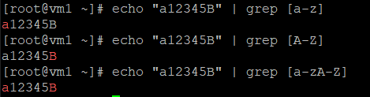

# 正規表示法（正則表達式） v.s. 萬用字元（通配符）
* 正規表示法：基本上是用來搜尋檔案的內文或標準輸入
* 萬用字元：基本上給系統命令使用，常使用於搜尋檔案的名稱
# 正規表示法（正則表達式）
* 英文：Regular Expression
* 多用來匹配符合條件的字符串、檔案內容，正則是包含匹配
* 可與`grep`, `awk`, `sed`指令搭配使用

## 常見的正則表達式特殊字元

字元|說明
-|-|-
`^`|匹配以...為開頭
`$`|匹配以...為結尾
`.`|匹配任一字元
`*`|匹配任意次數
`[]`|匹配括號中指定的任一字元
> 如果想將上述字元當作是普通字元，要將他們前面加上一個 `\` 字符，來跳脫字元。例如：如果要查詢 `$` 字元，則需要在 `$` 前面加上 `\` 跳脫符號，寫成 `\$`。

## 正則表達式特殊匹配模式

特殊符號|匹配說明
-|-
`[:alnum:]`|字母與數字，如：A-Z、a-z、0-9
`[:alpha:]`|字母，如：A-Z、a-z
`[:blank:]`|空格，如：空白鍵、[Tab] 鍵
`[:digit:]`|數字，如：0-9
`[:lower:]`|小寫字母，如：a-z
`[:upper:]`|大寫字母，如：A-Z
> 如果想找 passwd 檔案內所有的數字，可輸入 `grep [[:digit:]] passwd`

## 範例 - `grep`
* `echo "a12345B" | grep [a-z]`\
 `echo "a12345B" | grep [A-Z]`\
 `echo "a12345B" | grep [a-zA-Z]`
* 執行結果



# 萬用字元（通配符）
* 英文：Wildcard Character
* 多用來匹配符合條件的文件名，通配符是完全匹配
* 可與`find`, `ls`, `cp`, `mv`指令搭配使用

## 常見的萬用字元

萬用字元|說明|輸入|輸入介紹|輸出
-|-|-|-|-
`*`|匹配 0 或多個字元|`a*b`|a 跟 b 之間有任意長度的字元，以 a 開頭且 b 結尾|`axyzb`、`aabcb`、`a012b` `ab`
`?`|匹配任意一個字元|`a?b`|a 跟 b 之間有任意一個字元，以 a 開頭且 b 結尾|`axb`、`a0b`、`aab`
`[list]`|匹配 list 中任意單一字元|`a[xyz]b`|a 跟 b 之間有任意一個字元，但只能是 x 或 y 或 z|`axb`、`ayb`、`azb`
`[!list]` `[^list]`|匹配除了 list 中的任一單字元|`a[!0-9]b`|a 跟 b 之間有任意一個字元，但不能是 0-9|`axb`、`aab`
`[c1-c2]`|匹配 c1-c2 中的任意單一字元 如：[0-9] [a-z]|`a[0-9]b`|0 與 9 之間必須也只能有一個字元|`a0b`、`a1b`...`a9b`
`[!c1-c2]` `[^c1-c2]`|匹配除了 c1-c2 中的任意字元|`a[!0-9]b`|0 與 9 之間必須也只能有一個字元，且不能是 c1-c2 之間的字元|`axb`、`aab`、`acb`
`{string1, string2}`|匹配 sring1 或 string2 (或更多)其一字串|`a{abc,xyz,123}b`|a 跟 b 之間有 abc 或 xyz 或 123 其一字串|`aabcb`、 `axyzb`、`a123b`

## 範例 - `ls`
* `ls -l`：詳細列出所有資料夾、檔案
    - `-l`：use a long listing format，以長格式表示，列出所有資料夾、檔案，包含檔案屬性

```sh
[user@vm1 ~]$ ls -l
-rw-r--r--  1 root root 360 Apr 29 11:36 1.yml
drwxrwxr-x  3 user user  94 May 13 10:13 ansible
-rw-r--r--  1 root root  29 Apr 15 11:11 a.php
-rw-r--r--  1 root root 163 May  6 10:01 app2.yml
-rw-r--r--  1 root root 188 May  6 09:51 app.yml
```

* `ls -ld */`：詳細列出所有目錄
    - `-d`：directory，列出目錄，但不列出目錄內的檔案

```sh
[user@vm1 ~]$ ls -ld */
drwxrwxr-x  3 user user 94 May 13 10:13 ansible/
drwxr-xr-x. 2 user user  6 Mar  4 11:28 Desktop/
drwxr-xr-x. 2 user user  6 Mar  4 11:28 Documents/
drwxr-xr-x. 2 user user  6 Mar  4 11:28 Downloads/
```

* `ls -l | grep "^d"`：詳細列出以 d 為開頭的資料，由於開頭為 d 代表目錄，所以等同於列出所有目錄
```sh
[user@vm1 ~]$ ls -l | grep "^d"
drwxrwxr-x  3 user user  94 May 13 10:13 ansible
drwxr-xr-x. 2 user user   6 Mar  4 11:28 Desktop
drwxr-xr-x. 2 user user   6 Mar  4 11:28 Documents
drwxr-xr-x. 2 user user   6 Mar  4 11:28 Downloads
```

* `ls -l | grep "^[-]"`：詳細列出以 - 開頭的資料
    - `[-]`：中括號是匹配裡面的，列出符合 - 的資料
```sh
[user@vm1 ~]$ ls -l | grep "^[-]"
-rw-r--r--  1 root root 360 Apr 29 11:36 1.yml
-rw-r--r--  1 root root  29 Apr 15 11:11 a.php
-rw-r--r--  1 root root 163 May  6 10:01 app2.yml
-rw-r--r--  1 root root 188 May  6 09:51 app.yml
```

* `ls -l | grep "^[-d]"`：詳細列出以 - 或 d 開頭的資料
```sh
[user@vm1 ~]$ ls -l | grep "^[-d]"
-rw-r--r--  1 root root 360 Apr 29 11:36 1.yml
drwxrwxr-x  3 user user  94 May 13 10:13 ansible
-rw-r--r--  1 root root  29 Apr 15 11:11 a.php
-rw-r--r--  1 root root 163 May  6 10:01 app2.yml
```

* `ls -l | grep "^[^d]"`：詳細列出以非 d 開頭的資料
    - `"^[^d]"`：第一個 `^` 是以...開頭，第二個 `^` 是 **不要**，所以`^[^d]`是**不要**匹配以 d 開頭的資料
```sh
[user@vm1 ~]$ ls -l | grep "^[^d]"
-rw-r--r--  1 root root 360 Apr 29 11:36 1.yml
-rw-r--r--  1 root root  29 Apr 15 11:11 a.php
-rw-r--r--  1 root root 163 May  6 10:01 app2.yml
-rw-r--r--  1 root root 188 May  6 09:51 app.yml
```

* `ls -l | grep "^[^-]"`：詳細列出以非 - 開頭的資料
```sh
[user@vm1 ~]$ ls -l | grep "^[^-]"
drwxrwxr-x  3 user user  94 May 13 10:13 ansible
drwxr-xr-x. 2 user user   6 Mar  4 11:28 Desktop
drwxr-xr-x. 2 user user   6 Mar  4 11:28 Documents
drwxr-xr-x. 2 user user   6 Mar  4 11:28 Downloads
```

* `ls -l | grep "^[^-d]"`：詳細列出以非 - 和 d 開頭的資料
```sh
[user@vm1 ~]$ ls -l | grep "^[^-d]"
total 92
```
> 沒有符合的資料

* `ls -l | grep "sh$"`：詳細列出以 sh 結尾的資料
```sh
[user@vm1 ~]$ ls -l | grep "sh$"
-rw-r--r--  1 root root  87 Apr 29 09:24 install_httpd.sh
-rw-rw-r--  1 user user 277 May 20 10:26 line.sh
-rwxr-xr-x  1 root root 242 Mar 18 10:30 lsdir.sh
-rwxr-xr-x  1 root root 238 Mar 11 12:12 mylookup2.sh
```

* `ls | grep "^[^d]"`：列出以非 d 開頭的資料
```sh
[user@vm1 ~]$ ls | grep "^[^d]"
1.yml
ansible
a.php
app2.yml
app.yml
```

* `ls [a-z]`\
`ls {a,b}`\
`ls -l [a-z]`\
`ls -l {a,b}`
* 執行結果
```sh
[root@vm1 ~]# ls [a-z]
a  A  b  B  c
[root@vm1 ~]# ls {a,b}
a  b
[root@vm1 ~]# ls -l [a-z]
-rw-r--r-- 1 root root 0 Jun 16 22:35 a
-rw-r--r-- 1 root root 0 Jun 16 22:36 A
-rw-r--r-- 1 root root 0 Jun 16 22:35 b
-rw-r--r-- 1 root root 0 Jun 16 22:36 B
-rw-r--r-- 1 root root 0 Jun 16 22:35 c
[root@vm1 ~]# ls -l {a,b}
-rw-r--r-- 1 root root 0 Jun 16 22:35 a
-rw-r--r-- 1 root root 0 Jun 16 22:35 b
```

## ls 腳本 Test1
1. 建立一個腳本：`vim lsdir.sh`
* `IFS`：用來控制換行
```sh
#!/usr/bin/bash

IFS="
"

echo "Directories:"
for i in $(ls -dl */)
do
echo "$i"
done

echo "subdirectories:"
echo "...................."
for i in $(ls -l $1 | grep ^d)
do
echo $i
done

for i in $(ls -l $1 | grep ^[^d])
do
echo $i
done
```
2. 增加執行權限：`chmod +x lsdir.sh`
3. 執行腳本
* `bash lsdir.sh`
* `./lsdir.sh /home/user`：執行加指定目錄

* 執行結果
```sh
[user@vm1 ~]$ ./lsdir.sh /home/user
Directories:
drwxrwxr-x  3 user user 94 May 13 10:13 ansible/
drwxr-xr-x. 2 user user  6 Mar  4 11:28 Desktop/
drwxr-xr-x. 2 user user  6 Mar  4 11:28 Documents/
drwxr-xr-x. 2 user user  6 Mar  4 11:28 Downloads/
drwxr-xr-x  2 root root 20 May  6 09:43 files/
drwxr-xr-x. 2 user user  6 Mar  4 11:28 Music/
drwxr-xr-x. 2 user user  6 Mar  4 11:28 Pictures/
drwxr-xr-x. 2 user user  6 Mar  4 11:28 Public/
drwxr-xr-x  2 root root 27 May  6 11:15 templates/
drwxr-xr-x. 2 user user  6 Mar  4 11:28 Templates/
drwxr-xr-x. 2 user user  6 Mar  4 11:28 Videos/
subdirectories:
....................
drwxrwxr-x  3 user user  94 May 13 10:13 ansible
drwxr-xr-x. 2 user user   6 Mar  4 11:28 Desktop
drwxr-xr-x. 2 user user   6 Mar  4 11:28 Documents
drwxr-xr-x. 2 user user   6 Mar  4 11:28 Downloads
drwxr-xr-x  2 root root  20 May  6 09:43 files
drwxr-xr-x. 2 user user   6 Mar  4 11:28 Music
drwxr-xr-x. 2 user user   6 Mar  4 11:28 Pictures
drwxr-xr-x. 2 user user   6 Mar  4 11:28 Public
drwxr-xr-x  2 root root  27 May  6 11:15 templates
drwxr-xr-x. 2 user user   6 Mar  4 11:28 Templates
drwxr-xr-x. 2 user user   6 Mar  4 11:28 Videos
total 92
-rw-r--r--  1 root root 360 Apr 29 11:36 1.yml
-rw-r--r--  1 root root  29 Apr 15 11:11 a.php
-rw-r--r--  1 root root 163 May  6 10:01 app2.yml
-rw-r--r--  1 root root 188 May  6 09:51 app.yml
-rw-r--r--  1 root root  84 Apr 15 11:31 Dockerfile
-rw-r--r--  1 root root 113 Apr 29 11:39 hello.yml
-rw-r--r--  1 root root 287 May  6 09:31 httpd.yml
-rw-r--r--  1 root root  87 Apr 29 09:24 install_httpd.sh
-rw-rw-r--  1 user user 277 May 20 10:26 line.sh
-rwxr-xr-x  1 root root 242 Mar 18 10:30 lsdir.sh
-rwxr-xr-x  1 root root 238 Mar 11 12:12 mylookup2.sh
-rwxr-xr-x  1 root root 288 Mar 11 11:21 mylookup.sh
-rw-r--r--  1 root root  15 May  6 10:29 test1.retry
-rw-r--r--  1 root root 130 May  6 10:28 test1.yml
-rw-r--r--  1 root root 133 May  6 10:48 test3.yml
-rw-r--r--  1 root root 233 May  6 10:57 test4.yml
-rw-r--r--  1 root root 270 May  6 11:16 test5.yml
-rw-r--r--  1 root root  30 May  6 11:44 test6.retry
-rw-r--r--  1 root root 147 May  6 11:41 test6.yml
-rw-r--r--  1 root root  15 May  6 12:07 test7.retry
-rw-r--r--  1 root root 295 May  6 12:07 test7.yml
-rwxr-xr-x  1 root root  93 Jun  8 21:10 test.sh
-rw-r--r--  1 root root  25 May  6 10:58 vars.yml
```
## 補充：Linux 命令列中 EOF 用法
* <<EOF開頭，EOF結束
```sh
[root@vm1 ~]# cat <<EOF
> aa
> bbb
> cccc
> d
> EOF
aa
bbb
cccc
d
```
* 將 <<EOF 到 EOF 中間的內容儲存到 a.txt
```sh
[root@vm1 ~]# cat << EOF > a.txt
> a
> bb
> ccc
> dddd
> EOF
[root@vm1 ~]# cat a.txt
a
bb
ccc
dddd
```
---
參考資料：
- [linux通配符和正则表达式](https://blog.51cto.com/qibingtuan/1970593)
- [第十一章、正規表示法與文件格式化處理](http://linux.vbird.org/linux_basic/0330regularex.php)
- [林柏億學長的筆記](https://github.com/istar0me/linux-note/blob/107-2/Wildcard%20vs.%20Regular%20Expression.md)
- []()