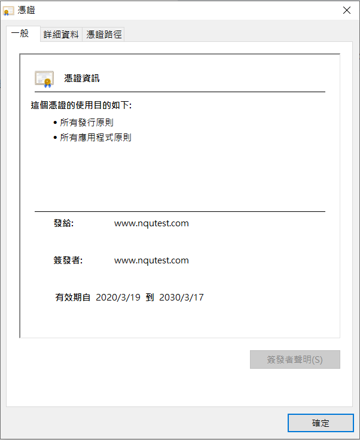
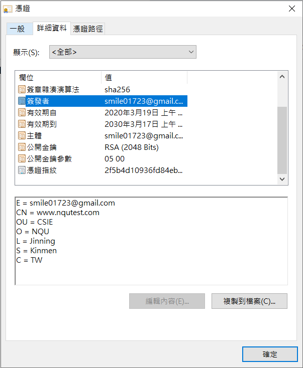
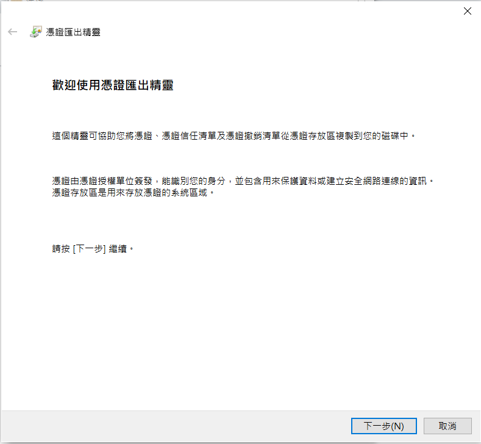

# 自建 SSL憑證
> 使用 root 超級使用者執行
1. 安裝產生SSL憑證的軟體
```sh
[root@vm1 ~]# yum install mod_ssl openssl
```
2. 建立私鑰
```sh
[root@vm1 ~]# openssl genrsa -out ca.key 2048
```
3. 建立簽證檔
```sh
[root@vm1 ~]# openssl req -new -key ca.key -out ca.csr

You are about to be asked to enter information that will be incorporated
into your certificate request.
What you are about to enter is what is called a Distinguished Name or a DN.
There are quite a few fields but you can leave some blank
For some fields there will be a default value,
If you enter '.', the field will be left blank.
-----
Country Name (2 letter code) [XX]: TW                           # 台灣
State or Province Name (full name) []: Kinmen                   # 金門
Locality Name (eg, city) [Default City]: Jinning                # 金寧
Organization Name (eg, company) [Default Company Ltd]: NQU      # 國立金門大學
Organizational Unit Name (eg, section) []: CSIE                 # 資訊工程學系
Common Name (eg, your name or your server's hostname) []: www.nqutest.com
Email Address []: xxx@gmail.com                                 # Gmail

Please enter the following 'extra' attributes
to be sent with your certificate request
A challenge password []:
An optional company name []:
```
4. 產生CA簽證
```sh
[root@vm1 ~]# openssl x509 -req -days 3650 -in ca.csr -signkeyca.key -out ca.crt
```
5. 檔案整理到一個資料夾 (mySSL)
```sh
[root@vm1 ~]# mkdir -p /etc/mySSL 
[root@vm1 ~]# cp ca.key ca.csr ca.crt /etc/mySSL
``` 
6. 修改設定檔
```sh
[root@vm1 ~]# vim /etc/httpd/conf.d/ssl.conf
```
```sh
a. 把 SSLCertificateFile /etc/pki/tls/certs/localhost.crt 加上 '#' 註解掉
下一行加上 SSLCertificateFile /etc/mySSL/ca.crt

#SSLCertificateFile /etc/pki/tls/certs/localhost.crt
SSLCertificateFile /etc/mySSL/ca.crt
```
```sh
b. 把 SSLCertificateKeyFile /etc/pki/tls/private/localhost.key 加上 '#' 註解掉
下一行加上 SSLCertificateKeyFile /etc/mySSL/ca.key

#SSLCertificateKeyFile /etc/pki/tls/private/localhost.key
SSLCertificateKeyFile /etc/mySSL/ca.key
```
7. 存檔後重啟伺服器
```sh
[root@vm1 ~]# systemctl restart httpd
```
8. 新建一個 hi.html 的網頁
```sh
[root@vm1 ~]# echo "hi" > hi.html
```
* 到 Windows 本機 `C:\Windows\System32\drivers\etc` 裡修改 hosts 檔，手動指定ip 的方式加上 `192.168.56.101 www.nqutest.com` ( hosts檔要有權限才能更改 )
* 到 Chrome 搜尋 https://www.nqutest.com/hi.html 會出現 "你的連線不是私人連線" -> 進階-> 繼續前往


* 可以看憑證是否設定成功（在詳細資料中查看設定檔是否正確）



* 在憑證「詳細資料」設定「複製到檔案」開啟「憑證匯出精靈」視窗，並點選下一步


* 在「匯出檔案格式」視窗中選取「DER 編碼二位元 X.509」，並點選下一步


* 接下來點擊「瀏覽」，以選取用來儲存 .cer 檔案的位置，並點選下一步
* 點擊「完成」

---
參考資料：
* [CentOS 7 自建 SSL 憑證](https://www.brilliantcode.net/343/centos-7-create-own-ssl-certificates/)
