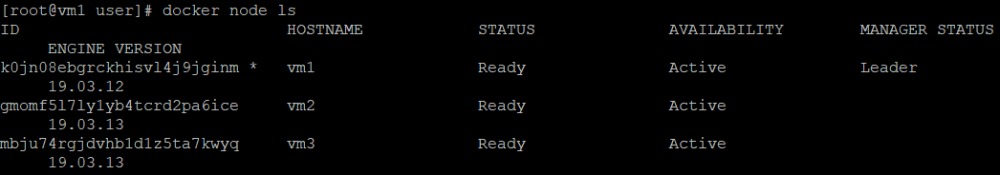
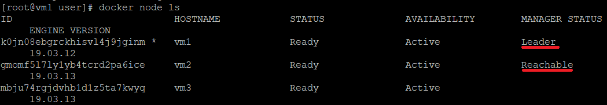
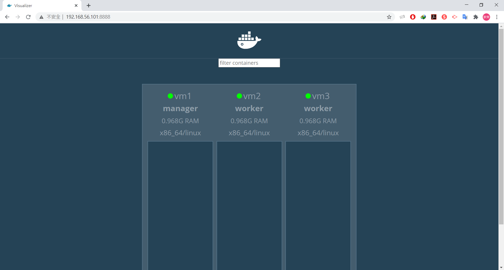
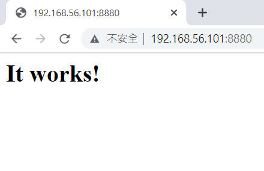
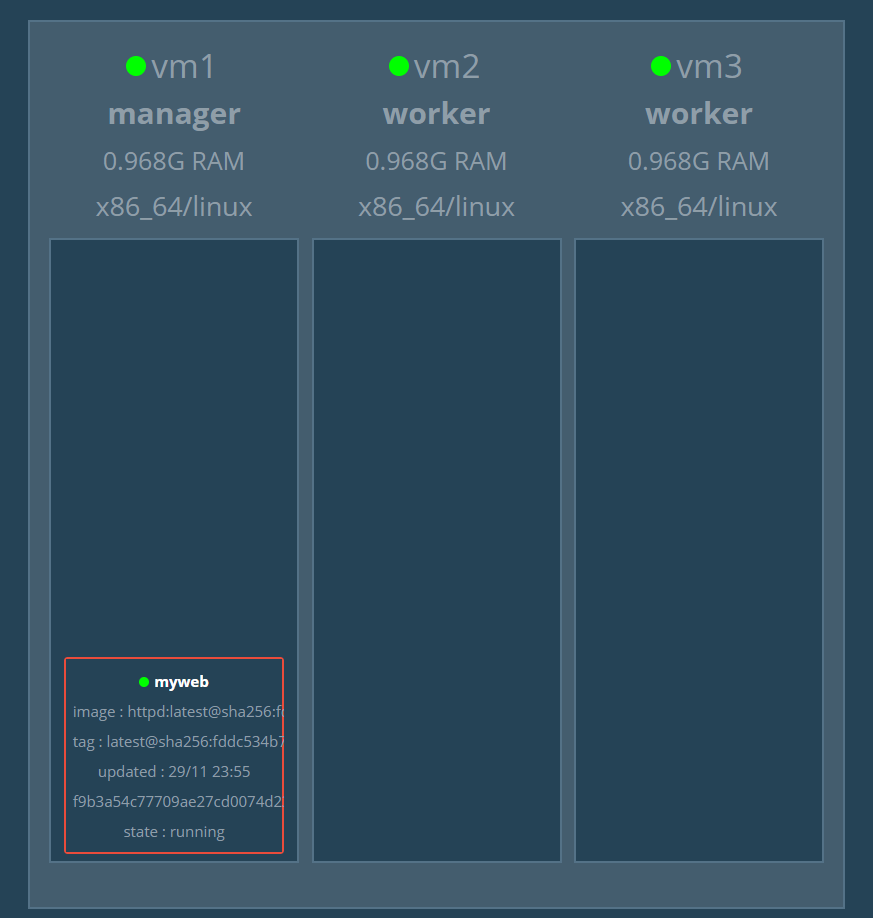
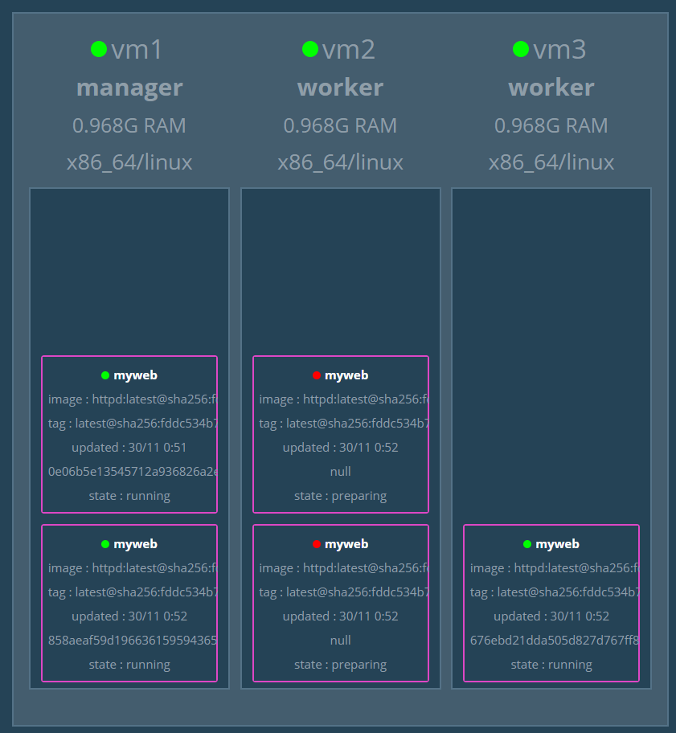
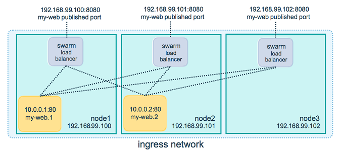
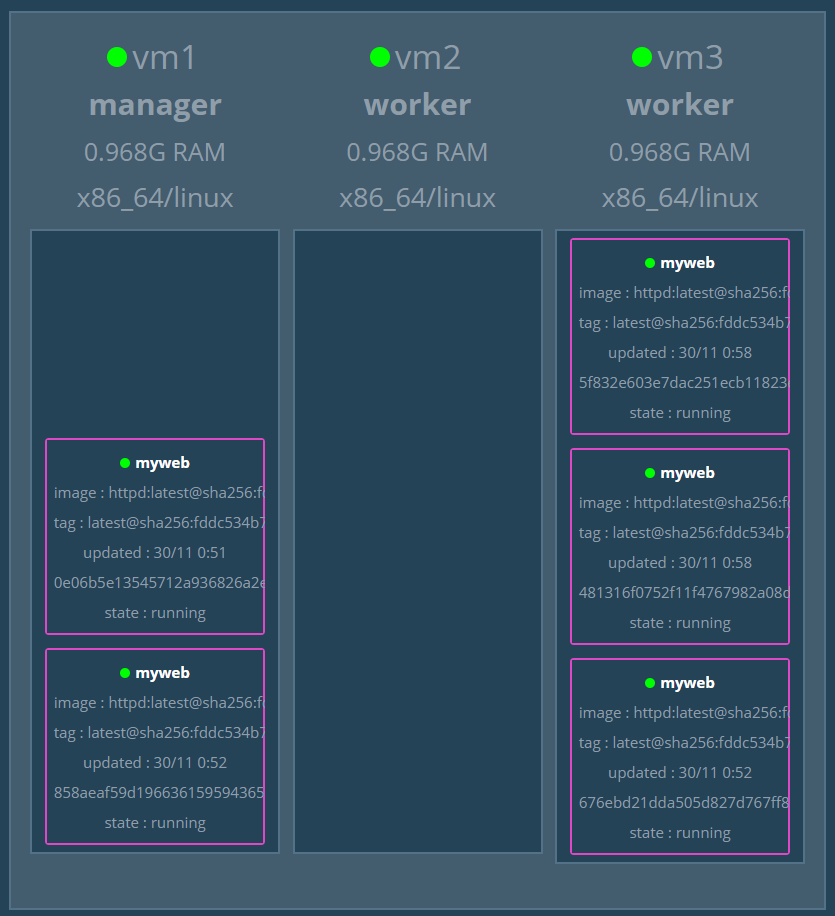

* [Docker Swarm](https://github.com/linjiachi/Linux_note/blob/master/109-1%20Docker/W10-20201117.md#docker-swarm)
    - [基本設定](https://github.com/linjiachi/Linux_note/blob/master/109-1%20Docker/W10-20201117.md#%E5%9F%BA%E6%9C%AC%E8%A8%AD%E5%AE%9A)
    - [主要節點設定](https://github.com/linjiachi/Linux_note/blob/master/109-1%20Docker/W10-20201117.md#%E4%B8%BB%E8%A6%81%E7%AF%80%E9%BB%9E%E8%A8%AD%E5%AE%9A)
    - [工作節點設定](https://github.com/linjiachi/Linux_note/blob/master/109-1%20Docker/W10-20201117.md#%E5%B7%A5%E4%BD%9C%E7%AF%80%E9%BB%9E%E8%A8%AD%E5%AE%9A)
    - [節點設定](https://github.com/linjiachi/Linux_note/blob/master/109-1%20Docker/W10-20201117.md#%E7%AF%80%E9%BB%9E%E8%A8%AD%E5%AE%9A)
    - [圖形化介面](https://github.com/linjiachi/Linux_note/blob/master/109-1%20Docker/W10-20201117.md#%E5%9C%96%E5%BD%A2%E5%8C%96%E4%BB%8B%E9%9D%A2)
    - [使用 docker swarm 啟動 Web 服務](https://github.com/linjiachi/Linux_note/blob/master/109-1%20Docker/W10-20201117.md#%E4%BD%BF%E7%94%A8-docker-swarm-%E5%95%9F%E5%8B%95-web-%E6%9C%8D%E5%8B%99)
    - [補充：維護](https://github.com/linjiachi/Linux_note/blob/master/109-1%20Docker/W10-20201117.md#%E8%A3%9C%E5%85%85%E7%B6%AD%E8%AD%B7)
---
# Docker Swarm
## 基本設定
* 準備三台虛擬機 (vm1、vm2、vm3)
* 三台虛擬機可以互 ping
* `getenforce` -> Disabled

## 主要節點設定
**vm1 (manager)** 
1. 初始化 docker swarm
```sh
docker swarm init --advertise-addr 192.168.56.101   # vm1 IP
```
* 會得到一個加入工作節點的權杖

## 工作節點設定
**vm2 (worker)**
1. 將剛剛 vm1 的權杖指令輸入
```sh
[root@vm2 user]# docker swarm join --token SWMTKN-1-481mlgclc6z3xi5ji6zpdyi8pfobgrm0iwy3m5x1tues5ir9gb-0ql526pozmtf6kfdtjg8e6ifd 192.168.56.101:2377
This node joined a swarm as a worker.
```
* 一開始 docker swarm join 有報錯，報錯指令
```sh
Error response from daemon: error while validating Root CA Certificate: x509: certificate has expired or is not yet valid
```
> 原因提示 CA 證書過期，故執行時間同步指令 `sudo ntpdate time.nist.gov`

**vm3 (worker)**
```sh
[root@vm3 user]# docker swarm join --token SWMTKN-1-481mlgclc6z3xi5ji6zpdyi8pfobgrm0iwy3m5x1tues5ir9gb-0ql526pozmtf6kfdtjg8e6ifd 192.168.56.101:2377
This node joined a swarm as a worker.
```
## 節點設定
### vm1 (manager)
* 看到目前的 node
```sh
docker node ls
```



* 將工作節點升級為主要節點 / 將主要節點降級為工作節點
```sh
docker node promote [HOSTNAME]
docker node demote [HOSTNAME]
```

* 當有兩個 manager 時，第一個主要 manager 會呈現 Leader，而第二個 manager 會呈現 Reachable



* 更新節點
```sh
docker node update [OPTIONS] [HOSTNAME]

OPTIONS：
    --availability active/drain (執行/不執行)
    --role worker/manager
```
* 移除 node
```sh
docker node rm -f [HOSTNAME]
```
* 再次新增 node 為 manager / worker
```sh
docker swarm join-token manager/worker
```
> 再將權杖指令複製至想要設定的虛擬機

### vm2、vm3 (worker)
* 離開 swarm
```sh
docker swarm leave --force
```

## 圖形化介面
**vm1**
1. 下載 `dockersamples/visualizer`
```sh
docker pull dockersamples/visualizer
```
2. 啟動
```sh
[root@vm1 user]# docker run -itd -p 8888:8080 -e HOST=192.168.56.101  -e PORT=8080 -v /var/run/docker.sock:/var/run/docker.sock --name visualizer dockersamples/visualizer
1e614ecd1e1ba151b19aa351aaebe40e40a9e49d515ce8aa57eb79e90b6cd353
```
3. 在 Chrome 輸入 `192.168.56.101:8888`



## 使用 docker swarm 啟動 Web 服務
**vm1**
1. 部署 Web 服務器，有兩種方式
    
    1.  創造服務器直接設定 port 號
    
    ```sh
    docker service create --name myweb -p 8880:80 httpd
    ```
    2. 先創造 Web 服務器，後新增指定對外 port
    
    ```sh
    docker service create --name myweb httpd
    docker service update --publish-add 8880:80 myweb
    ```
2. 查看服務
```sh
[root@vm1 user]# docker service ls
ID                  NAME                MODE                REPLICAS            IMAGE               PORTS
x2kop3rw2ajk        myweb               replicated          1/1                 httpd:latest        *:8880->80/tcp
```
3. 在 Chrome 上輸入 `192.168.56.101:8880`



4. 在圖形化介面上觀察



* 讓 myweb 產生 5 個副本
```sh
docker service scale myweb=5
```


* 用命令列的方式觀察
```sh
docker service ps myweb
```
* 刪除服務
```sh
docker service rm myweb
```
## 補充：維護
維護之後雖然圖形化介面顯示該節點底下沒有容器存在，但是連到該節點還是會出現畫面，這是因為 docker swarm 內建的 Loan Balance + Routing Mesh 幫我們完成了，Routing Mesh 會將 request 導到運行的容器上，如下圖所示



**vm1**
* 將 vm2 設定為維護狀態，其他 node 會幫忙
```sh
docker node update --availability drain vm2
```


---
參考資料：
- [twtrubiks/docker-swarm-tutorial - Github](https://github.com/twtrubiks/docker-swarm-tutorial#docker-machine-%E6%95%99%E5%AD%B8)
- [使用docker swarm 啟動 Web 服務 - 自動軟體系統應用](https://kawsing.gitbook.io/opensystem/docker-swarm/shi-yong-docker-swarm-qi-dong-web-fu-wu)