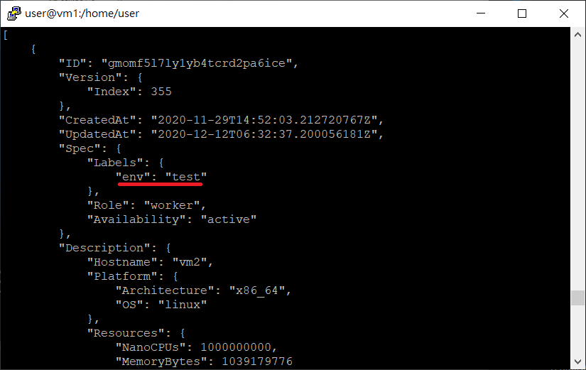
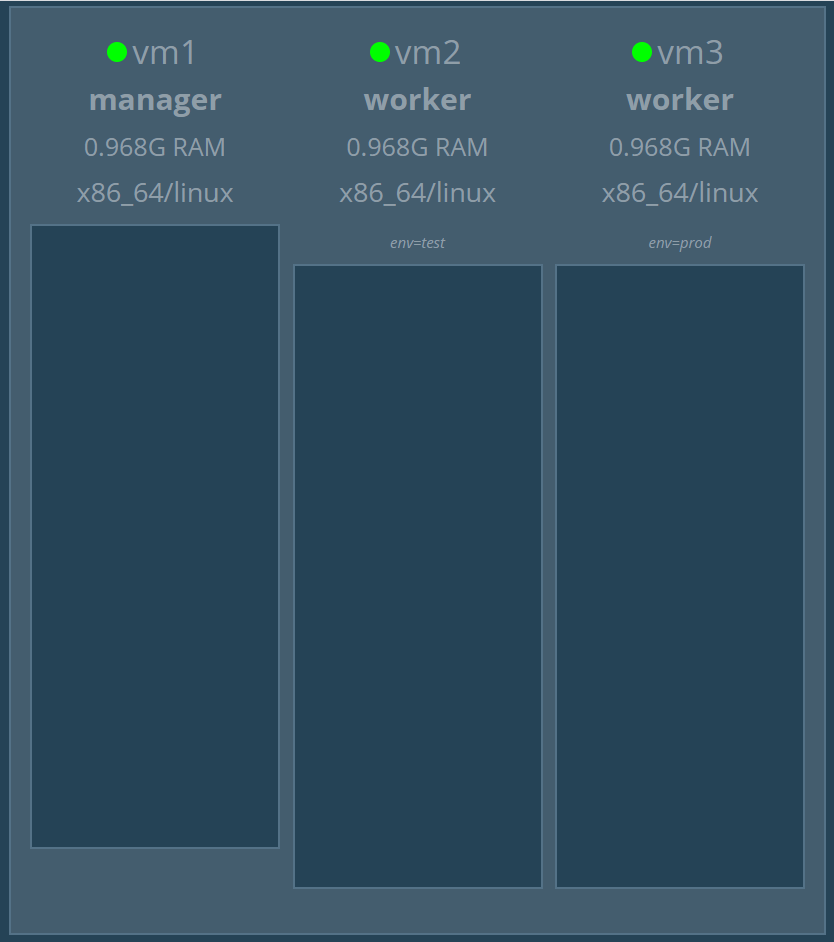
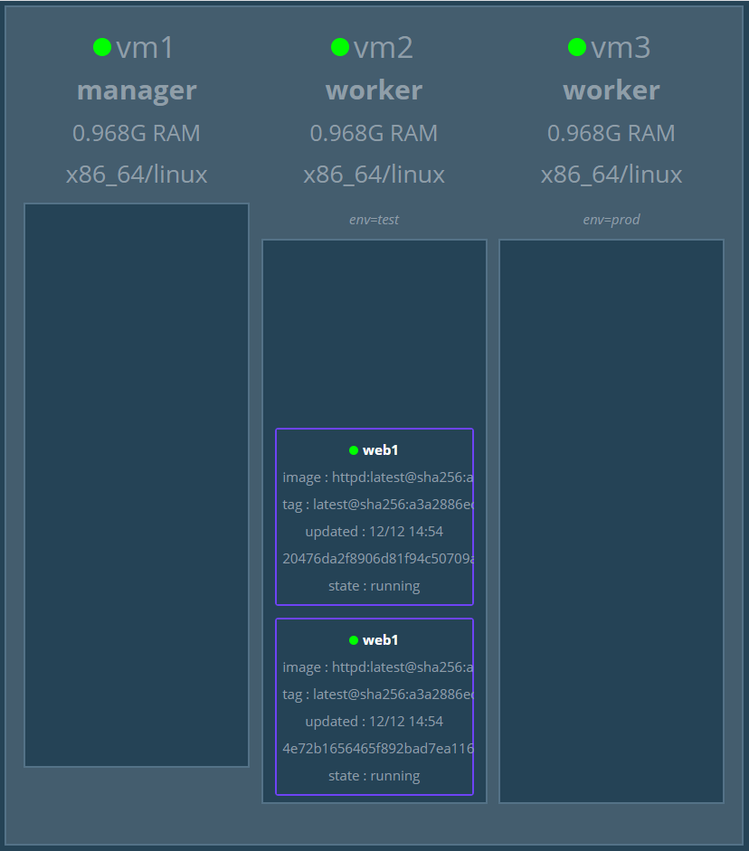
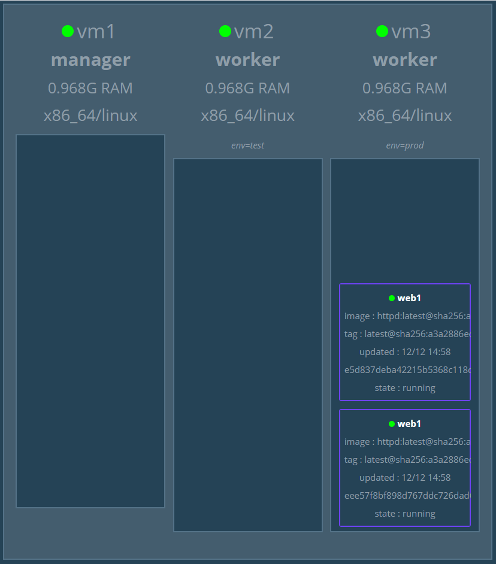

* [Docker Swarm](https://github.com/linjiachi/Linux_note/blob/master/109-1%20Docker/W11-20201124.md#docker-swarm)
    - [特色與功能介紹](https://github.com/linjiachi/Linux_note/blob/master/109-1%20Docker/W11-20201124.md#%E7%89%B9%E8%89%B2%E8%88%87%E5%8A%9F%E8%83%BD%E4%BB%8B%E7%B4%B9)
    - [Service](https://github.com/linjiachi/Linux_note/blob/master/109-1%20Docker/W11-20201124.md#service)
        - [Mode - Replicated v.s Global](https://github.com/linjiachi/Linux_note/blob/master/109-1%20Docker/W11-20201124.md#mode---replicated-vs-global)
    - [Docker Swarm 實作](https://github.com/linjiachi/Linux_note/blob/master/109-1%20Docker/W11-20201124.md#docker-swarm-%E5%AF%A6%E4%BD%9C)
        - [Rolling update](https://github.com/linjiachi/Linux_note/blob/master/109-1%20Docker/W11-20201124.md#rolling-update)
        - [Label](https://github.com/linjiachi/Linux_note/blob/master/109-1%20Docker/W11-20201124.md#label)
---
# Docker Swarm
Docker Swarm 為 Docker 公司所推出的原生容器調度 (Orchestration) 管理平台

## 特色與功能介紹
目前主流的容器調度平台為 Google 推出的 K8S (Kubernetes)，但 Docker Swarm 擁有 Docker 原生與組態設定較為簡單的優勢，**負載均衡**、**安全加密**、**分散設計**

**原生內建** 只要透過 Docker Engine 即可建立及管理 Docker Swarm 叢集，不需要額外安裝級組態設定

**跨主機網路環境** 透過內建的 Docker Overlay Network 網路機制，在 Docker Swarm 叢集運作架構中，達成可以互相溝通的網路機制

**Rolling Update** 滾動式更新機制，將服務在節點中一個一個進行更新，而不是將服務下線再更新

## Service
Docker Swarm 可以在 Service 創建和運行過程中，利用 `--replicas` 調整容器副本數量
### Mode - Replicated v.s Global
**Replicate mode** ：Service 默認的模式，指定一個 Service 運行的容器數量
* `docker service create --replicas 3 -p 8004:80 --name web4 httpd`

**Global mode** ：在所有符合運行條件的 Node 上，都運行這一個容器，適合用來作監控服務
> 在 K8S 中，稱為 Daemonset

* `docker service create --mode global -p 8005:80 --name web5 httpd`

## Docker Swarm 實作
### Rolling update

**vm1、vm2、vm3**
1. 下載 httpd

    ```sh
    docker pull httpd:2.4.43
    docker pull httpd:2.4.46
    ```

**vm1**

2. 新建六個 httpd:2.4.43 的服務

    ```sh
    docker service create --name web --replicas 6 -p 8080:80 httpd:2.4.43
    ```
3. 將服務更新為 httpd:2.4.46 版本，有兩種方式
* 一個服務更新完，再換下一個更新

    ```sh
    docker service update --image httpd:2.4.46 web
    ```
* 可以一次更新好幾個

    ```sh
    docker service update --image httpd:2.4.46 --update-parallelism 2 --update-delay 10s web
    ```

    * `--update-parallelism`：一次更新的數量 (加快效率)
    * `--update-delay`：距離下次更新的延遲 (確保穩定性)

4. 回滾到更新之前的版本
    
    ```sh
    docker service update --rollback web
    ```
### Label
打上標籤後可以把節點分成各種不同的環境

**vm1**
* 幫節點打上標籤，測試環境與生產環境

    ```sh
    docker node update --label-add env=test vm2
    docker node update --label-add env=prod vm3
    ```
* 文字化顯示標籤

    ```sh
    docker node inspect vm2
    ```

    

* 圖型化顯示標籤

    

* 命令特定節點新建服務

    ```sh
    docker service create --constraint node.labels.env==test --replicas 2 --name web1 -p 8000:80 httpd
    ```
    * `--constraint node.labels.env==test`：限制節點標籤

    

* 移除條件

    ```sh
    docker service update --constraint-rm node.labels.env==test web1
    ```
* 新增條件

    ```sh
    docker service update --constraint-add node.labels.env==prod web1
    ```
    

* 移除標籤

    ```sh
    docker node update --label-rm env vm2
    docker node update --label-rm env vm3
    ```

---
參考資料：
- [Docker Swarm容器管理　規畫部署一次傾囊相授 - 網管人](https://www.netadmin.com.tw/netadmin/zh-tw/feature/167CDFB3615E42229B5C7053DC452755)
- [twtrubiks/docker-swarm-tutorial - Github](https://github.com/twtrubiks/docker-swarm-tutorial)
