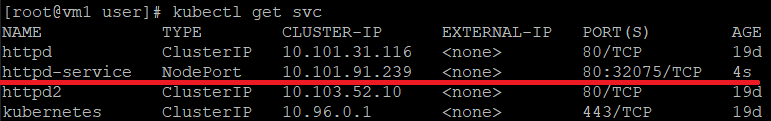
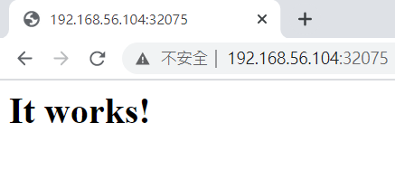
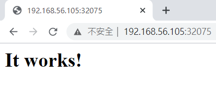
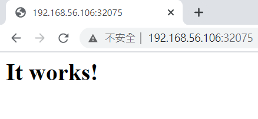
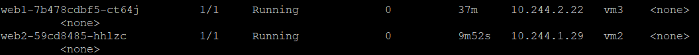
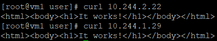
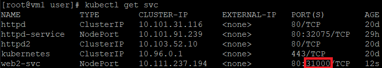
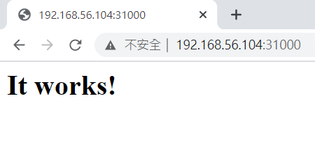

* [K8S (Kubernetes)]()
    - [K8S (Kubernetes) 簡介]()
    - [K8S (Kubernetes) 指令]()
    - [安裝 K8S (Kubernetes)]()
        - [環境準備]()
        - [CentOS 7 下安裝 K8S]()
        - [補充：遇到 docker --version 版本 < 19.03]()
    - [新增節點]()
    - [部署服務]()
    - [部署應用]()
---
# K8S (Kubernetes)
## K8S (Kubernetes) 簡介
是由 Google 開源用來管理數量龐大的容器管理平台，K8S 的叢集架構主要分為 master 和 worker nodes，其中 master 負責叢集裡的所有安排、分配與監控。

## K8S (Kubernetes) 指令
動作指令：get、delete、apply、create、scale \
物件種類：**Deployment**、**Pod**、**Service**、**Node**

```sh
kubectl [action] [object] [NAME]
```
* 查詢指令如何使用
```sh
kubectl --help
```
**Deployment**：用來管理 Pod，可以用來管理控制副本數，可以使用 rolling back 和 roll back
* 產生 Deployment 有兩種方法，一種是使用 command 的方式，另一種為建立 yml 檔
    
    - command 的方式
    ```sh
    kubectl create deployment web1 --image=httpd
    ```
    - yml 檔的方式
        
        - 將 deployment 匯出形成 yaml 檔，寫入 myweb.yml
        
        ```sh
        kubectl get deployment web1 -o yaml > myweb.yml
        ```
        - 執行 yml 檔
        
        ```sh
        kubectl apply -f myweb.yml
        ```
* 查看部署服務
```sh
kubectl get deployment
```
**Pod**：一個 Pod 至少一定會有一個 Docker
* 查看執行副本的位置
```sh
kubectl get pod -o wide
```
**Service**

* 查看所有的 service
```sh
kubectl get svc
```
**Node**：分為 master 和 worker

* 查看所有的 node
```sh
kubectl get nodes
```
* 查看單一的 node
```sh
kubectl describe node [NAME]
```
## 安裝 K8S (Kubernetes) 
### 環境準備

虛擬機| IP Address
:-:|:-:
vm1 (master)|192.168.56.104
vm2 (worker)|192.168.56.105
vm3 (worker)|192.168.56.106

* 三台虛擬機，且可使用 hostname 互 ping (`vim /etc/hosts`) 
    
    ```sh
    127.0.0.1   localhost localhost.localdomain localhost4 localhost4.localdomain4
    ::1         localhost localhost.localdomain localhost6 localhost6.localdomain6

    192.168.56.104 vm1
    192.168.56.105 vm2
    192.168.56.106 vm3
    ```
* `getenforce` -> Disabled
* 安裝完 Docker

### CentOS 7 下安裝 K8S
**vm1、vm2、vm3**

* `yum install wget net-tools -y`
* `vim /etc/fstab` 關閉 swap，註解此行，之後 `reboot` 重新開機
    
    ```sh
    # /dev/mapper/centos-swap swap                    swap    defaults        0 0
    ```

* `vim /etc/sysctl.conf` 加上這兩行，執行 `systemctl --system` 讓此生效
    
    ```sh
    net.ipv4.ip_forward = 1
    net.bridge.bridge-nf-call-iptables = 1
    ```
* `echo 1 > /proc/sys/net/ipv4/ip_forward`
* `modprobe br_netfilter`
* `echo "br_netfilter" > /etc/modules-load.d/br_netfilter.conf`
* `yum install -y yum-utils device-mapper-persistent-data lvm2`
* `vim /etc/yum.repos.d/kubernetes.repo`
    
    ```sh
    [kubernetes]
    name=Kubernetes
    baseurl=https://packages.cloud.google.com/yum/repos/kubernetes-el7-x86_64
    enabled=1
    gpgcheck=1
    repo_gpgcheck=1
    gpgkey=https://packages.cloud.google.com/yum/doc/yum-key.gpg https://packages.cloud.google.com/yum/doc/rpm-package-key.gpg
    ```
* `yum clean all && yum repolist`
* `yum install kubelet-1.15.2 kubectl-1.15.2 kubeadm-1.15.2 --nogpgcheck --disableexcludes=kubernetes -y`
* `systemctl enable kubelet.service`

### 補充：遇到 docker --version 版本 < 19.03
1. 先卸載
```sh
yum remove docker docker-client docker-client-latest docker-common docker-latest docker-latest-logrotate docker-logrotate docker-selinux  docker-engine-selinux docker-engine
```
2. 再執行安裝以下
```sh
yum install -y yum-utils device-mapper-persistent-data lvm2
```
```sh
yum-config-manager --add-repo https://download.docker.com/linux/centos/docker-ce.repo
```
```sh
yum install docker-ce-18.09
```
## 新增節點

**vm1**
* Master 初始化：

    ```sh
                                              # Master IP
    kubeadm init --apiserver-advertise-address=192.168.56.104 --pod-network-cidr=10.244.0.0/16
    ```
* 會得到 join worker nodes 指令並且執行 `run the following as a regular user`

    ```sh
    mkdir -p $HOME/.kube
    sudo cp -i /etc/kubernetes/admin.conf $HOME/.kube/config
    sudo chown $(id -u):$(id -g) $HOME/.kube/config
    ```

**vm2、vm3**
* 執行 join worker nodes 指令
    
    ```sh
    kubeadm join 192.168.56.104:6443 --token 3v59qj.kfe2w5tskkpuh5bm \
    --discovery-token-ca-cert-hash sha256:05e17b55abf60f08bd4f77ffb43c5eb754daba9e6b41a4eace4d02a0f52ba340
    ```

**vm1**
* 安裝通用的 flannel 容器網路介面 CNI（Container Network Interface）元件，並確認所有機器的狀態為 Ready

    ```sh
    [root@vm1 user]# kubectl apply -f https://raw.githubusercontent.com/coreos/flannel/master/Documentation/kube-flannel.yml

    [root@vm1 user]# kubectl get nodes
    NAME   STATUS   ROLES                  AGE     VERSION
    vm1    Ready    control-plane,master   8m12s   v1.20.0
    vm2    Ready    <none>                 6m42s   v1.20.0
    vm3    Ready    <none>                 6m10s   v1.20.0
    ```

## 部署服務
**vm1**
1. 創建一個 httpd 的服務
```sh
[root@vm1 user]# kubectl create deployment httpd-app --image=httpd
deployment.apps/httpd-app created
```
2. 將服務設置在 80 port
```sh
[root@vm1 user]# kubectl expose deployment httpd-app --type=NodePort --name=httpd-service --port=80
service/httpd-service exposed
```
3. 查看對外的 port 多少
```sh
kubectl get svc
```



**測試**

在 Chrome 上輸入 `IP:Port` 測試是否運作

IP|-
:-:|:-:
192.168.56.104:32075|
192.168.56.105:32075|
192.168.56.106:32075|

## 部署應用
使用 yaml 檔來建立 deployment
1. 部署一個 deployment 命名為 web1 
```sh
kubectl create deployment web1 --image=httpd
```
2. 將 web1 匯出成 yaml 檔後放入 `myweb.yml`
```sh
kubectl get deployment web1 -o yaml > myweb.yml
```
3. 開啟 `myweb.yml` 並修改參數
* app: web1 -> myweb1
* name: web1 -> web2
```yml
.
.
.
labels:
    app: myweb1
  managedFields:
.
.
.
 name: web2
  namespace: default
  resourceVersion: "103394"
  uid: 8a79d970-6a0b-4396-a175-e02d46755fe9
spec:
  progressDeadlineSeconds: 600
  replicas: 1
  revisionHistoryLimit: 10
  selector:
    matchLabels:
      app: myweb1
  strategy:
    rollingUpdate:
      maxSurge: 25%
      maxUnavailable: 25%
    type: RollingUpdate
  template:
    metadata:
      creationTimestamp: null
      labels:
        app: myweb1
.
.
.
```
4. 部署 `myweb.yml`
```sh
kubectl apply -f myweb.yml
```
5. 查看副本
```sh
kubectl get pod -o wide
```


6. 測試



## 訪問應用
1. 創建一個 yml 檔
* `myweb2.yml`
```yml
apiVersion: v1
kind: Service
metadata:
  name: web2-svc
spec:
  type: NodePort
  selector:
    app: myweb1
  ports:
  - protocol: TCP
    nodePort: 31000
    port: 80
    targetPort: 80
```
* `apiVersion`：版本
* `kind`：服務類型
* `NodePort`：提供對外的服務
* `nodePort`：對外的 port
* `port`：docker httpd 使用的 port
* `targetport`：內網裡面的 port

2. 部署執行
```sh
kubectl apply -f myweb2.yml
```
3. 查看服務
```sh
kubectl get svc
```


4. 測試，在 Chrome 上輸入 `[master IP]:31000`



---
參考資料：
- [CentOS 7.6上安裝 Kubernetes（一）叢集佈署](https://blog.tomy168.com/2019/08/centos-76-kubernetes.html)
