* [K8S (Kubernetes)]()
    - [K8S (Kubernetes) 概念]()
    - [K8S (Kubernetes) 介紹]()
        - [Sacle 應用]()
        - [Rolling Update、Rollback]()
            - [實作]()
---
# K8S (Kubernetes)
## Kubernetes 概念
**Pod** 是 Kubernetes 的最小工作單位，每個 Pod 包含一個或多個容器。
* Kubernetes 引入 Pod 主要有兩個目的
1. 可管理性：Kubernetes 以 Pod 為最小單位進行調度、擴展、共享資源、管理生命週期
2. 通訊和資源共享：Pod 中的所有容器使用同一個 namespace，相同的 IP 和 Port，它們可以用 localhost 通訊，相同的，這些容器可以共享儲存。

## K8S (Kubernetes) 介紹
**Deployment**
* 創建部署一個 deployment，取名為 myweb 使用鏡像 httpd
```sh
kubectl create deployment myweb --image=httpd
```
* 讓外面的網路可以存取 myweb，讓 deployment expose 到外面，指定的類型為 NodePort，Port 號為 80
```sh
kubectl expose deployment myweb --type="NodePort" --port=80
```
* 查看目前的 deployment
```sh
kubectl get deployment
```
**Service**
* 查看目前的服務
```sh
kubectl get svc
```
**Namespace**
* 查看目前的 Namespace
```sh
kubectl get ns
```
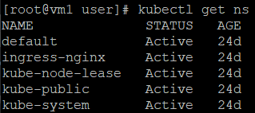

* default：若是創建資源沒有指定，則會放到 default Namespace 中，故 `kubectl get deployment`、`kubectl get pod` 顯示出來會是預設的 default Namespace
* kube-system：kubernetes 自己創建的系統資源會放到這個 Namespace 中
    
    - 查看所有 kubernetes 創造出來的 Pod
    ```sh
    kubectl get pod -n kube-system
                    (namespace)
    ```
    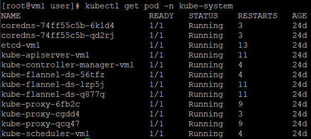

* 創建一個 Namespace
```sh
kubectl create ns myns
```
* 創建一個 deployment 並指定放在 myns
```sh
kubectl create deployment myweb3 --image=httpd -n=myns
```
* 查看目前 myns 的 deployment
```sh
kubectl get deployment -n myns
```
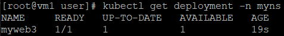

* 查看所有的 Pod
```sh
kubectl get pod --all-namespaces
```
**Pod**
* 要進去 Pod 的容器裡面
1. 查看想進去容器的名稱
```sh
kubectl get pod
```
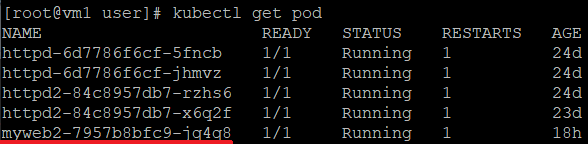

2. 進到 myweb2 容器裡
```sh
kubectl exec myweb2-7957b8bfc9-jq4q8 -it -- bash
```
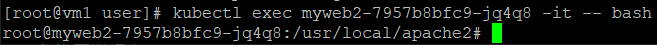

> * 這是在一個 Pod 只有一個 Container 的情況下成立
> * 若是一個 Pod 只有多個 Container
`kubectl exec <podname> -c <container-name> -it -- bash`

* 沒有進到 Pod 容器裡
```sh
kubectl exec myweb2-7957b8bfc9-jq4q8 date
kubectl exec myweb2-7957b8bfc9-jq4q8 echo "hi"
```
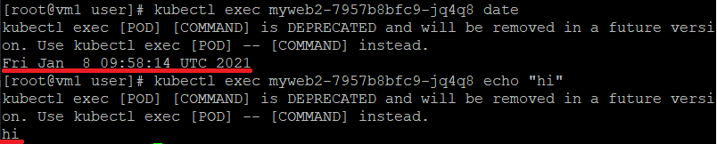

### Sacle 應用
在默認運行 deployment 的情況下只會運行一個 Pod，scale 可以指定運行 Pod 的數量

* 指定將 myweb 的 Pod 運行 3 個數量
```sh
kubectl scale deployment myweb --replicas 3
                               --replicas=3
```
### Rolling Update、Rollback
* rolling update 指令
```sh
kubectl set image deplyment <deployment> <container name>=<image>
```
* rollback 指令
```sh
kubectl rollout undo deployment <deployment>
```

#### 實作
1. 登入 docker
```sh
docker login
```
2. 下載 2 個不同版本的 httpd
```sh
docker pull httpd:2.4.43
docker pull httpd:2.4.46
```
3. 創建一個 deployment 使用鏡像 httpd:2.4.43
```sh
kubectl create deployment myweb2 --image=httpd:2.4.43
```
4. 查看目前 myweb2 的 Pod Name
```sh
kubectl get pod
```
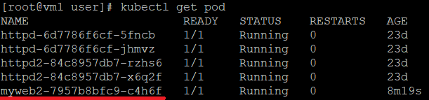

5. 查看目前的版本
```sh
kubectl describe pod myweb2-7957b8bfc9-c4h6f | grep image
```
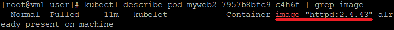

6. 查看 Container name
```sh
kubectl get deployment myweb2 -o yaml | grep name
```
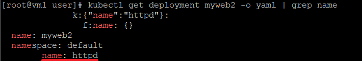

7. 希望在執行的過程當中能滾動更新成 httpd:2.4.46 版本
```sh
kubectl set image deployment myweb2 httpd=httpd:2.4.46
```

8. 查看更新後 myweb2 的 Pod Name
```sh
kubectl get pod
```
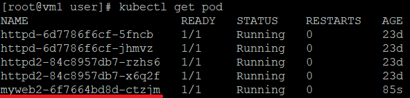

9. 查看是否有更新成 httpd:2.4.46 版本
```sh
kubectl describe pod myweb2-6f7664bd8d-ctzjm | grep image  
```
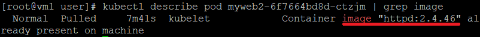

10. rollback 到 httpd:2.4.43 版本
```sh
kubectl rollout undo deployment myweb2
```
11. 查看更新後 myweb2 的 Pod Name
```sh
kubectl get pod
```
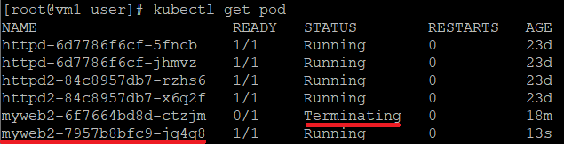

* 可以發現舊的正在 Terminating，新的 Pod 已經 Running

12. 查看是否有回滾成回 httpd:2.4.43 版本
```sh
kubectl describe pod myweb2-7957b8bfc9-jq4q8 | grep image
``` 
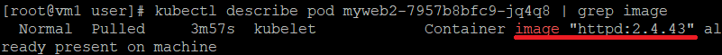

---
參考資料：
- [每天 5 分鐘玩轉 Kubenetes.pdf](https://drive.google.com/file/d/1kcT8R9VYw6cgLAiqZaVlX9m0-hVC4YKw/view?usp=sharing)