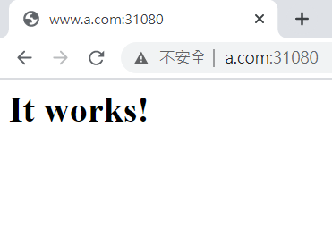

* [Proxy Server 代理伺服器]()
    - [Forward Proxy Server 正向代理伺服器]()
    - [Reverse Proxy Server 反向代理伺服器]()
* [Ingress]()
    - [部署一個 Ingress]()
        - [環境設置]()
        - [Test2 - 負載均衡]()
        - [Test3]()


---
# Proxy Server 代理伺服器
類似代理人的身分去取得使用者所需的資料，可以透過代理伺服器達成防火牆功能和用戶瀏覽資料的分析，也可以藉由代理伺服器節省頻寬，加快內部網路對網際網路的存取速度。Proxy Server 分為正向代理伺服器和反向代理伺服器。

## Forward Proxy Server 正向代理伺服器
在區域網路中許多主機連線遠端伺服器，會很耗費資源。故會使用 Proxy Server，當有其他主機搜尋過，就將資料儲存到 Local cache，如此一來，對外的頻寬只需要抓一次，可以節省大量頻寬和時間。正向代理伺服器是代理客戶端。

## Reverse Proxy Server 反向代理伺服器
類似像負載均衡，反向代理伺服器提供一個 VIP (Virtual IP)，當客戶在進行存取的時候，連線到 VIP，代理伺服器就會將連線導到真正的伺服器抓取資料回傳給客戶端。反向代理伺服器是代理真正的伺服器。

一個 IP 可以對應多個 Domain name，故 Proxy Server 使用相同的 VIP，可以對應到許多不同的網站。

# Ingress
對於 K8S 來說，Ingress 就像是反向代理伺服器，是使用 nginx。nginx 是一套軟體，可以當作傳統的網頁伺服器和反向代理伺服器。
## 部署一個 Ingress
### 環境設置

虛擬機 | IP
:-:|:-:
vm1 (master) | 192.168.56.104
vm2 (client) | 192.168.56.105
vm3 (client) | 192.168.56.106

**vm1**
1. 使用 winscp 將 [test-ingress-nginx]() 資料夾放入 master 虛擬機當中，並進到資料夾

    ```sh
    cd test-ingress-nginx/
    ```
2. 創建 ingress

    ```sh
    kubectl apply -f mandatory.yaml
    kubectl apply -f service-nodeport.yaml
    ```
3. 檢查是否安裝成功

    ```sh
    kubectl get pod -n ingress-nginx
    ```
    

    ```sh
    kubectl get svc -n ingress-nginx
    ```
    

4. 開放端口，查看 deployment、service 是否運作，並利用內部 IP 查看網頁是否運作

    ```sh
    kubectl apply -f httpd.yaml
    kubectl get deployment
    kubectl get svc
    ```
    

    ```sh
    curl 10.101.89.124
    ```
    

5. 開放外部端口

    ```sh
    kubectl apply -f ingress-httpd.yaml
    ```
6. 先查看服務是被部署在哪個虛擬機，再到 `C:\Windows\System32\drivers\etc` 中，修改 `hosts` 檔案

    ```sh
    kubectl get pod -n ingress-nginx -o wide
    ```
    

    在 `hosts` 檔案下新增
    ```txt
    192.168.56.106      www.a.com
    ```
7. 在 Chrome 連到 `www.a.com:31080`
    
    

## Test2 - 負載均衡
1. 查看 Pod Name

    ```sh
    [root@vm1 test-ingress-nginx]# kubectl get pod -o wide
    NAME                     READY   STATUS    RESTARTS   AGE   IP           NODE   NOMINATED NODE   READINESS GATES
    httpd-6d7786f6cf-5fncb   1/1     Running   0          36m   10.244.1.5   vm2    <none>           <none>
    httpd-6d7786f6cf-jhmvz   1/1     Running   0          36m   10.244.2.4   vm3    <none>           <none>
    ```
2. 進到 Pod 裡面的容器新增檔案，用來辨識哪台虛擬機 

    ```sh
    [root@vm1 test-ingress-nginx]# kubectl exec httpd-6d7786f6cf-5fncb -it -- bash
    root@httpd-6d7786f6cf-5fncb:/usr/local/apache2# cd htdocs/
    root@httpd-6d7786f6cf-5fncb:/usr/local/apache2/htdocs# echo "vm3 www.a.com" > hi.htm
    root@httpd-6d7786f6cf-5fncb:/usr/local/apache2/htdocs# exit
    exit
    [root@vm1 test-ingress-nginx]# kubectl exec httpd-6d7786f6cf-jhmvz -it -- bash
    root@httpd-6d7786f6cf-jhmvz:/usr/local/apache2# cd htdocs/
    root@httpd-6d7786f6cf-jhmvz:/usr/local/apache2/htdocs# echo "vm2 www.a.com" > hi.htm
    ```
3. 到 Chrome 輸入 `www.a.com:31080/hi.htm`，再重新整理

    

    

## Test3
1. 複製舊檔案並命名為新檔案 `httpd2.yaml`、`ingress-httpd2.yaml`
   
    ```sh
    [root@vm1 test-ingress-nginx]# cp httpd.yaml httpd2.yaml
    [root@vm1 test-ingress-nginx]# cp ingress-httpd.yaml ingress-httpd2.yaml
    ```
2. 修改 `httpd2.yaml`、`ingress-httpd2.yaml` 內容
* `httpd2.yaml`：httpd -> httpd2
* `ingress-httpd2.yaml`：

    - `nginx-ingress2` -> `nginx-ingress2`
    - `www.a.com` -> `www.b.com`
    - `httpd` -> `httpd2`

3. 創建 ingress

    ```sh
    kubectl apply -f httpd2.yaml
    kubectl apply -f ingress-httpd2.yaml
    ```
4. 檢查是否創建成功，並進入到 Pod 裡新增 `hi.htm` 檔案

    ```sh
    [root@vm1 test-ingress-nginx]# kubectl get ingress
    NAME             CLASS    HOSTS       ADDRESS        PORTS   AGE
    nginx-ingress    <none>   www.a.com   10.98.69.130   80      45m
    nginx-ingress2   <none>   www.b.com                  80      5s
    [root@vm1 test-ingress-nginx]# kubectl get pod
    NAME                      READY   STATUS    RESTARTS   AGE
    httpd-6d7786f6cf-5fncb    1/1     Running   0          54m
    httpd-6d7786f6cf-jhmvz    1/1     Running   0          54m
    httpd2-84c8957db7-rzhs6   1/1     Running   0          4m29s
    httpd2-84c8957db7-x6q2f   1/1     Running   0          32s
    [root@vm1 test-ingress-nginx]# kubectl exec httpd2-84c8957db7-x6q2f -it -- bash
    root@httpd2-84c8957db7-x6q2f:/usr/local/apache2# cd htdocs/
    root@httpd2-84c8957db7-x6q2f:/usr/local/apache2/htdocs# echo "www.b.com" > hi.htm
    ```
5. 查看服務是被部署在哪個虛擬機，再到 `C:\Windows\System32\drivers\etc` 中，修改 `hosts` 檔案，再到 Chrome 輸入 `www.b.com:31080/hi.htm`

* `hosts` 檔案

    

* Chrome

    


---
參考資料：
- [第十七章、區網控制者： Proxy 伺服器 - 鳥哥的 Linux 私房菜](http://linux.vbird.org/linux_server/0420squid.php#theory)
- [kubernetes系列09—Ingress控制器详解](https://www.cnblogs.com/along21/p/10333086.html)