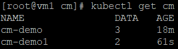
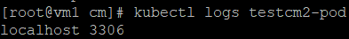

* [PersistentVolume、PersistentVolumeClaim](https://github.com/linjiachi/Linux_note/blob/master/109-1%20Docker/W15-20201222.md#persistentvolumepersistentvolumeclaim)
    - [NFS (Network File System) 安裝](https://github.com/linjiachi/Linux_note/blob/master/109-1%20Docker/W15-20201222.md#nfs-network-file-system-%E5%AE%89%E8%A3%9D)
      - [環境設置](https://github.com/linjiachi/Linux_note/blob/master/109-1%20Docker/W15-20201222.md#%E7%92%B0%E5%A2%83%E8%A8%AD%E7%BD%AE)
    - [NFS 測試](https://github.com/linjiachi/Linux_note/blob/master/109-1%20Docker/W15-20201222.md#nfs-%E6%B8%AC%E8%A9%A6)
    - [Test]()
* [PersistentVolume、PersistentVolumeClaim 實作](https://github.com/linjiachi/Linux_note/blob/master/109-1%20Docker/W15-20201222.md#persistentvolumepersistentvolumeclaim-%E5%AF%A6%E4%BD%9C)
    - [創建 PersistentVolume (PV)](https://github.com/linjiachi/Linux_note/blob/master/109-1%20Docker/W15-20201222.md#%E5%89%B5%E5%BB%BA-persistentvolume-pv)
    - [創建 PersistentVolumeClaim (PVC)](https://github.com/linjiachi/Linux_note/blob/master/109-1%20Docker/W15-20201222.md#%E5%89%B5%E5%BB%BA-persistentvolumeclaim-pvc)
* [ConfigMap、SecretMap](https://github.com/linjiachi/Linux_note/blob/master/109-1%20Docker/W15-20201222.md#configmapsecretmap)
    - [ConfigMap 創建](https://github.com/linjiachi/Linux_note/blob/master/109-1%20Docker/W15-20201222.md#configmap-%E5%89%B5%E5%BB%BA)
      - [使用 `key-value` 的方式創建](https://github.com/linjiachi/Linux_note/blob/master/109-1%20Docker/W15-20201222.md#%E4%BD%BF%E7%94%A8-key-value-%E7%9A%84%E6%96%B9%E5%BC%8F%E5%89%B5%E5%BB%BA)
      - [使用目錄的方式來創建 - `--from-file`](https://github.com/linjiachi/Linux_note/blob/master/109-1%20Docker/W15-20201222.md#%E4%BD%BF%E7%94%A8%E7%9B%AE%E9%8C%84%E7%9A%84%E6%96%B9%E5%BC%8F%E4%BE%86%E5%89%B5%E5%BB%BA-----from-file)
      - [直接在命令行指定 - `--from-literal`](https://github.com/linjiachi/Linux_note/blob/master/109-1%20Docker/W15-20201222.md#%E7%9B%B4%E6%8E%A5%E5%9C%A8%E5%91%BD%E4%BB%A4%E8%A1%8C%E6%8C%87%E5%AE%9A-----from-literal)
    - [使用 ConfigMap](https://github.com/linjiachi/Linux_note/blob/master/109-1%20Docker/W15-20201222.md#%E4%BD%BF%E7%94%A8-configmap)
      - [設置命令列參數](https://github.com/linjiachi/Linux_note/blob/master/109-1%20Docker/W15-20201222.md#%E8%A8%AD%E7%BD%AE%E5%91%BD%E4%BB%A4%E5%88%97%E5%8F%83%E6%95%B8)

---
# PersistentVolume、PersistentVolumeClaim
PersistentVolume (PV) 持久性雲硬碟，是一個讓 Pod 可以保留儲存資料的元件，提供給 Container 將 Volume 中的資料永久的儲存下來，不會因為 Pod 被銷毀而不見。在 K8S 架構當中 PersistentVolume 算是底層的元件。目前 Container 真正的掛載使用需要透過 PersistentVolumeClaim (PVC) 的機制幫忙。

## NFS (Network File System) 安裝
NFS 是用 mount 的方式來存取遠端伺服器分享出來的目錄

### 環境設置

虛擬機|IP
:-:|:-:
vm1 (server) | 192.168.56.104
vm2 (client) | 192.168.56.105
vm3 (client) | 192.168.56.106

**NFS Server (vm1) setting**
1. 安裝 NFS 套件並新增資料夾，給予權限

  ```sh
  yum install nfs-utils
  mkdir /var/nfsshare
  chmod -R 777 /var/nfsshare/
  ```

2. 在 `/etc/exports` 中新增此行

  ```sh
  /var/nfsshare   192.168.56.0/24(rw,sync,no_root_squash,no_all_squash)
  ```
3. 重啟服務

  ```sh
  systemctl restart rpcbind
  systemctl restart nfs-server
  ```

**NFS Client (vm2、vm3) setting**
1. 安裝 NFS 套件

  ```sh
  yum install nfs-utils
  ```
2. 創建 NFS 目錄掛載點，並掛載 vm1 分享出去的目錄

  ```sh
  mkdir -p /mnt/nfs/var/nfsshare
  mount -t nfs 192.168.56.104:/var/nfsshare /mnt/nfs/var/nfsshare/
  ```
## NFS 測試
* 在 vm2 進入 `/mnt/nfs/var/nfsshare/` 資料夾新增文件，再到 vm1 `/var/nfsshare/` 和 vm3 `/mnt/nfs/var/nfsshare/` 中查看，會同步更新

  ```sh
  //vm2
  [root@vm2 user]# cd /mnt/nfs/var/nfsshare/
  [root@vm2 nfsshare]# ls
  [root@vm2 nfsshare]# touch a b 1 2
  [root@vm2 nfsshare]# ls
  1  2  a  b

  //vm1
  [root@vm1 user]# cd /var/nfsshare/
  [root@vm1 nfsshare]# ls
  1  2  a  b

  //vm3
  [root@vm3 user]#  cd /mnt/nfs/var/nfsshare/
  [root@vm3 nfsshare]# ls
  1  2  a  b
  ```

## Test
在部署時只有單一個 Pod 在執行，所以唯一 Pod 如果掛了，並不會做任何復原動作

**vm1**
1. 創建三個 `yaml` 檔案，並運行
* `1.yaml`：在 K8S 中宣告一個 5G 可以儲存使用的空間，名稱為 my-pv

  ```yml
  apiVersion: v1
  kind: PersistentVolume
  metadata:
    name: my-pv
  spec:
    capacity:
      storage: 5Gi
    accessModes:
      - ReadWriteMany
    persistentVolumeReclaimPolicy: Recycle
    storageClassName: test
    nfs:
      path: /var/nfsshare
      server: 192.168.56.104
  ```
* `2.yaml`：在 5G 的空間申請要一個 (1G) 的空間，名稱為 my-pvc

  ```yml
  apiVersion: v1
  kind: PersistentVolumeClaim
  metadata:
    name: my-pvc
  spec:
    accessModes:
      - ReadWriteMany
    resources:
      requests:
        storage: 1Gi
    storageClassName: test
  ```
* `3.yaml`：創建一個網頁伺服器，並掛載至 `/usr/local/apache2/htdocs`，將剛剛申請到的 `my-pvc` 的空間，用 volume 的方式並重新命名為 `task-pv-storage`

  ```yml
  apiVersion: v1
  kind: Pod
  metadata:
    name: task-pv-pod
  spec:
    volumes:
      - name: task-pv-storage
        persistentVolumeClaim:
          claimName: my-pvc
    containers:
      - name: task-pv-container
        image: httpd:2.4.46
        ports:
          - containerPort: 80
            name: "http-server"
        volumeMounts:
          - mountPath: "/usr/local/apache2/htdocs"
            name: task-pv-storage
  ```
* 運行指令

  ```sh
  kubectl apply -f 1.yaml
  kubectl apply -f 2.yaml
  kubectl apply -f 3.yaml
  ```
2. 進到 `/var/nfsshare/` 資料夾，並新增檔案

  ```sh
  cd /var/nfsshare/
  echo "hi" > hi.htm
  echo "hello" > hello.htm
  ```
3. 執行 `kubectl get pod -o wide` 查看網頁伺服器運行的 IP 資訊

  ```sh
  [root@vm1 nfsshare]# kubectl get pod -o wide
  NAME                          READY   STATUS    RESTARTS   AGE     IP            NODE   NOMINATED NODE   READINESS GATES
  task-pv-pod                   1/1     Running   0          2m21s   10.244.2.9    vm3    <none>           <none>
  ```
4. 查看網頁伺服器內容

  ```sh
  [root@vm1 nfsshare]# curl 10.244.2.9/hi.htm
  hi
  [root@vm1 nfsshare]# curl 10.244.2.9/hello.htm
  hello
  ```
> 常使用於 database 持久化

# PersistentVolume、PersistentVolumeClaim 實作
* vm2、vm3 先卸離掛載

  ```sh
  umount /mnt/nfs/var/nfsshare
  ```
## 創建 PersistentVolume (PV)
* pv.yaml

  ```yml
  apiVersion: v1
  kind: PersistentVolume
  metadata:
    name: my-pv
  spec:
    capacity:
      storage: 5Gi
    accessModes:
      - ReadWriteMany
    nfs:
      path: /var/nfsshare
      server: 192.168.56.104
  ```
* 創建指令

  ```sh
  [root@vm1 user]# kubectl apply -f pv.yaml
  persistentvolume/my-pv created
  ```
* 查看 pv 訊息

  ```sh
  [root@vm1 user]# kubectl get pv
  NAME    CAPACITY   ACCESS MODES   RECLAIM POLICY   STATUS      CLAIM   STORAGECLASS   REASON   AGE
  my-pv   5Gi        RWX            Retain           Available                                   16s
  ```

## 創建 PersistentVolumeClaim (PVC)
在部署的時候是使用 deployment，所以如果 Pod 掛了，deployment 會維持固定的副本數

* pvc.yaml

  ```yml
  apiVersion: apps/v1
  kind: Deployment
  metadata:
    name: httpd-dep2
  spec:
    selector:
      matchLabels:
        app: httpd
    replicas: 1
    template:
      metadata:
        labels:
          app: httpd
      spec:
        containers:
        - name: httpd
          image: httpd:2.4.46
          ports:
          - containerPort: 80
          volumeMounts:
          - name: wwwroot
            mountPath: /usr/local/apache2/htdocs
          ports:
          - containerPort: 80
        volumes:
          - name: wwwroot
            persistentVolumeClaim:
              claimName: my-pvc

  ---
  apiVersion: v1
  kind: PersistentVolumeClaim
  metadata:
    name: my-pvc
  spec:
    accessModes:
      - ReadWriteMany
    resources:
      requests:
        storage: 5Gi
  ```

* 創建指令

  ```sh
  [root@vm1 user]# kubectl apply -f pvc.yaml
  deployment.apps/httpd-dep2 created
  persistentvolumeclaim/my-pvc created
  ```
* 查看 pvc 訊息

  ```sh
  [root@vm1 user]# kubectl get pvc
  NAME     STATUS   VOLUME   CAPACITY   ACCESS MODES   STORAGECLASS   AGE
  my-pvc   Bound    my-pv    5Gi        RWX                           35s
  ```
## ConfigMap、SecretMap
ConfigMap 可以使用檔案的形式或是變量的方式傳給 Pod 裡面的 Docker，可以動態的讀取裡面的系統環境變量，利用配置檔來啟動服務。不僅可以用來保存單個屬性，還可以用來保存整個配置文件。

SecretMap 是加密的，如有關隱密性的可以放置在 SecretMap。

## ConfigMap 創建
### 使用 `key-value` 的方式創建
1. 創建一個資料夾

  ```sh
  mkdir -p cm
  ccd cm/
  ```
2. 創建 `myconfmap.yaml`
* `myconfmap.yaml`

  ```yml
  kind: ConfigMap
  apiVersion: v1
  metadata:
    name: cm-demo
    namespace: default
  data:
    data.1: hello
    data.2: world
    config: |
      property.1=value-1
      property.2=value-2
      property.3=value-3

  ```
配置數據在 data 屬性下面進行配置，前兩個被用來保存單個屬性，後面被用來保存一個配置文件

3. 創建

  ```sh
  kubectl apply -f myconfmap.yaml
  ```
### 使用目錄的方式來創建 - `--from-file`
1. 新增一個 `testcm` 目錄，並新增 `mysql.conf` 和 `redis.conf`

  ```sh
  mkdir testcm
  vim mysql.conf
  vim redis.conf
  ```
  ```sh
  [root@vm1 testcm]# cat mysql.conf
  host=127.0.0.1
  port=3306

  [root@vm1 testcm]# cat redis.conf
  host=127.0.0.1
  port=6379
  ```
2. 使用資料夾創建

  ```sh
  kubectl create configmap cm-demo1 --from-file=testcm
  ```
3. 查看 configmap

  ```sh
  kubectl get cm
  ```
  

### 直接在命令行指定 - `--from-literal`

```sh
kubectl create configmap cm-demo3 --from-literal=db.host=localhost --from-literal=db.port=3306
```
## 使用 ConfigMap
### 設置命令列參數
1. 創建一個 `testpod.yaml`

  ```yml
  apiVersion: v1
  kind: Pod
  metadata:
    name: testcm2-pod
  spec:
    containers:
      - name: testcm2
        image: busybox
        command: [ "/bin/sh", "-c", "echo $(DB_HOST) $(DB_PORT)" ]
        env:
          - name: DB_HOST
            valueFrom:
              configMapKeyRef:
                name: cm-demo3
                key: db.host
          - name: DB_PORT
            valueFrom:
              configMapKeyRef:
                name: cm-demo3
                key: db.port

  ```
2. 創建

  ```sh
  kubectl apply -f testpod.yaml
  ```
3. 顯示系統訊息

  ```sh
  kubectl logs testcm2-pod
  ```
  

---
參考資料：
- [配置 Pod 以使用 PersistentVolume 作为存储](https://kubernetes.io/zh/docs/tasks/configure-pod-container/configure-persistent-volume-storage/)
- [RHEL / CentOS 7 安裝 NFS Server - Linux 技術手札](https://www.opencli.com/linux/rhel-centos-7-install-nfs-server)
- [ConfigMap - 从 Docker 到 Kubernetes 进阶手册](https://www.qikqiak.com/k8s-book/docs/28.ConfigMap.html)
- [[Kubernetes] Persistent Volume (Claim) Overview - 小信豬的原始部落](https://godleon.github.io/blog/Kubernetes/k8s-PersistentVolume-Overview/)
- [Kubernetes Persistent Volume 介紹 (Micro Service)](https://blog.toright.com/posts/6541/kubernetes-persistent-volume.html)