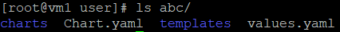

* [Dashboard](https://github.com/linjiachi/Linux_note/blob/master/109-1%20Docker/W16-20201229.md#dashboard)
    - [Dashboatd install](https://github.com/linjiachi/Linux_note/blob/master/109-1%20Docker/W16-20201229.md#dashboatd-install)
* [Helm (v3)](https://github.com/linjiachi/Linux_note/blob/master/109-1%20Docker/W16-20201229.md#helm-v3)
    - [Helm 介紹](https://github.com/linjiachi/Linux_note/blob/master/109-1%20Docker/W16-20201229.md#helm-%E4%BB%8B%E7%B4%B9)
    - [Helm 安裝](https://github.com/linjiachi/Linux_note/blob/master/109-1%20Docker/W16-20201229.md#helm-%E5%AE%89%E8%A3%9D)
    - [Helm 指令](https://github.com/linjiachi/Linux_note/blob/master/109-1%20Docker/W16-20201229.md#helm-%E6%8C%87%E4%BB%A4)
      - [安裝 chart](https://github.com/linjiachi/Linux_note/blob/master/109-1%20Docker/W16-20201229.md#%E5%AE%89%E8%A3%9D-chart)
      - [創造 chart](https://github.com/linjiachi/Linux_note/blob/master/109-1%20Docker/W16-20201229.md#%E5%89%B5%E9%80%A0-chart)
      - [實現 yaml 高效復用](https://github.com/linjiachi/Linux_note/blob/master/109-1%20Docker/W16-20201229.md#%E5%AF%A6%E7%8F%BE-yaml-%E9%AB%98%E6%95%88%E5%BE%A9%E7%94%A8)
---
# Dashboard
由 Kubernetes 提供的操作介面，透過 Dashboard 提供的圖形化介面，開發者能更快速、方便的查看 Kubernetes Cluster 上資源分布與使用情況。

## Dashboatd install
* 在 vm1 (192.168.56.104) 虛擬機執行

1. 建立一個檔案 [dashboard.yaml](https://github.com/linjiachi/Linux_note/blob/master/109-1%20Docker/File/W16-20201229/dashboard.yaml)

2. 在 `dashboard.yaml` 檔案新增 `type: NodePort`、`nodePort: 30310`

  ```yaml
  ---

  kind: Service
  apiVersion: v1
  metadata:
    labels:
      k8s-app: kubernetes-dashboard
    name: kubernetes-dashboard
    namespace: kubernetes-dashboard
  spec:
    type: NodePort
    ports:
      - port: 443
        targetPort: 8443
        nodePort: 30310
    selector:
      k8s-app: kubernetes-dashboard

  ---
  ```
3. 執行指令 

  ```sh
  kubectl apply -f dashboard.yaml
  ```
4. 檢查是否安裝成功

  ```sh
  kubectl get deployment -n kubernetes-dashboard | grep dashboard
  ```
  

5. 在 `kubernetes-dashboard` Namespace 當中查看所有訊息

  ```sh
  kubectl get all -n kubernetes-dashboard
  ```
6. 建立一個 [admin-role.yaml](https://github.com/linjiachi/Linux_note/blob/master/109-1%20Docker/File/W16-20201229/admin-role.yaml) 檔案來建立帳戶

  ```sh
  kubectl apply -f admin-role.yaml
  ```
7. 到 Firefox 輸入 `https://192.168.56.104:30310/#/login`，接受風險並繼續執行，最一開始會需要 token

* 取得 token 指令

  ```sh
  kubectl -n kube-system describe secret $(kubectl -n kube-system get secret | grep admin | awk '{print $1}') | grep token: | awk -F : '{print $2}' | xargs echo
  ```
複製 token 貼上後會登入到 Dashboard


# Helm (v3) 
Helm 屬於在 K8S 管理應用的一種微服務，將一個或多個應用包裝成一個服務，並透過 chart 的形式發布。

## Helm 介紹
* Helm 可以解決以下問題
  - 使用 Helm 可以把 yaml 檔整體管理
  - 實現 yaml 高效復用
  - 使用 Helm 應用級別的版本管理

* Helm 是 K8S 的包裝管理工具，如 yum、apt，可以方便將之前打包好的 yaml 文件部署到 K8S 上
  - Helm：命令行客戶端工具用於 K8S，應用於 chart 的創建、打包、發布與管理。
  - Chart：應用描述，描述 K8S 資源相關文件的集合。
  - Release：基於 chart 部署實體，一個 chart 被 helm 執行後產生對應一個 release。

* Helm 在 2019 發行 V3 版本
  - V3 刪除了 tiller
  - release 可以在不同命名空間重用
  - 將 chart 推送到 docker 倉庫中

## Helm 安裝
1. 下載 helm (v3)

  ```sh
  wget https://get.helm.sh/helm-v3.4.2-linux-amd64.tar.gz
  ```

2. 解壓縮

  ```sh
  tar xvfz helm-v3.4.2-linux-amd64.tar.gz
  ```

3. 進到資料夾並複製 `helm` 檔至 `/usr/local/bin/`

  ```sh
  [root@vm1 user]# cd linux-amd64/
  [root@vm1 linux-amd64]# ls
  helm  LICENSE  README.md
  [root@vm1 linux-amd64]# mv helm /usr/local/bin/
  ```
4. 初始化 Helm，添加一個 chart 倉庫

  ```sh
  helm repo add stable https://charts.helm.sh/stable
  ```
5. 查看倉庫 list

  ```sh
  [root@vm1 linux-amd64]# helm repo list
  NAME    URL
  stable  https://charts.helm.sh/stable
  ```
6. 查看 Helm 版本

  ```sh
  [root@vm1 user]# helm version
  version.BuildInfo{Version:"v3.4.2", GitCommit:"23dd3af5e19a02d4f4baa5b2f242645a1a3af629", GitTreeState:"clean", GoVersion:"go1.14.13"}
  ```
## Helm 指令
* 新增 aliyun 倉庫

  ```sh
  helm repo add aliyun https://kubernetes.oss-cn-hangzhou.aliyuncs.com/charts
  ```
* 移除 aliyun 倉庫

  ```sh
  helm repo remove aliyun
  ```
* 到 stable 倉庫中進行搜尋，顯示許多不同的 chart

  ```sh
  helm search repo stable
  ```
  

### 安裝 chart
1. 先更新，確定我們可以拿到最新的 charts 列表

  ```sh
  helm repo update
  ```
2. 查詢有關 mysql 的套件

  ```sh
  helm search repo mysql
  ```
3. 安裝 stable/mysql

  ```sh
  helm install stable/mysql --generate-name
  ```
4. 查詢已部署的應用

  ```sh
  helm list
  ```
  

5. 移除、卸載已部署的應用

  ```sh
  helm uninstall [NAME]
  ```
  

## 創造 chart
1. 新增一個 chart

  ```sh
  helm create abc
  ```
2. 查看 chart abc 資料夾

  ```sh
  ls abc/
  ```
  

3. 將 templates 資料夾裡的檔案全部刪除

  ```sh
  cd templates/
  rm -rf *
  ```
  

4. 在 `/home/user/abc/templates/` 中創建兩個檔案 [deployment.yaml](https://github.com/linjiachi/Linux_note/blob/master/109-1%20Docker/File/W16-20201229/mychart/templates/deployment.yaml)、[service.yaml](https://github.com/linjiachi/Linux_note/blob/master/109-1%20Docker/File/W16-20201229/mychart/templates/service.yaml)

5. 安裝 chart abc，記得要離開 abc 資料夾再安裝

  ```sh
  helm install abc --generate-name
  ```
6. 查看服務及 Port 號

  ```sh
  kubectl get svc
  ```
  

7. 測試

  ```sh
  curl 192.168.56.104:30381
  ```
  

## 實現 yaml 高效復用
* 將會變動的設定寫在 `values.yaml` 檔

1. 將 [mychart2](https://github.com/linjiachi/Linux_note/tree/master/109-1%20Docker/File/W16-20201229/mychart2) 資料夾利用 winscp 放入 vm1 中
2. 進入 `mychart2/templates/` 資料夾編輯 `deployment.yaml`，在 `replicas` 後面加上 `{{.Values.replicas}}`

  ```sh
  cd mychart2/templates/
  vim deployment.yaml
  ```
* `deployment.yaml`

  ```yaml
  apiVersion: apps/v1
  kind: Deployment
  metadata:
    creationTimestamp: null
    labels:
      app: {{.Values.label}}
    name: {{.Release.Name}}-deploy
  spec:
    replicas: {{.Values.replicas}}
    selector:
      matchLabels:
        app: {{.Values.label}}
  .
  .
  ```
3. 安裝 mychart2

  ```sh
  helm install mychart2 --generate-name
  ```
4. 查看狀態

  ```sh
  helm status [NAME]
  ```
  * `NAME`：`helm ls` 可以查詢

  

---
參考資料：
- [佈署 & 存取 Kubernetes Dashboard - 小信豬的原始部落](https://godleon.github.io/blog/Kubernetes/k8s-Deploy-and-Access-Dashboard/)
- [CentOS 7 安裝 Kubernetes (二) – 安裝 Kubernetes Dashboard - Ken Wu](https://kenwu0310.wordpress.com/2019/01/16/centos-7-%E5%AE%89%E8%A3%9D-kubernetes-%E4%BA%8C-%E5%AE%89%E8%A3%9D-kubernetes-dashboard/)
- [HELM Docs](https://helm.sh/zh/docs/intro/quickstart/)