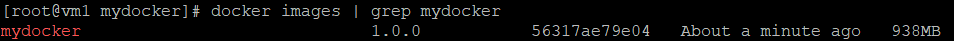
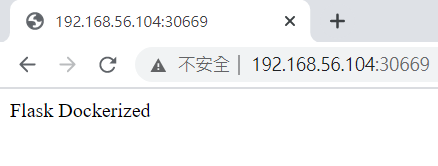
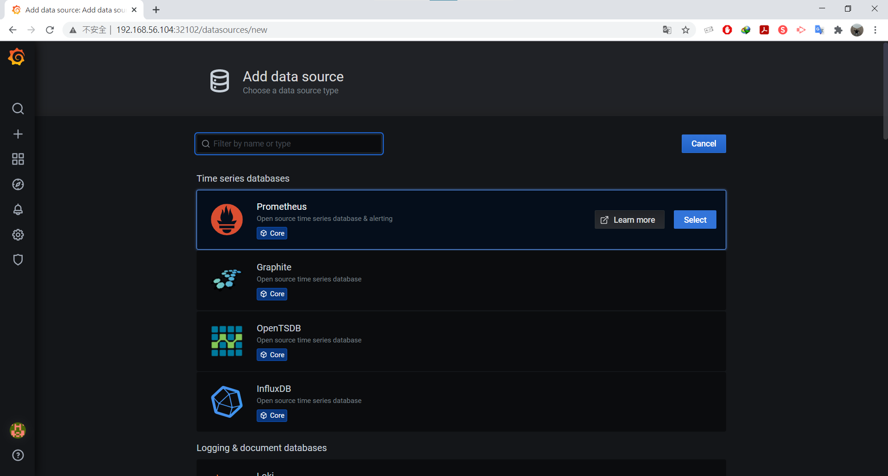

* [K8S 應用部署]()
    - [容器交代流程]()
    - [K8S 部署項目流程]()
    - [實作 Dockerfile + Flask]()
        - [環境準備]()
            - [推送至 DockerHub]()
            - [推送到鏡像倉庫 docker harbor]()
            - [補充：docker login fail]()
* [Prometheus]()
    - [Prometheus + Grafana 安裝]()
    - []()
---
# K8S 應用部署
## 容器交代流程
1. 開發代碼階段
    
    - 編寫代碼 coding
    - 測試 test
    - 編寫 Dockerfile
2. 持續交付/集成 CI/CD (Continuous Integration/Continuous Deployment)

    - 代碼打包
    - 製作鏡像
    - 上傳到鏡像倉庫
3. 應用部署
    
    - 環境準備
    - Pod
    - Service
    - Ingress
4. 運維

    - 監控 (K8S 使用的是 prometheus)
    - 故障檢查
    - 升級優化

## K8S 部署項目流程
1. 製作鏡像

    - Dockerfile
2. 推送鏡像倉庫

    - DockerHub
    - harbor
3. 控制器部署鏡像

    - Deployment
4. 對外暴露應用
    
    - Service
    - Ingress
5. 運維

    - 監控
    - 升級

# 實作 Dockerfile + Flask
## 環境準備

虛擬機|IP
:-:|:-:
vm1 (master)|192.168.56.104
vm2 (client)|192.168.56.105
vm3 (client)|192.168.56.106

* 三台虛擬機都先執行
```sh
docker login
```
### 推送至 DockerHub
**vm1**
1. 創建資料夾，並進到資料夾裡

    ```sh
    mkdir -p mydocker
    cd mydocker/
    ```
2. 創建三個檔案 `main.py`、`requirements.txt`、`Dockerfile`
* `main.py`

    ```py
    from flask import Flask

    app = Flask(__name__)


    @app.route('/')
    def hello_world():
        return 'Flask Dockerized'


    if __name__ == "__main__":
        app.run(debug=True, host='0.0.0.0', port=8888)
    ```
* `requirements.txt`

    ```txt
    Click==7.0
    Flask==1.1.1
    itsdangerous==1.1.0
    Jinja2==2.10.3
    MarkupSafe==1.1.1
    Werkzeug==0.16.0
    ```
* `Dockerfile`

    ```dockerfile
    FROM python:3.7.2-stretch

    WORKDIR /app

    ADD . /app

    RUN pip install -r requirements.txt

    CMD python main.py
    ```
3. 將 Dockerfile 打包成 image

    ```sh
    docker build -t mydocker:1.0.0 .
    ```
4. 啟動

    ```sh
    docker run -d -p 8081:8888 --name mydocker mydocker:1.0.0
    ```
5. 測試

    ```sh
    curl 127.0.0.1:8081
    ```
    

6. 查看 image

    ```sh
    docker images | grep mydocker
    ```
    

7. 將 image 重新命名

    ```sh
    docker tag 563 lin7/mydocker:1.0.0
    ```
    

8. 推送上傳至 DockerHub

    ```sh
    docker push lin7/mydocker:1.0.0
    ```
9. 產生一個 yaml 檔，並寫入 `mydocker-deployment.yaml` 檔

    ```sh
    kubectl create deployment mydocker --image=lin7/mydocker:1.0.0 --dry-run -o yaml > mydocker-deployment.yaml
    ```
10. 編輯 `mydocker-deployment.yaml`，在 `replicas` 修改數量

    ```sh
    vim mydocker-deployment.yaml
    ```
* `mydocker-deployment.yaml`

    ```yml
    replicas: 1-> 2
    ```
11. 部署

    ```sh
    kubectl apply -f mydocker-deployment.yaml
    ```
12. 提供暴露服務

    ```sh
    kubectl expose deployment mydocker --port=8888 --target-port=8888 --type=NodePort
    ```
13. 查看部署服務及 port

    ```sh
    kubectl get svc
    ```
    

14. 在 Chrome 上輸入 `[masrerIP:port]`

    

### 推送到鏡像倉庫 docker harbor
> 參考 [安裝 Docker-compose](https://github.com/linjiachi/Linux_note/blob/master/109-1%20Docker/W2-20200922.md#%E5%AE%89%E8%A3%9D-docker-compose)、[安裝 docker harbor](https://github.com/linjiachi/Linux_note/blob/master/109-1%20Docker/W4-20201006.md#%E5%AE%89%E8%A3%9D-docker-harbor)

1. 建立 [iris 鏡像檔](https://github.com/linjiachi/Linux_note/blob/master/109-1%20Docker/W6-20201020.md#iris)

2. 重新命名

    ```sh
    docker tag  192.168.56.104/library/myiris:1.0.0
    ```
3. 推送至 Harbor

    ```sh
    docker push 192.168.56.104/library/myiris:1.0.0
    ```
4. 產生一個 yaml 檔，並寫入 `myiris-deployment.yaml` 檔

    ```sh
    kubectl create deployment myiris --image=192.168.56.104/library/myiris:1.0.0 --dry-run -o yaml > myiris-deployment.yaml
    ```
5. 部署

    ```sh
    kubectl apply -f myiris-deployment.yaml
    ```
6. 提供暴露服務

    ```sh
    kubectl expose deployment myiris --port=5000 --target-port=5000 --type=NodePort
    ```
7. 查看部署服務及 port

    ```sh
    kubectl get svc
    ```
8. 編輯 `client.py`

    ```py

    ```
9. 

### 補充：docker login fail
```sh
[root@vm1 harbor]# docker login 192.168.56.104
Username: admin
Password:
Error response from daemon: login attempt to http://192.168.56.104/v2/ failed with status: 502 Bad Gateway
```
* 解決辦法

    ```sh
    [root@vm1 harbor]# docker ps | grep registry
    [root@vm1 harbor]# docker start registry
    registry
    [root@vm1 harbor]# docker ps | grep registry
    4c92efd27225   goharbor/registry-photon:v2.7.1-patch-2819-v1.9.0   "/entrypoint.sh /etc…"   25 minutes ago   Up 2 seconds (health: starting)   5000/tcp                    registry
    ```
再次登入成功
```sh
[root@vm1 harbor]# docker login 192.168.56.104
Username: admin
Password:
WARNING! Your password will be stored unencrypted in /root/.docker/config.json.
Configure a credential helper to remove this warning. See
https://docs.docker.com/engine/reference/commandline/login/#credentials-store

Login Succeeded
```

# Prometheus
Prometheus 是 K8S 的監控系統

## Prometheus + Grafana 安裝
1. 將 [prometheus]() 資料夾用 winscp，放入 vm1 虛擬機，並進入資料夾

    ```sh
    cd prometheus/
    ```
2. 修改 `grafana.yaml`、`prometheus.yaml` 檔
* `grafana.yaml`
    
    ```yml
    .
    .
    .
    nfs:
        path: /nfs/prometheus/data
        server: 192.168.56.104
    ```
* `prometheus.yaml`

    ```yml
    .
    .
    .
    nfs:
        path: /nfs/prometheus/data
        server: 192.168.56.104
    ```
3. 創建資料夾
    
    ```sh
    mkdir /nfs/prometheus/data/ -p
    mkdir /nfs/grafana/data/ -p
    ```
4. 編輯 `/etc/exports`，新增以下兩行

    ```sh
    /nfs/prometheus/data    192.168.56.0/24(rw,sync,no_root_squash,no_all_squash)
    /nfs/grafana/data    192.168.56.0/24(rw,sync,no_root_squash,no_all_squash)
    ```
5. 重啟 NFS 服務

    ```sh
    systemctl restart nfs
    ```
6. 部署服務

    ```sh
    kubectl apply -f namespace.yaml
    kubectl apply -f prometheus.yaml
    kubectl apply -f node-exporter.yaml
    kubectl apply -f grafana.yaml
    ```
7. 查看對應端口

    ```sh
    kubectl get svc -n ns-monitor
    ```
    

8. 在 Chrome 輸入 `192.168.56.104:32467`，進到 prometheus 的操作介面；`192.168.56.104:32102`，進到 Grafana 登入介面
* `192.168.56.104:32467`

    

* `192.168.56.104:32102`，一剛開始帳：admin / 密：admin，登入後重新設定密碼：passwd12345
    
    

    

9. 增加一個數據源
    
    

    

10. 填入 prometheus 的網址，點擊 Save&Test

    

11. import 面板 `https:///dashboards/315`

    

    

12. 檢視

    

---
參考資料：
- [實作 Dockerfile + flask 教學 (附GitHub完整程式)](https://www.maxlist.xyz/2020/01/11/docker-flask/)
- [Kubernetes+Prometheus+Grafana部署笔记 - 51CTO 博客](https://blog.51cto.com/kaliarch/2160569)