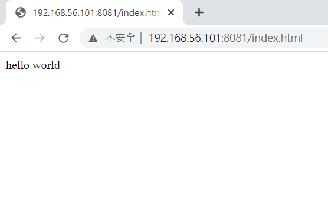

* [Docker](https://github.com/linjiachi/Linux_note/blob/master/109-1%20Docker/W3-20200929.md#docker)
    - [Docker 實作](https://github.com/linjiachi/Linux_note/blob/master/109-1%20Docker/W3-20200929.md#docker-%E5%AF%A6%E4%BD%9C)
    - [busybox](https://github.com/linjiachi/Linux_note/blob/master/109-1%20Docker/W3-20200929.md#busybox)
        - [安裝 busybox](https://github.com/linjiachi/Linux_note/blob/master/109-1%20Docker/W3-20200929.md#%E5%AE%89%E8%A3%9D-busybox)
        - [一次性指令](https://github.com/linjiachi/Linux_note/blob/master/109-1%20Docker/W3-20200929.md#%E4%B8%80%E6%AC%A1%E6%80%A7%E6%8C%87%E4%BB%A4)
    - [使用容器環境](https://github.com/linjiachi/Linux_note/blob/master/109-1%20Docker/W3-20200929.md#%E4%BD%BF%E7%94%A8%E5%AE%B9%E5%99%A8%E7%92%B0%E5%A2%83)
        - [C](https://github.com/linjiachi/Linux_note/blob/master/109-1%20Docker/W3-20200929.md#c)
        - [Python](https://github.com/linjiachi/Linux_note/blob/master/109-1%20Docker/W3-20200929.md#python)
        - [Httpd](https://github.com/linjiachi/Linux_note/blob/master/109-1%20Docker/W3-20200929.md#httpd)
            1. [將虛擬機的資料夾映射到 docker 環境中](https://github.com/linjiachi/Linux_note/blob/master/109-1%20Docker/W3-20200929.md#1%E5%B0%87%E8%99%9B%E6%93%AC%E6%A9%9F%E7%9A%84%E8%B3%87%E6%96%99%E5%A4%BE%E6%98%A0%E5%B0%84%E5%88%B0-docker-%E7%92%B0%E5%A2%83%E4%B8%AD)
            2. [利用`docker cp`將虛擬機的資料夾映射到 docker 環境中](https://github.com/linjiachi/Linux_note/blob/master/109-1%20Docker/W3-20200929.md#2%E5%88%A9%E7%94%A8docker-cp%E5%B0%87%E8%99%9B%E6%93%AC%E6%A9%9F%E7%9A%84%E8%B3%87%E6%96%99%E5%A4%BE%E6%98%A0%E5%B0%84%E5%88%B0-docker-%E7%92%B0%E5%A2%83%E4%B8%AD)
---
# Docker
* `/var/lib/docker`：docker 存放 Image、Container 的位置，可以說是 docker 的家目錄
## Docker 實作
* 選擇 Image 可以選擇 STARS 多的
```sh
[root@vm1 user]# docker search httpd
NAME                                    DESCRIPTION                                                      STARS               OFFICIAL            AUTOMATED
httpd                                   The Apache HTTP Server Project                                   3191                [OK]
centos/httpd-24-centos7                 Platform for running Apache httpd 2.4 or                  bui…   36
centos/httpd                                                                                             32                                      [OK]
arm32v7/httpd                           The Apache HTTP Server Project                                   9
polinux/httpd-php                       Apache with PHP in Docker (Supervisor, C                 entO…   4                                       [OK]
salim1983hoop/httpd24                   Dockerfile running apache config                                 2                                       [OK]
```
* `docker login`：Docker 登入，有些 Image 需要登入後才能下載

## busybox
* busybox 整合了很多小的 unix 下的通用功能，在 unix 或者 linux 下常用的那些功能在 busybox 都能找到
### 安裝 busybox
* 安裝：`docker pull busybox`
* 執行指令：

    ```sh
    docker run -it busybox
    docker run -it busybox:latest sh
    ```
* 執行結果：

    ```sh
    [root@vm1 user]# docker run -it busybox
    / #
    ```
* `Ctrl + p + q`：暫時離開容器(還是處於 running)，跳回本地端
* `docker attach [Container ID]`：回到容器(還是處於 running 的容器)
### 一次性指令
> * 執行完指令，就沒有程式在執行了，容器就會結束
> * 如果容器沒有持續執行的程式，容器就會結束
* `docker run -it busybox:latest echo "hello world"`
* `docker run -it --rm busybox:latest echo "hello world"`
    - `--rm`：容器只要結束，就會一起刪除

* 執行結果：

    ```sh
    [root@vm1 user]# docker run -it busybox:latest echo "hello world"
    hello world
    ```
## 使用容器環境
**開發環境很複雜，故可以利用在 docker 環境中，在想要的時候採用特別的編譯環境**
### C
* 下載 gcc 編譯器：`docker pull gcc`
* 新增 /data 資料夾，並在資料夾裡新增 hello.c

    ```sh
    mkdir -p /data
    cd /data
    vim hello.c
    ```
    ```c
    // hello.c

    #include <stdlib.h>
    #include <studio.h>

    int main(){
        printf("hello world\n");
        return 0;
    }
    ```
* `docker run -it -v /data:/data gcc:latest bash`
    - `-v`：value，將虛擬機的資料夾映射到 docker 環境內部的資料夾，也可以映射檔案，**將資料持久化**，若想映射多個就使用多個 `-v`
* `gcc -o hello hello.c`：將 hello.c 編譯成輸出檔 hello
    
* 執行結果：

    ```sh
    [root@vm1 data]# docker run -it -v /data:/data gcc:latest bash
    root@9750bb4739c4:/# cd /data/
    root@9750bb4739c4:/data# ls 
    hello hello.c 
    root@9750bb4739c4:/data# ./hello
    hello world
    ```
### Python
> 比較不同版本 Python2 及 Python3
* Python2：`docker pull codenvy/python27`
* Python3：`docker pull rackspacedot/python37`

* 新增 /data 資料夾，並在資料夾裡新增兩個檔案

    ```sh
    mkdir -p /data
    cd /data
    vim p2.py
        # 檔案寫入：
        print "Hello world"

    vim p3.py
        # 檔案寫入：
        print{"hello world"}
    ```
* `docker run -it -v /data:/data codenvy/python27 bash`
* 執行結果：

    ```sh
    [root@vm1 data]# docker run -it -v /data:/data codenvy/python27 bash
    user@1e15f4d6b045:/data$ python p2.py
    Hello world
    user@1e15f4d6b045:/data$ python p3.py
    set(['hello world'])  # p3.py 的寫法不行
    ```
    > 結果發現 `p3.py` 的寫法`print{"hello world"}`不行，將檔案修改為`print("hello world")`

* 執行結果：
    ```sh
    user@b58e26856206:/data$ cat p3.py
    print("hello world")
    user@b58e26856206:/data$ python p3.py
    hello world
    ```
### Httpd
* 下載 httpd：`docker pull httpd`
* 新增 /myweb 資料夾，並在資料夾裡新增一個 index.html 檔案
    
    ```sh
    mkdir -p /myweb
    cd /myweb
    echo "hello world" > index.html
    ```
#### 1.將虛擬機的資料夾映射到 docker 環境中
* 執行指令：`docker run -itd --name myweb2 -v /myweb:/usr/local/apache2/htdocs -p 8081:80 httpd`
* `docker exec -it myweb2 bash`：進到正在執行的容器
* 執行結果：
    ```sh
    [root@vm1 user]# docker run -itd --name myweb2 -v /myweb:/usr/local/apache2/htdocs -p 8081:80 httpd
    85bfaf19fab6b5c8dada991e9fbc88676dbd704cee6b0b1f9153533d8c11e513
    [root@vm1 user]# docker exec -it myweb2 bash
    root@85bfaf19fab6:/usr/local/apache2# cd htdocs/
    root@85bfaf19fab6:/usr/local/apache2/htdocs# ls
    index.html
    ```
    

#### 2.利用`docker cp`將虛擬機的資料夾映射到 docker 環境中
* 執行指令：
    ```sh
    docker run -itd --name myweb3 -p 8082:80 httpd
    docker cp index.html myweb3:/usr/local/apache2/htdocs
    ```
---
參考資料：
- [Docker利用busybox創建基礎鏡像(base image)](https://kknews.cc/zh-tw/code/9p3mja8.html)


