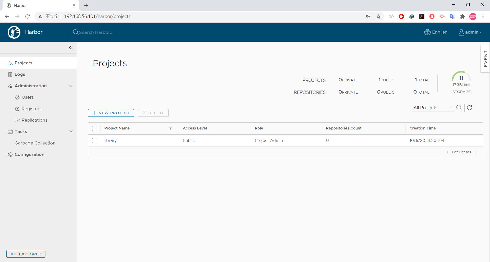
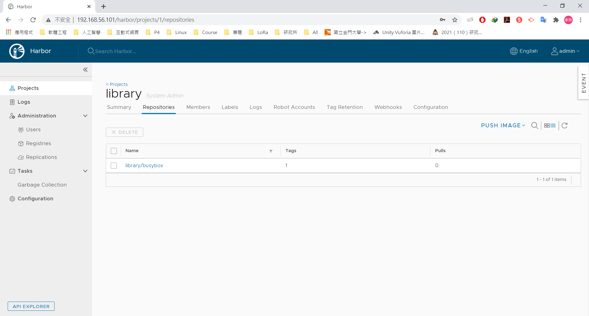

* [Docker 實作](https://github.com/linjiachi/Linux_note/blob/master/109-1%20Docker/W4-20201006.md#docker-%E5%AF%A6%E4%BD%9C)
    - [將資料從第一台(192.168.56.101)傳到第二台機器(192.168.56.102)](https://github.com/linjiachi/Linux_note/blob/master/109-1%20Docker/W4-20201006.md#%E5%B0%87%E8%B3%87%E6%96%99%E5%BE%9E%E7%AC%AC%E4%B8%80%E5%8F%B019216856101%E5%82%B3%E5%88%B0%E7%AC%AC%E4%BA%8C%E5%8F%B0%E6%A9%9F%E5%99%A819216856102)
    - [查看 docker 容器使用的資源](https://github.com/linjiachi/Linux_note/blob/master/109-1%20Docker/W4-20201006.md#%E6%9F%A5%E7%9C%8B-docker-%E5%AE%B9%E5%99%A8%E4%BD%BF%E7%94%A8%E7%9A%84%E8%B3%87%E6%BA%90)
    - [Harbor 私有倉儲](https://github.com/linjiachi/Linux_note/blob/master/109-1%20Docker/W4-20201006.md#harbor-%E7%A7%81%E6%9C%89%E5%80%89%E5%84%B2)
        - [安裝 docker harbor](https://github.com/linjiachi/Linux_note/blob/master/109-1%20Docker/W4-20201006.md#%E5%AE%89%E8%A3%9D-docker-harbor)
        - [上傳鏡像檔至 Harbor](https://github.com/linjiachi/Linux_note/blob/master/109-1%20Docker/W4-20201006.md#%E4%B8%8A%E5%82%B3%E9%8F%A1%E5%83%8F%E6%AA%94%E8%87%B3-harbor)

---
# Docker 實作
## 將資料從第一台(192.168.56.101)傳到第二台機器(192.168.56.102)
**vm1**
* 將 docker Image 存檔出一個檔案

    ```sh
    docker save -o myhttpd.tar 417
    ```
    - `-o`：output，輸出檔案
* 將資料傳到第二台機器
    
    ```sh
    scp myhttpd.tar user@192.168.56.102:/home/user
    ```

    ```sh
    [root@vm1 user]# scp myhttpd.tar user@192.168.56.102:/home/user
    user@192.168.56.102's password:
    myhttpd.tar                    100%  135MB  42.9MB/s   00:03
    ```
**vm2**
* 查看是否傳成功
    ```sh
    [root@vm2 user]# ls
    Desktop    Downloads  myhttpd.tar  Public     Videos
    Documents  Music      Pictures     Templates
    ```
* 載入至機器：`docker load -i myhttpd.tar`
## 查看 docker 容器使用的資源
* 容器分析，Docker 有提供指令讓使用者可以查看目前 Docker Container 所使用的 CPU、記憶體、網路 I/O...等等的資源使用量

    ```sh
    docker stats
    ```
* 取得 Container 的紀錄
    ```sh
    docker logs [Container ID]
    ```
## Harbor 私有倉儲
* Harbor 是 Docker 的鏡像倉庫
### 安裝 docker harbor
> search：github docker harbor，參考 [Docker容器倉庫Harbor的安裝部署](https://kknews.cc/zh-tw/code/5n9poj6.html)，我們選擇下載較穩定的版本 v1.9.0 [Github goharbor/harbor](https://github.com/goharbor/harbor/releases/tag/v1.9.0)

1. 檢查是否安裝 docker-compose

    ```sh
    docker-compose --version
    ```
2. 下載 http://csie.nqu.edu.tw/smallko/harbor1.9.0.tgz

    ```sh
    wget http://csie.nqu.edu.tw/smallko/harbor1.9.0.tgz
    ```
3. 解壓縮

    ```sh
    tar xvfz harbor1.9.0.tgz
    ```
4. 進到 /harbor，並更改 harbor.yml，將 hostname 更改為 vm1 的 IP

    ```yml
    # The IP address or hostname to access admin UI and registry service.
    # DO NOT use localhost or 127.0.0.1, because Harbor needs to be accessed by external clients.
    hostname: 192.168.56.101
    ```
5. 執行安裝

    ```sh
    sh install.sh
    ```
6. 在 Chrome 上輸入 vm1 IP，並登入

    
    

7. 再次開啟 docker harbor
> 進入到安裝目錄，可以看到一個 docker-compose.yml 文件，此文件就是用來控制 harbor 的啟動和停止。
    
    docker-compose start # 啟動
    docker-compose stop # 停止
    
### 上傳鏡像檔至 Harbor
1. 重新將鏡像標籤命名

    ```sh
    docker tag [Image ID] 192.168.56.101/library/busybox:latest
    ```
2. 這是因為 docker 默認使用的是 https 連接，而 harbor 默認使用 http 連接。對於這樣的情況，需要在客戶端的 docker 伺服器上添加如下此參數，表示它是個一個非安全類倉庫。

    ```sh
    
    [root@vm1 harbor]# vim /etc/docker/daemon.json

    {
    "insecure-registries":["192.168.56.101"] # 倉儲的 IP
    }

    ```
3. 重啟 docker 服務

    ```sh
    systemctl daemon-reload
    systemctl restart docker
    ```
    > 有時候會影響到 docker，故要在有 `docker-compose.yml` 的資料夾下執行 `docker-compose up -d`

4. 登入 Harbor 私有倉儲  

    ```sh
    [root@vm1 harbor]# docker login 192.168.56.101
    Username: admin
    Password:
    WARNING! Your password will be stored unencrypted in /root/.docker/config.json.
    Configure a credential helper to remove this warning. See
    https://docs.docker.com/engine/reference/commandline/login/#credentials-store

    Login Succeeded
    ```
5. 上傳鏡像檔至 Harbor

    ```sh
    [root@vm1 harbor]# docker push 192.168.56.101/library/busybox:latest
    The push refers to repository [192.168.56.101/library/busybox]
    be8b8b42328a: Pushed
    latest: digest: sha256:2ca5e69e244d2da7368f7088ea3ad0653c3ce7aaccd0b8823d11b0d5de956002 size: 527
    ```
6. 查看有無成功

    

7. 從 Harbor 下載 Image

    ```sh
    docker pull 192.168.56.101/library/busybox:latest
    ```

---
參考資料：
- [Day9：如何備份 Docker Image 為 tar 檔](https://ithelp.ithome.com.tw/articles/10191387)
- [Docker容器倉庫Harbor的安裝部署](https://kknews.cc/zh-tw/code/5n9poj6.html)
- [Harbor倉庫介紹與搭建過程](https://www.itread01.com/content/1526620986.html)
- [Github goharbor/harbor](https://github.com/goharbor/harbor/releases/tag/v1.9.0)
- [[Docker] Bridge Network 簡介](https://godleon.github.io/blog/Docker/docker-network-bridge/)