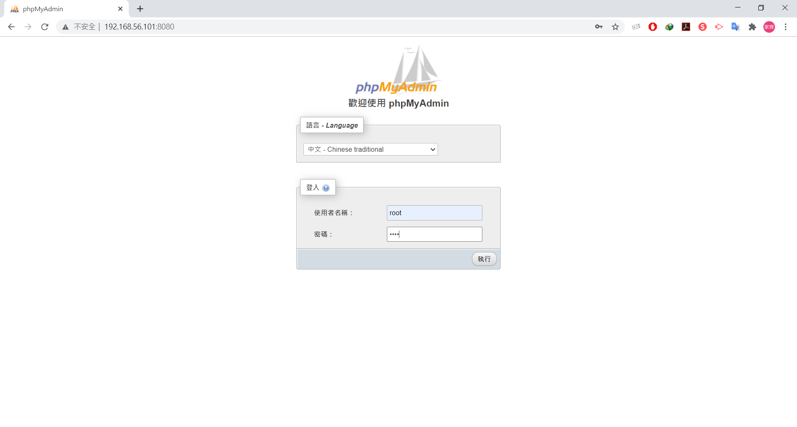

* [Docker 應用]()
  - [架設 MySQL]()
  - [架設 phpMyAdmin]()
  - [架設 Ngrok]()
  - [Iris]()
---
# Docker 應用
## 架設 MySQL
1. MySQL install
```sh
[root@vm1 user]# docker run -itd --name mysql -p 3306:3306 -e MYSQL_ROOT_PASSWORD=root mysql:5.7.24
```
2. 測試 mysql
```sh
[root@vm1 user]# docker exec -it 6d4 bash
root@6d40bec3fabf:/# mysql -uroot -p
Enter password: # paswd：root
Welcome to the MySQL monitor.  Commands end with ; or \g.
Your MySQL connection id is 2
Server version: 5.7.24 MySQL Community Server (GPL)

Copyright (c) 2000, 2018, Oracle and/or its affiliates. All rights reserved.

Oracle is a registered trademark of Oracle Corporation and/or its
affiliates. Other names may be trademarks of their respective
owners.

Type 'help;' or '\h' for help. Type '\c' to clear the current input statement.

# 創建一個 database
mysql> create database test1;
Query OK, 1 row affected (0.07 sec)

mysql> use test1;
Database changed

# 創建 mytable 資料表
mysql> create table mytable(school char(5),name char(10),id int);
Query OK, 0 rows affected (0.04 sec)

mysql> show tables;
+-----------------+
| Tables_in_test1 |
+-----------------+
| mytable         |
+-----------------+
1 row in set (0.00 sec)

# 新增資料
mysql> insert into mytable(school, name, id) values ('NQU','Jerry','123');
Query OK, 1 row affected (0.04 sec)
mysql> insert into mytable values ('NCTU','Amy','234');
Query OK, 1 row affected (0.00 sec)

# 顯示資料
mysql> select * from mytable;
+--------+-------+------+
| school | name  | id   |
+--------+-------+------+
| NQU    | Jerry |  123 |
| NCTU   | Amy   |  234 |
+--------+-------+------+
2 rows in set (0.00 sec)
```
## 架設 phpMyAdmin
1. phpMyAdmin install 連接 MySQL
```sh
[root@vm1 user]# docker run --name phpmyadmin -d --link mysql -e PMA_HOST="mysql" -p 8080:80 phpmyadmin/phpmyadmin
```
2. docker start mysql、phpmyadmin
```sh
[root@vm1 user]# docker start mysql
mysql
[root@vm1 user]# docker start phpmyadmin
phpmyadmin
```
3. 到 Chrome 開起 phpmyadmin 圖形化介面 `IP:8080`
* 預設帳密：帳：root / 密：root




4. 圖形化顯示資料表


## 架設 Ngrok
* 讓外網也能使用，連到網頁
1. 先到 [ngrok 官網](https://ngrok.com/)，註冊一個帳號


2. 登入後


3. 下載 [Linux](https://bin.equinox.io/c/4VmDzA7iaHb/ngrok-stable-linux-amd64.zip)


```sh
[root@vm1 ~]# wget https://bin.equinox.io/c/4VmDzA7iaHb/ngrok-stable-linux-amd64.zip
[root@vm1 ~]# ls
anaconda-ks.cfg  initial-setup-ks.cfg  ngrok-stable-linux-amd64.zip

//解壓縮
[root@vm1 ~]# unzip ngrok-stable-linux-amd64.zip
Archive:  ngrok-stable-linux-amd64.zip
  inflating: ngrok
```
4. 編譯 ngrok
```sh
[root@vm1 ~]# ./ngrok authtoken [自己的token]
Authtoken saved to configuration file: /root/.ngrok2/ngrok.yml
```
5. 測試，開啟 httpd
```sh
[root@vm1 ~]# docker run -d -p 8080:80 --name myweb httpd:latest
f499d7fa02b6d914d1aeec27ff0ec206114ec00cae2da1e868f1680991419c2e
[root@vm1 ~]# ./ngrok http 8080
```
* 連線畫面


6. 在 Chrome 輸入 http://a06d9583bd39.ngrok.io/


## Iris
> 深度學習典型的例子
1. 創建一個 iris 資料夾
```sh
[root@vm1 ~]# mkdir -p iris
[root@vm1 ~]# cd iris/
```
2. 創建 train_model.py 檔
```py
# coding: utf-8
import pickle
from sklearn import datasets
from sklearn.model_selection import train_test_split
from sklearn import tree

# simple demo for traing and saving model
iris=datasets.load_iris()
x=iris.data
y=iris.target

#labels for iris dataset
labels ={
  0: "setosa",
  1: "versicolor",
  2: "virginica"
}

x_train, x_test, y_train, y_test = train_test_split(x, y, test_size=.25)
classifier=tree.DecisionTreeClassifier()
classifier.fit(x_train,y_train)
predictions=classifier.predict(x_test)

#export the model
model_name = 'model.pkl'
print("finished training and dump the model as {0}".format(model_name))
pickle.dump(classifier, open(model_name,'wb'))
```
* 測試
```sh
[root@vm1 iris]# vim train_model.py
[root@vm1 iris]# python train_model.py
Traceback (most recent call last):
  File "train_model.py", line 3, in <module>
    from sklearn import datasets
ImportError: No module named sklearn  # 缺少模組
[root@vm1 iris]# yum install epel-release   # 安裝第三方套件模組
[root@vm1 iris]# pip install --upgrade pip  # 更新 pip
[root@vm1 iris]# pip install sklearn  # 安裝 sklearn 模組
[root@vm1 iris]# python train_model.py
finished training and dump the model as model.pkl
```
3. 創建 server.py 檔
```py
import pickle

from flask import Flask, request, jsonify

app = Flask(__name__)

# Load the model
model = pickle.load(open('model.pkl', 'rb'))
labels = {
  0: "versicolor",
  1: "setosa",
  2: "virginica"
}

@app.route('/api', methods=['POST'])
def predict():
    # Get the data from the POST request.
    data = request.get_json(force = True)
    predict = model.predict(data['feature'])
    return jsonify(predict[0].tolist())

if __name__ == '__main__':
    app.run(debug = True, host = '0.0.0.0')
```
4. 創建 client.py 檔
```py
# coding: utf-8
import requests
# Change the value of experience that you want to test
url = 'http://127.0.0.1:5000/api'   # 改成 127.0.0.1
feature = [[5.8, 4.0, 1.2, 0.2]]
labels ={
  0: "setosa",
  1: "versicolor",
  2: "virginica"
}

r = requests.post(url,json={'feature': feature})
print(labels[r.json()])
```
5. 執行 
```sh
[root@vm1 iris]# python client.py
setosa
```
---
參考資料：
- [簡單的 MySQL 使用教學 - 傑瑞窩在這](https://jerrynest.io/mysql-tutorial/)
- [[開發工具小技巧][05] ngrok 讓外部能夠連到 localhost 的網站及服務](https://blog.alantsai.net/posts/2018/04/devtooltips-5-ngrok-allow-public-to-access-localhost-website-and-sql-server)
- [通过 Flask, Docker, Jenkins 和 Kubernets 部署机器学习模型 - 吴良超的学习笔记](http://wulc.me/2019/04/19/%E9%80%9A%E8%BF%87%20Flask,%20Docker,%20Jenkins%20%E5%92%8C%20Kubernets%20%E9%83%A8%E7%BD%B2%E6%9C%BA%E5%99%A8%E5%AD%A6%E4%B9%A0%E6%A8%A1%E5%9E%8B/)
- [利用 Dockfile、Docker Compose 建立 LAMP 環境 (PHP、Apache、MySQL)](https://hackmd.io/@titangene/docker-lamp)