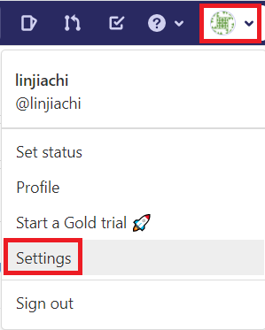

* [GitLab - CI/CD (Continuous Delivery/Continuous Deployment)](https://github.com/linjiachi/Linux_note/blob/master/109-1%20Docker/W7-20201027.md#gitlab---cicd-continuous-deliverycontinuous-deployment)
   - [將 Iris 打包成 docker](https://github.com/linjiachi/Linux_note/blob/master/109-1%20Docker/W7-20201027.md#%E5%B0%87-iris-%E6%89%93%E5%8C%85%E6%88%90-docker)
   - [與 GitLab 建立 CI/CD](https://github.com/linjiachi/Linux_note/blob/master/109-1%20Docker/W7-20201027.md#%E8%88%87-gitlab-%E5%BB%BA%E7%AB%8B-cicd)
      - [與 GitLab 建立 SSH 連線](https://github.com/linjiachi/Linux_note/blob/master/109-1%20Docker/W7-20201027.md#%E8%88%87-gitlab-%E5%BB%BA%E7%AB%8B-ssh-%E9%80%A3%E7%B7%9A)
      - [將 iris 專案上傳至 GitLab](https://github.com/linjiachi/Linux_note/blob/master/109-1%20Docker/W7-20201027.md#%E5%B0%87-iris-%E5%B0%88%E6%A1%88%E4%B8%8A%E5%82%B3%E8%87%B3-gitlab)
      - [建立 gitlab-runner](https://github.com/linjiachi/Linux_note/blob/master/109-1%20Docker/W7-20201027.md#%E5%BB%BA%E7%AB%8B-gitlab-runner)
 
---
# Gitlab - CI/CD (Continuous Delivery/Continuous Deployment)
* 整合自動化發佈或部署 (Continuous Delivery/Continuous Deployment, CI/CD)

## 將 Iris 打包成 docker
> 延續上周內容
1. 安裝鏡像
```sh
docker pull nitincypher/docker-ubuntu-python-pip
```
2. 建立 Dockerfile
```dockerfile
FROM nitincypher/docker-ubuntu-python-pip

COPY ./requirements.txt /app/requirements.txt

WORKDIR /app

RUN pip install -r requirements.txt

COPY server.py /app

COPY train_model.py /app

CMD python /app/train_model.py && python /app/server.py
```
3. 建立 requirements.txt
```sh
sklearn
flask
```
4. 建立鏡像檔
```sh
[root@vm1 iris]# docker build -t iris:1.0 .
```
- `-t`：標籤建立
5. 執行 & 測試
```sh
[root@vm1 iris]# docker run -itd --name iris -p 5000:5000 iris:1.0
102efa98eae5b8c4e6ce85468771c9e1bb72ec21923a12e1fecd15675f226a27
[root@vm1 iris]# python client.py
setosa
```
## 與 GitLab 建立 CI/CD
### 與 GitLab 建立 SSH 連線
* vm1、vm2 皆須建立

1. 以 vm2 為例，在第二台虛擬機產生 ssh 金鑰
```sh
[root@vm2 ~]# ssh-keygen
[root@vm2 ~]# cd .ssh
[root@vm2 .ssh]# ls
id_rsa  id_rsa.pub
# 私鑰  # 公鑰
[root@vm2 .ssh]# cat id_rsa.pub
```
2. 到 GitLab setting - SSH Keys，將公鑰複製貼上並命名




3. 建立完成


## 將 iris 專案上傳至 GitLab
1. 先到 [GitLab](https://gitlab.com/users/sign_in?redirect_to_referer=yes&__cf_chl_jschl_tk__=89569c25cb71b833a2796dc37a84276808493a9b-1605019400-0-AYeIhJ0ostnoPKzZoZaCSk13SACWkvYPXxj5WjXrEwBkGP1kq7IDKdXmjTO3W5dBo1E8vI-1nyTjGFfX6NFHD0iDqdrLygEYoOlyu1jrP3ZUe8PiaCFgr4_6T0t1dfc0S1cyB0RWFZAANzb5zgGkA3LGbOdVHzlYtkd4jvL5VpwPUKHhzr6fPbvw-1v4uJDgURmk84Y5j42diF1oMfzMnfxfhVMboO4AxGQp_GqEy11NKIRK7EipJkjX4vaJ3zjjK_jt9tBj9zpIpCN75wbFbV92CqXeGk0o9J1eROjDy0kswOYCSBI92PtNaKnbvu7vZNWbYidNX-kq-CJrVAoVULsoMjk3knDsvj5VXtt0qo4F4WYpnRkKnXdUp2hxMS0Ajg) 註冊帳號
2. 到 Projects -> Your projects -> New project -> 命名專案


3. 到 vm1 將 **Git global setup** 指令輸入
4. 到 `/iris` 資料夾
```sh
git init
git remote add origin git@gitlab.com:linjiachi/myiris.git
git add .
git commit -m "Initial commit"
git push -u origin master
```
5. 上傳完成


## 建立 gitlab-runner
* 只要 vm1 上傳檔案 vm2 會自動更新

**vm2 建立 gitlab-runner**
```sh
[root@vm2 ~]# curl -L --output /usr/local/bin/gitlab-runner https://gitlab-runner-downloads.s3.amazonaws.com/latest/binaries/gitlab-runner-linux-amd64
  % Total    % Received % Xferd  Average Speed   Time    Time     Time  Current
                                 Dload  Upload   Total   Spent    Left  Speed
100 35.3M  100 35.3M    0     0  1820k      0  0:00:19  0:00:19 --:--:-- 2395k
[root@vm2 ~]# chmod +x /usr/local/bin/gitlab-runner

# 給權限
[root@vm2 ~]# useradd --comment 'GitLab Runner' --create-home gitlab-runner --shell /bin/bash
[root@vm2 ~]# usermod -aG docker gitlab-runner

# 一般使用者執行 docker 失敗
[root@vm2 ~]# su - user
Last login: Tue Oct 27 14:51:16 CST 2020 from 192.168.56.1 on pts/1
[user@vm2 ~]$ docker ps
Got permission denied while trying to connect to the Docker daemon socket at unix:///var/run/docker.sock: Get http://%2Fvar%2Frun%2Fdocker.sock/v1.40/containers/json: dial unix /var/run/docker.sock: connect: permission denied

# gitlab-runner 可以執行 docker
[root@vm2 ~]# su - gitlab-runner
Last failed login: Tue Oct 27 15:40:35 CST 2020 on pts/1
There was 1 failed login attempt since the last successful login.
[gitlab-runner@vm2 ~]$ docker ps
CONTAINER ID        IMAGE               COMMAND             CREATED             STATUS              PORTS               NAMES


[root@vm2 ~]# /usr/local/bin/gitlab-runner install --user=gitlab-runner --working-directory=/home/gitlab-runner
Runtime platform                                    arch=amd64 os=linux pid=3812 revision=ece86343 version=13.5.0
[root@vm2 ~]# /usr/local/bin/gitlab-runner start
Runtime platform                                    arch=amd64 os=linux pid=3862 revision=ece86343 version=13.5.0
```

**註冊 gitlab-runner**
* 將 Setting 裡 CI/CD 的 Runner token 複製
```sh
[root@vm2 ~]# gitlab-runner register
Runtime platform                                    arch=amd64 os=linux pid=4040 revision=ece86343 version=13.5.0
Running in system-mode.

Please enter the gitlab-ci coordinator URL (e.g. https://gitlab.com/):
https://gitlab.com/
Please enter the gitlab-ci token for this runner:
Myzxuf3bckJvMRf3DLVJ    # 貼上剛剛複製的 token
Please enter the gitlab-ci description for this runner:
[vm2]: centos7-2-local-runner
Please enter the gitlab-ci tags for this runner (comma separated):
centos7-2
Registering runner... succeeded                     runner=Myzxuf3b
Please enter the executor: ssh, virtualbox, docker+machine, docker-ssh+machine, kubernetes, docker, docker-ssh, shell, custom, parallels:
shell
Runner registered successfully. Feel free to start it, but if it's running already the config should be automatically reloaded!
[root@vm2 ~]#

```
**將 Shared runner 關閉**


**設定完成**


**在 vm1 新增 .gitlab-ci.yml 檔**
```sh
[root@vm1 iris]# vim .gitlab-ci.yml
[root@vm1 iris]# ls -a
.   client.py   .git            model.pkl         server.py
..  Dockerfile  .gitlab-ci.yml  requirements.txt  train_model.py
[root@vm1 iris]# git add .gitlab-ci.yml
[root@vm1 iris]# git commit -m "submit .gitlab-ci.yml"
[master 79f10ad] submit .gitlab-ci.yml
 1 file changed, 11 insertions(+)
 create mode 100644 .gitlab-ci.yml
[root@vm1 iris]# git push -u origin master
Counting objects: 4, done.
Compressing objects: 100% (3/3), done.
Writing objects: 100% (3/3), 432 bytes | 0 bytes/s, done.
Total 3 (delta 1), reused 0 (delta 0)
To git@gitlab.com:linjiachi/myiris.git
   8269bf6..79f10ad  master -> master
Branch master set up to track remote branch master from origin.
```

---
參考資料：
- [吳良超的學習筆記 - 通过 Flask, Docker, Jenkins 和 Kubernets 部署机器学习模型](http://wulc.me/2019/04/19/%E9%80%9A%E8%BF%87%20Flask,%20Docker,%20Jenkins%20%E5%92%8C%20Kubernets%20%E9%83%A8%E7%BD%B2%E6%9C%BA%E5%99%A8%E5%AD%A6%E4%B9%A0%E6%A8%A1%E5%9E%8B/)
- [Install GitLab Runner manually on GNU/Linux](https://docs.gitlab.com/runner/install/linux-manually.html)
- [什麼是 CI / CD ? - Bear 熊](https://medium.com/@Bear_/%E4%BB%80%E9%BA%BC%E6%98%AF-ci-cd-72bd5ae571f1)