* [CI/CD (Continuous Delivery/Continuous Deployment)](https://github.com/linjiachi/Linux_note/blob/master/109-1%20Docker/W8-20201103.md#cicd-continuous-deliverycontinuous-deployment)
    - [新建一個專案 testgo](https://github.com/linjiachi/Linux_note/blob/master/109-1%20Docker/W8-20201103.md#%E6%96%B0%E5%BB%BA%E4%B8%80%E5%80%8B%E5%B0%88%E6%A1%88-testgo)
* [Docker-compose](https://github.com/linjiachi/Linux_note/blob/master/109-1%20Docker/W8-20201103.md#docker-compose)
    - [Docker-compose 簡介](https://github.com/linjiachi/Linux_note/blob/master/109-1%20Docker/W8-20201103.md#docker-compose-%E7%B0%A1%E4%BB%8B)
    - [Docker-compose 實作](https://github.com/linjiachi/Linux_note/blob/master/109-1%20Docker/W8-20201103.md#docker-compose-%E5%AF%A6%E4%BD%9C)
        - [Test1 - web project](https://github.com/linjiachi/Linux_note/blob/master/109-1%20Docker/W8-20201103.md#test1---web-project)
---
# CI/CD (Continuous Delivery/Continuous Deployment)
* 參考 [Github yangshun2005/gitlab-cicd](https://github.com/yangshun2005/gitlab-cicd)

## 新建一個專案 testgo
1. git clone 檔案，在本地端建立 docker image，並測試是否能正常運作

    **vm1**
    ```sh
    [root@vm1 user]# git clone https://github.com/yangshun2005/gitlab-cicd.git
    [root@vm1 user]# cd gitlab-cicd/
    [root@vm1 gitlab-cicd]# cd testgolang/
    [root@vm1 testgolang]# docker build -t testgo:1.0 .
    [root@vm1 testgolang]# docker run -d -p 8001:8001 testgo:1.0
    c438e254a9c08d230dc24bfe18c707a928b6c9b0fec2c44ebf130a7f8ca99ee5
    [root@vm1 testgolang]# curl 192.168.56.101:8001/hello
    hello chinaase willim ,I running in docker-container and buit by gitlab
    ```

2. 在另一台機器 centos7-2 安裝 gitlab-runner，並產生 ssh key，把 public key 新增到 gitlab 上

    **確認 R2 有 git-runner**
    ```sh
    [root@vm2 user]# gitlab-runner
    Runtime platform                                    arch=amd64 os=linux pid=11045 revision=ece86343 version=13.5.0
    NAME:
    gitlab-runner - a GitLab Runner

    USAGE:
    gitlab-runner [global options] command [command options] [arguments...]

    VERSION:
    13.5.0 (ece86343)

    AUTHOR:
    GitLab Inc. <support@gitlab.com>

    COMMANDS:
        exec                  execute a build locally
        list                  List all configured runners
        run                   run multi runner service
        register              register a new runner
        install               install service
        uninstall             uninstall service
        start                 start service
        stop                  stop service
        restart               restart service
        status                get status of a service
        run-single            start single runner
        unregister            unregister specific runner
        verify                verify all registered runners
        artifacts-downloader  download and extract build artifacts (internal)
        artifacts-uploader    create and upload build artifacts (internal)
        cache-archiver        create and upload cache artifacts (internal)
        cache-extractor       download and extract cache artifacts (internal)
        cache-init            changed permissions for cache paths (internal)
        health-check          check health for a specific address
        read-logs             reads job logs from a file, used by kubernetes executor (internal)
        help, h               Shows a list of commands or help for one command

    GLOBAL OPTIONS:
    --cpuprofile value           write cpu profile to file [$CPU_PROFILE]
    --debug                      debug mode [$DEBUG]
    --log-format value           Choose log format (options: runner, text, json) [$LOG_FORMAT]
    --log-level value, -l value  Log level (options: debug, info, warn, error, fatal, panic) [$LOG_LEVEL]
    --help, -h                   show help
    --version, -v                print the version

    ```

3. 在 gitlab 上新建一個 project

    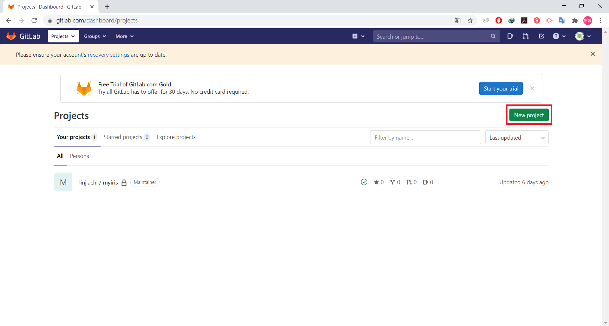
    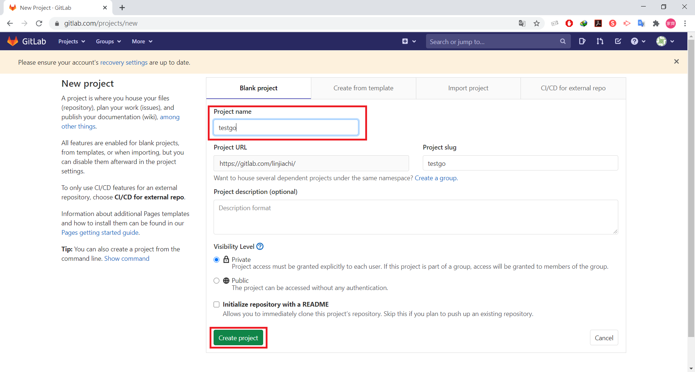
    
    **建完 project 後會出現 Command line instructions，在第一台機器執行**
    
    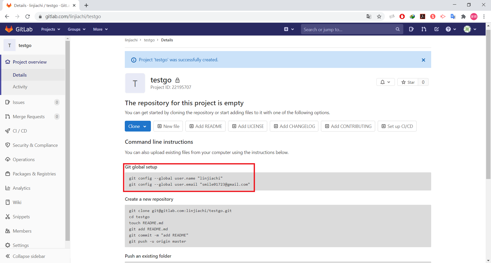
    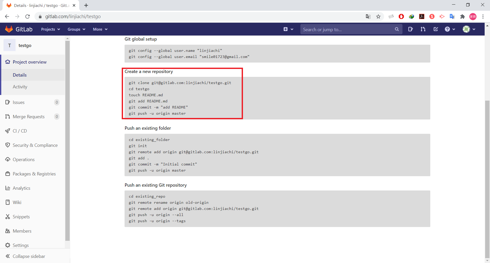

    **vm1**

    ```sh
    [root@vm1 testgolang]# git init
    Initialized empty Git repository in /home/user/gitlab-cicd/testgolang/.git/
    [root@vm1 testgolang]# git remote add origin git@gitlab.com:linjiachi/testgo.git
    [root@vm1 testgolang]# git add .
    [root@vm1 testgolang]# git commit -m "Initial commit"
    [master (root-commit) 5eb4e34] Initial commit
    5 files changed, 69 insertions(+)
    create mode 100644 .gitignore
    create mode 100644 .gitlab-ci.yml
    create mode 100644 Dockerfile
    create mode 100644 README.md
    create mode 100644 main.go
    [root@vm1 testgolang]# git push -u origin master
    ```

    **執行完成**

    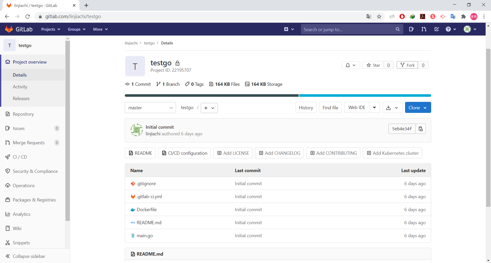

4. 在第二台進行環境配置

    **到 Settings - CI/CD - Runners**
    
    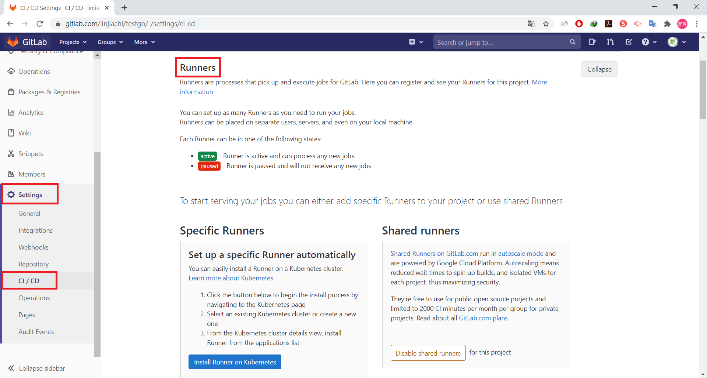

    **a. 開啟 Shared runners 的 Disable shared runners，變成 Enable shared runners。**
    
    **b. 在第二台虛擬機開啟 gitlab-runner，設定 gitlab-runner register**

    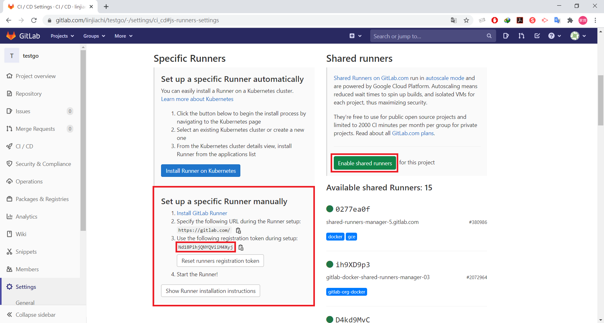

    **R2**
    ```sh
    [root@vm2 user]# gitlab-runner start
    Runtime platform                                    arch=amd64 os=linux pid=11486 revision=ece86343 version=13.5.0
    [root@vm2 user]# gitlab-runner register
    Runtime platform                                    arch=amd64 os=linux pid=11501 revision=ece86343 version=13.5.0
    Running in system-mode.

    Please enter the gitlab-ci coordinator URL (e.g. https://gitlab.com/):
    https://gitlab.com/     # 打上 https://gitlab.com/
    Please enter the gitlab-ci token for this runner:
    Nd18PihjQNYQViiM4Xyj    # 在 gitlab 上的 Set up a specific Runner manually 的第三個 token
    Please enter the gitlab-ci description for this runner:
    [vm2]: centos7-2        # 此機器的名稱
    Please enter the gitlab-ci tags for this runner (comma separated):
    mbp13       # 這個的 tags 要跟 .gitlab-ci.yml 的 tags 一樣
    Registering runner... succeeded                     runner=Nd18Pihj
    Please enter the executor: docker, parallels, ssh, virtualbox, docker+machine, kubernetes, custom, docker-ssh, shell, docker-ssh+machine:
    shell
    Runner registered successfully. Feel free to start it, but if it's running already the config should be automatically reloaded!
    ```

    **設置完成**

    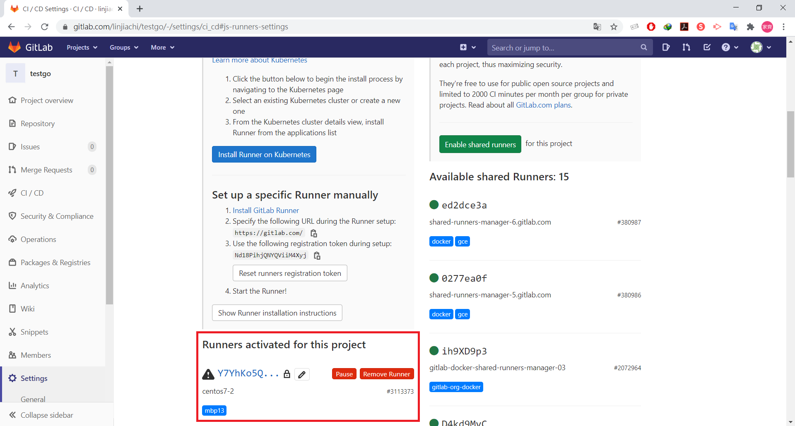


# Docker-compose
## Docker-compose 簡介
* 可以在一台主機同時管理多個容器
* 檔案格式為 `yml` 檔
## Docker-compose 實作
### Test1 - web project
1. 新建一個資料夾，並進入資料夾

```sh
mkdir test-dockercompose
```
2. 建立 `app.py`

```py
import time
 import redis
 from flask import Flask

 app = Flask(__name__)
 cache = redis.Redis(host='redis', port=6379)

 def get_hit_count():
     retries = 5
     while True:
         try:
             return cache.incr('hits')
         except redis.exceptions.ConnectionError as exc:
             if retries == 0:
                 raise exc
             retries -= 1
             time.sleep(0.5)

 @app.route('/')
 def get_index():
     count = get_hit_count()
     return 'Yo! 你是第 {} 次瀏覽\n'.format(count)

 if name == "__main__":
     app.run(host="0.0.0.0", debug=True)
```
2. 建立 `docker-compose.yml`

```yml
version: '3'
services:
 web:
     build: .
     ports:
     - "5000:5000"
     volumes:
     - .:/code 
 redis:
     image: "redis:alpine"
```
3. 建立 `Dockerfile`

```dockerfile
FROM python
ADD . /code 
WORKDIR /code 
RUN pip install -r requirements.txt
CMD ["python", "app.py"]
```
4. 建立 `requirements.txt`

```txt
flask 
redis
```
5. 查看是否安裝 `docker-compose`

```sh
[root@vm1 user]# docker-compose version
docker-compose version 1.27.3, build 4092ae5d
docker-py version: 4.3.1
CPython version: 3.7.7
OpenSSL version: OpenSSL 1.1.0l  10 Sep 2019
```
> 如果沒有安裝，可以參考 [docker-compose install](https://docs.docker.com/compose/install/)

6. 啟動服務並在背景執行

```sh
docker-compose up -d
```
7. 執行 web 程式

```sh
curl 127.0.0.1:5000
```
**將 web project 上傳至 GitLab**
1. 到 Projects -> Your projects -> New project -> 命名專案 `docker-compose-python-flask-redis`

2. 在 vm1 執行 **Git global setup** 和 **Push an existing folder**

3. 上傳完成

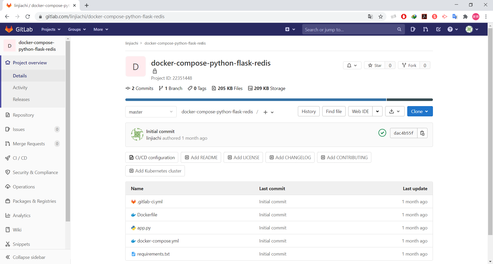

**在 vm2 建立 gitlab-runner**
1. 到 Settings -> CI/CD -> 複製 token -> Shared runners 關閉

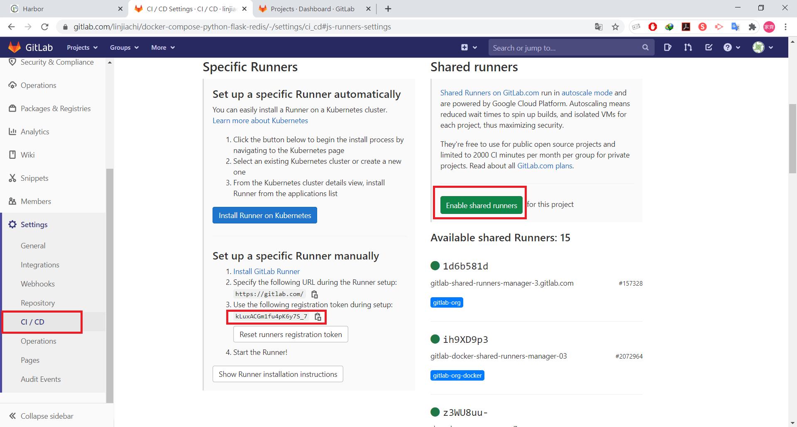

2. 在 vm2 `gitlab-runner register` 註冊
> 詳細參考 [建立 gitlab-runner](https://github.com/linjiachi/Linux_note/blob/master/109-1%20Docker/W7-20201027.md#%E5%BB%BA%E7%AB%8B-gitlab-runner)

3. 註冊完成

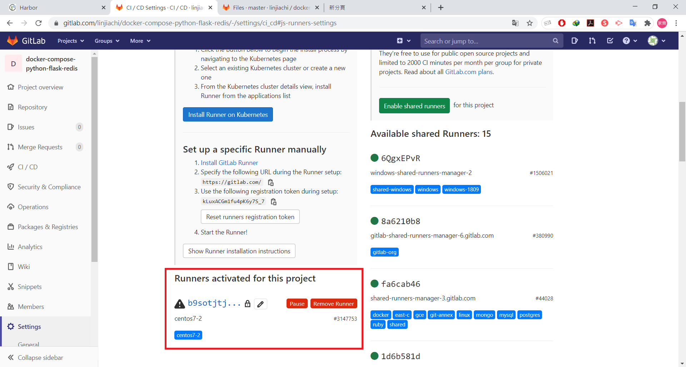

4. 執行結果

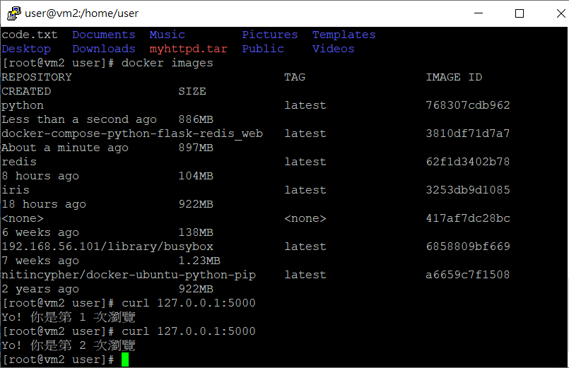

---
參考資料：
- [Github yangshun2005/gitlab-cicd](https://github.com/yangshun2005/gitlab-cicd)
- [Docker Compose 建置 Web service 起步走入門教學 - TechBridge 技術共筆部落格](https://blog.techbridge.cc/2018/09/07/docker-compose-tutorial-intro/)