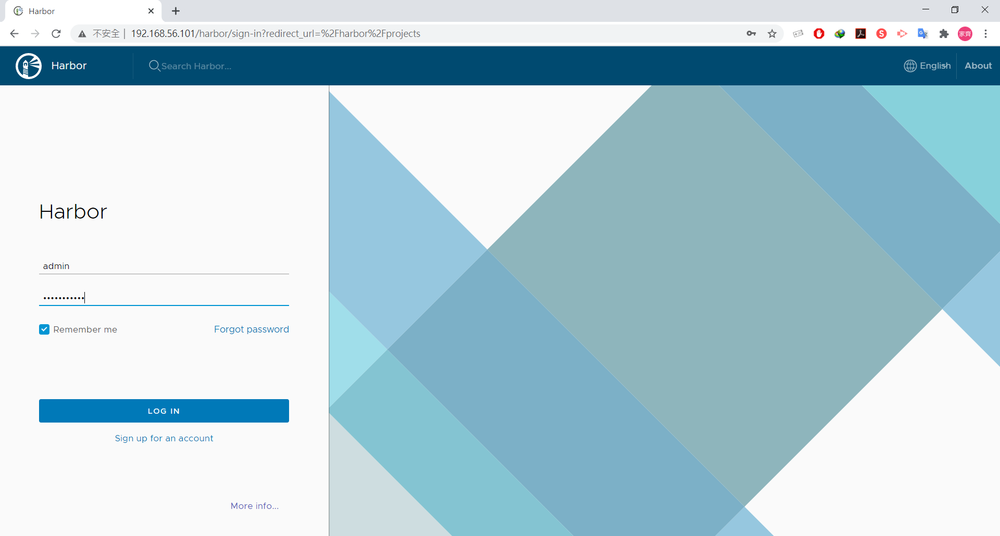
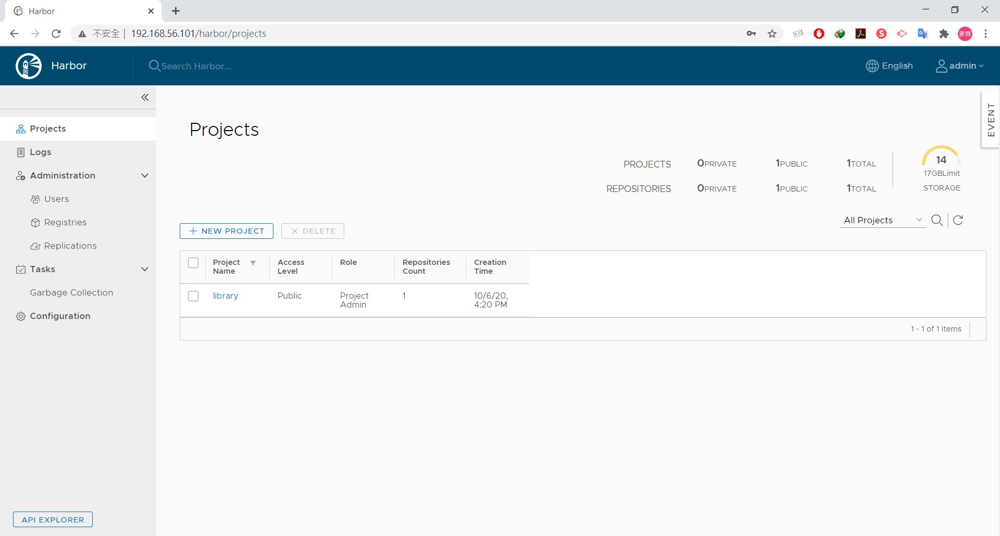
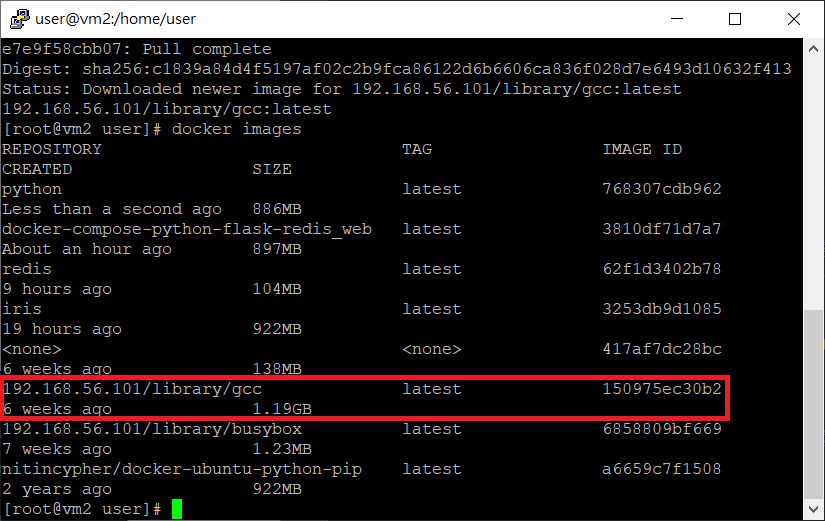

# MidtermTest
## Test1
### 題目：建立 harbor，並可以上傳下載 docker image

參考：[Harbor 私有倉儲](https://github.com/linjiachi/Linux_note/blob/master/109-1%20Docker/W4-20201006.md#harbor-%E7%A7%81%E6%9C%89%E5%80%89%E5%84%B2)

### 安裝 docker harbor
1. 下載 [http://csie.nqu.edu.tw/smallko/harbor1.9.0.tgz](http://csie.nqu.edu.tw/smallko/harbor1.9.0.tgz)
```sh
wget http://csie.nqu.edu.tw/smallko/harbor1.9.0.tgz
```
2. 解壓縮
```sh
tar xvfz harbor1.9.0.tgz
```
3. 到 /harbor 資料夾下，編輯 harbor.yml 檔，將 hostname 更改為 vm1 的 IP
```sh
# The IP address or hostname to access admin UI and registry service.
# DO NOT use localhost or 127.0.0.1, because Harbor needs to be accessed by external clients.
hostname: 192.168.56.101
```
4. 執行安裝
```sh
sh install.sh
```
5. 在 Chrome 上輸入 vm1 IP，帳：admin / 密：Harbor12345




### 上傳鏡像檔至 Harbor
1. 重新將鏡像檔命名
```sh
docker tag 1509 192.168.56.101/library/gcc:latest
```
2. 到 /etc/docker/daemon.json 增加倉儲 IP
```sh
vim /etc/docker/daemon.json

{
"insecure-registries":["192.168.56.101","192.168.56.102"]
}

```
3. 重啟 docker 服務
```sh
systemctl daemon-reload
systemctl restart docker
```
4. 登入 docker harbor
```sh
docker login 192.168.56.101
```
5. 上傳鏡像檔至 harbor
```sh
docker push 192.168.56.101/library/gcc:latest
```
6. 查看上傳有無成功


7. 到第二台虛擬機 (vm2) 下載 library/gcc:latest
```sh
docker pull 192.168.56.101/library/busybox:latest
```
8. 下載結果



## Test2
### 題目：在本地端建立 mydata 資料夾，在資料夾中建立 hi.htm (內容是 hi)，使用 http image 啟動並掛載 mydata，讓 browser 可以看到 hi

參考：[Httpd](https://github.com/linjiachi/Linux_note/blob/master/109-1%20Docker/W3-20200929.md#httpd)

1. 下載 httpd
```sh
docker pull httpd
```
2. 新增 mydata 資料夾，並新建一個 hi.htm (內容為 hi)
```sh
mkdir -p /mydata
cd /mydata
echo "hi" > hi.htm
```
3. 將內容映射到 docker 環境中，並進入正在執行的容器中
```sh
docker run -itd --name mydata -v /mydata:/usr/local/apache2/htdocs -p 8080:80 httpd
docker exec -it mydata bash
cd htdocs/
```

4. 到 Chrome 輸入 `192.168.56.101:8080/hi.htm`


## Test3
### 題目：建立 mynet (bridge type)，並啟動兩個 docker (VM1、VM2)，讓這兩個 VM1、VM2 可以用名稱連接

參考：[使用自訂的 bridge Network](https://github.com/linjiachi/Linux_note/blob/master/109-1%20Docker/W5-20201013.md#%E4%BD%BF%E7%94%A8%E8%87%AA%E8%A8%82%E7%9A%84-bridge-network)

1. 創造一個新的網路並命名 mynet
```sh
docker network create -d bridge mynet
```
2. 啟動兩個

## Test4
### 題目：使用 Docker-compose (flask、redis) 上傳至 gitlab 上，並 deplay 在另一台機器上

參考：[]()