* [計算機網路]()
    - [前言]()
* [EVE (Emulated Virtual Environment)]()
    - [前言]()
    - [EVE-Pro 預設帳密]()
    - [開啟 Wireshark]()
    - [補充：新增新的 Template]()
---
# 計算機網路
## 前言
* 本學期會教**交換(Layer2)** 與 **路由(Layer3)**
    - Layer2
        - LAN、VLAN、STP
    - Layer3
        - RIP、OSPF、EIGRP
* 課堂參考 [Jan Ho 的網絡世界](https://www.jannet.hk/zh-Hant/)
# EVE (Emulated Virtual Environment)
## 前言
* EVE-Pro 網路模擬器，可以透過 Web Brower 建立 Lab，不用安裝 Client

## EVE-Pro 預設帳密
* terminal：
    - username：root
    - password：eve

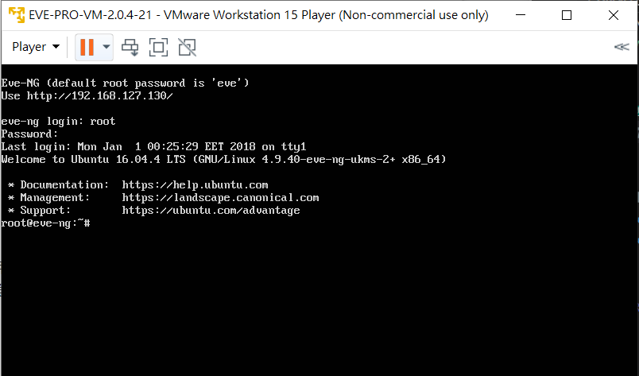

* web client： \
(在 Windows 輸入 Terminal 的 IP 登入 EVE)

    - username：admin
    - password：eve

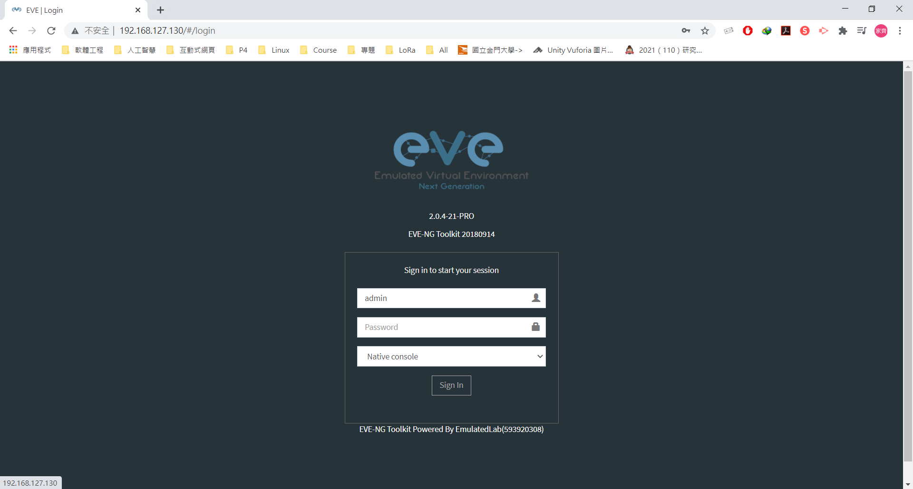

* Add new lab


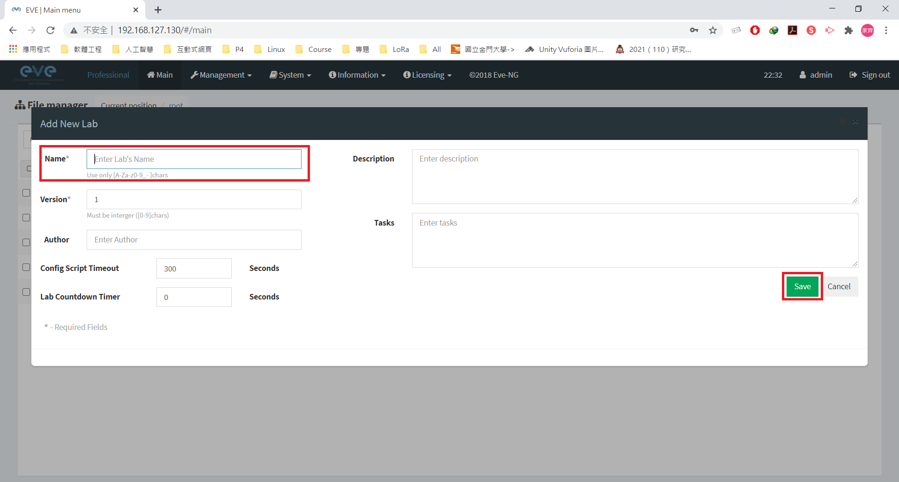

* Add an object

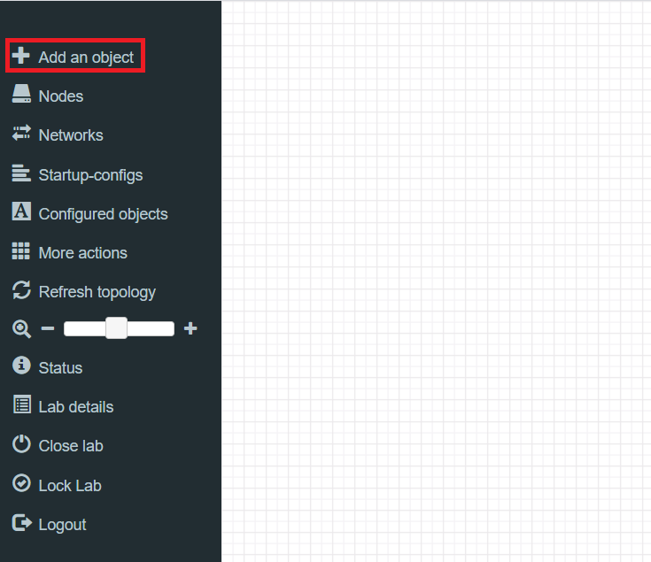

* Add Node
    - Cisco IOL 當 switch
    - Vitual PC (VPCS) 當 PC

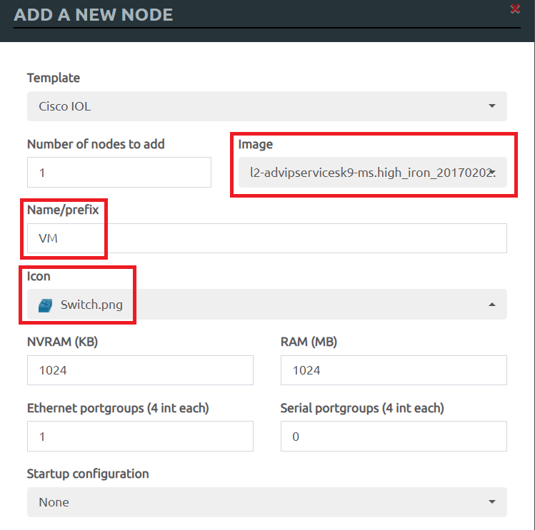
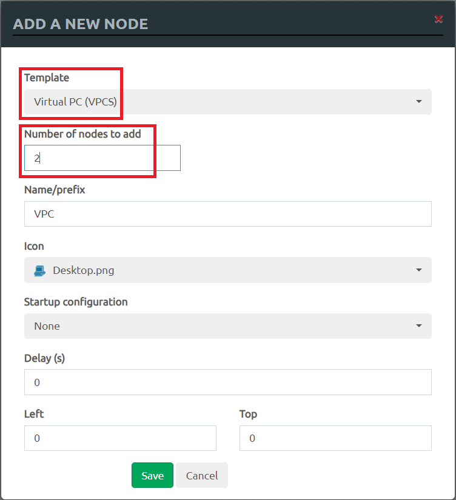

* 將兩台 PC 和 SW 連起來

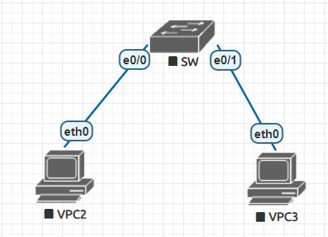

* Start all Nodes

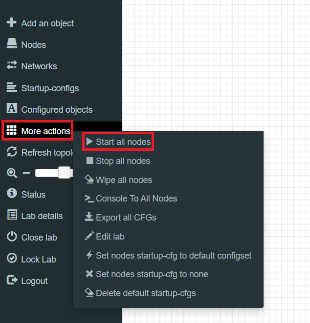
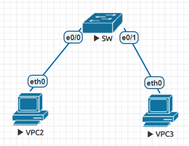

* 將 PC1 新增 IP，點擊 VPC2 開啟 Terminal
```sh
ip 192.168.1.1 255.255.255.0
```
* 將 PC2 新增 IP，點擊 VPC3 開啟 Terminal
```sh
ip 192.168.1.2 255.255.255.0
```
## 開啟 Wireshark
* 在 SW 按右鍵點擊 Capture，選擇 eth0 接口查看封包
* 可以互 ping 查看運作情況

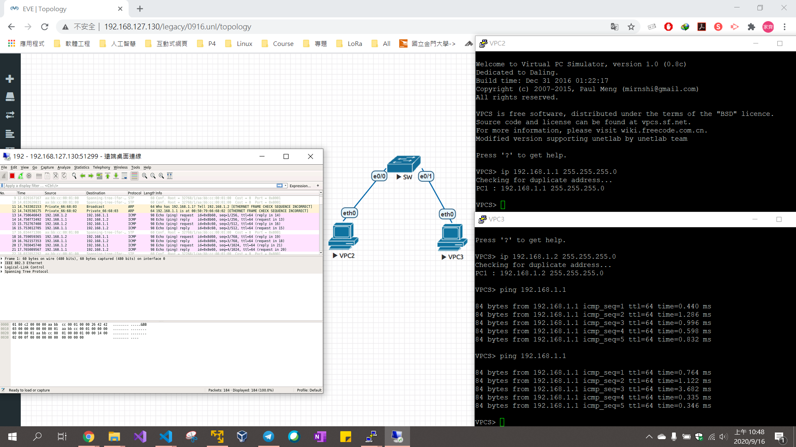

## 補充：新增新的 Template
* 教學網址：[Add VMWare Esxi](https://www.eve-ng.net/index.php/documentation/howtos/howto-add-vm-ware-esxi/)

1. 下載其中一個檔

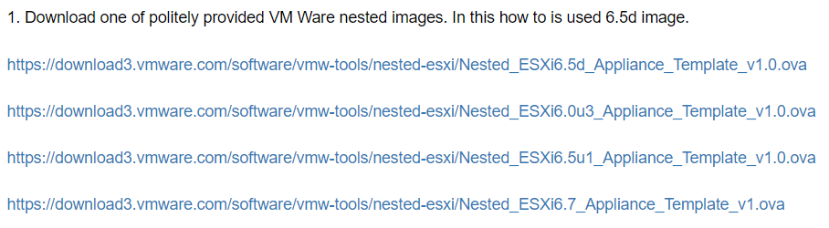

2. 依照網頁做完所有步驟即可
3. 到網頁上檢查

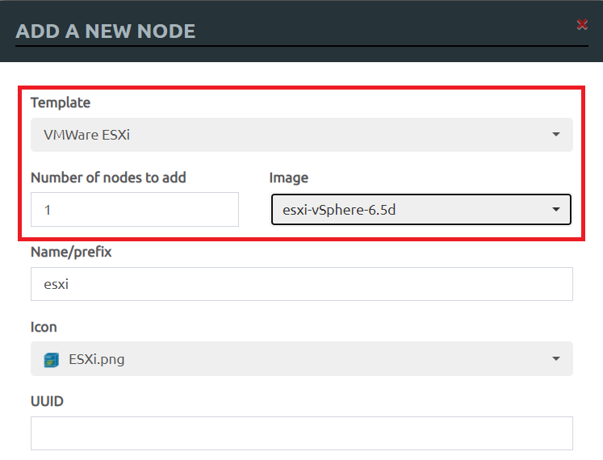

---
參考資料：
- [Jan Ho 的網絡世界](https://www.jannet.hk/zh-Hant/)