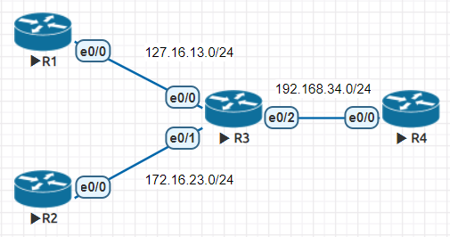
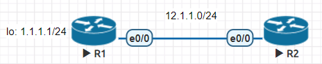
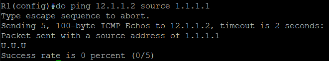

* [EIGRP (Enhanced Interior Gateway Routing Protocol)](https://github.com/linjiachi/Linux_note/blob/master/109-1/cisco/W10-20201118.md#eigrp-enhanced-interior-gateway-routing-protocol)
    - [Metric](https://github.com/linjiachi/Linux_note/blob/master/109-1/cisco/W10-20201118.md#metric)
    - [路徑選擇](https://github.com/linjiachi/Linux_note/blob/master/109-1/cisco/W10-20201118.md#%E8%B7%AF%E5%BE%91%E9%81%B8%E6%93%87)
    - [Variance](https://github.com/linjiachi/Linux_note/blob/master/109-1/cisco/W10-20201118.md#variance)
    - [Summarization](https://github.com/linjiachi/Linux_note/blob/master/109-1/cisco/W10-20201118.md#summarization)
        - [Test1](https://github.com/linjiachi/Linux_note/blob/master/109-1/cisco/W10-20201118.md#test1)
* [ACL (Access Control List) - 存取控制清單](https://github.com/linjiachi/Linux_note/blob/master/109-1/cisco/W10-20201118.md#acl-access-control-list---%E5%AD%98%E5%8F%96%E6%8E%A7%E5%88%B6%E6%B8%85%E5%96%AE)
    - [ACL 運作模式](https://github.com/linjiachi/Linux_note/blob/master/109-1/cisco/W10-20201118.md#acl-%E9%81%8B%E4%BD%9C%E6%A8%A1%E5%BC%8F)
    - [ACL 從嚴或從寬條件](https://github.com/linjiachi/Linux_note/blob/master/109-1/cisco/W10-20201118.md#acl-%E5%BE%9E%E5%9A%B4%E6%88%96%E5%BE%9E%E5%AF%AC%E6%A2%9D%E4%BB%B6)
    - [ACL 種類](https://github.com/linjiachi/Linux_note/blob/master/109-1/cisco/W10-20201118.md#acl-%E7%A8%AE%E9%A1%9E)
    - [ACL 實作](https://github.com/linjiachi/Linux_note/blob/master/109-1/cisco/W10-20201118.md#acl-%E5%AF%A6%E4%BD%9C)
        - [Test1 - 過濾封包](https://github.com/linjiachi/Linux_note/blob/master/109-1/cisco/W10-20201118.md#test1---%E9%81%8E%E6%BF%BE%E5%B0%81%E5%8C%85)

---
# EIGRP (Enhanced Interior Gateway Routing Protocol)
## Metric
* 計算公式 = `(K1 * BW * 256 + (K2 * BW) / (256 - load) + K3 * delay * 256) * (K5 / (reliability + K4))`

    * 預設 K1 = 1、K2 = 0、K4 = 0、K5 = 0
    * 將公式簡化成 `(BW + delay) * 256`
    * BW = `10^7 / interface bandwidth (Kbit)`
    * delay = `interface delay (usec) / 10`
## 路徑選擇
* AD (Advertised Distance)：下一個節點去目的地的距離
* FD (Feasible Distance)：從自己到目的地的距離最小值
* FD 的 Path 成為 Successor，並放入路由表
* AD 小於 FD 的 Path 則成為 Feasible successor，作為 Successor 的備用
## Variance
這是一個倍數，看可以容許 FD 內的 AD 值得路徑，預設為 1

## Summarization
自動彙總的話只會用 /8、/16、/24，而手動即可根據要彙整的數量作相對應的遮罩
### Test1
* 架構圖



**設定 IP**
```sh
//R1
R1(config-if)#int e0/0
R1(config-if)#ip addr 172.16.13.1 255.255.255.0
R1(config-if)#no shut

//R2
R2(config)#int e0/0
R2(config-if)#ip addr 172.16.23.2 255.255.255.0
R2(config-if)#no shut

//R3
R3(config)#int e0/0
R3(config-if)#ip addr 172.16.13.3 255.255.255.0
R3(config-if)#no shut
R3(config-if)#int e0/1
R3(config-if)#ip addr 172.16.23.3 255.255.255.0
R3(config-if)#no shut
R3(config-if)#int e0/2
R3(config-if)#ip addr 192.168.34.3 255.255.255.0
R3(config-if)#no shut

//R4
R4(config)#int e0/0
R4(config-if)#ip addr 192.168.34.4 255.255.255.0
R4(config-if)#no shut
```
**設定 EIGRP**
```sh
//R1
R1(config-if)#router eigrp 1
R1(config-router)#network 172.16.13.0 0.0.0.255
R1(config-router)#no auto-summary

//R2
R2(config-if)#router eigrp 1
R2(config-router)#network 172.16.23.0 0.0.0.255
R2(config-router)#no auto-summary

//R3
R3(config-if)#router eigrp 1
R3(config-router)#network 172.16.13.0 0.0.0.255
R3(config-router)#network 172.16.23.0 0.0.0.255
R3(config-router)#network 192.168.34.0
R3(config-router)#no auto-summary

//R4
R4(config-if)#router eigrp 1
R4(config-router)#network 192.168.34.0
R4(config-router)#no auto-summary
```
**將 172.16.13.0 和 172.16.23.0 這兩條 Route Summize 合併為一條**
```sh
R3(config-if)#int e0/2
R3(config-if)#ip summary-address eigrp 1 172.16.0.0 255.255.224.0
```
**結果**
```sh
R3(config-if)#do sh ip route

Gateway of last resort is not set

      172.16.0.0/16 is variably subnetted, 5 subnets, 3 masks
D        172.16.0.0/19 is a summary, 00:00:10, Null0
.
.
.
```
# ACL (Access Control List) - 存取控制清單
* 可以做為資料分類
* 可以設置為簡易防火牆    
    1. 設定規則
    2. 指定規則要在哪個介面及指定方向

## ACL 運作模式
* permit：允許封包通過
* deny：禁止封包通過
* permit any：如果都沒有符合，但最後一筆是 permit any，則該封包允許通過
* deny any：如果都沒有符合，但最後一筆是 deny any，則該封包不允許通過

## ACL 從嚴或從寬條件
1. 從嚴條件：**最後一筆**如果是 Deny any，表示之前條件都不符合，則拒絕通過
2. 從寬條件：**最後一筆**如果是 Permit any，表示之前條件都不符合，則允許通過

* 黑名單方式：限制某些不能通過，其他的可以
* 白名單方式：讓某些通過，其他的拒絕

## ACL 種類
1. 標準存取控制清單 (Standard ACL)：檢視 IP 封包中的來源位置，來決定封包是否允許通過，編號為 1~99
2. 延伸式存取清單 (Extended ACL)：針對第三層的來源 IP、目的 IP或第四層傳輸層控制，編號為 100~199
3. 名稱式存取清單 (Named ACL)：以名稱命名的方式存取，對於新增條件相較彈性

## ACL 實作
### Test1 - 過濾封包
* 架構圖



**環境設置**
```sh
//R1
R1(config)#int e0/0
R1(config-if)#ip addr 12.1.1.1 255.255.255.0
R1(config-if)#no shut
R1(config-if)#int lo 0
R1(config-if)#ip addr 1.1.1.1 255.255.255.0

//R2
R2(config)#int e0/0
R2(config-if)#ip addr 12.1.1.2 255.255.255.0
R2(config-if)#no shut
R2(config-if)#exit
R2(config)#ip route 1.1.1.0 255.255.255.0 12.1.1.1
```
> 現在 R1(12.1.1.1/1.1.1.1) 和 R2(12.1.1.2) 可以互 ping

**R2 限制 IP**
```sh
R2(config)#ho R2
R2(config)#access-list 1 deny host 1.1.1.1
R2(config)#access-list 1 permit any
R2(config)#int e0/0
R2(config-if)#ip access-group 1 in
R2(config-if)#ip addr 12.1.1.2 255.255.255.0
R2(config-if)#no shut
```
**阻擋 IP 為 1.1.1.1 的封包**



---
參考資料：
- [Jan Ho 的網路世界](https://www.jannet.hk/zh-Hant/post/enhanced-interior-gateway-routing-protocol-eigrp/#path)
- [封包過濾表-存取控制清單](http://www.tsnien.idv.tw/Manager_WebBook/chap9/9-5%20%E5%B0%81%E5%8C%85%E9%81%8E%E6%BF%BE%E8%A1%A8%20%E2%80%93%20ACL.html)