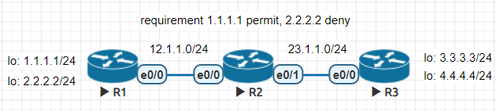
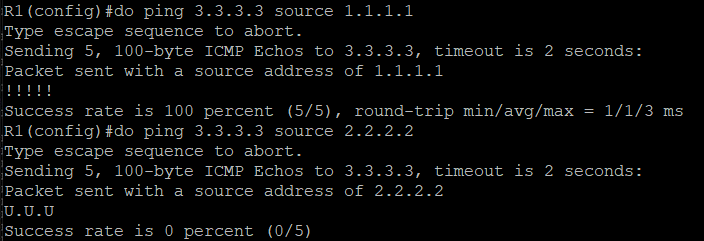
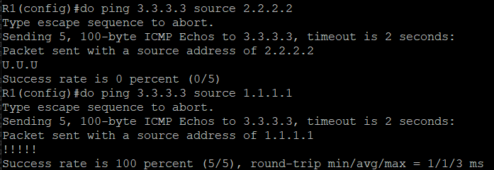
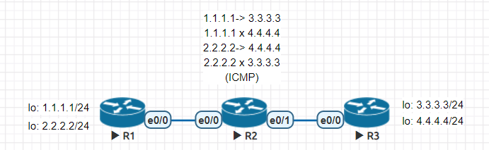
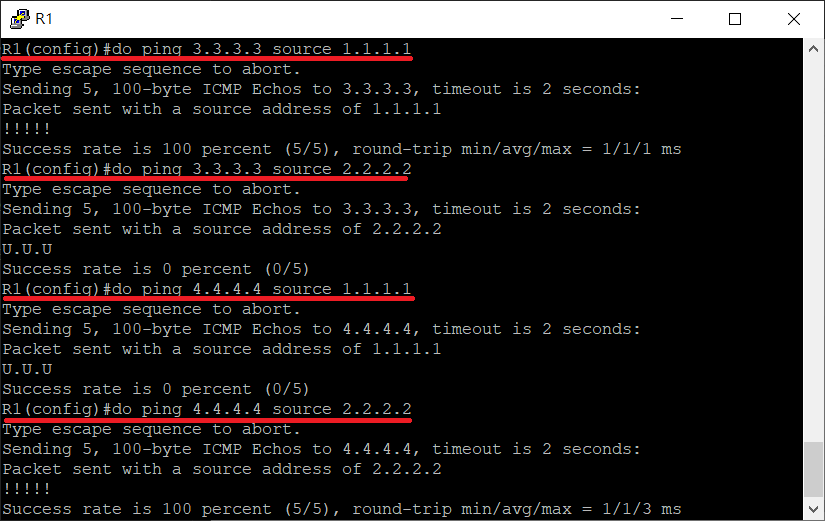
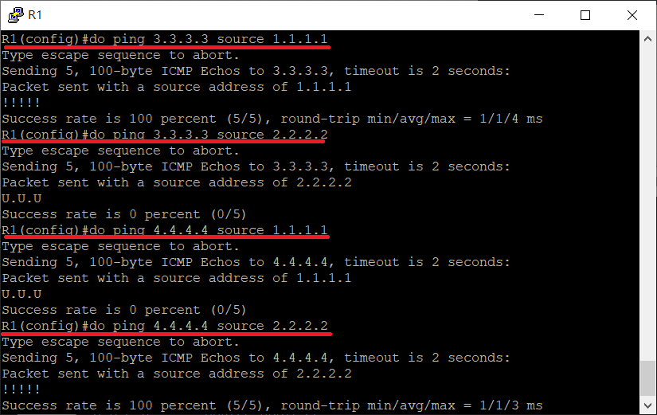
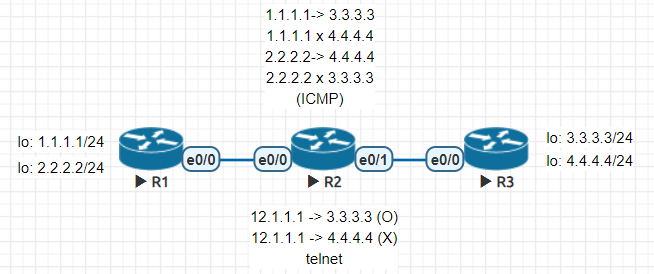

* [ACL 實作](https://github.com/linjiachi/Linux_note/blob/master/109-1/cisco/W11-20201125.md#acl-%E5%AF%A6%E4%BD%9C)
    - [Test1 - Standard ACL](https://github.com/linjiachi/Linux_note/blob/master/109-1/cisco/W11-20201125.md#test1---standard-acl)
    - [Test2 - Extended ACL](https://github.com/linjiachi/Linux_note/blob/master/109-1/cisco/W11-20201125.md#test2---extended-acl)
    - [Test3 - Telnet](https://github.com/linjiachi/Linux_note/blob/master/109-1/cisco/W11-20201125.md#test3---telnet)
    - [Test4 - Named ACL](https://github.com/linjiachi/Linux_note/blob/master/109-1/cisco/W11-20201125.md#test4---named-acl)
---
# ACL 實作
## Test1 - Standard ACL
* 架構圖



**設定 IP**
```sh
//R1
R1(config)#int e0/0
R1(config-if)#ip addr 12.1.1.1 255.255.255.0
R1(config-if)#no shut
R1(config-if)#int lo 0
R1(config-if)#ip addr 1.1.1.1 255.255.255.0
R1(config-if)#int lo 1
R1(config-if)#ip addr 2.2.2.2 255.255.255.0

//R2
R2(config)#int e0/0
R2(config-if)#ip addr 12.1.1.2 255.255.255.0
R2(config-if)#no shut
R2(config-if)#int e0/1
R2(config-if)#ip addr 23.1.1.2 255.255.255.0
R2(config-if)#no shut

//R3
R3(config)#int e0/0
R3(config-if)#ip addr 23.1.1.3 255.255.255.0
R3(config-if)#no shut
R3(config-if)#int lo 0
R3(config-if)#ip addr 3.3.3.3 255.255.255.0
R3(config-if)#int lo 1
R3(config-if)#ip addr 4.4.4.4 255.255.255.0
```
**設定 RIP**
```sh
//R1
R1(config)#router rip
R1(config-router)#version 2
R1(config-router)#network 12.1.1.0
R1(config-router)#network 1.1.1.0
R1(config-router)#network 2.2.2.0
R1(config-router)#no auto-summary

//R2
R2(config)#router rip
R2(config-router)#network 12.1.1.0
R2(config-router)#network 23.1.1.0
R2(config-router)#no auto-summary

//R3
R3(config)#router rip
R3(config-router)#version 2
R3(config-router)#network 23.1.1.0
R3(config-router)#network 3.3.3.0
R3(config-router)#network 4.4.4.0
R3(config-router)#no auto-summary
```
**黑名單方法設定**
```sh
//R3
R3(config)#access-list 1 deny 2.2.2.2 0.0.0.255
R3(config)#access-list 1 permit any
R3(config)#int e0/0
R3(config-if)#ip access-group 1 in
```
**R1 ping R3**
* 2.2.2.2 在黑名單裡



**白名單方法設定**
```sh
//R3
R3(config)#access-list 2 permit 1.1.1.1 0.0.0.0
R3(config)#int e0/0
R3(config-if)#ip access-group 2 in
```
**R1 ping R3**
* 1.1.1.1 在白名單裡



## Test2 - Extended ACL
* 標準型的 ACL 要越靠近目的端
* 延伸型的 ACL 要越靠近來源端
* 擴充型的 ACL 要越靠近來源端

* 架構圖



**黑名單方式設定**
```sh
//R2
R2(config)#access-list 100 deny icmp 1.1.1.0 0.0.0.255 4.4.4.0 0.0.0.255
R2(config)#access-list 100 deny icmp 2.2.2.0 0.0.0.255 3.3.3.0 0.0.0.255
R2(config)#access-list 100 permit ip any any
R2(config)#int e0/0
R2(config-if)#ip access-group 100 in
```
**R1 ping R3**



**白名單方式設定**
```sh
//R2
R2(config)#access-list 100 permit icmp 1.1.1.0 0.0.0.255 3.3.3.0 0.0.0.255
R2(config)#access-list 100 permit icmp 2.2.2.0 0.0.0.255 4.4.4.0 0.0.0.255
R2(config)#access-list 100 deny ip any any
R2(config)#int e0/0
R2(config-if)#ip access-group 100 in
```
**R1 ping R3**



## Test3 - Telnet
* 架構圖



**telnet 設定**
```sh
//R3
R3(config)#line vty 0 4
R3(config-line)#password cisco
R3(config-line)#login
R3(config-line)#transport input telnet
```
**測試**
```sh
R2(config-router)#do telnet 3.3.3.3
Trying 3.3.3.3 ... Open

User Access Verification

Password:
R3>
R2(config-router)#do telnet 4.4.4.4
Trying 4.4.4.4 ... Open

User Access Verification

Password:
R3>
```
**白名單方式設定 telnet**
* telnet、http、ssh -> tcp 協定

```sh
R2(config-router)#access-list 101 permit tcp any 3.3.3.0 0.0.0.255 eq 23
R2(config)#int e0/1
R2(config-if)#ip access-group 101 out
```

**測試**
```sh
R1(config-router)#do telnet 3.3.3.3
Trying 3.3.3.3 ... Open


User Access Verification

Password:
R3>exit

[Connection to 3.3.3.3 closed by foreign host]
R1(config-router)#do telnet 4.4.4.4
Trying 4.4.4.4 ...
% Destination unreachable; gateway or host down
```
## Test4 - Named ACL
* 好處是可以刪除與新增規則

**黑名單方式設定**
```sh
R2(config)#ip access-list extended telnet-acl
R2(config-ext-nacl)#deny tcp any 4.4.4.0 0.0.0.255 eq 23
R2(config-ext-nacl)#permit ip any any
R2(config-ext-nacl)#int e0/1
R2(config-if)#ip access-group telnet-acl out
```
**測試**
```sh
R1(config-router)#do telnet 3.3.3.3
Trying 3.3.3.3 ... Open


User Access Verification

Password:
R3>exit

[Connection to 3.3.3.3 closed by foreign host]
R1(config-router)#do telnet 4.4.4.4
Trying 4.4.4.4 ...
% Destination unreachable; gateway or host down
```
**刪除規則**
```sh
R2(config-if)#do sh access-lists
Extended IP access list telnet-acl
    10 deny tcp any 4.4.4.0 0.0.0.255 eq telnet
    20 permit ip any any
R2(config)#ip access-list extended telnet-acl

# 刪除 10 deny tcp any 4.4.4.0 0.0.0.255 eq telnet
R2(config-ext-nacl)#no 10   
R2(config-ext-nacl)#do sh access-lists
Extended IP access list telnet-acl
    20 permit ip any any (84 matches)

# 新增規則
R2(config-ext-nacl)#5 deny tcp any 3.3.3.0 0.0.0.255
R2(config-ext-nacl)#do sh access-lists
Extended IP access list telnet-acl
    5 deny tcp any 3.3.3.0 0.0.0.255
    20 permit ip any any (84 matches)
```
---
參考資料：
- [Access List 設定 - 小鋼管 筆記](https://giboss.pixnet.net/blog/post/26846168)
- [封包過濾表 - 存取控制清單](http://www.tsnien.idv.tw/Manager_WebBook/chap9/9-5%20%E5%B0%81%E5%8C%85%E9%81%8E%E6%BF%BE%E8%A1%A8%20%E2%80%93%20ACL.html)