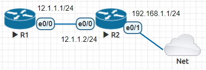

* [Routersploit 路由器漏洞檢測](https://github.com/linjiachi/Linux_note/blob/master/109-1/cisco/W12-20201202.md#routersploit)
  - [Test1 - 掃描 router 設備漏洞/弱點](https://github.com/linjiachi/Linux_note/blob/master/109-1/cisco/W12-20201202.md#test1---%E6%8E%83%E6%8F%8F-router-%E8%A8%AD%E5%82%99%E6%BC%8F%E6%B4%9E%E5%BC%B1%E9%BB%9E)
    - [環境設定](https://github.com/linjiachi/Linux_note/blob/master/109-1/cisco/W12-20201202.md#%E7%92%B0%E5%A2%83%E8%A8%AD%E5%AE%9A)
    - [測試](https://github.com/linjiachi/Linux_note/blob/master/109-1/cisco/W12-20201202.md#%E6%B8%AC%E8%A9%A6)
  - [Test2 - 使用 Python 控制 router](https://github.com/linjiachi/Linux_note/blob/master/109-1/cisco/W12-20201202.md#test2---%E4%BD%BF%E7%94%A8-python-%E6%8E%A7%E5%88%B6-router)

---

# Routersploit 路由器漏洞檢測
## Test1 - 掃描 router 設備漏洞/弱點
> 參考：[routersploit 掃 router 設備漏洞/弱點](https://ssorc.tw/7397/routersploit-%E6%8E%83-router-%E8%A8%AD%E5%82%99%E6%BC%8F%E6%B4%9E-%E5%BC%B1%E9%BB%9E/)

* 拓樸圖


### 環境設定
**R1、R2 設定 IP、RIP、SSH**
```sh
//R1
R1(config)#int e0/0
R1(config-if)#ip addr 12.1.1.1 255.255.255.0
R1(config-if)#no shut
R1(config-if)#router rip
R1(config-router)#version 2
R1(config-router)#network 12.1.1.0
R1(config-router)#no auto-summary

//SSH settig
# 事先設定好 hostname
R1(config)#ip domain-name test.com    # 設定網域名稱
R1(config)#ip ssh version 2           # 使用 SSH v2 協定
Please create RSA keys to enable SSH (and of atleast 768 bits for SSH v2).
R1(config)#crypto key generate rsa    # 產生金鑰
% You already have RSA keys defined named R1.test.com.
% Do you really want to replace them? [yes/no]: yes
Choose the size of the key modulus in the range of 360 to 4096 for your
  General Purpose Keys. Choosing a key modulus greater than 512 may take
  a few minutes.

How many bits in the modulus [512]:
*Dec 31 23:27:39.509: %SSH-5-DISABLED: SSH 1.5 has been disabled
1024
R1(config)#username root privilege 15 password 123456   # 設定使用者帳號及密碼，權限最高等級為 15
R1(config)#line vty 0 4
R1(config-line)#login local
R1(config-line)#transport input ssh

//R2
R2(config)#int e0/0
R2(config-if)#ip addr 12.1.1.2 255.255.255.0
R2(config-if)#no shut
R2(config-if)#int e0/1
R2(config-if)#ip addr 192.168.1.1 255.255.255.0
R2(config-if)#no shut
R2(config-if)#router rip
R2(config-router)#version 2
R2(config-router)#network 12.1.1.0
R2(config-router)#network 192.168.1.0
R2(config)#do ssh -l root 12.1.1.1
Password:
R1#
// SSH setting ok!
```
**kali-linux**
```sh
ip addr add 192.168.1.2/24 brd + dev eth0
ip route add default via 192.168.1.1
apt update
```
> 如果 apt 無法更新，可能是沒有日期、時間同步
> * 時間同步：`systemctl restart ntp.service`
> * 時區同步：`timedatectl set-timezone Asia/Taipei`

```sh
useradd user
passwd user
mkdir -p /home/user
su - user
bash
git clone https://github.com/reverse-shell/routersploit
cd routersploit/
python3 -m pip install -r requirements.txt
python3 rsf.py
```


### 測試
**kail-linux**
* 建立一個測試密碼檔
```sh
cd Download/
vim test.txt    # 內容打一些簡易的密碼，包含正確的 root 密碼
hydra -l root -P test.txt ssh://12.1.1.1 -t 4
```
* 測試結果


## Test2 - 使用 Python 控制 router
* 拓樸圖



**R1、R2 設定 IP、RIP**
```sh
//R1
R1(config)#int e0/0
R1(config-if)#ip addr 12.1.1.1 255.255.255.0
R1(config-if)#no shut
R1(config-if)#router rip
R1(config-router)#version 2
R1(config-router)#network 12.1.1.0
R1(config-router)#no auto-summary

//R2
R2(config)#int e0/0
R2(config-if)#ip addr 12.1.1.2 255.255.255.0
R2(config-if)#no shut
R2(config-if)#int e0/1
R2(config-if)#ip addr dhcp    # 自動取得 IP
R2(config-if)#no shut
*Jan  1 00:21:08.067: %DHCP-6-ADDRESS_ASSIGN: Interface Ethernet0/1 assigned DHCP address 192.168.196.132, mask 255.255.255.0, hostname R2

R2(config-if)#do sh ip int brief
Interface                  IP-Address      OK? Method Status                Protocol
Ethernet0/0                12.1.1.2        YES manual up                    up  
Ethernet0/1                192.168.196.132 YES DHCP   up                    up  
Ethernet0/2                unassigned      YES unset  administratively down down
Ethernet0/3                unassigned      YES unset  administratively down down

R2(config)#router rip
R2(config-router)#version 2
R2(config-router)#network 12.1.1.0
R2(config-router)#network 192.168.196.0
R2(config-router)#no auto-summary
```
**R2**
```sh
R2(config)#enable password 123456
R2(config)#line vty 0 4
R2(config-line)#password 123456
R2(config-line)#login
R2(config-line)#transport input telnet
```

**vm1**
* 開一台虛擬機 vm1 (IP：192.168.196.133)，只要 NAT 網路
```sh
[root@vm1 user]# telnet 192.168.196.132     # 進到 R2 環境
Trying 192.168.196.132...
Connected to 192.168.196.132.
Escape character is '^]'.


User Access Verification

Password: 
R2>enable
Password: 
R2#

```
> * 沒有 telnet，可以執行安裝指令 `yum install telnet`
> * 沒有 python3，可以執行安裝指令 `yum install python3 python3-pip`

**安裝使用 pexpect 套件**
```sh
pip3 install pexpect
```
**vm1 與 R2 進行交互**
* 透過程式遠端進行控制
```sh
[root@vm1 user]# python3
Python 3.6.8 (default, Nov 16 2020, 16:55:22) 
[GCC 4.8.5 20150623 (Red Hat 4.8.5-44)] on linux
Type "help", "copyright", "credits" or "license" for more information.
>>> import pexpect
>>> child=pexpect.spawn('telnet 192.168.196.132')
>>> child.expect('Password:')
0
>>> child.sendline('123456')
7
>>> child.expect('R2>')
0
>>> child.sendline('enable')
7
>>> child.expect('Password:')
0
>>> child.sendline('123456')
7
>>> child.expect('R2#')
0
>>> child.sendline('sh ip int brief')
16
>>> child.expect('R2#')
0
>>> child.before
b'sh ip int brief\r\nInterface                  IP-Address      OK? Method Status                Protocol\r\nEthernet0/0                12.1.1.2        YES manual up                    up      \r\nEthernet0/1                192.168.196.132 YES DHCP   up                    up      \r\nEthernet0/2                unassigned      YES NVRAM  administratively down down    \r\nEthernet0/3                unassigned      YES NVRAM  administratively down down    \r\n'
```
* 將程式寫成腳本來進行管理 R1、R2

**vm1 新增內定路由**
```sh
ip route add 192.168.196.0/24 via 192.168.196.132 dev ens33
ip route add default via 192.168.196.132 dev ens33
```


**vm1 ping R1、R2**


**vm1**
```sh
cd /tmp/
vim test.py
```
```py
#!/usr/bin/python3
import pexpect

devices={'R1':{'prompt1':'R1>', 'prompt2':'R1#', 'ip':'12.1.1.1'},
         'R2':{'prompt1':'R2>', 'prompt2':'R2#', 'ip':'12.1.1.2'}}

password1='123456'
password2='123456'

for device in devices.keys():
  device_prompt1=devices[device]['prompt1']
  device_prompt2=devices[device]['prompt2']
  child=pexpect.spawn('telnet '+devices[device]['ip'])
  print('ip:',devices[device]['ip'], "device:",device_prompt2)
  child.expect('Password:')
  child.sendline(password1)
  child.expect(device_prompt1)
  child.sendline('enable')
  child.expect('Password:')
  child.sendline(password2)
  child.expect(device_prompt2)
  child.sendline('show ip int brief')
  child.expect(device_prompt2)
  print(child.before)
  child.sendline('exit')
```
**執行**
```sh
python3 test.py
```
---
參考資料：
- [routersploit 掃 router 設備漏洞/弱點](https://ssorc.tw/7397/routersploit-%E6%8E%83-router-%E8%A8%AD%E5%82%99%E6%BC%8F%E6%B4%9E-%E5%BC%B1%E9%BB%9E/)
- [Cisco設定遠端連線(Telnet & SSH)](https://sites.google.com/a/james-tw.com/j-note/cisco/cisco-she-ding-yuan-duan-lian-xian-telnet-ssh)