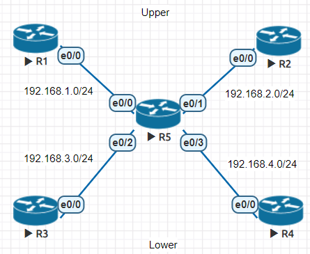
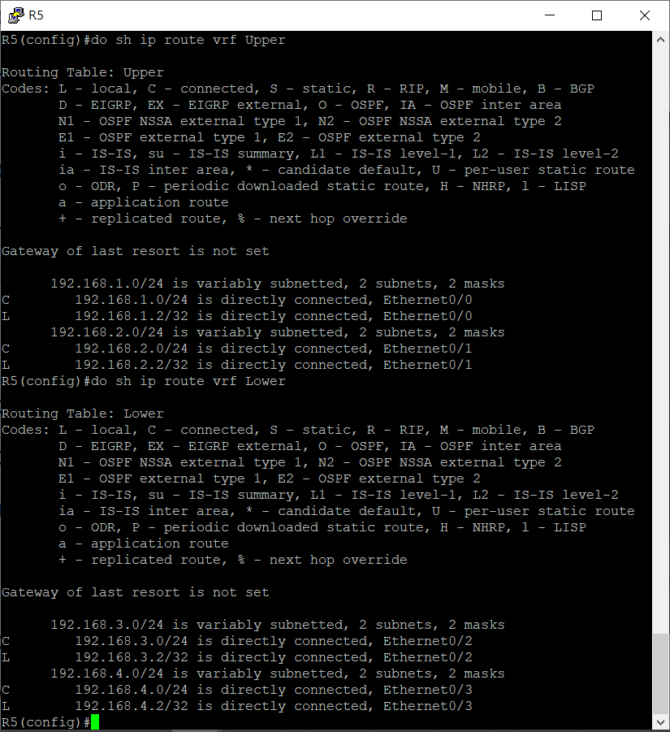
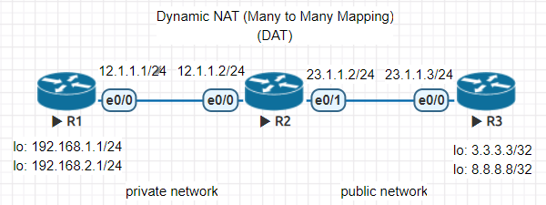
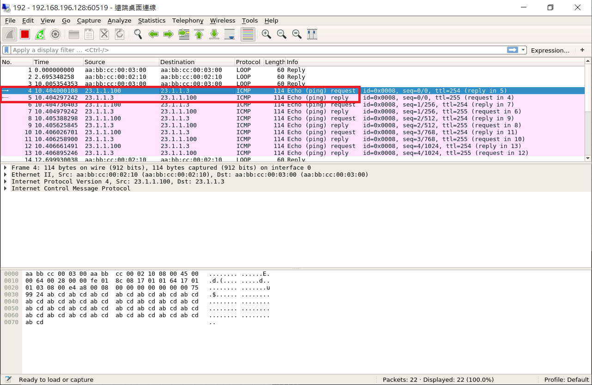
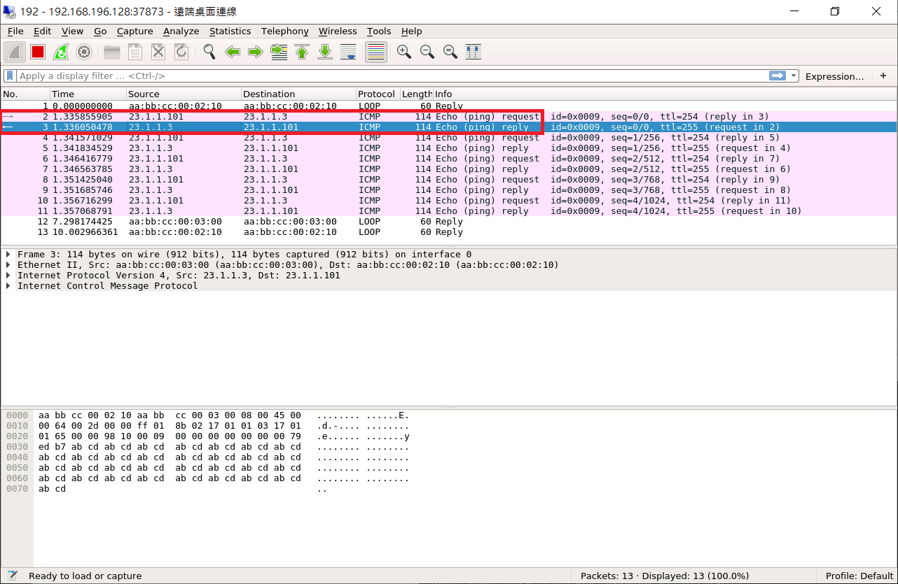
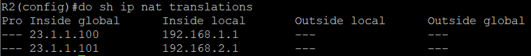
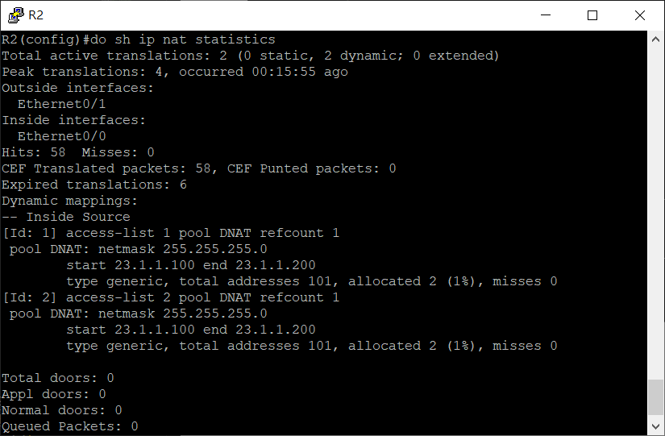
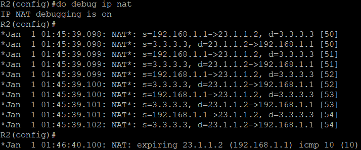
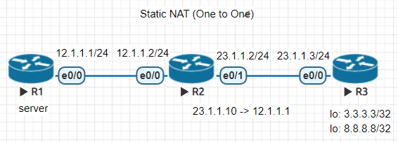

* [VRF (Virtual routing and forwarding) - 虛擬路由和轉發](https://github.com/linjiachi/Linux_note/blob/master/109-1/cisco/W13-20201209.md#vrf-virtual-routing-and-forwarding---%E8%99%9B%E6%93%AC%E8%B7%AF%E7%94%B1%E5%92%8C%E8%BD%89%E7%99%BC)
    - [網路虛擬化：VLAN、VRF](https://github.com/linjiachi/Linux_note/blob/master/109-1/cisco/W13-20201209.md#%E7%B6%B2%E8%B7%AF%E8%99%9B%E6%93%AC%E5%8C%96vlanvrf)
    - [VRF 實驗](https://github.com/linjiachi/Linux_note/blob/master/109-1/cisco/W13-20201209.md#vrf-%E5%AF%A6%E9%A9%97)
      - [環境設定](https://github.com/linjiachi/Linux_note/blob/master/109-1/cisco/W13-20201209.md#%E7%92%B0%E5%A2%83%E8%A8%AD%E5%AE%9A)
      - [測試](https://github.com/linjiachi/Linux_note/blob/master/109-1/cisco/W13-20201209.md#%E6%B8%AC%E8%A9%A6)
* [NAT (Network Address Translation) - 網路位置轉換](https://github.com/linjiachi/Linux_note/blob/master/109-1/cisco/W13-20201209.md#nat-network-address-translation---%E7%B6%B2%E8%B7%AF%E4%BD%8D%E7%BD%AE%E8%BD%89%E6%8F%9B)
  - [Dynamic NAT (DAT)](https://github.com/linjiachi/Linux_note/blob/master/109-1/cisco/W13-20201209.md#dynamic-nat-dat)
    - [環境設定](https://github.com/linjiachi/Linux_note/blob/master/109-1/cisco/W13-20201209.md#%E7%92%B0%E5%A2%83%E8%A8%AD%E5%AE%9A-1)
    - [測試](https://github.com/linjiachi/Linux_note/blob/master/109-1/cisco/W13-20201209.md#%E6%B8%AC%E8%A9%A6-1)
  - [Port NAT (PAT)](https://github.com/linjiachi/Linux_note/blob/master/109-1/cisco/W13-20201209.md#port-nat-pat)
    - [環境設定](https://github.com/linjiachi/Linux_note/blob/master/109-1/cisco/W13-20201209.md#%E7%92%B0%E5%A2%83%E8%A8%AD%E5%AE%9A-2)
    - [測試](https://github.com/linjiachi/Linux_note/blob/master/109-1/cisco/W13-20201209.md#%E6%B8%AC%E8%A9%A6-2)
  - [Static NAT](https://github.com/linjiachi/Linux_note/blob/master/109-1/cisco/W13-20201209.md#static-nat)
    - [環境設定](https://github.com/linjiachi/Linux_note/blob/master/109-1/cisco/W13-20201209.md#%E7%92%B0%E5%A2%83%E8%A8%AD%E5%AE%9A-3)
    - [測試](https://github.com/linjiachi/Linux_note/blob/master/109-1/cisco/W13-20201209.md#%E6%B8%AC%E8%A9%A6-3)
---

# VRF (Virtual routing and forwarding) - 虛擬路由和轉發
## 網路虛擬化：VLAN、VRF
虛擬化最重要的是資源的隔離。對路由器進行虛擬化來說，是為了隔離、保護路由表，讓他人無法看見內部路由結構

* VLAN：Layer 2 的網路虛擬化
* VRF：Layer 3 的網路虛擬化，可以解釋為 Layer 3 的 VLAN

## VRF 實驗
* 拓樸圖



### 環境設定

**設定 IP**
```sh
//R1
R1(config)#int e0/0
R1(config-if)#ip addr 192.168.1.1 255.255.255.0
R1(config-if)#no shut

//R2
R2(config)#int e0/0
R2(config-if)#ip addr 192.168.2.1 255.255.255.0
R2(config-if)#no shut

//R3
R3(config)#int e0/0
R3(config-if)#ip addr 192.168.3.1 255.255.255.0
R3(config-if)#no shut

//R4
R4(config)#int e0/0
R4(config-if)#ip addr 192.168.4.1 255.255.255.0
R4(config-if)#no shut
```
**網路虛擬化**
* 創建虛擬網路路由器
```sh
ip vrf [Name]
```
```sh
R5(config)#ip vrf Upper
R5(config-vrf)#exit
R5(config)#ip vrf Lower
R5(config-vrf)#exit
```

* 指定網路
```sh
ip vrf forwarding [Name]
```
```sh
R5(config)#int e0/0
R5(config-if)#ip vrf forwarding Upper
R5(config-if)#ip addr 192.168.1.2 255.255.255.0
R5(config-if)#no shut
R5(config-if)#int e0/1
R5(config-if)#ip vrf forwarding Upper
R5(config-if)#ip addr 192.168.2.2 255.255.255.0
R5(config-if)#no shut
R5(config-if)#int e0/2
R5(config-if)#ip vrf forwarding Lower
R5(config-if)#ip addr 192.168.3.2 255.255.255.0
R5(config-if)#no shut
R5(config-if)#int e0/3
R5(config-if)#ip vrf forwarding Lower
R5(config-if)#ip addr 192.168.4.2 255.255.255.0
R5(config-if)#no shut
```
**查看接口設定**
```sh
R5(config-if)#do sh ip vrf
  Name                             Default RD            Interfaces
  Lower                            <not set>             Et0/2
                                                         Et0/3
  Upper                            <not set>             Et0/0
                                                         Et0/1
```
**查看路由表**
```sh
show ip route vrf [Name]
```


**發送 ping**
```sh
R5(config)#do ping vrf Upper 192.168.1.1
Type escape sequence to abort.
Sending 5, 100-byte ICMP Echos to 192.168.1.1, timeout is 2 seconds:
.!!!!
Success rate is 80 percent (4/5), round-trip min/avg/max = 5/5/5 ms
R5(config)#do ping vrf Lower 192.168.3.1
Type escape sequence to abort.
Sending 5, 100-byte ICMP Echos to 192.168.3.1, timeout is 2 seconds:
.!!!!
Success rate is 80 percent (4/5), round-trip min/avg/max = 1/1/1 ms
```

**新增動態路由協定**
```sh
//R1
R1(config)#router ospf 1
R1(config-router)#network 192.168.1.0 0.0.0.255 area 0

//R2
R2(config)#router ospf 1
R2(config-router)#network 192.168.2.0 0.0.0.255 area 0

//R3
R3(config)#router ospf 1
R3(config-router)#network 192.168.3.0 0.0.0.255 area 0

//R4
R4(config)#router ospf 1
R4(config-router)#network 192.168.4.0 0.0.0.255 area 0

//R5
R5(config)#router ospf 1 vrf Upper
R5(config-router)#network 192.168.1.0 0.0.0.255 area 0
R5(config-router)#network 192.168.2.0 0.0.0.255 area 0
R5(config)#router ospf 2 vrf Lower
R5(config-router)#network 192.168.3.0 0.0.0.255 area 0
R5(config-router)#network 192.168.4.0 0.0.0.255 area 0

```
### 測試
**R1 ping R2、R3**
```sh
R1(config-router)#do ping 192.168.2.1
Type escape sequence to abort.
Sending 5, 100-byte ICMP Echos to 192.168.2.1, timeout is 2 seconds:
!!!!!
Success rate is 100 percent (5/5), round-trip min/avg/max = 1/1/1 ms
R1(config-router)#do ping 192.168.3.1
Type escape sequence to abort.
Sending 5, 100-byte ICMP Echos to 192.168.3.1, timeout is 2 seconds:
.....
Success rate is 0 percent (0/5)
```

**R3 ping R1、R4**
```sh
R3(config-router)#do ping 192.168.1.1
Type escape sequence to abort.
Sending 5, 100-byte ICMP Echos to 192.168.1.1, timeout is 2 seconds:
.....
Success rate is 0 percent (0/5)
R3(config-router)#do ping 192.168.4.1
Type escape sequence to abort.
Sending 5, 100-byte ICMP Echos to 192.168.4.1, timeout is 2 seconds:
!!!!!
Success rate is 100 percent (5/5), round-trip min/avg/max = 1/1/1 ms
```
# NAT (Network Address Translation) - 網路位置轉換

Type|-
-|-
Dynamic NAT|many to many
Port NAT|many to one
Static NAT|one to one
* Dynamic NAT 準備很多 Public IP，無法減少 IP 使用量
* Port NAT 只需要一個 Public IP，目前常用此方法
* Static NAT 轉送至內部主機，提供服務


## Dynamic NAT (DAT)
* Many to Many Mapping
* 拓樸圖



### 環境設定
**R1、R2、R3 設定 IP**
```sh
//R1
R1(config)#int e0/0
R1(config-if)#ip addr 12.1.1.1 255.255.255.0
R1(config-if)#no shut
R1(config-if)#int lo 0
R1(config-if)#ip addr 192.168.1.1 255.255.255.0
R1(config-if)#int lo 1
R1(config-if)#ip addr 192.168.2.1 255.255.255.0

//R2
R2(config)#int e0/0
R2(config-if)#ip addr 12.1.1.2 255.255.255.0
R2(config-if)#no shut
R2(config-if)#int e0/1
R2(config-if)#ip addr 23.1.1.2 255.255.255.0
R2(config-if)#no shut

//R3
R3(config)#int e0/0
R3(config-if)#ip addr 23.1.1.3 255.255.255.0
R3(config-if)#no shut
R3(config-if)#int lo 0
R3(config-if)#ip addr 3.3.3.3 255.255.255.255
R3(config-if)#int lo 1
R3(config-if)#ip addr 8.8.8.8 255.255.255.255
```
**設定內定路由**
```sh
//R1
R1(config)#ip route 0.0.0.0 0.0.0.0 e0/0 12.1.1.2

//R2
R2(config)#ip route 192.168.1.0 255.255.255.0 e0/0 12.1.1.1
R2(config)#ip route 192.168.2.0 255.255.255.0 e0/0 12.1.1.1
R2(config)#ip route 0.0.0.0 0.0.0.0 e0/2 23.1.1.3
```
**R2 測試**
```sh
R2(config)#do ping 12.1.1.1
Type escape sequence to abort.
Sending 5, 100-byte ICMP Echos to 12.1.1.1, timeout is 2 seconds:
!!!!!
Success rate is 100 percent (5/5), round-trip min/avg/max = 1/3/7 ms
R2(config)#do ping 192.168.2.1
Type escape sequence to abort.
Sending 5, 100-byte ICMP Echos to 192.168.2.1, timeout is 2 seconds:
!!!!!
Success rate is 100 percent (5/5), round-trip min/avg/max = 1/1/1 ms
R2(config)#do ping 23.1.1.3
Type escape sequence to abort.
Sending 5, 100-byte ICMP Echos to 23.1.1.3, timeout is 2 seconds:
!!!!!
Success rate is 100 percent (5/5), round-trip min/avg/max = 1/1/1 ms
R2(config)#do ping 3.3.3.3
Type escape sequence to abort.
Sending 5, 100-byte ICMP Echos to 3.3.3.3, timeout is 2 seconds:
!!!!!
Success rate is 100 percent (5/5), round-trip min/avg/max = 1/2/6 ms
```
**Dynamic NAT Setting**
```sh
R2(config)#access-list 1 permit 192.168.1.0 0.0.0.255
R2(config)#access-list 2 permit 192.168.2.0 0.0.0.255
R2(config)#ip nat pool DNAT 23.1.1.100 23.1.1.200 netmask 255.255.255.0
R2(config)#int e0/0
R2(config-if)#ip nat inside
R2(config-if)#int e0/1
R2(config-if)#ip nat outside
R2(config-if)#exit
R2(config)#ip nat inside source list 1 pool DNAT
R2(config)#ip nat inside source list 2 pool DNAT
```
### 測試
* `192.168.1.1`、`192.168.2.1` 在經過 R2，進行了 ip translation 故可以回傳
```sh
R1(config)#do ping 23.1.1.3 source 192.168.1.1
Type escape sequence to abort.
Sending 5, 100-byte ICMP Echos to 23.1.1.3, timeout is 2 seconds:
Packet sent with a source address of 192.168.1.1
.!!!!
Success rate is 80 percent (4/5), round-trip min/avg/max = 1/1/1 ms
R1(config)#do ping 23.1.1.3 source 192.168.2.1
Type escape sequence to abort.
Sending 5, 100-byte ICMP Echos to 23.1.1.3, timeout is 2 seconds:
Packet sent with a source address of 192.168.2.1
.!!!!
Success rate is 80 percent (4/5), round-trip min/avg/max = 1/1/1 ms
```





**查看 Translation 紀錄**
```sh
show ip nat translations
```


**統計 IP Translation**
```sh
show ip nat statistics
```


## Port NAT (PAT) 
* Many to One

### 環境設定 
> 延續上一個實驗環境，先在 R2 刪掉 DAT 規則

```sh
R2(config)#no ip nat inside source list 1 pool DAT
R2(config)#no ip nat inside source list 2 pool DAT
```
```sh
R2(config)#ip nat pool PAT 23.1.1.2 23.1.1.2 netmask 255.255.255.0
R2(config)#ip nat inside source list 1 pool PAT overload
R2(config)#ip nat inside source list 2 pool PAT overload
```
### 測試
**R2**
```sh
debug ip nat
```
**R1**
```sh
R1(config)#do ping 3.3.3.3 source 192.168.1.1
Type escape sequence to abort.
Sending 5, 100-byte ICMP Echos to 3.3.3.3, timeout is 2 seconds:
Packet sent with a source address of 192.168.1.1
!!!!!
Success rate is 100 percent (5/5), round-trip min/avg/max = 1/1/1 ms
```
**R2**




## Static NAT
* One to One
* 拓樸圖



### 環境設定
> R2、R3 延續上面的 Setting

**R1 (Server)**
```sh
R1(config)#int e0/0
R1(config-if)#ip addr 12.1.1.1 255.255.255.0
R1(config-if)#no shut
R1(config-if)#exit
R1(config)#ip route 0.0.0.0 0.0.0.0 12.1.1.2
R1(config)#line vty 0 4
R1(config-line)#password cisco
R1(config-line)#login
R1(config-line)#transport input telnet
```
**R2 telnet 12.1.1.1**
```sh
R2(config)#do telnet 12.1.1.1
Trying 12.1.1.1 ... Open


User Access Verification

Password:
R1>
```
**R2**
```sh
R2(config)#int e0/0
R2(config-if)#ip nat inside
R2(config-if)#int e0/1
R2(config-if)#ip nat outside
R2(config-if)#exit
R2(config)#ip nat inside source static 12.1.1.1 23.1.1.10
R2(config)#do sh ip nat translations
Pro Inside global      Inside local       Outside local      Outside global
--- 23.1.1.10          12.1.1.1           ---                ---
```

### 測試
**R3 telnet 23.1.1.10**
```sh
R3#telnet 23.1.1.10
Trying 23.1.1.10 ... Open

User Access Verification

Password:
R1>
```
> telnet 外網的 IP 會藉由 R2 設定的 Static NAT，轉到 R1

---
參考資料：
- [太閤實驗棧 一鍵解鎖VRF知識架構](https://kknews.cc/zh-tw/code/4j9pp6q.html)
- [Network Address Translation (NAT) 網路位置轉換 - Jan Ho 的網絡世界](https://www.jannet.hk/zh-Hant/post/network-address-translation-nat/)
