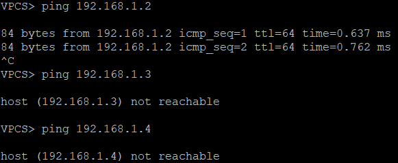
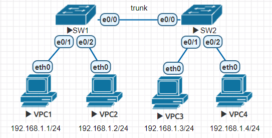

* [VLAN (Virtual LAN) - 虛擬區域網路]()
    - [VLAN 介紹]()
    - [VLAN 實作]()
        - [Test1 - 設定 VLAN]()
            - [環境設定]()
            - [測試]()
        - [Test2]()
            - [環境設定]()
            - [測試]()
    - [Trunk Link]()
        - [Test3 - trunk]()
            - [環境設定]()
            - [測試]()  
        - [Test4 - 將 default vlan 1 改成 vlan 10]()
            - [環境設定]()
            - [測試]()
* [VTP (VLAN Trunking Protocol) - 虛擬區域網路中繼協定]()
    - [VTP Mode]()
    - [VTP 實作]()
        - [Test1 - Server&Client]()
            - [環境設定]()
            - [測試]() 
        - [Test2 - Client 可以學習轉發]()
            - [環境設定]()
            - [測試]()
        - [Test3 - Transparent]()
            - [環境設定]()
            - [測試]()
            - [結論]()

---

# VLAN (Virtual LAN) - 虛擬區域網路
* VLAN：Layer 2 的虛擬網路化技術

VLAN 就是把實體的 LAN 分割成多個虛擬 LAN 使用，分割出來的 VLAN 是各自獨立的。
## VLAN 介紹
第二層設備有位置學習的功能，會記錄裝置位於哪裡，當一開始不知道的時候，就會使用廣播的方式搜尋。所以當主機很多時，會有很多廣播封包在網路中，故效能、安全性降低。

* VLAN 有兩個制式讓彼此能互相溝通，ISL (Inter-Switch Link) 和 IEEE 802.1Q。ISL 是 Cisco 專有的，只有 Cisco 設備才能設定，802.1q 是公開的。
* 利用 802.1Q 協定來區分不同的 VLAN，會在封包的乙太網路的標頭增加標籤，標籤會放 VLAN ID(12 Bits)，告訴封包是第幾個 VLAN，ID 的有效範圍是 1-4094。VLAN ID 0 表示不屬於任何 VLAN，VLAN ID 1 代表 Default VLAN，是不用貼標籤的。當第二層設備在沒設定時，裝置都處於 Default VLAN。

## VLAN 實作
### Test1 - 設定 VLAN
* PC1、PC2 同一個 VLAN，PC3、PC4 同一個 VLAN
* 拓樸圖


#### 環境設定
**PC1、PC2、PC3、PC4 設定 IP**
```sh
//PC1
ip 192.168.1.1 255.255.255.0

//PC2
ip 192.168.1.2 255.255.255.0

//PC3
ip 192.168.1.3 255.255.255.0

//PC4
ip 192.168.1.4 255.255.255.0
```

**SW**
* 在沒有做任何設定時，所有 VLAN 皆為預設 VLAN 1
```sh
Switch(config)#do sh vlan brief

VLAN Name                             Status    Ports
---- -------------------------------- --------- -------------------------------
1    default                          active    Et0/0, Et0/1, Et0/2, Et0/3
1002 fddi-default                     act/unsup
1003 token-ring-default               act/unsup
1004 fddinet-default                  act/unsup
1005 trnet-default                    act/unsup
```

**SW setting VLAN**
```sh
Switch(config)#vlan 10
Switch(config-vlan)#name Vlan10
Switch(config-vlan)#exit
Switch(config)#vlan 20
Switch(config-vlan)#name Vlan20
Switch(config-vlan)#exit
Switch(config)#do sh vlan brief

VLAN Name                             Status    Ports
---- -------------------------------- --------- -------------------------------
1    default                          active    Et0/0, Et0/1, Et0/2, Et0/3
10   Vlan10                           active
20   Vlan20                           active
1002 fddi-default                     act/unsup
1003 token-ring-default               act/unsup
1004 fddinet-default                  act/unsup
1005 trnet-default                    act/unsup

Switch(config)#int e0/0
Switch(config-if)#switchport mode access
Switch(config-if)#switchport access vlan 10
Switch(config-if)#int e0/1
Switch(config-if)#switchport mode access
Switch(config-if)#switchport access vlan 10
Switch(config-if)#int e0/2
Switch(config-if)#switchport mode access
Switch(config-if)#switchport access vlan 20
Switch(config-if)#int e0/3
Switch(config-if)#switchport mode access
Switch(config-if)#switchport access vlan 20
Switch(config-if)#do sh vlan brief

VLAN Name                             Status    Ports
---- -------------------------------- --------- -------------------------------
1    default                          active
10   Vlan10                           active    Et0/0, Et0/1
20   Vlan20                           active    Et0/2, Et0/3
1002 fddi-default                     act/unsup
1003 token-ring-default               act/unsup
1004 fddinet-default                  act/unsup
1005 trnet-default                    act/unsup
```
#### 測試
**PC1 可以 ping PC2，但不能 ping PC3、PC4**



**PC3 可以 ping PC4，但不能 ping PC1、PC2**


### Test2
* PC1、PC3 同一個 VLAN，PC2、PC4 同一個 VLAN
* 拓樸圖


#### 環境設定
> 延續上一個實驗，PC IP setting 不變

**SW1、SW2 setting VLAN**
```sh
//SW1
sw1(config)#vlan 10
sw1(config-vlan)#name Vlan10
sw1(config-vlan)#exit
sw1(config)#vlan 20
sw1(config-vlan)#name Vlan20

sw1(config)#int range e0/1,e0/2
sw1(config-if-range)#sw mode access
sw1(config-if-range)#sw access vlan 10
sw1(config-if-range)#int range e0/0,e0/3
sw1(config-if-range)#sw mode access
sw1(config-if-range)#sw access vlan 20
sw1(config-if-range)#do sh vlan brief

VLAN Name                             Status    Ports
---- -------------------------------- --------- -------------------------------
1    default                          active
10   Vlan10                           active    Et0/1, Et0/2
20   Vlan20                           active    Et0/0, Et0/3
1002 fddi-default                     act/unsup
1003 token-ring-default               act/unsup
1004 fddinet-default                  act/unsup
1005 trnet-default                    act/unsup

//SW2
sw2(config)#vlan 10
sw2(config-vlan)#name Vlan10
sw2(config-vlan)#exit
sw2(config)#vlan 20
sw2(config-vlan)#name Vlan20

sw2(config)#int range e0/1,e0/2
sw2(config-if-range)#sw mode access
sw2(config-if-range)#sw access vlan 10
sw2(config-if-range)#int range e0/0,e0/3
sw2(config-if-range)#sw mode access
sw2(config-if-range)#sw access vlan 20
sw2(config-if-range)#do sh vlan brief

VLAN Name                             Status    Ports
---- -------------------------------- --------- -------------------------------
1    default                          active
10   Vlan10                           active    Et0/1, Et0/2
20   Vlan20                           active    Et0/0, Et0/3
1002 fddi-default                     act/unsup
1003 token-ring-default               act/unsup
1004 fddinet-default                  act/unsup
1005 trnet-default                    act/unsup
```

#### 測試
**PC1 可以 ping PC3，不能 ping PC2、PC4**


**PC2 可以 ping PC4，不能 ping PC1、PC3**


## Trunk Link
VLAN 跨越多個 Switch，藉由 VLAN ID 知道封包的 VLAN，故需要使用 802.1q VLAN Tag。要傳送 VLAN Tag，需要把 Switch 和 Switch 之間的 Link 設定成 Trunk，因為只有 Trunk Link 才可以容納不同的 VLAN。

### Test3 - trunk
* 拓樸圖



#### 環境設定
**PC setting IP**
```sh
//PC1
VPC1> ip 192.168.1.1 255.255.255.0

//PC2
VPC2> ip 192.168.1.2 255.255.255.0

//PC3
VPC3> ip 192.168.1.3 255.255.255.0

//PC4
VPC4> ip 192.168.1.4 255.255.255.0
```

**SW setting vlan**
```sh
//SW1
sw1(config)#vlan 10
sw1(config-vlan)#name Vlan10
sw1(config-vlan)#exit
sw1(config)#vlan 20
sw1(config-vlan)#name Vlan20
sw1(config-vlan)#int e0/1
sw1(config-if)#sw mode access
sw1(config-if)#sw access vlan 10
sw1(config-if)#int e0/2
sw1(config-if)#sw mode access
sw1(config-if)#sw access vlan 20

//SW2
sw2(config)#vlan 10
sw2(config-vlan)#name Vlan10
sw2(config-vlan)#exit
sw2(config)#vlan 20
sw2(config-vlan)#name Vlan20
sw2(config-vlan)#int e0/1
sw2(config-if)#sw mode access
sw2(config-if)#sw access vlan 10
sw2(config-if)#int e0/2
sw2(config-if)#sw mode access
sw2(config-if)#sw access vlan 20
```
**SW setting trunk**
```sh
//SW1
sw1(config)#int e0/0
sw1(config-if)#switchport trunk encapsulation dot1q
sw1(config-if)#switchport mode trunk

//SW2
sw2(config)#int e0/0
sw2(config-if)#switchport trunk encapsulation dot1q
sw2(config-if)#switchport mode trunk
```
#### 測試
**PC1 ping PC3**


## Test4 - 將 default vlan 1 改成 vlan 10
* 拓樸圖


#### 環境設定
> 延續上一個環境設定

**PC5、PC6 setting**
```sh
//PC5
VPC5> ip 192.168.10.1 255.255.255.0

//PC6
VPC6> ip 192.168.20.1 255.255.255.0
```
**SW setting**
* `switchport trunk native vlan 10`：可修改預設 vlan

```sh
//SW1
sw1(config)#int e0/3
sw1(config-if)#sw access vlan 1
sw1(config-if)#int e0/0
sw1(config-if)#sw trunk native vlan 10

//SW2
sw2(config)#int e0/3
sw2(config-if)#sw access vlan 1
sw2(config-if)#int e0/0
sw2(config-if)#sw trunk native vlan 10
```
#### 測試


# VTP (VLAN Trunking Protocol) - 虛擬區域網路中繼協定
VTP 是 Cisco 的專利，主要為 VLAN 管理。VTP 可以實施中央管理，只需要在一台 VTP Server 新增 VLAN，VLAN 資訊就會自動發佈到其他台 Switch，其他 Switch 就會新增此 VLAN。另外，VTP Version 1 及 Version 2 有點缺陷，有機會出現災難性的後果，因此有經驗的網管人員都會避免使用。直至 VTP Version 3，才把問題解決了，還加入了 MST 的管理。所以如果真的要應用 VTP 在網絡中，應該使用 Version 3。
## VTP Mode
**Server**：能創建、修改、刪除 VLAN

**Client**：不能創建、修改、刪除 VLAN，但能學習轉發

**Transparent**：能創建、修改、刪除 VLAN，不能學習轉發

## VTP 實作
### Test1 - Server&Client
* VTP Server 可以增減 VLAN，VTP Client 不能自行更改
* 拓樸圖


#### 環境設定
> 要在相同的 domain 下，訊息才能交換

**SW setting domain**
```sh
//SW1(Server)
sw1(config)#vtp domain mynet
sw1(config)#vtp password cisco
sw1(config)#do show vtp status
```


```sh
//SW2(Client)
sw2(config)#vtp mode client
sw2(config)#vtp domain mynet
sw2(config)#vtp password cisco
sw2(config)#do sh vtp status
```


**創造 vlan、trunk**
```sh
//SW1
sw1(config)#vlan 11-15,1006
sw1(config-vlan)#int e0/0
sw1(config-if)#switchport trunk encapsulation dot1q
sw1(config-if)#switchport mode trunk

//SW2
sw2(config)#int e0/0
sw2(config-if)#switchport trunk encapsulation dot1q
sw2(config-if)#switchport mode trunk
```
#### 測試


> SW2 自動增加 VLAN 11~VLAN 15，但卻沒有 VLAN 1006，是因為 **VTP Version 1、Version 2** 只支援VLAN 2~VLAN 1001，直到 **Version 3** 才支援更多。

### Test2 - Client 可以學習轉發
再增加一台 Switch
* 拓樸圖


#### 環境設定
> SW1、SW2 延續上個實驗的設定

**SW Setting trunk**
```sh
//SW3
sw3(config)#vtp mode client
sw3(config)#vtp domain mynet
sw3(config)#vtp password cisco
sw3(config)#int e0/0
sw3(config-if)#switchport trunk encapsulation dot1q
sw3(config-if)#switchport mode trunk

//SW2
sw2(config)#int e0/1
sw2(config-if)#switchport trunk encapsulation dot1q
sw2(config-if)#switchport mode trunk
```
#### 測試


> 可以看到，後來新增上去的 Switch，設定完 trunk 之後，一樣會新增 vlan11~15

### Test3 - Transparent
> 延續上一個實驗環境，更改 SW2 的 Mode

#### 環境設定
**SW Setting Mode**
```sh
//SW2
sw2(config)#vtp mode transparent
```

#### 測試

**SW1 add VLAN**
```sh
sw1(config-vlan)#vlan 20-21
```


**SW3 show vlan**


**SW2 show vlan**


> 可以發現在 SW1(Server) 端新增 VLAN，SW3(Client) 會新增，SW2(Transparent)**不會新增**
> * Transparent 可以將 Server 的訊息傳給 Client，但本身不受影響

**SW2 delete vlan**
> Transparent mode 可以自行刪除 vlan，Server、Client 不受影響


#### 結論
Transparent Mode 對 Server、Client 來說就像透明的，但卻是非常重要的模式。舉例來說，如果在一個現有的網路，當網路需要擴充，在舊的交換機要插入與現有的交換機一起運作時，先將舊的交換機設定成 Transparent Mode，就此保護以防直接影響到 Server。

---
參考資料：
- [Ethan - 隔離廣播域的 vlan 來了](https://www.cnblogs.com/michael9/p/13360084.html)
- [Virtual LAN (VLAN) 虛擬區域網路 - Jan Ho 的網路世界](https://www.jannet.hk/zh-Hant/post/virtual-lan-vlan/)
- [VLAN Trunking Protocol (VTP) 虛擬區域網路中繼協定 - Jan Ho 的網路世界](https://www.jannet.hk/zh-Hant/post/vlan-trunking-protocol-vtp/)
