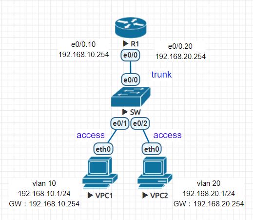
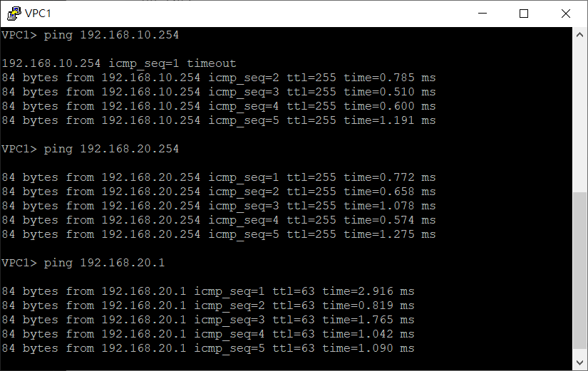
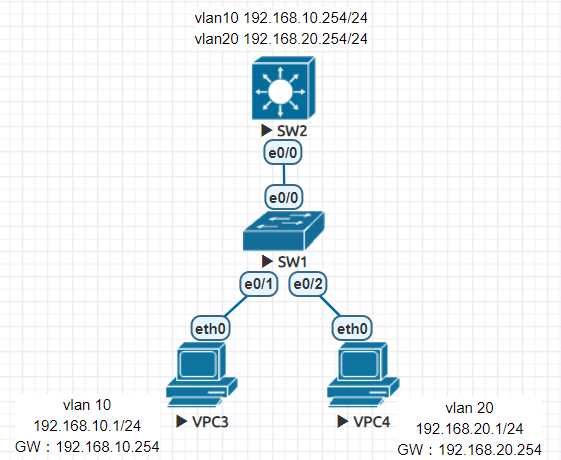
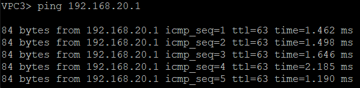
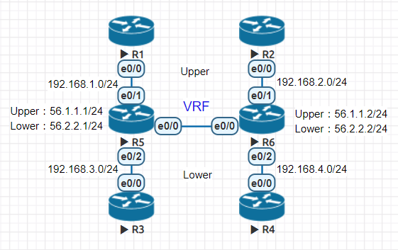
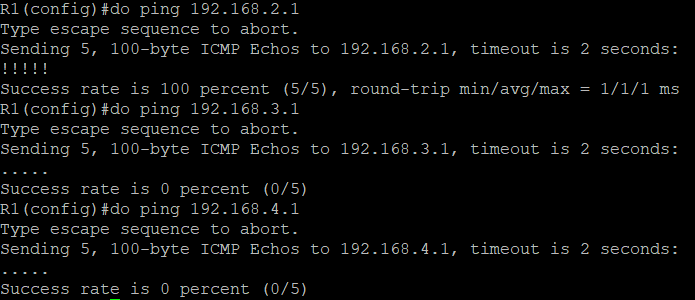
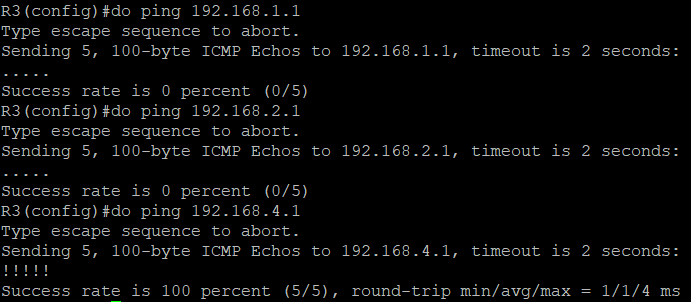

* [單臂路由](https://github.com/linjiachi/Linux_note/blob/master/109-1/cisco/W15-20201223.md#%E5%96%AE%E8%87%82%E8%B7%AF%E7%94%B1)
    - [環境設置](https://github.com/linjiachi/Linux_note/blob/master/109-1/cisco/W15-20201223.md#%E7%92%B0%E5%A2%83%E8%A8%AD%E7%BD%AE)
    - [測試](https://github.com/linjiachi/Linux_note/blob/master/109-1/cisco/W15-20201223.md#%E6%B8%AC%E8%A9%A6)
* [Layer3 Switch](https://github.com/linjiachi/Linux_note/blob/master/109-1/cisco/W15-20201223.md#layer3-switch)
    - [環境設置](https://github.com/linjiachi/Linux_note/blob/master/109-1/cisco/W15-20201223.md#%E7%92%B0%E5%A2%83%E8%A8%AD%E7%BD%AE-1)
    - [測試](https://github.com/linjiachi/Linux_note/blob/master/109-1/cisco/W15-20201223.md#%E6%B8%AC%E8%A9%A6-1)
* [VRF 練習](https://github.com/linjiachi/Linux_note/blob/master/109-1/cisco/W15-20201223.md#vrf-%E7%B7%B4%E7%BF%92)
    - [環境設置](https://github.com/linjiachi/Linux_note/blob/master/109-1/cisco/W15-20201223.md#%E7%92%B0%E5%A2%83%E8%A8%AD%E7%BD%AE-2)
    - [測試](https://github.com/linjiachi/Linux_note/blob/master/109-1/cisco/W15-20201223.md#%E6%B8%AC%E8%A9%A6-2)

---
# 單臂路由
路由器的介面會虛擬出兩個介面，當 PC1 發送 ping 會先經過 R1 進行路由交換，在傳送到 PC2

* 拓樸圖



## 環境設置
**PC setting**
```sh
//PC1
ip 192.168.10.1 255.255.255.0 192.168.10.254

//PC2
ip 192.168.20.1 255.255.255.0 192.168.20.254
```

**SW setting vlan**
```sh
Switch(config)#vlan 10
Switch(config-vlan)#exit
Switch(config)#vlan 20
Switch(config-vlan)#exit
Switch(config)#int e0/0
Switch(config-if)#switchport trunk encapsulation dot1q
Switch(config-if)#switchport mode trunk
Switch(config-if)#int e0/1
Switch(config-if)#switchport access vlan 10
Switch(config-if)#switchport mode access
Switch(config-if)#int e0/2
Switch(config-if)#switchport access vlan 20
Switch(config-if)#switchport mode access
```

**R1 setting**
```sh
Router(config)#int e0/0
Router(config-if)#no shut
Router(config-if)#int e0/0.10
Router(config-subif)#encapsulation dot1Q 10
Router(config-subif)#ip addr 192.168.10.254 255.255.255.0
Router(config-subif)#int e0/0.20
Router(config-subif)#encapsulation dot1Q 20
Router(config-subif)#ip addr 192.168.20.254 255.255.255.0
```
## 測試
**PC1 ping**



# Layer3 Switch
* 拓樸圖



## 環境設置
**PC setting**
```sh
//PC3
ip 192.168.10.1 /24 192.168.10.254

//PC4
ip 192.168.20.1 /24 192.168.20.254
```

**SW2 setting**
* 要執行 `ip routing` 開啟第三層的功能，不然 SW2 會只有第二層的設備功能

```sh
Switch(config)#ho SW2
SW2(config)#ip routing
SW2(config)#vlan 10
SW2(config-vlan)#vlan 20
SW2(config-vlan)#vtp mode server
SW2(config)#vtp domain ccna
SW2(config)#vtp password cisco
SW2(config)#int e0/0
SW2(config-if)#sw trunk en dot
SW2(config-if)#sw mode trunk

//創造虛擬的介面
SW2(config-if)#int vlan 10
SW2(config-if)#ip addr 192.168.10.254 255.255.255.0
SW2(config-if)#no shut
SW2(config-if)#int vlan 20
SW2(config-if)#ip addr 192.168.20.254 255.255.255.0
SW2(config-if)#no shut
```

**SW1 setting**
```sh
Switch(config)#ho SW1
SW1(config)#vtp mode client
SW1(config)#vtp domain ccna
SW1(config)#vtp password cisco
SW1(config)#int e0/0
SW1(config-if)#sw trunk en dot
SW1(config-if)#sw mode trunk
SW1(config-if)#int e0/1
SW1(config-if)#sw mode access
SW1(config-if)#sw access vlan 10
SW1(config-if)#int e0/2
SW1(config-if)#sw mode access
SW1(config-if)#sw access vlan 20
SW1(config-if)#do sh int trunk

Port        Mode             Encapsulation  Status        Native vlan
Et0/0       on               802.1q         trunking      1

Port        Vlans allowed on trunk
Et0/0       1-4094

Port        Vlans allowed and active in management domain
Et0/0       1

Port        Vlans in spanning tree forwarding state and not pruned
Et0/0       1
```
## 測試
**PC3 ping PC4**



# VRF 練習
* 拓樸圖



## 環境設置
**Router setting IP**
```sh
//R1
R1(config)#int e0/0
R1(config-if)#ip addr 192.168.1.1 255.255.255.0
R1(config-if)#no shut

//R2
R2(config)#int e0/0
R2(config-if)#ip addr 192.168.2.1 255.255.255.0
R2(config-if)#no shut

//R3
R3(config)#int e0/0
R3(config-if)#ip addr 192.168.3.1 255.255.255.0
R3(config-if)#no shut

//R4
R4(config)#int e0/0
R4(config-if)#ip addr 192.168.4.1 255.255.255.0
R4(config-if)#no shut
```

**Setting VRF**
```sh
//R5
R5(config)#ip vrf Upper
R5(config-vrf)#exit
R5(config)#ip vrf Lower
R5(config-vrf)#exit
R5(config)#int e0/1
R5(config-if)#ip vrf forwarding Upper
R5(config-if)#ip addr 192.168.1.2 255.255.255.0
R5(config-if)#no shut
R5(config-if)#int e0/2
R5(config-if)#ip vrf forwarding Lower
R5(config-if)#ip addr 192.168.3.2 255.255.255.0
R5(config-if)#no shut


R5(config-if)#int e0/0
R5(config-if)#no shut
R5(config-if)#int e0/0.10
R5(config-subif)#encapsulation dot1Q 10
R5(config-subif)#ip vrf forwarding Upper
R5(config-subif)#ip addr 56.1.1.1 255.255.255.0
R5(config-subif)#no shut
R5(config-subif)#exit
R5(config)#int e0/0.20
R5(config-subif)#encapsulation dot1Q 20
R5(config-subif)#ip vrf forwarding Lower
R5(config-subif)#ip addr 56.2.2.1 255.255.255.0
R5(config-subif)#no shut

//R6
R6(config)#ip vrf Upper
R6(config-vrf)#exit
R6(config)#ip vrf Lower
R6(config-vrf)#exit
R6(config)#int e0/1
R6(config-if)#ip vrf forwarding Upper
R6(config-if)#ip addr 192.168.2.2 255.255.255.0
R6(config-if)#no shut
R6(config-if)#int e0/2
R6(config-if)#ip vrf forwarding Lower
R6(config-if)#ip addr 192.168.4.2 255.255.255.0
R6(config-if)#no shut

R6(config)#int e0/0
R6(config-if)#no shut
R6(config-if)#int e0/0.10
R6(config-subif)#encapsulation dot1Q 10
R6(config-subif)#ip vrf forwarding Upper
R6(config-subif)#ip addr 56.1.1.2 255.255.255.0
R6(config-subif)#no shut
R6(config-subif)#exit
R6(config)#int e0/0.20
R6(config-subif)#encapsulation dot1Q 20
R6(config-subif)#ip vrf forwarding Lower
R6(config-subif)#ip addr 56.2.2.2 255.255.255.0
R6(config-subif)#no shut
```

**Route protocol setting**
```sh
//R1
R1(config)#router ospf 1
R1(config-router)#net 192.168.1.0 0.0.0.255 area 0

//R2
R2(config)#router ospf 1
R2(config-router)#net 192.168.2.0 0.0.0.255 area 0

//R3
R3(config)#router ospf 1
R3(config-router)#net 192.168.3.0 0.0.0.255 area 0

//R4
R4(config)#router ospf 1
R4(config-router)#net 192.168.4.0 0.0.0.255 area 0

//R5
R5(config)#router ospf 1 vrf Upper
R5(config-router)#net 192.168.1.0 0.0.0.255 area 0
R5(config-router)#net 56.1.1.0 0.0.0.255 area 0
R5(config-router)#exit
R5(config)#router ospf 2 vrf Lower
R5(config-router)#net 192.168.3.0 0.0.0.255 area 0
R5(config-router)#net 56.2.2.0 0.0.0.255 area 0

//R6
R6(config)#router ospf 1 vrf Upper
R6(config-router)#net 192.168.2.0 0.0.0.255 area 0
R6(config-router)#net 56.1.1.0 0.0.0.255 area 0
R6(config-router)#exit
R6(config)#router ospf 2 vrf Lower
R6(config-router)#net 192.168.4.0 0.0.0.255 area 0
R6(config-router)#net 56.2.2.0 0.0.0.255 area 0
```
## 測試
**PC1 ping**



**PC3 ping**

