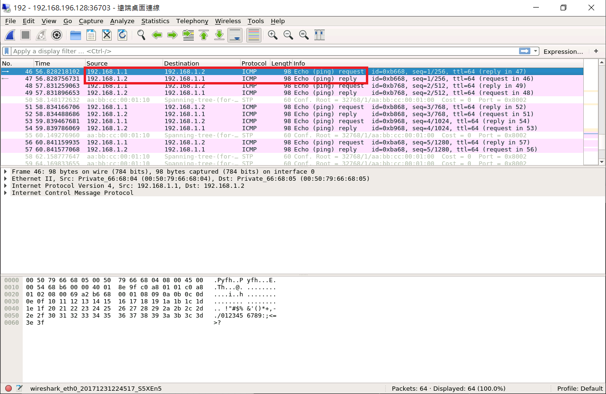
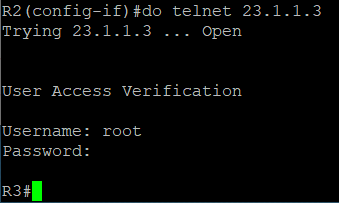

* [Spanning-Tree]()
    - [Forwarding and Address Learning Algorithm]()
    - [Spanning Tree Algorithm]()
    - [Test - SpanningTree]()
* [EtherChannel (PAgP and LACP) - 乙太通道]()
    - [EtherChannel 優點]()
    - [Test - 建立 Etherchannel]()
* [Authentication Authorization Accounting (AAA) - 認證授權與計費]()
    - [網絡設備連接 TACACS+]()
        - [環境設置]()
        - [測試]()

---
# Spanning-Tree
## Forwarding and Address Learning Algorithm


## Spanning Tree Algorithm
> 防止 Loop 的發生

* Loop：在網路的世界，有迴圈時會造成廣播風暴，導致整個網路效能會變得很差 (缺點)。但 Loop 可以增加網路的彈性 (roburstness) (優點)。

1. Find the Root Bridge

    - Priority + MAC Address 最小的就是 Root Bridge
    - Cisco 裡面預設 Priority 是 32768，然後加上 VLAN ID

2. Find the Root Port

    - 每台交換機到 Root Bridge cost 最少成本的 Port

3. Find the Designated Port (D Port)

    - 對每個 LAN 來說，到達 Root Bridge 的最小成本
    - 剩下的 Port 就是非指定 Port

## Test - SpanningTree
* 拓樸圖


**Show Switch Spanning-Tree**
```sh
sh spanning-tree
```


* Bridge ID：32768 + 1 (VLAN ID) = 32769
* Root Bridge：0100

**PC setting IP**
```sh
//PC1
ip 192.168.1.1 255.255.255.0
//PC2
ip 192.168.1.2 255.255.255.0
```

**PC1 ping PC2**

從 wireshark 可以觀察到，ping 封包是走 SW2 -> SW1 -> SW3



# EtherChannel (PAgP and LACP) - 乙太通道
屬於 Layer 2：主要是讓交換機和交換機之間的許多連線邏輯上變成一條，一個介面。

* EtherChannel 有兩個通訊協定
1. PAgP (Port Aggregation Protocol)：由 Cisco 所提出來的，只有 Cisco 產品才能使用
2. LACP (Link Aggregation Control Protocol)：802.3ad (動態網路聚合)

## EtherChannel 優點
1. 效能變好，頻寬變大
2. 彈性變好，萬一有一個掛了，可以使用另一個進行傳輸

## Test - 建立 Etherchannel
* 拓樸圖


**SW setting**
```sh
//SW1
Switch(config)#ho SW1
SW1(config)#interface range e0/0-1
SW1(config-if-range)#channel-group 1 mode on
Creating a port-channel interface Port-channel 1

//SW2
Switch(config)#ho SW2
SW2(config)#interface range e0/0-1
SW2(config-if-range)#channel-group 1 mode on
Creating a port-channel interface Port-channel 1
```

**查看 Etherchannel**
```sh
SW1(config-if-range)#do sh etherchannel summary
```


# Authentication Authorization Accounting (AAA) - 認證授權與計費

將身分認證工作設置在一台伺服器上，可以給許多不同客戶端使用，不用每一台都設置。使用者可以藉由網路設備登入，藉由固定的伺服器做驗證。

* AAA 功能
1. 身分識別
2. 授權
3. 做了哪些事會被記錄起來

## 網絡設備連接 TACACS+ 
TACACS 是 AAA Server 的 Software

* 拓樸圖


### 環境設置
* Linux-kali (帳：root / 密：toor)
* Network (Management(Cloud0))

**Linux-kali**
* 更新至正確時間

```sh
apt install ntp
timedatectl set-timezone "Asia/Taipei"
systemctl restart ntp
date
```
1. 下載文件
```sh
wget ftp://ftp.shrubbery.net/pub/tac_plus/tacacs-F4.0.4.28.tar.gz
```
2. 解壓縮
```sh
tar -zxvf tacacs-F4.0.4.28.tar.gz
```
3. 進入 `tacacs-F4.0.4.28` 資料夾
```sh
cd tacacs-F4.0.4.28/
```
4. 安裝 `bison`、`libwrap0-dev` 套件，並執行 `./config`
```sh
apt install bison libwrap0-dev
./configure
```
5. `ls` 確認 `tac_plus` 是否呈現綠色字
6. `make install`
7. 在 `/etc/ld.so.conf` 中添加路徑
```sh
include /etc/ld.so.conf.d/*.conf
/usr/lib
```
8. `ldconfig`
9. 加密 toor
```sh
tac_pwd
```
10. 修改 `/etc/tac_plus.conf` 檔
```sh
key = ccie

accounting file = /var/log/tac.acct

user = root {
    member = group1
    login = des 0Bouf6vSPcX8o 
}

group = group1{
    service = exec {
        priv-lvl  = 15
    }
}
```
* 將 Linux 連至 Route

    * 拓樸圖

    

**Linux-kali**
```sh
ifconfig eth0 192.168.1.2/24
cd tacacs-F4.0.4.28/
./tac_plus -C /etc/tac_plus.conf -G     # 在背景執行
```
**Router setting IP**
```sh
//R2
R2(config)#int e0/0
R2(config-if)#ip addr 23.1.1.2 255.255.255.0
R2(config-if)#no shut

//R3 setting 
R3(config)#int e0/0
R3(config-if)#ip addr 23.1.1.3 255.255.255.0
R3(config-if)#no shut
R3(config-if)#int e0/1
R3(config-if)#ip addr 192.168.1.1 255.255.255.0
R3(config-if)#no shut
```
**R3 setting AAA**
```sh
R3(config)#aaa new-model
R3(config)#tacacs server TACACS-SERVER
R3(config-server-tacacs)#address ipv4 192.168.1.2
R3(config-server-tacacs)#key ccie

R3(config)#aaa authentication login loginlist group tacacs+ local
R3(config)#aaa authorization exec privlist group tacacs+ local
R3(config)#aaa accounting exec acclist start-stop group tacacs+
R3(config)#aaa accounting commands 15 comm15list start-stop group tacacs+
R3(config)#line vty 0 4
R3(config-line)#login authentication loginlist
R3(config-line)#authorization exec privlist
R3(config-line)#accounting exec acclist
R3(config-line)#accounting commands 15 comm15list
R3(config-line)#transport input telnet
```

### 測試
**R2 telnet R3**
```sh
R2(config-if)#do telnet 23.1.1.3
```


> 驗證成功登入

**查看紀錄**
* 到 Linux-kali terminal
```sh
cat /var/log/tac.acct
```


---
參考資料：
- [EtherChannel (PAgP and LACP) 乙太通道 - Jan Ho 的網路世界](https://www.jannet.hk/zh-Hant/post/etherchannel-pagp-lacp/)
- [ubuntu tacacs+ 服務器安裝啓動 - 台部落](https://www.twblogs.net/a/5c220b1bbd9eee16b4a769ce)
- [Authentication Authorization Accounting (AAA) 認證授權與計費 - Jan Ho 的網路世界](https://www.jannet.hk/zh-Hant/post/authentication-authorization-accounting-aaa/)