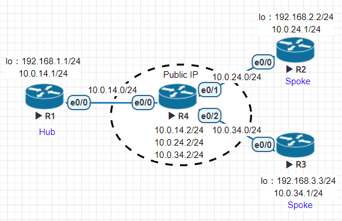
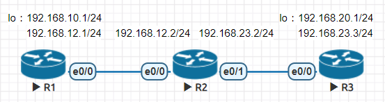
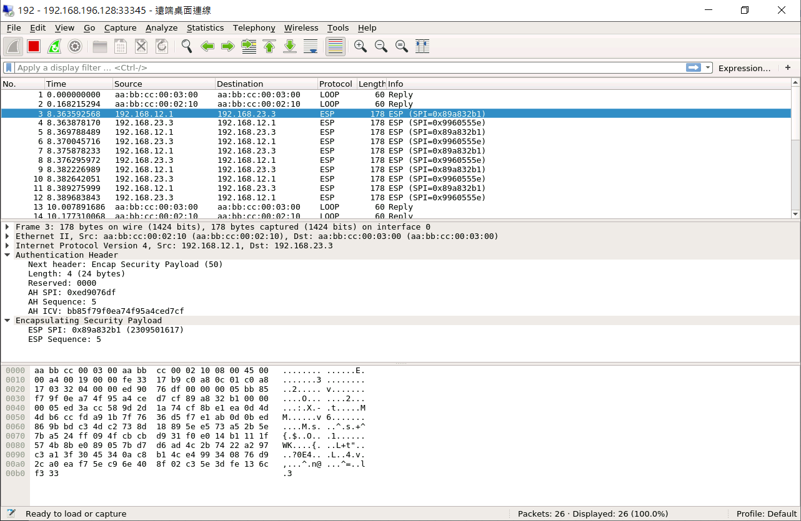

* [VPN (Virtual Private Network) - 虛擬私人網路](https://github.com/linjiachi/Linux_note/blob/master/109-1/cisco/W17-20210106.md#vpn-virtual-private-network---%E8%99%9B%E6%93%AC%E7%A7%81%E4%BA%BA%E7%B6%B2%E8%B7%AF)
    - [GRE (Generic Routing Encapsulation) - 通用路由封裝](https://github.com/linjiachi/Linux_note/blob/master/109-1/cisco/W17-20210106.md#gre-generic-routing-encapsulation---%E9%80%9A%E7%94%A8%E8%B7%AF%E7%94%B1%E5%B0%81%E8%A3%9D)
        - [Hub-to-spoke Topology](https://github.com/linjiachi/Linux_note/blob/master/109-1/cisco/W17-20210106.md#hub-to-spoke-topology)
            - [環境設置](https://github.com/linjiachi/Linux_note/blob/master/109-1/cisco/W17-20210106.md#%E7%92%B0%E5%A2%83%E8%A8%AD%E7%BD%AE)
            - [驗證]()
    - [IPSEC (Internet Protocol Security) - 網際網路安全協定](https://github.com/linjiachi/Linux_note/blob/master/109-1/cisco/W17-20210106.md#ipsec-internet-protocol-security---%E7%B6%B2%E9%9A%9B%E7%B6%B2%E8%B7%AF%E5%AE%89%E5%85%A8%E5%8D%94%E5%AE%9A)
        - [環境設置](https://github.com/linjiachi/Linux_note/blob/master/109-1/cisco/W17-20210106.md#%E7%92%B0%E5%A2%83%E8%A8%AD%E7%BD%AE-1)
        - [測試](https://github.com/linjiachi/Linux_note/blob/master/109-1/cisco/W17-20210106.md#%E6%B8%AC%E8%A9%A6)
---
# VPN (Virtual Private Network) - 虛擬私人網路
## GRE (Generic Routing Encapsulation) - 通用路由封裝
GRE 可以在兩個 Physical Interface 之間建立點對點 Tunnel，多用於設置 Virtual Private Network (VPN) 去保護資訊。GRE 是一種 ip in ip 的技術，傳輸過程中沒有加密，故安全性差。

### Hub-to-spoke Topology
* 拓樸圖



## 環境設置
**Router setting IP**
```sh
//R1
R1(config)#int e0/0
R1(config-if)#ip addr 10.0.14.1 255.255.255.0
R1(config-if)#no shut
R1(config-if)#int lo 0
R1(config-if)#ip addr 192.168.1.1 255.255.255.0

//R2
R2(config)#int e0/0
R2(config-if)#ip addr 10.0.24.1 255.255.255.0
R2(config-if)#no shut
R2(config-if)#int lo 0
R2(config-if)#ip addr 192.168.2.2 255.255.255.0

//R3
R3(config)#int e0/0
R3(config-if)#ip addr 10.0.34.1 255.255.255.0
R3(config-if)#no shut
R3(config-if)#int lo 0
R3(config-if)#ip addr 192.168.3.3 255.255.255.0

//R4
R4(config)#int e0/0
R4(config-if)#ip addr 10.0.14.2 255.255.255.0
R4(config-if)#no shut
R4(config-if)#int e0/1
R4(config-if)#ip addr 10.0.24.2 255.255.255.0
R4(config-if)#no shut
R4(config-if)#int e0/2
R4(config-if)#ip addr 10.0.34.2 255.255.255.0
R4(config-if)#no shut
```

**建立虛擬通道**
```sh
//R1
R1(config)#router rip
R1(config-router)#version 2
R1(config-router)#no auto-summary
R1(config-router)#network 10.0.14.0
R1(config-router)#router eigrp 1
R1(config-router)#net 172.16.12.0 0.0.0.255
R1(config-router)#net 172.16.13.0 0.0.0.255
R1(config-router)#net 192.168.1.0
R1(config-router)#no auto-summary
R1(config-router)#exit
R1(config)#int tunnel 12
R1(config-if)#ip addr 172.16.12.1 255.255.255.0
R1(config-if)#tunnel source e0/0
R1(config-if)#tunnel destination 10.0.24.2
R1(config-if)#int tunnel 13
R1(config-if)#ip addr 172.16.13.1 255.255.255.0
R1(config-if)#tunnel source e0/0
R1(config-if)#tunnel destination 10.0.34.3

//R2
R2(config)#router rip
R2(config-router)#version 2
R2(config-router)#no auto-summary
R2(config-router)#network 10.0.24.0
R2(config-router)#router eigrp 1
R2(config-router)#net 172.16.12.0 0.0.0.255
R2(config-router)#net 192.168.2.0
R2(config-router)#no auto-summary
R2(config-router)#exit
R2(config)#int tunnel 12
R2(config-if)#ip addr 172.16.12.2 255.255.255.0
R2(config-if)#tunnel source e0/0
R2(config-if)#tunnel destination 10.0.14.1

//R3
R3(config)#router rip
R3(config-router)#version 2
R3(config-router)#no no auto-summary
R3(config-router)#network 10.0.34.0
R3(config-router)#router eigrp 1
R3(config-router)#net 172.16.13.0 0.0.0.255
R3(config-router)#net 192.168.3.0
R3(config-router)#no no auto-summary
R3(config-router)#exit
R3(config)#int tunnel 13
R3(config-if)#ip addr 172.16.13.3 255.255.255.0
R3(config-if)#tunnel source e0/0
R3(config-if)#tunnel destination 10.0.14.1

//R4
R4(config)#router rip
R4(config-router)#version 2
R4(config-router)#no auto-summary
R4(config-router)#network 10.0.14.0
R4(config-router)#network 10.0.24.0
R4(config-router)#network 10.0.34.0
```
### 驗證
* R2 e0/0 封包

 

## IPSEC (Internet Protocol Security) - 網際網路安全協定
Phase1 是傳輸交換秘密金鑰，Phase2 才是傳輸加密使用者資料

* 拓樸圖
> Site to Site IPSEC VPN



* 要讓 R1 的私有網路和 R3 的私有網路進行通訊

### 環境設置
**Router setting IP**
```sh
//R1
R1(config)#int e0/0
R1(config-if)#ip addr 192.168.12.1 255.255.255.0
R1(config-if)#no shut
R1(config-if)#int lo 0
R1(config-if)#ip addr 192.168.10.1 255.255.255.0

//R2
R2(config)#int e0/0
R2(config-if)#ip addr 192.168.12.2 255.255.255.0
R2(config-if)#no shut
R2(config-if)#int e0/1
R2(config-if)#ip addr 192.168.23.2 255.255.255.0
R2(config-if)#no shut

//R3
R3(config)#int e0/0
R3(config-if)#ip addr 192.168.23.3 255.255.255.0
R3(config-if)#no shut
R3(config-if)#int lo 0
R3(config-if)#ip addr 192.168.20.1 255.255.255.0
```
**設定內定路由**
```sh
//R1
R1(config)#ip route 0.0.0.0 0.0.0.0 192.168.12.2

//R3
R3(config)#ip route 0.0.0.0 0.0.0.0 192.168.23.2
```
**設定感興趣流**
```sh
//R1
R1(config)#ip access-list extended VPN-Traffic
R1(config-ext-nacl)#permit ip 192.168.10.0 0.0.0.255 192.168.20.0 0.0.0.255

//R3
R3(config)#ip access-list extended VPN-Traffic
R3(config-ext-nacl)#permit ip 192.168.20.0 0.0.0.255 192.168.10.0 0.0.0.255
```
**設定 Phase1**
```sh
//R1
R1(config)#crypto isakmp policy 1
R1(config-isakmp)#encryption aes
R1(config-isakmp)#hash md5
R1(config-isakmp)#authentication pre-share
R1(config-isakmp)#group 2
R1(config-isakmp)#lifetime 30000
R1(config-isakmp)#exit

//R2
R2(config)#crypto isakmp policy 1
R2(config-isakmp)#encryption aes
R2(config-isakmp)#hash md5
R2(config-isakmp)#authentication pre-share
R2(config-isakmp)#group 2
R2(config-isakmp)#lifetime 30000
R2(config-isakmp)#exit

//R3
R3(config)#crypto isakmp policy 1
R3(config-isakmp)#encryption aes
R3(config-isakmp)#hash md5
R3(config-isakmp)#authentication pre-share
R3(config-isakmp)#group 2
R3(config-isakmp)#lifetime 30000
R3(config-isakmp)#exit
```
**設定 Phase2，對資料進行加密**
```sh
//R1
R1(config)#crypto ipsec transform-set TS esp-3des ah-sha-hmac
R1(cfg-crypto-trans)#exit
R1(config)#crypto isakmp key 6 ccie address 192.168.23.3
R1(config)#crypto map CMAP 1 ipsec-isakmp
R1(config-crypto-map)#set peer 192.168.23.3
R1(config-crypto-map)#set transform-set TS
R1(config-crypto-map)#match address VPN-Traffic
R1(config-crypto-map)#exit
R1(config)#int e0/0
R1(config-if)#crypto map CMAP

//R3
R3(config)#crypto ipsec transform-set TS esp-3des ah-sha-hmac
R3(cfg-crypto-trans)#exit
R3(config)#crypto isakmp key 6 ccie address 192.168.12.1
R3(config)#crypto map CMAP 1 ipsec-isakmp
R3(config-crypto-map)#set peer 192.168.12.1
R3(config-crypto-map)#set transform-set TS
R3(config-crypto-map)#match address VPN-Traffic
R3(config-crypto-map)#exit
R3(config)#int e0/0
R3(config-if)#crypto map CMAP
```
### 測試
* R3 e0/0 封包
* R1 `ping 192.168.20.1 so 192.168.10.1`



> 觀察不到 ping 和 request 

---
參考資料：
- [Generic Routing Encapsulation (GRE) 通用路由封裝 - Jan Ho 的網路世界](https://www.jannet.hk/zh-Hant/post/generic-routing-encapsulation-gre/)
- [Internet Protocol Security (IPSEC) 網際網路安全協定 - Jan Ho 的網路世界](https://www.jannet.hk/zh-Hant/post/internet-protocol-security-ipsec/)
