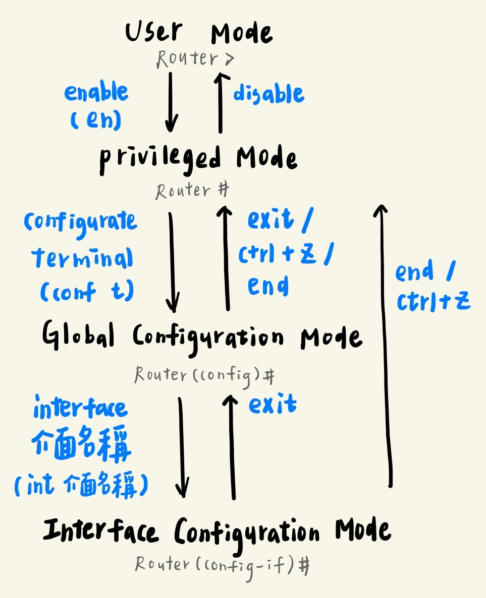
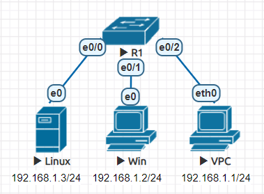
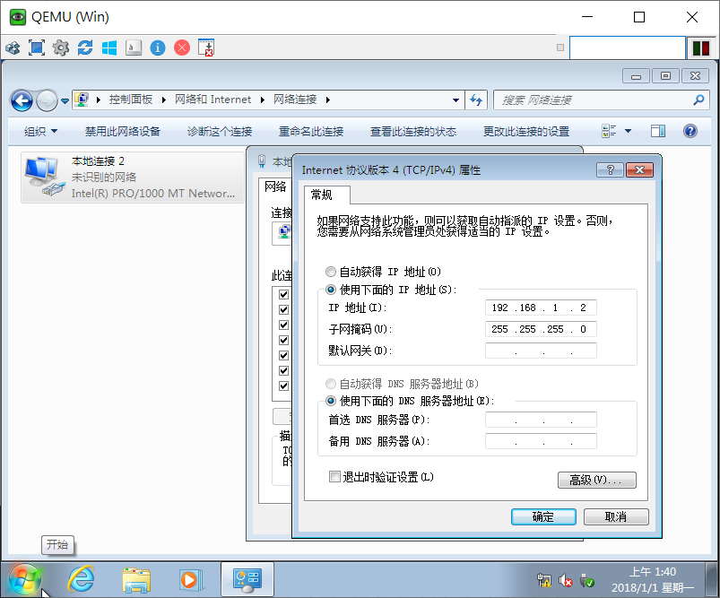

* [EVE](https://github.com/linjiachi/Linux_note/blob/master/109-1/cisco/W2-20200923.md#eve)
* [Cisco](https://github.com/linjiachi/Linux_note/blob/master/109-1/cisco/W2-20200923.md#cisco)
    - [Cisco Router Mode](https://github.com/linjiachi/Linux_note/blob/master/109-1/cisco/W2-20200923.md#cisco-router-mode)
* [中間人攻擊](https://github.com/linjiachi/Linux_note/blob/master/109-1/cisco/W2-20200923.md#%E4%B8%AD%E9%96%93%E4%BA%BA%E6%94%BB%E6%93%8A)
---
# EVE
* 模擬器

名稱|差異
-|-
simulator|軟體模擬環境
emulator|虛擬出整個系統

# Cisco
* 作業系統是 IOT(Internetwork Operating System)

## Cisco Router Mode
1. User Mode
> 使用者模式，只能觀看設備基本狀態與資訊，無法對設備的設定做修改。
* 指令提示符號：

    ```sh
    Router>
    ```
2. Privileged Mode
> 在 User Mode 輸入 `enable` (縮寫 `en`)，進入 Privileged Mode。
> * 在 Global 和 Interface Configuration Mode 下，在開頭加入 `do`，它將會在 Privileged Mode 下執行。
* 指令提示符號：

    ```sh
    Router#
    ```
3. Global Configuration Mode
> 在 Privileged Mode 輸入 `configure terminal` (縮寫 `conf t`)，進入 Global Configuration Mode，可以對設備做整體的設定。
* 指令提示符號：

    ```sh
    Router(config)#
    ```
4. Interface Configuration Mode
> 在 Global Configuration Mode 輸入 `interface [介面名稱]` (縮寫 `int [介面名稱]`)，可以針對介面卡做設定。
* 指令提示符號：

    ```sh
    Router(config-if)#
    ```
* 示意圖



# 中間人攻擊
> win7 和 PC 在互 ping，Linux 去竊聽兩者之間的通訊
* 拓樸圖



1. 準備 EVE 環境：Switch、VPC、qemu 的 win7、linux-kali
* 設定 VPC 的 IP：`ip addr 192.168.1.1 255.255.255.0`
* 設定 win7 的 IP

    IP|子網路遮罩
    -|-
    192.168.1.2|255.255.255.0

    - 網絡 - 屬性 - 更改適配器設置 - 本地連接 2 - 屬性 - Internet 協議版本 4 (TCP/IPv4) - 屬性 - 手動設定 IP

    

* 設定 linux-kali 的 IP：
    - 帳：root，密：toor
    - `ip addr add 192.168.1.3/24 brd + dev eth0`
    - `echo 1 > /proc/sys/net/ipv4/ip_forward`

2. win7 ping VPC
* `ping 192.168.1.1 -t`
    - `-t`：持續
3. Linux 可以用 wireshark 查看 e0/0 的狀態
* 使用工具：ettercap、Arpspoof
* 欺騙 192.168.1.1 "Linux 是 192.168.1.2"

    - `arpspoof -i eth0 -t 192.168.1.1 192.168.1.2`
* 欺騙 192.168.1.2 "Linux 是 192.168.1.1"

    - `arpspoof -i eth0 -t 192.168.1.2 192.168.1.1`

---
參考資料：
- [Arpspoof 工具](https://wizardforcel.gitbooks.io/daxueba-kali-linux-tutorial/content/58.html)
- [routersploit 掃 router 設備漏洞/弱點](https://ssorc.tw/7397/routersploit-%E6%8E%83-router-%E8%A8%AD%E5%82%99%E6%BC%8F%E6%B4%9E-%E5%BC%B1%E9%BB%9E/)