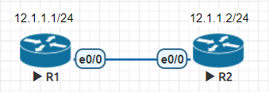
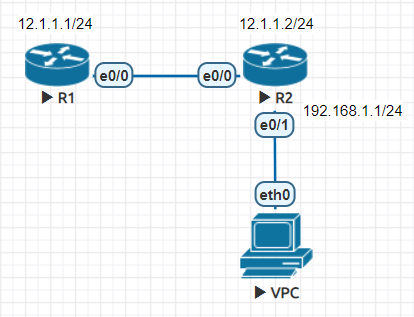
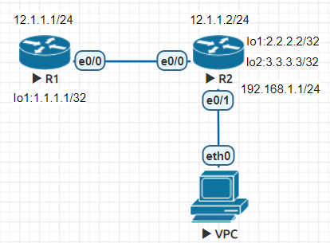
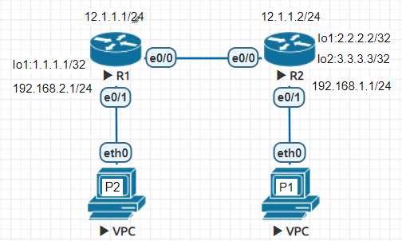
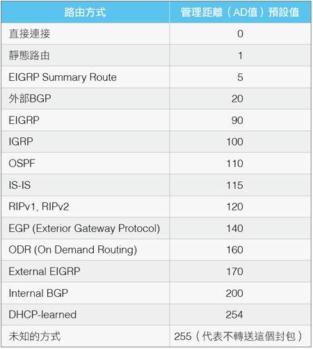
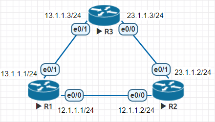

* [Cisco Router Command](https://github.com/linjiachi/Linux_note/blob/master/109-1/cisco/W3-20200930.md#cisco-router-command)
    - [加入 config mode 的密碼](https://github.com/linjiachi/Linux_note/blob/master/109-1/cisco/W3-20200930.md#%E5%8A%A0%E5%85%A5-config-mode-%E7%9A%84%E5%AF%86%E7%A2%BC)
* [Cisco 實作](https://github.com/linjiachi/Linux_note/blob/master/109-1/cisco/W3-20200930.md#cisco-%E5%AF%A6%E4%BD%9C)
    - [Test1 - R1 ping R2](https://github.com/linjiachi/Linux_note/blob/master/109-1/cisco/W3-20200930.md#test1---r1-ping-r2)
    - [Test2 - R1 機器連到 R2 (類似ssh)](https://github.com/linjiachi/Linux_note/blob/master/109-1/cisco/W3-20200930.md#test2---r1-%E6%A9%9F%E5%99%A8%E9%80%A3%E5%88%B0-r2-%E9%A1%9E%E4%BC%BCssh)
    - [Test3 - 利用 DHCP 取得 IP](https://github.com/linjiachi/Linux_note/blob/master/109-1/cisco/W3-20200930.md#test3---%E5%88%A9%E7%94%A8-dhcp-%E5%8F%96%E5%BE%97-ip)
    - [解決 VPC 不能 ping R1](https://github.com/linjiachi/Linux_note/blob/master/109-1/cisco/W3-20200930.md#%E8%A7%A3%E6%B1%BA-vpc-%E4%B8%8D%E8%83%BD-ping-r1)
    - [Test4 - P2 ping P1](https://github.com/linjiachi/Linux_note/blob/master/109-1/cisco/W3-20200930.md#test4---p2-ping-p1)
    - [補充](https://github.com/linjiachi/Linux_note/blob/master/109-1/cisco/W3-20200930.md#%E8%A3%9C%E5%85%85)
    - [Test5 - AD (Administrative Distance) 設定路徑權重值](https://github.com/linjiachi/Linux_note/blob/master/109-1/cisco/W3-20200930.md#test5---ad-administrative-distance-%E8%A8%AD%E5%AE%9A%E8%B7%AF%E5%BE%91%E6%AC%8A%E9%87%8D%E5%80%BC)

---
# Cisco Router Command
* `?`：help
* `show`
* `ip addr <ip 位置> <子網路遮罩>`
    - `ip addr 192.168.1.1 255.255.255.0`
    - 假設 IP 位置設定錯誤，在前方加入 `no`，就能夠移除剛剛的設定
* `no shutdown`：啟動介面
* `hostname [主機名稱]`：設定主機名稱
* `show ip interface brief`：查看 IP 介面卡的狀態
* `write memory`：將設定寫入

## 加入 config mode 的密碼
1. 明文密碼：`enable password 密碼`
2. 加密模式：`enable secret 密碼`
* 如果 secret 有設，會覆蓋掉 enable 密碼

# Cisco 實作
## Test1 - R1 ping R2
* 架構圖



**R1**
```sh
R1>en
R1#conf t
R1(config)#int e0/0
R1(config-if)#ip addr 12.1.1.1 255.255.255.0
R1(config-if)#no shut
```
**R2**
```sh
R2>en
R2#conf t
R2(config)#int e0/0
R2(config-if)#ip addr 12.1.1.2 255.255.255.0
R2(config-if)#no shut
```
**R1 ping R2**
* `.` 代表失敗，`!` 代表成功
* 在連線時，第一個封包會失敗是因為 arp 還沒解析完
```sh
Router# ping 12.1.1.2
Type escape sequence to abort.
Sending 5, 100-byte ICMP Echos to 12.1.1.2, timeout is 2 seconds:
.!!!!
Success rate is 80 percent (4/5), round-trip min/avg/max = 1/1/1 ms
```
* 當 ping 不成功，可以執行 `show ip int brief` 查看 IP 是否設好，介面卡狀態是否 UP

## Test2 - R1 機器連到 R2 (類似ssh)
**R2**
```sh
R2>en
R2#conf t
R2(config)#line vty 0 4
R2(config-line)#password cisco
R2(config-line)#login
R2(config-line)#transport input telnet
```
**R1**
```sh
R1>en
R1#conf t
R1(config)#line vty 0 4
R1(config-line)# transport input telnet
R1(config-line)#^Z
R1#telnet 12.1.1.2
Trying 12.1.1.2 ... Open


User Access Verification
Password:
R2>
```
## Test3 - 利用 DHCP 取得 IP
* 架構圖



**R2**
```sh
R2>en
R2#conf t
R2(config)#int e0/1
R2(config-if)#ip addr 192.168.1.1 255.255.255.0
R2(config-if)#no shut

# 設定 DHCP 伺服器
R2(config)#ip dhcp pool DHCP
R2(dhcp-config)#network 192.168.1.0 /24
R2(dhcp-config)#default-router 192.168.1.1
R2(dhcp-config)#dns-server 8.8.8.8
```

**VPC**
* 利用 dhcp 取得 IP
```sh
VPCS> ip dhcp
DDORA IP 192.168.1.2/24 GW 192.168.1.1

# 查看是否取得到 IP
VPCS> show ip

NAME        : VPCS[1]
IP/MASK     : 192.168.1.2/24
GATEWAY     : 192.168.1.1
DNS         : 8.8.8.8
DHCP SERVER : 192.168.1.1
DHCP LEASE  : 86361, 86400/43200/75600
MAC         : 00:50:79:66:68:03
LPORT       : 20000
RHOST:PORT  : 127.0.0.1:30000
MTU         : 1500

# 可以 ping 192.168.1.1、12.1.1.2
VPCS> ping 192.168.1.1

84 bytes from 192.168.1.1 icmp_seq=1 ttl=255 time=0.271 ms
84 bytes from 192.168.1.1 icmp_seq=2 ttl=255 time=0.358 ms

VPCS> ping 12.1.1.2

84 bytes from 12.1.1.2 icmp_seq=1 ttl=255 time=0.352 ms
84 bytes from 12.1.1.2 icmp_seq=2 ttl=255 time=0.326 ms

# 不能 ping 12.1.1.1
VPCS> ping 12.1.1.1

12.1.1.1 icmp_seq=1 timeout
12.1.1.1 icmp_seq=2 timeout
```
## 解決 VPC 不能 ping R1
* 架構圖



**R2**
```sh
R2>en
R2#conf t
R2(config)#int lo 1
R2(config-if)#ip addr 2.2.2.2 255.255.255.255
R2(config-if)#do sh ip int brief
Interface                  IP-Address      OK? Method Status                Protocol
Ethernet0/0                12.1.1.2        YES NVRAM  up                    up  
Ethernet0/1                192.168.1.1     YES manual up                    up  
Ethernet0/2                unassigned      YES NVRAM  administratively down down
Ethernet0/3                unassigned      YES NVRAM  administratively down down
Loopback1                  2.2.2.2         YES manual up                    up  
# Lookback1(lo) Interface 不需要 no shutdown 
# 即可讓介面卡狀態 UP，因為 lo 是一個虛擬的介面

# 切換介面卡可直接輸入，不用跳出來再跳進去
R2(config-if)#int lo 2
R2(config-if)#ip addr 3.3.3.3 255.255.255.255
```

**R1**
```sh
R1>en
R1#conf t
R1(config)#int lo 1
R1(config-if)#ip addr 1.1.1.1 255.255.255.255
R1(config-if)#exit

# 設定靜態路由，ip route <R2> <下一跳>
R1(config)#ip route 2.2.2.2 255.255.255.255 12.1.1.2
R1(config)#ip route 3.3.3.3 255.255.255.255 12.1.1.2
R1(config)#ip route 192.168.1.0 255.255.255.0 12.1.1.2
```
**R1**
* 開啟 IP ICMP (Internet Control Message Protocol)
```sh
# 列出詳細資料
R1(config)#do debug ip icmp
ICMP packet debugging is on
R1(config)#do ping 2.2.2.2
Type escape sequence to abort.
Sending 5, 100-byte ICMP Echos to 2.2.2.2, timeout is 2 seconds:
!!!!!
Success rate is 100 percent (5/5), round-trip min/avg/max = 1/3/12 ms
*Dec 31 23:03:45.397: ICMP: echo reply rcvd, src 2.2.2.2, dst 12.1.1.1, topology BASE, dscp 0 topoid 0
*Dec 31 23:03:45.399: ICMP: echo reply rcvd, src 2.2.2.2, dst 12.1.1.1, topology BASE, dscp 0 topoid 0
*Dec 31 23:03:45.400: ICMP: echo reply rcvd, src 2.2.2.2, dst 12.1.1.1, topology BASE, dscp 0 topoid 0
*Dec 31 23:03:45.401: ICMP: echo reply rcvd, src 2.2.2.2, dst 12.1.1.1, topology BASE, dscp 0 topoid 0
*Dec 31 23:03:45.401: ICMP: echo reply rcvd, src 2.2.2.2, dst 12.1.1.1, topology BASE, dscp 0 topoid 0
```
```sh
# R1 封包送出會成功，但會被丟棄，因為 R2 沒有設定回到 1.1.1.1 
R1#ping 2.2.2.2 source 1.1.1.1 repeat 10
Type escape sequence to abort.
Sending 10, 100-byte ICMP Echos to 2.2.2.2, timeout is 2 seconds:
Packet sent with a source address of 1.1.1.1
..........
Success rate is 0 percent (0/10)
```
**R2**
* 查看路由表
```sh
# 顯示路由表
R2(config)#do show ip route
# 沒有任何設定傳回 1.1.1.1
      2.0.0.0/32 is subnetted, 1 subnets
C        2.2.2.2 is directly connected, Loopback1
      3.0.0.0/32 is subnetted, 1 subnets
C        3.3.3.3 is directly connected, Loopback2
      12.0.0.0/8 is variably subnetted, 2 subnets, 2 masks
C        12.1.1.0/24 is directly connected, Ethernet0/0
L        12.1.1.2/32 is directly connected, Ethernet0/0
      192.168.1.0/24 is variably subnetted, 2 subnets, 2 masks
C        192.168.1.0/24 is directly connected, Ethernet0/1
L        192.168.1.1/32 is directly connected, Ethernet0/1

R2(config)#ip route 1.1.1.1 255.255.255.255 12.1.1.1
```
## Test4 - P2 ping P1
* 架構圖



**R1**
```sh
R1>en
R1#conf t
R1(config)#int e0/1
R1(config-if)#ip addr 192.168.2.1 255.255.255.0
R1(config-if)#no shut

# 設定 DHCP 伺服器
R1(config)#ip dhcp pool DHCP
R1(dhcp-config)#network 192.168.2.0 /24
R1(dhcp-config)#default-router 192.168.2.1
R1(dhcp-config)#dns-server 8.8.8.8

R1(config)#ip route 2.2.2.2 255.255.255.255 12.1.1.2
R1(config)#ip route 3.3.3.3 255.255.255.255 12.1.1.2
R1(config)#ip route 192.168.1.0 255.255.255.0 12.1.1.2
```
**R2**
```sh
R2>en
R2#conf t
R2(config)#ip route 192.168.2.0 255.255.255.0 12.1.1.1
```
**VPC(P2)**
```sh
VPCS> ip dhcp
DDORA IP 192.168.2.2/24 GW 192.168.2.1

# P2 ping P1
VPCS> ping 192.168.1.1

84 bytes from 192.168.1.1 icmp_seq=1 ttl=254 time=0.558 ms
84 bytes from 192.168.1.1 icmp_seq=2 ttl=254 time=3.614 ms
.
.
```

## 補充
* `#show arp`：顯示 ip arp mapping
    - 位址解析協定 Address Resolution Protocol (ARP)：是一個通過解析網路層位址來找尋資料鏈路層位址的網路傳輸協定，它在 IPv4 中極其重要
* `#show interface e0/0`：顯示 interface 詳細資訊，如 ip addr、 mac addr、傳送速度、MTU、送了多少封包、接收多少封包等等
* `#debug ip icmp`：
    - 網際網路控制訊息協定 Internet Control Message Protocol (ICMP)：是用來解析網路封包或是分析路由的情況，大多是透過所傳回來的錯誤訊息進行分析 
* `Ctrl + Shift + 6`：快速中止動作

## Test5 - AD (Administrative Distance) 設定路徑權重值
* 管理距離 (AD值) 是一個從 0~255 的整數，每一種路由協定都有一個預設的管理距離 (AD值) 與之對應，代表這個路由協定所提供的資訊的可靠程度，其值越低，代表可靠程度越高。

    
* 架構圖



**R1**
```sh
R1(config-if)#int e0/0
R1(config-if)#ip addr 12.1.1.1 255.255.255.0
R1(config-if)#no shut
R1(config-if)#int e0/1
R1(config-if)#ip addr 13.1.1.1 255.255.255.0
R1(config-if)#no shut

# 設定靜態路由
R1(config)#ip route 23.1.1.0 255.255.255.0 12.1.1.2
R1(config)#ip route 23.1.1.0 255.255.255.0 13.1.1.3 10
                                                  # AD值
```

**R2**
```sh
R2(config)#int e0/0
R2(config-if)#ip addr 12.1.1.2 255.255.255.0
R2(config-if)#no shut
R2(config)#int e0/1
R2(config-if)#ip addr 23.1.1.2 255.255.255.0
R2(config-if)#no shut

# 設定靜態路由
R2(config)#ip route 13.1.1.0 255.255.255.0 12.1.1.1
R2(config)#ip route 13.1.1.0 255.255.255.0 23.1.1.3 10
                                                  # AD值
```
**R3**
```sh
R3(config-if)#int e0/0
R3(config-if)#ip addr 23.1.1.3 255.255.255.0
R3(config-if)#no shut
R3(config-if)#int e0/1
R3(config-if)#ip addr 13.1.1.3 255.255.255.0
R3(config-if)#no shut

# 設定靜態路由
R3(config)#ip route 12.1.1.0 255.255.255.0 13.1.1.1
```
**R1 ping 23.1.1.2 有兩條路**

1. R1 > 12.1.1.1
2. R1 > 13.1.1.1 > 23.1.1.0 
```sh
R1#show ip route
Codes: L - local, C - connected, S - static, R - RIP, M - mobile, B - BGP
       D - EIGRP, EX - EIGRP external, O - OSPF, IA - OSPF inter area
       N1 - OSPF NSSA external type 1, N2 - OSPF NSSA external type 2
       E1 - OSPF external type 1, E2 - OSPF external type 2
       i - IS-IS, su - IS-IS summary, L1 - IS-IS level-1, L2 - IS-IS level-2
       ia - IS-IS inter area, * - candidate default, U - per-user static route
       o - ODR, P - periodic downloaded static route, H - NHRP, l - LISP
       a - application route
       + - replicated route, % - next hop override

Gateway of last resort is not set

      12.0.0.0/8 is variably subnetted, 2 subnets, 2 masks
C        12.1.1.0/24 is directly connected, Ethernet0/0
L        12.1.1.1/32 is directly connected, Ethernet0/0
      13.0.0.0/8 is variably subnetted, 2 subnets, 2 masks
C        13.1.1.0/24 is directly connected, Ethernet0/1
L        13.1.1.1/32 is directly connected, Ethernet0/1
      23.0.0.0/24 is subnetted, 1 subnets
S        23.1.1.0 [1/0] via 12.1.1.2
       # 23.1.1.0 [AD值]，跳轉到 12.1.1.2 

R1#ping 23.1.1.2 source 12.1.1.1
Type escape sequence to abort.
Sending 5, 100-byte ICMP Echos to 23.1.1.2, timeout is 2 seconds:
Packet sent with a source address of 12.1.1.1
!!!!!
Success rate is 100 percent (5/5), round-trip min/avg/max = 1/1/1 ms

R1#ping 23.1.1.2
Type escape sequence to abort.
Sending 5, 100-byte ICMP Echos to 23.1.1.2, timeout is 2 seconds:
!!!!!
```
* 若是當 12.1.1.1 這條線路斷了，就會走第二條

---
參考資料：
- [Cisco router基本設定 - 小鋼管筆記](https://giboss.pixnet.net/blog/post/26807628)
- [Administrative Distance(AD)管理距離 - Jan Ho 的網絡世界](https://www.jannet.hk/zh-Hant/post/administrative-distance-ad/)