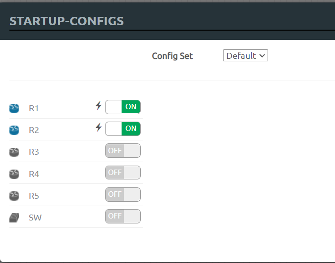
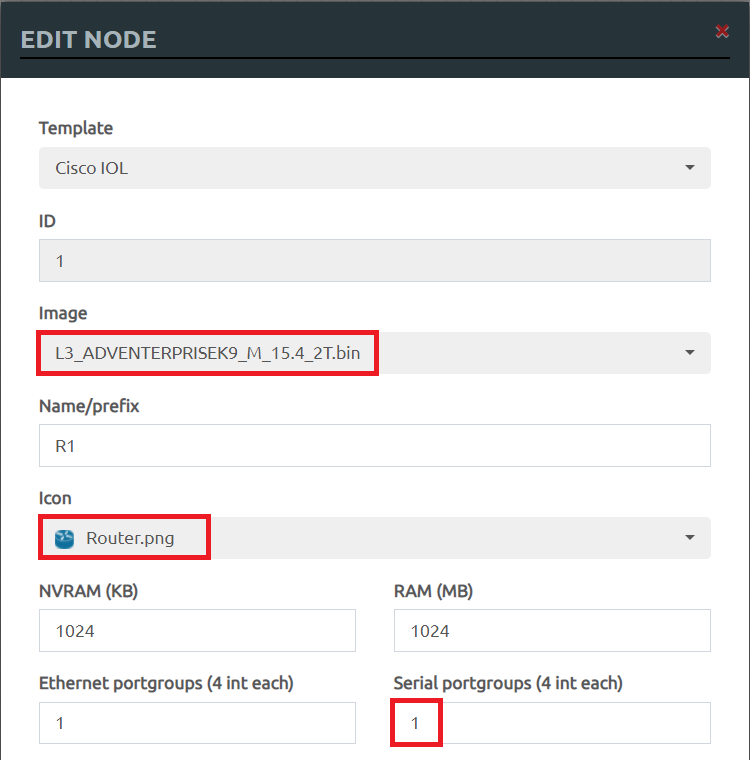
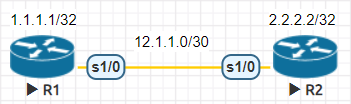
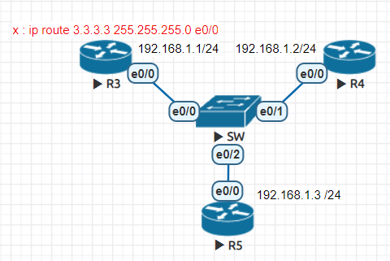
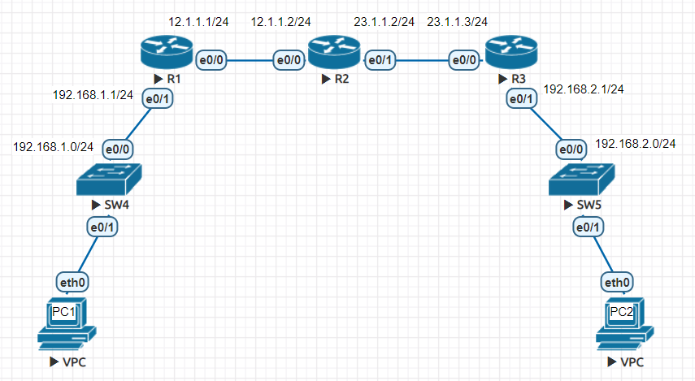
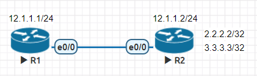

* [EVE](https://github.com/linjiachi/Linux_note/blob/master/109-1/cisco/W4-20201007.md#eve)
    - [保存設置](https://github.com/linjiachi/Linux_note/blob/master/109-1/cisco/W4-20201007.md#%E4%BF%9D%E5%AD%98%E8%A8%AD%E7%BD%AE)
* [Router Serial Port 序列埠](https://github.com/linjiachi/Linux_note/blob/master/109-1/cisco/W4-20201007.md#router-serial-port-%E5%BA%8F%E5%88%97%E5%9F%A0)
    - [Test1 - 序列埠連接](https://github.com/linjiachi/Linux_note/blob/master/109-1/cisco/W4-20201007.md#test1---%E5%BA%8F%E5%88%97%E5%9F%A0%E9%80%A3%E6%8E%A5)
    - [Test2 - 乙太網路接口](https://github.com/linjiachi/Linux_note/blob/master/109-1/cisco/W4-20201007.md#test2---%E4%B9%99%E5%A4%AA%E7%B6%B2%E8%B7%AF%E6%8E%A5%E5%8F%A3)
    - [Test3 - 整合實作](https://github.com/linjiachi/Linux_note/blob/master/109-1/cisco/W4-20201007.md#test3---%E6%95%B4%E5%90%88%E5%AF%A6%E4%BD%9C)
    - [Test4 - 內定路由](https://github.com/linjiachi/Linux_note/blob/master/109-1/cisco/W4-20201007.md#test4---%E5%85%A7%E5%AE%9A%E8%B7%AF%E7%94%B1)

---
# EVE
## 保存設置
* Export CFG
* STARTUP-CONFIGS



# Router Serial Port 序列埠
* 傳輸方式屬於點對點的傳輸

## Test1 - 序列埠連接
**Router setting**



* 拓樸圖
    - 序列 port 要選擇 s1/0



**R1**
```sh
R1>en
R1#conf t
R1(config)#int s1/0
R1(config-if)#ip addr 12.1.1.1 255.255.255.252

# 設定時脈
R1(config-if)#clock rate 64000  
R1(config-if)#no shut
R1(config-if)#do sh ip int brief
Interface                  IP-Address      OK? Method Status                Protocol
Ethernet0/0                unassigned      YES unset  administratively down down
Ethernet0/1                unassigned      YES unset  administratively down down
Ethernet0/2                unassigned      YES unset  administratively down down
Ethernet0/3                unassigned      YES unset  administratively down down
Serial1/0                  12.1.1.1        YES manual up                    up  
Serial1/1                  unassigned      YES unset  administratively down down
Serial1/2                  unassigned      YES unset  administratively down down
Serial1/3                  unassigned      YES unset  administratively down down
```
**R2**
```sh
R2>en
R2#conf t
R2(config)#int s1/0
R2(config-if)#ip addr 12.1.1.2 255.255.255.252
R2(config-if)#clock rate 64000
R2(config-if)#no shut
R2(config-if)#do show ip int brief
Interface                  IP-Address      OK? Method Status                Protocol
Ethernet0/0                unassigned      YES unset  administratively down down
Ethernet0/1                unassigned      YES unset  administratively down down
Ethernet0/2                unassigned      YES unset  administratively down down
Ethernet0/3                unassigned      YES unset  administratively down down
Serial1/0                  12.1.1.2        YES manual up                    up  
Serial1/1                  unassigned      YES unset  administratively down down
Serial1/2                  unassigned      YES unset  administratively down down
Serial1/3                  unassigned      YES unset  administratively down down
```
**R1 ping R2**
```sh
R1(config-if)#do ping 12.1.1.2
Type escape sequence to abort.
Sending 5, 100-byte ICMP Echos to 12.1.1.2, timeout is 2 seconds:
!!!!!
Success rate is 100 percent (5/5), round-trip min/avg/max = 9/11/14 ms
```

**在 R1、R2 設置一個 Loopback0 介面**
```sh
//R1
R1(config-if)#int lo 0
R1(config-if)#ip addr 1.1.1.1 255.255.255.255
R1(config)#do sh ip int brief
Interface                  IP-Address      OK? Method Status                Protocol
Ethernet0/0                unassigned      YES unset  administratively down down
Ethernet0/1                unassigned      YES unset  administratively down down
Ethernet0/2                unassigned      YES unset  administratively down down
Ethernet0/3                unassigned      YES unset  administratively down down
Serial1/0                  12.1.1.1        YES manual up                    up  
Serial1/1                  unassigned      YES unset  administratively down down
Serial1/2                  unassigned      YES unset  administratively down down
Serial1/3                  unassigned      YES unset  administratively down down
Loopback0                  1.1.1.1         YES manual up                    up

//R2
R2(config-if)#int lo 0
R2(config-if)#ip addr 2.2.2.2 255.255.255.255
```

**對 R1、R2 序列埠加上路由**
```sh
# 有三種方式

//R1
# 最正規完整的方式
R1(config)#ip route 2.2.2.0 255.255.255.0 s1/0 12.1.1.2
R1(config)#ip route 2.2.2.0 255.255.255.0 12.1.1.2

# 對於序列埠可以直接寫 s1/0，因為序列埠只有一條路
R1(config)#ip route 2.2.2.0 255.255.255.0 s1/0

//R2
R2(config)#ip route 1.1.1.0 255.255.255.0 s1/0 12.1.1.1
```
**R1 ping R2**
```sh
R1(config)#do ping 2.2.2.2
Type escape sequence to abort.
Sending 5, 100-byte ICMP Echos to 2.2.2.2, timeout is 2 seconds:
!!!!!
Success rate is 100 percent (5/5), round-trip min/avg/max = 7/11/14 ms

# 增加來源位址
R1(config)#do ping 2.2.2.2 source 1.1.1.1
Type escape sequence to abort.
Sending 5, 100-byte ICMP Echos to 2.2.2.2, timeout is 2 seconds:
Packet sent with a source address of 1.1.1.1
!!!!!
Success rate is 100 percent (5/5), round-trip min/avg/max = 9/9/11 ms
```

## Test2 - 乙太網路接口
* 拓樸圖



**R3**
```sh
R3(config)#int e0/0
R3(config-if)#ip addr 192.168.1.1 255.255.255.0
R3(config-if)#no shut

R3(config-if)#int lo 0
R3(config-if)#ip addr 3.3.3.3 255.255.255.255
```
**R4**
```sh
R4(config)#int e0/0
R4(config-if)#ip addr 192.168.1.2 255.255.255.0
R4(config-if)#no shut

R4(config-if)#int lo 0
R4(config-if)#ip addr 4.4.4.4 255.255.255.255
```
**R5**
```sh
R5(config)#int e0/0
R5(config-if)#ip addr 192.168.1.3 255.255.255.0
R5(config-if)#no shut

R5(config-if)#int lo 0
R5(config-if)#ip addr 5.5.5.5 255.255.255.255
```
**設置靜態路由**
```sh
R3(config)#ip route 4.4.4.0 255.255.255.0 e0/0 192.168.1.2
# ping 成功
R3(config)#do ping 4.4.4.4
Type escape sequence to abort.
Sending 5, 100-byte ICMP Echos to 4.4.4.4, timeout is 2 seconds:
!!!!!
Success rate is 100 percent (5/5), round-trip min/avg/max = 1/1/1 ms

# 指定來源 ping 失敗
R3(config)#do ping 4.4.4.4 source 3.3.3.3
Type escape sequence to abort.
Sending 5, 100-byte ICMP Echos to 4.4.4.4, timeout is 2 seconds:
Packet sent with a source address of 3.3.3.3
.....
Success rate is 0 percent (0/5)
```
**解決**
```sh
R4(config-if)#ip route 3.3.3.0 255.255.255.0 e0/0 192.168.1.1
```
## Test3 - 整合實作
* 拓樸圖



**R1**
```sh
R1(config)#int e0/1
R1(config-if)#ip addr 192.168.1.1 255.255.255.0
R1(config-if)#no shut

R1(config-if)#int e0/0
R1(config-if)#ip addr 12.1.1.1 255.255.255.0
R1(config-if)#no shut

R1(config)#ip dhcp pool DHCP1
R1(dhcp-config)#network 192.168.1.0 /24
R1(dhcp-config)#default-router 192.168.1.1
R1(dhcp-config)#dns-server 8.8.8.8
```
**VPC1**
```sh
VPCS> ip dhcp
DDORA IP 192.168.1.2/24 GW 192.168.1.1

VPCS> show ip

NAME        : VPCS[1]
IP/MASK     : 192.168.1.2/24
GATEWAY     : 192.168.1.1
DNS         : 8.8.8.8
DHCP SERVER : 192.168.1.1
DHCP LEASE  : 86393, 86400/43200/75600
MAC         : 00:50:79:66:68:06
LPORT       : 20000
RHOST:PORT  : 127.0.0.1:30000
MTU         : 1500
```
**R3**
```sh
R3(config)#int e0/0
R3(config-if)#ip addr 23.1.1.3 255.255.255.0
R3(config-if)#no shut

R3(config-if)#int e0/1
R3(config-if)#ip addr 192.168.2.1 255.255.255.0
R3(config-if)#no shut

R3(config)#ip dhcp pool DHCP2
R3(dhcp-config)#network 192.168.2.0 /24
R3(dhcp-config)#default-router 192.168.2.1
R3(dhcp-config)#dns-server 8.8.8.8
```
**VPC2**
```sh
VPCS> ip dhcp
DDORA IP 192.168.2.2/24 GW 192.168.2.1

VPCS> sh ip

NAME        : VPCS[1]
IP/MASK     : 192.168.2.2/24
GATEWAY     : 192.168.2.1
DNS         : 8.8.8.8
DHCP SERVER : 192.168.2.1
DHCP LEASE  : 86395, 86400/43200/75600
MAC         : 00:50:79:66:68:07
LPORT       : 20000
RHOST:PORT  : 127.0.0.1:30000
MTU         : 1500
```

**R2**
```sh
R2(config)#int e0/0
R2(config-if)#ip addr 12.1.1.2 255.255.255.0
R2(config-if)#no shut

R2(config-if)#int e0/1
R2(config-if)#ip addr 23.1.1.2 255.255.255.0
R2(config-if)#no shut
```

**設置靜態路由**
```sh
# 讓 PC1 可以 ping 12.1.1.2
R2(config)#ip route 192.168.1.0 255.255.255.0 e0/0 12.1.1.1
                                           # <初接口> <下一跳>
# 讓 PC1 可以 ping 23.1.1.2
R1(config)#ip route 23.1.1.0 255.255.255.0 e0/0 12.1.1.2

# 讓 PC1 可以 ping 23.1.1.3
R3(config)#ip route 192.168.1.0 255.255.255.0 e0/0 23.1.1.2

# 讓 PC1 可以 ping 192.168.2.1、192.168.2.2
R1(config)#ip route 192.168.2.0 255.255.255.0 e0/0 12.1.1.2
R2(config)#ip route 192.168.2.0 255.255.255.0 e0/1 23.1.1.3
```

## Test4 - 內定路由
* 拓樸圖



**R1**
```sh
R1(config)#int e0/0
R1(config-if)#ip addr 12.1.1.1 255.255.255.0
R1(config-if)#no shut
```
**R2**
```sh
R2(config)#int e0/0
R2(config-if)#ip addr 12.1.1.2 255.255.255.0
R2(config-if)#no shut

R2(config-if)#int lo 0
R2(config-if)#ip addr 2.2.2.2 255.255.255.255
R2(config-if)#int lo 1
R2(config-if)#ip addr 3.3.3.3 255.255.255.255
```

**R1 設置內定路由**
```sh
R1(config-if)#ip route 0.0.0.0 0.0.0.0 e0/0 12.1.1.2
R1(config)#do sh ip route
Codes: L - local, C - connected, S - static, R - RIP, M - mobile, B - BGP
       D - EIGRP, EX - EIGRP external, O - OSPF, IA - OSPF inter area
       N1 - OSPF NSSA external type 1, N2 - OSPF NSSA external type 2
       E1 - OSPF external type 1, E2 - OSPF external type 2
       i - IS-IS, su - IS-IS summary, L1 - IS-IS level-1, L2 - IS-IS level-2
       ia - IS-IS inter area, * - candidate default, U - per-user static route
       o - ODR, P - periodic downloaded static route, H - NHRP, l - LISP
       a - application route
       + - replicated route, % - next hop override

Gateway of last resort is 12.1.1.2 to network 0.0.0.0

# S：靜態路由
S*    0.0.0.0/0 [1/0] via 12.1.1.2, Ethernet0/0
      12.0.0.0/8 is variably subnetted, 2 subnets, 2 masks
C        12.1.1.0/24 is directly connected, Ethernet0/0
L        12.1.1.1/32 is directly connected, Ethernet0/0

# 顯示靜態路由
R1(config)#do show ip static route
Codes: M - Manual static, A - AAA download, N - IP NAT, D - DHCP,
       G - GPRS, V - Crypto VPN, C - CASA, P - Channel interface processor,
       B - BootP, S - Service selection gateway
       DN - Default Network, T - Tracking object
       L - TL1, E - OER, I - iEdge
       D1 - Dot1x Vlan Network, K - MWAM Route
       PP - PPP default route, MR - MRIPv6, SS - SSLVPN
       H - IPe Host, ID - IPe Domain Broadcast
       U - User GPRS, TE - MPLS Traffic-eng, LI - LIIN
       IR - ICMP Redirect
Codes in []: A - active, N - non-active, B - BFD-tracked, D - Not Tracked, P - permanent

Static local RIB for default

M  0.0.0.0/0 [1/0] via Ethernet0/0 12.1.1.2 [A]

R1(config)#do ping 2.2.2.2
Type escape sequence to abort.
Sending 5, 100-byte ICMP Echos to 2.2.2.2, timeout is 2 seconds:
!!!!!
Success rate is 100 percent (5/5), round-trip min/avg/max = 1/1/3 ms
R1(config)#do ping 3.3.3.3
Type escape sequence to abort.
Sending 5, 100-byte ICMP Echos to 3.3.3.3, timeout is 2 seconds:
!!!!!
Success rate is 100 percent (5/5), round-trip min/avg/max = 1/1/1 ms
```
