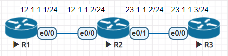

* [IPv6 設定](https://github.com/linjiachi/Linux_note/blob/master/109-1/cisco/W5-20201014.md#ipv6)
    - [手動設定IP](https://github.com/linjiachi/Linux_note/blob/master/109-1/cisco/W5-20201014.md#%E6%89%8B%E5%8B%95%E8%A8%AD%E5%AE%9Aip)
    - [自動取得 IPv6](https://github.com/linjiachi/Linux_note/blob/master/109-1/cisco/W5-20201014.md#%E8%87%AA%E5%8B%95%E5%8F%96%E5%BE%97-ipv6)
* [動態路由](https://github.com/linjiachi/Linux_note/blob/master/109-1/cisco/W5-20201014.md#%E5%8B%95%E6%85%8B%E8%B7%AF%E7%94%B1)
    - [RIP 實作 1](https://github.com/linjiachi/Linux_note/blob/master/109-1/cisco/W5-20201014.md#rip-%E5%AF%A6%E4%BD%9C-1)
    - [RIP 實作 2](https://github.com/linjiachi/Linux_note/blob/master/109-1/cisco/W5-20201014.md#rip-%E5%AF%A6%E4%BD%9C-2)
---
# IPv6
* switch port mode
    - access：會幫封包標籤
    - trunk

* 概念圖 


* 架構圖


## 手動設定IP
**Router**
```sh
# 啟動 IPv6 的功能
Router(config)#ipv6 unicast-routing
Router(config)#int lo 0
Router(config-if)#ipv6 addr 2001:2::1/64

Router(config-if)#int e0/0
Router(config-if)#ipv6 addr 2012::2/64
Router(config-if)#no shut
Router(config-if)#ipv6 route 2001:1::/64 e0/0 2012::1
```

**Switch**
```sh
Switch(config)#ipv6 unicast-routing
 Switch(config)#ipv6 route ::/0 2012::2
Switch(config)#int e0/0

# 把交換器的功能(L2)關起來-> L3
Switch(config-if)#no switchport
Switch(config-if)#ipv6 enable
Switch(config-if)#ipv6 addr 2012::1/64
Switch(config-if)#no shut
Switsh(config)#exit
```
**Switch ping**
```sh
# ping 成功
Switch(config)#do ping 2012::1
Type escape sequence to abort.
Sending 5, 100-byte ICMP Echos to 2012::1, timeout is 2 seconds:
!!!!!
Success rate is 100 percent (5/5), round-trip min/avg/max = 3/4/7 ms
Switch(config)#do ping 2012::2
Type escape sequence to abort.
Sending 5, 100-byte ICMP Echos to 2012::2, timeout is 2 seconds:
!!!!!
Success rate is 100 percent (5/5), round-trip min/avg/max = 1/4/18 ms

# ping 失敗
Switch(config)#do ping 2012:2::1
Type escape sequence to abort.
Sending 5, 100-byte ICMP Echos to 2012:2::1, timeout is 2 seconds:
UUUUU
Success rate is 0 percent (0/5)


# solve
Switch(config)#ipv6 route ::/0 e0/0 2012::2
# 創建一個虛擬網路
Switch(config)#vlan 10
Switch(config-vlan)#int vlan 10
Switch(config-if)#ipv6 addr 2001:1::FFFF/64
Switch(config-if)#no shut
Switch(config-if)#ipv6 enable
Switch(config-if)#int e0/1
Switch(config-if)#switch mode access
Switch(config-if)#switch access vlan 10
Switch(config-if)#do ping 2001:2::1
Type escape sequence to abort.
Sending 5, 100-byte ICMP Echos to 2001:2::1, timeout is 2 seconds:
!!!!!
Success rate is 100 percent (5/5), round-trip min/avg/max = 1/1/1 ms
```

**VPC**
```sh
VPCS> ip 2001:1::1/64 2001:1::FFFF
PC1 : 2001:1::1/64

VPCS> show ipv6

NAME              : VPCS[1]
LINK-LOCAL SCOPE  : fe80::250:79ff:fe66:6803/64
GLOBAL SCOPE      : 2001:1::1/64
DNS               :
ROUTER LINK-LAYER : aa:bb:cc:80:02:00
MAC               : 00:50:79:66:68:03
LPORT             : 20000
RHOST:PORT        : 127.0.0.1:30000
MTU:              : 1500

# ping 內定路由器
VPCS> ping 2001:1::FFFF
VPCS> ping 2012::1
```

## 自動取得 IPv6
**有狀態式**
* 透過 dhcpv6

**無狀態式**
* 透過 SLAAC、 RA (Router Advertisement)
* EUI-64 格式：將 48 bit 轉為 64 bit

**Switch**
```sh
int vlan 10
no ipv6 nd suppress-ra
```
**VPC**
```sh
ip auto
```
# 動態路由
* 動態尋徑協定
    - 距離向量尋徑協定
    - 連線狀態尋徑協定
    - 混合式尋徑協定

* ECMP (Equal-cost Multi-path Routing)
* 在 windows 查看路由表
```sh
route print
```
**這學期會介紹兩個路由**

1. 距離向量 RIP
    * 週期性的與相鄰路由器交換路徑資訊
    * 方式簡單，但不嚴謹
    * 只考慮跳數

2. 混和尋徑 EIGRP
    * 結合距離向量及連線
    * 考慮到頻寬、負載、時間延遲、可靠度

**判斷同個資料流方式**
* 5-tuple
    1. src ip
    2. dst ip
    3. src port
    4. dst port
    5. tcp/udp

**路徑表更新**
* 30s 更新一次
* 超過 180s 停止運作
* 超過 240s 刪除路由

## RIP 實作 1
* 使用動態路由使 Router 之間可以互相通訊
* 架構圖



**R1**
```sh
R1(config)#int e0/0
R1(config-if)#ip addr 12.1.1.1 255.255.255.0
R1(config-if)#no shut
R1(config-if)#exit
R1(config)#router rip
R1(config-router)#network 12.0.0.0
```
**R2**
```sh
R2(config-if)#int e0/0
R2(config-if)#ip addr 12.1.1.2 255.255.255.0
R2(config-if)#no shut
R2(config-if)#int e0/1
R2(config-if)#ip addr 23.1.1.2 255.255.255.0
R2(config-if)#no shut
R2(config-if)#exit
R2(config)#router rip
R2(config-router)#network 12.0.0.0
R2(config-router)#network 23.0.0.0
```
**R3**
```sh
R3(config)#int e0/0
R3(config-if)#ip addr 23.1.1.3 255.255.255.0
R3(config-if)#no shut
R3(config-if)#exit
R3(config)#router rip
R3(config-router)#network 23.0.0.0
```
## RIP 實作 2
* 架構圖


**R1**
```sh
R1(config)#int lo 0
R1(config-if)#ip addr 10.0.1.1 255.255.255.0
R1(config-if)#no shut
R1(config-if)#exit
R1(config)#router rip
R1(config-router)#version 2

# 取消自動合併功能
R1(config-router)#no auto-summary
R1(config-router)#network 10.0.1.0

# 清掉全部的路由表
R1(config-router)#do clear ip route *
```
**R3**
```sh
R3(config)#int lo 0
R3(config-if)#ip addr 10.0.2.1 255.255.255.0
R3(config-if)#no shut
R3(config-if)#exit
R3(config)#router rip
R3(config-router)#version 2
R3(config-router)#no auto-summary
R3(config-router)#network 10.0.2.0
```

---
參考資料：
- [[筆記]Cisco基本指令-VLAN](https://david50.pixnet.net/blog/post/45244986-%5B%E7%AD%86%E8%A8%98%5Dcisco%E5%9F%BA%E6%9C%AC%E6%8C%87%E4%BB%A4-vlan)
