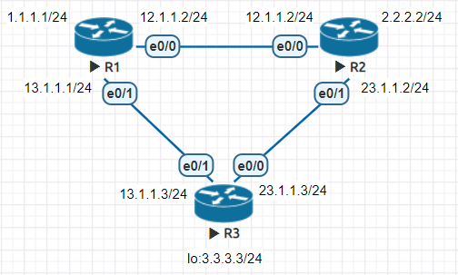
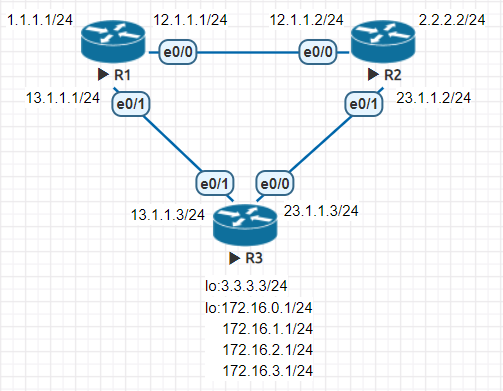
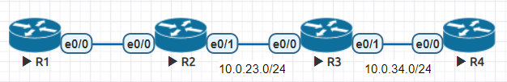

* [路由資訊協定 (Routing Information Protocol, RIP)]()
      - []()
      - []()
---
# 路由資訊協定 (Routing Information Protocol, RIP)

-|RIPv1|RIPv2
---|:-:|:-:
Layer|Application|Application
VLSM & CIDR|X|V
AD|120|120
metrics|hop count|hop count
Update method|broadcast 255.255.255.255|multicast 244.0.0.9
Auto summary|X|V

* v2 在進行路由交換，是可以支援加密
<details>
<summary> Abbrev </summary>

- VLSM：Variable Length Subnet Mask, 可變長度的子網路遮罩
- CIDR：Classless Inter-Domain Routing, 無類別域間路由
- AD：Administration distance, 管理距離

</details>

---
## RIPv2 實作 1
* 架構圖



**手動設定 R1、R2、R3 IP**
```sh
//R1
R1(config)#int lo 0
R1(config-if)#ip addr 1.1.1.1 255.255.255.0

R1(config-if)#int e0/0
R1(config-if)#ip addr 12.1.1.1 255.255.255.0
R1(config-if)#no shut

R1(config-if)#int e0/1
R1(config-if)#ip addr 13.1.1.1 255.255.255.0
R1(config-if)#no shut


//R2
R2(config)#int lo 0
R2(config-if)#ip addr 2.2.2.2 255.255.255.0

R2(config-if)#int e0/0
R2(config-if)#ip addr 12.1.1.2 255.255.255.0
R2(config-if)#no shut

R2(config-if)#int e0/1
R2(config-if)#ip addr 23.1.1.2 255.255.255.0
R2(config-if)#no shut

//R3
R3(config)#int lo 0
R3(config-if)#ip addr 3.3.3.3 255.255.255.0

R3(config-if)#int e0/0
R3(config-if)#ip addr 23.1.1.3 255.255.255.0
R3(config-if)#no shut

R3(config-if)#int e0/1
R3(config-if)#ip addr 13.1.1.3 255.255.255.0
R3(config-if)#no shut
```

**在 R1、R2、R3 設置路由**
```sh
//R1
R1(config)#router rip
R1(config-router)#version 2
R1(config-router)#no auto-summary
# 初始化界面
R1(config-router)#network 12.1.1.0
R1(config-router)#network 13.1.1.0
R1(config-router)#network 1.1.1.0
R1(config-router)#do show ip route rip
...
      2.0.0.0/24 is subnetted, 1 subnets
R        2.2.2.0 [120/1] via 12.1.1.2, 00:00:14, Ethernet0/0
      3.0.0.0/24 is subnetted, 1 subnets
R        3.3.3.0 [120/1] via 13.1.1.3, 00:00:24, Ethernet0/1
      23.0.0.0/24 is subnetted, 1 subnets
R        23.1.1.0 [120/1] via 13.1.1.3, 00:00:24, Ethernet0/1
                  [120/1] via 12.1.1.2, 00:00:14, Ethernet0/0


//R2
R2(config)#router rip
R2(config-router)#version 2
R2(config-router)#no auto-summary
R2(config-router)#network 12.1.1.0
R2(config-router)#network 23.1.1.0
R2(config-router)#network 2.2.2.0
R2(config-router)#do show ip route rip
...
      1.0.0.0/24 is subnetted, 1 subnets
R        1.1.1.0 [120/1] via 12.1.1.1, 00:00:06, Ethernet0/0
      3.0.0.0/24 is subnetted, 1 subnets
R        3.3.3.0 [120/1] via 23.1.1.3, 00:00:19, Ethernet0/1
      13.0.0.0/24 is subnetted, 1 subnets
R        13.1.1.0 [120/1] via 23.1.1.3, 00:00:19, Ethernet0/1
                  [120/1] via 12.1.1.1, 00:00:06, Ethernet0/0

R2(config-router)#do ping 1.1.1.1 source 2.2.2.2
Type escape sequence to abort.
Sending 5, 100-byte ICMP Echos to 1.1.1.1, timeout is 2 seconds:
Packet sent with a source address of 2.2.2.2
!!!!!
Success rate is 100 percent (5/5), round-trip min/avg/max = 1/1/1 ms


//R3
R3(config)#router rip
R3(config-router)#version 2
R3(config-router)#no auto-summary
R3(config-router)#network 13.1.1.0
R3(config-router)#network 23.1.1.0
R3(config-router)#network 3.3.3.0
R3(config-router)#do show ip route rip
...
      1.0.0.0/24 is subnetted, 1 subnets
R        1.1.1.0 [120/1] via 13.1.1.1, 00:00:24, Ethernet0/1
      2.0.0.0/24 is subnetted, 1 subnets
R        2.2.2.0 [120/1] via 23.1.1.2, 00:00:13, Ethernet0/0
      12.0.0.0/24 is subnetted, 1 subnets
R        12.1.1.0 [120/1] via 23.1.1.2, 00:00:13, Ethernet0/0
                  [120/1] via 13.1.1.1, 00:00:24, Ethernet0/1

```

* 架構圖



```sh
R3(config-if)#int lo 1
R3(config-if)#ip addr 172.16.0.1 255.255.255.0
R3(config-if)#int lo 2
R3(config-if)#ip addr 172.16.1.1 255.255.255.0
R3(config-if)#int lo 3
R3(config-if)#ip addr 172.16.2.1 255.255.255.0
R3(config-if)#int lo 4
R3(config-if)#ip addr 172.16.3.1 255.255.255.0
R3(config-if)#do sh ip int brief
Interface                  IP-Address      OK? Method Status                Protocol
Ethernet0/0                23.1.1.3        YES manual up                    up  
Ethernet0/1                13.1.1.3        YES manual up                    up  
Ethernet0/2                unassigned      YES NVRAM  administratively down down
Ethernet0/3                unassigned      YES NVRAM  administratively down down
Loopback0                  3.3.3.3         YES manual up                    up  
Loopback1                  172.16.0.1      YES manual up                    up  
Loopback2                  172.16.1.1      YES manual up                    up  
Loopback3                  172.16.2.1      YES manual up                    up  
Loopback4                  172.16.3.1      YES manual up                    up  

R3(config-if)#do sh ip route

      3.0.0.0/8 is variably subnetted, 2 subnets, 2 masks
C        3.3.3.0/24 is directly connected, Loopback0
L        3.3.3.3/32 is directly connected, Loopback0
      13.0.0.0/8 is variably subnetted, 2 subnets, 2 masks
C        13.1.1.0/24 is directly connected, Ethernet0/1
L        13.1.1.3/32 is directly connected, Ethernet0/1
      23.0.0.0/8 is variably subnetted, 2 subnets, 2 masks
C        23.1.1.0/24 is directly connected, Ethernet0/0
L        23.1.1.3/32 is directly connected, Ethernet0/0
      172.16.0.0/16 is variably subnetted, 8 subnets, 2 masks
C        172.16.0.0/24 is directly connected, Loopback1
L        172.16.0.1/32 is directly connected, Loopback1
C        172.16.1.0/24 is directly connected, Loopback2
L        172.16.1.1/32 is directly connected, Loopback2
C        172.16.2.0/24 is directly connected, Loopback3
L        172.16.2.1/32 is directly connected, Loopback3
C        172.16.3.0/24 is directly connected, Loopback4
L        172.16.3.1/32 is directly connected, Loopback4

R3(config)#router rip
R3(config-router)#network 172.16.0.0
R3(config-router)#int e0/0
# 子網路合併
R3(config-if)#ip summary-address rip 172.16.0.0 255.255.252.0
R3(config-router)#int e0/1
R3(config-if)#ip summary-address rip 172.16.0.0 255.255.252.0
```
## Passive Interface
* 架構圖



**R2**
```sh
R2(config)#router rip
R2(config-router)#version 2
R2(config-router)#passive-interface e0/1
R2(config-router)#network 10.0.0.0
```
**R3**
```sh
R3(config)#router rip
R3(config-router)#version 2
R3(config-router)#passive-interface default
R3(config-router)#no passive-interface e0/0
R3(config-router)#network 10.0.0.0
```

## Default-information Originate
* 架構圖


---
參考資料：
- [Routing Interface Protocol(RIP)路由信息協定](https://www.jannet.hk/zh-Hant/post/routing-information-protocol-rip/)