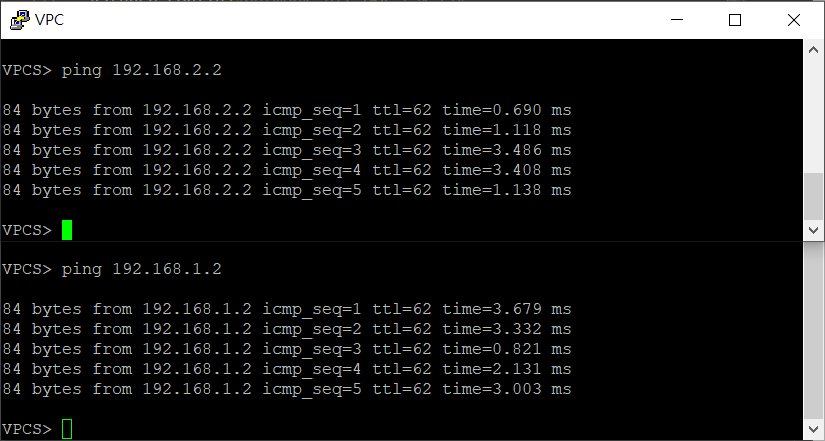

* [EIGRP (Enhanced Interior Gateway Routing Protocol)](https://github.com/linjiachi/Linux_note/blob/master/109-1/cisco/W8-20201104.md#eigrp-enhanced-interior-gateway-routing-protocol)
    - [特色](https://github.com/linjiachi/Linux_note/blob/master/109-1/cisco/W8-20201104.md#%E7%89%B9%E8%89%B2)
    - [封包類型](https://github.com/linjiachi/Linux_note/blob/master/109-1/cisco/W8-20201104.md#%E5%B0%81%E5%8C%85%E9%A1%9E%E5%9E%8B)
    - [資料存放表格](https://github.com/linjiachi/Linux_note/blob/master/109-1/cisco/W8-20201104.md#%E8%B3%87%E6%96%99%E5%AD%98%E6%94%BE%E8%A1%A8%E6%A0%BC)
    - [AD 值](https://github.com/linjiachi/Linux_note/blob/master/109-1/cisco/W8-20201104.md#ad-%E5%80%BC)
    - [RIP v.s EIGRP](https://github.com/linjiachi/Linux_note/blob/master/109-1/cisco/W8-20201104.md#rip-vs-eigrp)
    - [Neighbor](https://github.com/linjiachi/Linux_note/blob/master/109-1/cisco/W8-20201104.md#neighbor)
    - [Authentication](https://github.com/linjiachi/Linux_note/blob/master/109-1/cisco/W8-20201104.md#authentication)
    - [HW1](https://github.com/linjiachi/Linux_note/blob/master/109-1/cisco/W8-20201104.md#hw1)
    - [HW2](https://github.com/linjiachi/Linux_note/blob/master/109-1/cisco/W8-20201104.md#hw2)
    - [HW3](https://github.com/linjiachi/Linux_note/blob/master/109-1/cisco/W8-20201104.md#hw3)
---
# EIGRP (Enhanced Interior Gateway Routing Protocol)
### 特色
- 加強型內部閘門路徑協定
- IP header protocol：88
- 屬於 Hybrid Routing Protocol (混合型)，包含了Distance-Vector (距離向量) 與 Line-State (鏈路狀態) 的特性
- 採用擴張型更新演算法 (Diffusing-Update Algorithm, DUAL)
- 高級的 Distance Vector or Mixed
- 可變長度的網路遮罩 (Variable Length Subnet Mask, VLSM) and CIDR
- Metrics：Bandwidth、Delay、Load and Reliablity、MTUty
- trigger update 244.0.0.10 
- 群播，增量更新，可靠更新 

### 封包類型
1. Hello：用於建立和維持 Neighbor Hood
2. Update：用於傳送路由條目
3. Ack：用於實現可靠傳輸
4. Query：用於路由器丟失時，向鄰居發送路由請求
5. Reply：用於收到路由請求，給予回覆

### 資料存放表格
1. 鄰居表 (Neighbor Table)
2. 拓樸表 (Topology Table)
3. 路由表 (Routing Table)

### AD 值

-|AD值
-|-
static|1
EIGRP|90
OSPF|110
RIP|120

### RIP v.s EIGRP

RIP |EIGRP
:-:|:-:
維護成本高|維護成本低 (因為不會有路由表交換)
IP+UDP+RIP|IP+EIGRP

## Neighbor
* 架構圖：


**設定 IP**
```sh
//R1
R1(config)#int e0/0
R1(config-if)#ip addr 192.168.12.1 255.255.255.0
R1(config-if)#no shut

//R2
R2(config)#int e0/0
R2(config-if)#ip addr 192.168.12.2 255.255.255.0
R2(config-if)#no shut
R2(config-if)#int e0/1
R2(config-if)#ip addr 192.168.23.2 255.255.255.0
R2(config-if)#no shut

//R3
R3(config)#int e0/0
R3(config-if)#ip addr 192.168.23.3 255.255.255.0
R3(config-if)#no shut
```

**eigrp setting**
```sh
//R1
R1(config)#router eigrp 90
R1(config-router)#network 192.168.12.0 0.0.0.255
                                     # 
//R2
R2(config)#router eigrp 90
R2(config-router)#network 192.168.12.0 0.0.0.255
R2(config-router)#network 192.168.23.0 0.0.0.255

//R3
R3(config)#router eigrp 90
R3(config-router)#network 192.168.23.0 0.0.0.255

```
* 鄰居表
```sh
R2(config-router)#do sh ip eigrp nei
EIGRP-IPv4 Neighbors for AS(90)
H   Address                 Interface              Hold Uptime   SRTT   RTO  Q  Seq
                                                   (sec)         (ms)       Cnt Num
1   192.168.23.3            Et0/1                    11 00:03:15   10   100  0  3
0   192.168.12.1            Et0/0                    14 00:04:12    9   100  0  3
```
* 拓樸表
```sh
R2(config)#do sh ip eigrp topology
EIGRP-IPv4 Topology Table for AS(90)/ID(192.168.23.2)
Codes: P - Passive, A - Active, U - Update, Q - Query, R - Reply,
       r - reply Status, s - sia Status

P 192.168.23.0/24, 1 successors, FD is 281600
        via Connected, Ethernet0/1
P 192.168.12.0/24, 1 successors, FD is 281600
        via Connected, Ethernet0/0
```
* 路由表
```sh
R1(config)#do sh ip route eigrp
Codes: L - local, C - connected, S - static, R - RIP, M - mobile, B - BGP
       D - EIGRP, EX - EIGRP external, O - OSPF, IA - OSPF inter area
       N1 - OSPF NSSA external type 1, N2 - OSPF NSSA external type 2
       E1 - OSPF external type 1, E2 - OSPF external type 2
       i - IS-IS, su - IS-IS summary, L1 - IS-IS level-1, L2 - IS-IS level-2
       ia - IS-IS inter area, * - candidate default, U - per-user static route
       o - ODR, P - periodic downloaded static route, H - NHRP, l - LISP
       a - application route
       + - replicated route, % - next hop override

Gateway of last resort is not set

D     192.168.23.0/24 [90/307200] via 192.168.12.2, 00:07:37, Ethernet0/0
```
**R1 ping R3**


## Authentication
* 在 Neighbor 之間設置密碼

**R1**
```sh
R1(config)#key chain mychain
R1(config-keychain)#key 90
R1(config-keychain-key)#key-string cisco
R1(config-keychain-key)#int e0/0
R1(config-if)#ip authentication key-chain eigrp 90 mychain
R1(config-if)#ip authentication mode eigrp 90 md5
```

**R2**
```sh
R2(config)#key chain mychain
R2(config-keychain)#key 90
R2(config-keychain-key)#key-string cisco
R2(config-keychain-key)#int e0/0
R2(config-if)#ip authentication key-chain eigrp 90 mychain
R2(config-if)#ip authentication mode eigrp 90 md5
```
**結果**
* R1


* R2


### HW1
* 題目：PC1 ping PC2，走 R1、R2 這條；PC2 ping PC1，走 R2、R4、R3、R1 這條
* 架構圖

    

**設定 IP**
```sh
//R1
R1(config)#int e0/0
R1(config-if)#ip addr 12.1.1.1 255.255.255.0
R1(config-if)#no shut
R1(config)#int e0/1
R1(config-if)#ip addr 13.1.1.1 255.255.255.0
R1(config-if)#no shut
R1(config-if)#int e0/2
R1(config-if)#ip addr 192.168.1.1 255.255.255.0
R1(config-if)#no shut

//R2
R2(config)#int e0/0
R2(config-if)#ip addr 12.1.1.2 255.255.255.0
R2(config-if)#no shut
R2(config)#int e0/1
R2(config-if)#ip addr 24.1.1.2 255.255.255.0
R2(config-if)#no shut
R2(config-if)#int e0/2
R2(config-if)#ip addr 192.168.2.1 255.255.255.0
R2(config-if)#no shut

//R3
R3(config)#int e0/0
R3(config-if)#ip addr 34.1.1.3 255.255.255.0
R3(config-if)#no shut
R3(config-if)#int e0/1
R3(config-if)#ip addr 13.1.1.3 255.255.255.0
R3(config-if)#no shut

//R4
R4(config)#int e0/0
R4(config-if)#ip addr 24.1.1.4 255.255.255.0
R4(config-if)#no shut
R4(config-if)#int e0/1
R4(config-if)#ip addr 34.1.1.4 255.255.255.0
R4(config-if)#no shut

//PC1
VPCS> ip 192.168.1.2 /24 192.168.1.1
Checking for duplicate address...
PC1 : 192.168.1.2 255.255.255.0 gateway 192.168.1.1

//PC2
VPCS> ip 192.168.2.2 /24 192.168.2.1
Checking for duplicate address...
PC1 : 192.168.2.2 255.255.255.0 gateway 192.168.2.1
```

**設定靜態路由**
```sh
R1(config)#ip route 192.168.2.0 255.255.255.0 e0/0 12.1.1.2

R2(config)#ip route 192.168.1.0 255.255.255.0 e0/1 24.1.1.4

R4(config)#ip route 192.168.1.0 255.255.255.0 e0/1 34.1.1.3

R3(config)#ip route 192.168.1.0 255.255.255.0 e0/1 13.1.1.1
```

**PC1 ping PC2**
* PC1 request - PC2 reply


**PC2 ping PC1**
* PC2 request - PC1 reply


### HW2
* 題目：PC1、PC2 利用 DHCP 取得 IP，讓 PC1、PC2 互 ping 
* 架構圖

    

**設定 IP**
```sh
//R1
R1(config)#int e0/0
R1(config-if)#ip addr 12.1.1.1 255.255.255.0
R1(config-if)#no shut
R1(config-if)#int e0/1
R1(config-if)#ip addr 192.168.1.1 255.255.255.0
R1(config-if)#no shut

//R2
R2(config)#int e0/0
R2(config-if)#ip addr 12.1.1.2 255.255.255.0
R2(config-if)#no shut
R2(config-if)#int e0/1
R2(config-if)#ip addr 192.168.2.1 255.255.255.0
R2(config-if)#no shut
```

**設定 DHCP 伺服器**
```sh
//R1
R1(config)#ip dhcp pool DHCP
R1(dhcp-config)#network 192.168.1.0 /24
R1(dhcp-config)#default-router 192.168.1.1
R1(dhcp-config)#dns-server 8.8.8.8

//R2
R2(config)#ip dhcp pool DHCP
R2(dhcp-config)#network 192.168.2.0 /24
R2(dhcp-config)#default-router 192.168.2.1
R2(dhcp-config)#dns-server 8.8.8.8
```

**PC 利用 DHCP 取得 IP**
```sh
//PC1
VPCS> ip dhcp
DDORA IP 192.168.1.2/24 GW 192.168.1.1

//PC2
VPCS> ip dhcp
DDORA IP 192.168.2.2/24 GW 192.168.2.1
```

**設置靜態路由**
```sh
//R1
R1(config)#ip route 192.168.2.0 255.255.255.0 e0/0 12.1.1.2

//R2
R2(config)#ip route 192.168.1.0 255.255.255.0 e0/0 12.1.1.1
```

**PC1、PC2 互 ping**



### HW3
* 題目：RIP 設定，PC1、PC2 互 ping
* 架構圖

    

**設定 IP**
```sh
//R1
R1(config)#int e0/0
R1(config-if)#ip addr 12.1.1.1 255.255.255.0
R1(config-if)#no shut
R1(config-if)#int e0/1
R1(config-if)#ip addr 13.1.1.1 255.255.255.0
R1(config-if)#no shut
R1(config-if)#int e0/2
R1(config-if)#ip addr 192.168.1.1 255.255.255.0
R1(config-if)#no shut

//R2
R2(config)#int e0/0
R2(config-if)#ip addr 12.1.1.2 255.255.255.0
R2(config-if)#no shut
R2(config-if)#int e0/1
R2(config-if)#ip addr 24.1.1.2 255.255.255.0
R2(config-if)#no shut

//R3
R3(config)#int e0/0
R3(config-if)#ip addr 34.1.1.3 255.255.255.0
R3(config-if)#no shut
R3(config-if)#int e0/1
R3(config-if)#ip addr 13.1.1.3 255.255.255.0
R3(config-if)#no shut

//R4
R4(config)#int e0/0
R4(config-if)#ip addr 24.1.1.4 255.255.255.0
R4(config-if)#no shut
R4(config-if)#int e0/1
R4(config-if)#ip addr 34.1.1.4 255.255.255.0
R4(config-if)#no shut
R4(config-if)#int e0/2
R4(config-if)#ip addr 192.168.2.1 255.255.255.0
R4(config-if)#no shut

//PC1
VPCS> ip 192.168.1.2 /24 192.168.1.1
Checking for duplicate address...
PC1 : 192.168.1.2 255.255.255.0 gateway 192.168.1.1

//PC2
VPCS> ip 192.168.2.2 /24 192.168.2.1
Checking for duplicate address...
PC1 : 192.168.2.2 255.255.255.0 gateway 192.168.2.1
```

**設定 RIP**
```sh
//R1
R1(config-if)#router rip
R1(config-router)#network 12.0.0.0
R1(config-router)#network 13.0.0.0
R1(config-router)#network 192.168.1.0

//R2
R2(config-if)#router rip
R2(config-router)#network 12.0.0.0
R2(config-router)#network 24.0.0.0

//R3
R3(config-if)#router rip
R3(config-router)#network 34.0.0.0
R3(config-router)#network 13.0.0.0

//R4
R4(config-if)#router rip
R4(config-router)#network 24.0.0.0
R4(config-router)#network 34.0.0.0
R4(config-router)#network 192.168.2.0
```

**PC1、PC2 互 ping**


