# MidtermTest
## Test1
**題目：static routing，PC1 ping PC2，走 R1、R2 這條；PC2 ping PC1，走 R2、R4、R3、R1 這條**
* 拓樸圖

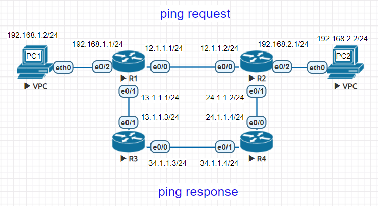

**設定 IP**
```sh
//R1
R1(config)#int e0/0
R1(config-if)#ip addr 12.1.1.1 255.255.255.0
R1(config-if)#no shut
R1(config)#int e0/1
R1(config-if)#ip addr 13.1.1.1 255.255.255.0
R1(config-if)#no shut
R1(config-if)#int e0/2
R1(config-if)#ip addr 192.168.1.1 255.255.255.0
R1(config-if)#no shut

//R2
R2(config)#int e0/0
R2(config-if)#ip addr 12.1.1.2 255.255.255.0
R2(config-if)#no shut
R2(config)#int e0/1
R2(config-if)#ip addr 24.1.1.2 255.255.255.0
R2(config-if)#no shut
R2(config-if)#int e0/2
R2(config-if)#ip addr 192.168.2.1 255.255.255.0
R2(config-if)#no shut

//R3
R3(config)#int e0/0
R3(config-if)#ip addr 34.1.1.3 255.255.255.0
R3(config-if)#no shut
R3(config-if)#int e0/1
R3(config-if)#ip addr 13.1.1.3 255.255.255.0
R3(config-if)#no shut

//R4
R4(config)#int e0/0
R4(config-if)#ip addr 24.1.1.4 255.255.255.0
R4(config-if)#no shut
R4(config-if)#int e0/1
R4(config-if)#ip addr 34.1.1.4 255.255.255.0
R4(config-if)#no shut

//PC1
VPCS> ip 192.168.1.2 /24 192.168.1.1
Checking for duplicate address...
PC1 : 192.168.1.2 255.255.255.0 gateway 192.168.1.1

//PC2
VPCS> ip 192.168.2.2 /24 192.168.2.1
Checking for duplicate address...
PC1 : 192.168.2.2 255.255.255.0 gateway 192.168.2.1
```

**設定靜態路由**
```sh
R1(config)#ip route 192.168.2.0 255.255.255.0 e0/0 12.1.1.2

R2(config)#ip route 192.168.1.0 255.255.255.0 e0/1 24.1.1.4

R4(config)#ip route 192.168.1.0 255.255.255.0 e0/1 34.1.1.3

R3(config)#ip route 192.168.1.0 255.255.255.0 e0/1 13.1.1.1
```
**PC1 ping PC2**
* PC1 request - PC2 reply

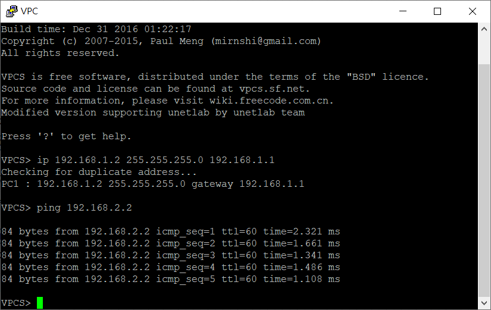

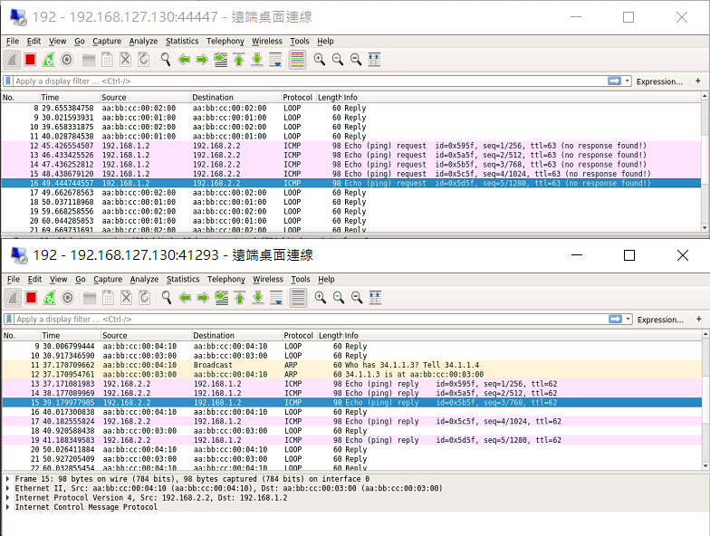

**PC2 ping PC1**
* PC2 request - PC1 reply

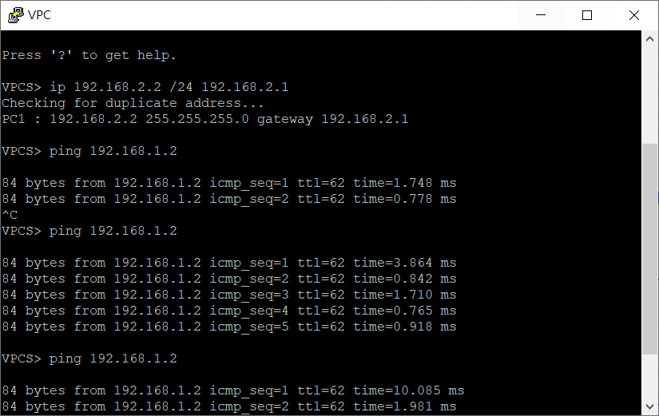

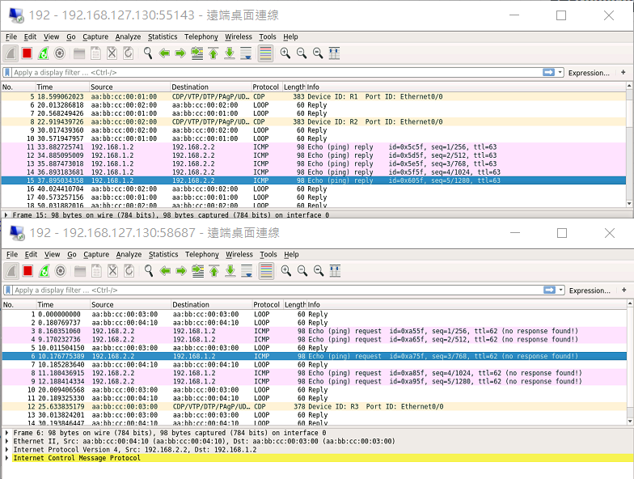

## Test2
**題目：讓 h1、h2 透過 DHCP server 取得 IP 和相關資訊，h1 可 ping h2**
* 拓樸圖

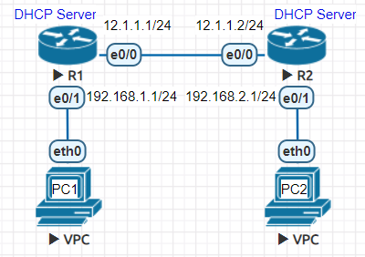

**設定 IP**
```sh
//R1
R1(config)#int e0/0
R1(config-if)#ip addr 12.1.1.1 255.255.255.0
R1(config-if)#no shut
R1(config-if)#int e0/1
R1(config-if)#ip addr 192.168.1.1 255.255.255.0
R1(config-if)#no shut

//R2
R2(config)#int e0/0
R2(config-if)#ip addr 12.1.1.2 255.255.255.0
R2(config-if)#no shut
R2(config-if)#int e0/1
R2(config-if)#ip addr 192.168.2.1 255.255.255.0
R2(config-if)#no shut
```

**設定 DHCP Server**
```sh
//R1
R1(config)#ip dhcp pool DHCP
R1(dhcp-config)#network 192.168.1.0 /24
R1(dhcp-config)#default-router 192.168.1.1
R1(dhcp-config)#dns-server 8.8.8.8

//R2
R2(config)#ip dhcp pool DHCP
R2(dhcp-config)#network 192.168.2.0 /24
R2(dhcp-config)#default-router 192.168.2.1
R2(dhcp-config)#dns-server 8.8.8.8
```

**PC 利用 DHCP 取得 IP**
```sh
//PC1
VPCS> ip dhcp
DDORA IP 192.168.1.2/24 GW 192.168.1.1

//PC2
VPCS> ip dhcp
DDORA IP 192.168.2.2/24 GW 192.168.2.1
```

**設置靜態路由**
```sh
//R1
R1(config)#ip route 192.168.2.0 255.255.255.0 e0/0 12.1.1.2

//R2
R2(config)#ip route 192.168.1.0 255.255.255.0 e0/0 12.1.1.1
```

**PC1、PC2 互 ping**
* PC1 ping PC2

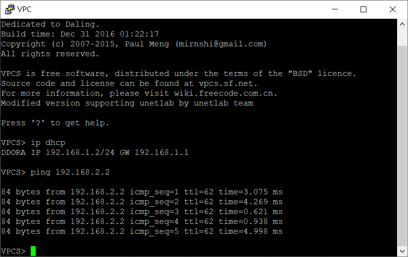

* PC2 ping PC1


## Test3
**題目：使用 RIP 和 EIGRP 讓 192.168.1.1 可 ping 192.168.2.1**
* 拓樸圖

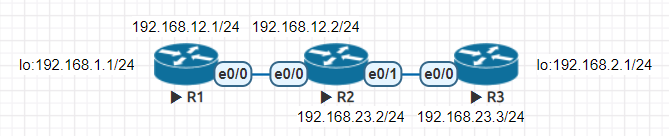

**設定 IP**
```sh
//R1
R1(config)#int e0/0
R1(config-if)#ip addr 192.168.12.1 255.255.255.0
R1(config-if)#no shut
R1(config-if)#int lo 0
R1(config-if)#ip addr 192.168.1.1 255.255.255.0

//R2
R2(config)#int e0/0
R2(config-if)#ip addr 192.168.12.2 255.255.255.0
R2(config-if)#no shut
R2(config-if)#int e0/1
R2(config-if)#ip addr 192.168.23.2 255.255.255.0
R2(config-if)#no shut

//R3
R3(config)#int e0/0
R3(config-if)#ip addr 192.168.23.3 255.255.255.0
R3(config-if)#no shut
R3(config-if)#int lo 0
R3(config-if)#ip addr 192.168.2.1 255.255.255.0
```

**設定 EIGRP**
```sh
//R1
R1(config-if)#router eigrp 90
R1(config-router)#network 192.168.12.0
R1(config-router)#network 192.168.1.0
R1(config-router)#auto-summary

//R2
R2(config-if)#router eigrp 90
R2(config-router)#network 192.168.12.0
R2(config-router)#network 192.168.23.0
R2(config-router)#auto-summary

//R3
R3(config-router)#router eigrp 90
R3(config-router)#network 192.168.23.0
R3(config-router)#network 192.168.2.0
R3(config-router)#auto-summary
```

**R1 ping 192.168.2.1**

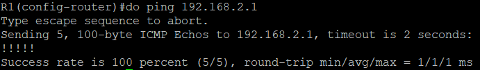

**R3 ping 192.168.1.1**

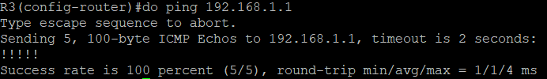

## Test4
**題目：使用浮動路由，讓 R1 和 R2 斷線後，h1->R1->R3->R2->h2**
* 拓樸圖

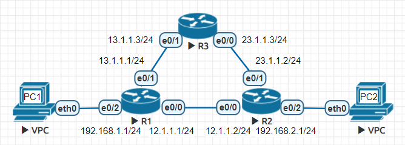

**設定 IP**
```sh
//R1
R1(config)#int e0/0
R1(config-if)#ip addr 12.1.1.1 255.255.255.0
R1(config-if)#no shut
R1(config-if)#int e0/1
R1(config-if)#ip addr 13.1.1.1 255.255.255.0
R1(config-if)#no shut
R1(config-if)#int e0/2
R1(config-if)#ip addr 192.168.1.1 255.255.255.0
R1(config-if)#no shut

//R2
R2(config)#int e0/0
R2(config-if)#ip addr 12.1.1.2 255.255.255.0
R2(config-if)#no shut
R2(config-if)#int e0/1
R2(config-if)#ip addr 23.1.1.2 255.255.255.0
R2(config-if)#no shut
R2(config-if)#int e0/2
R2(config-if)#ip addr 192.168.2.1 255.255.255.0
R2(config-if)#no shut

//R3
R3(config)#int e0/0
R3(config-if)#ip addr 23.1.1.3 255.255.255.0
R3(config-if)#no shut
R3(config)#int e0/1
R3(config-if)#ip addr 13.1.1.3 255.255.255.0
R3(config-if)#no shut

//PC1
VPCS> ip 192.168.1.2 /24 192.168.1.1
Checking for duplicate address...
PC1 : 192.168.1.2 255.255.255.0 gateway 192.168.1.1

//PC2
VPCS> ip 192.168.2.2 /24 192.168.2.1
Checking for duplicate address...
PC1 : 192.168.2.2 255.255.255.0 gateway 192.168.2.1
```

**設定浮動路由**
```sh
//R1
R1(config)#ip route 23.1.1.0 255.255.255.0 e0/0 12.1.1.2
R1(config)#ip route 23.1.1.0 255.255.255.0 e0/1 13.1.1.3 10
R1(config)#ip route 192.168.2.0 255.255.255.0 e0/1 13.1.1.3

//R2
R2(config)#ip route 13.1.1.0 255.255.255.0 e0/0 12.1.1.1
R2(config)#ip route 13.1.1.0 255.255.255.0 e0/1 23.1.1.3 10
R2(config)#ip route 192.168.1.0 255.255.255.0 e0/1 23.1.1.3

//R3
R3(config)#ip route 192.168.1.0 255.255.255.0 e0/1 13.1.1.1
R3(config)#ip route 192.168.2.0 255.255.255.0 e0/0 23.1.1.2
```
**R1、R2 shut e0/0**
```sh
//R1
R1(config)#int e0/0
R1(config-if)#shut

//R2
R2(config)#int e0/0
R2(config-if)#shut
```

**PC1 ping**

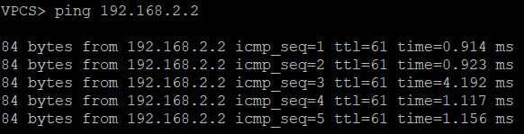

**PC2 ping**

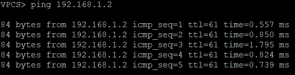