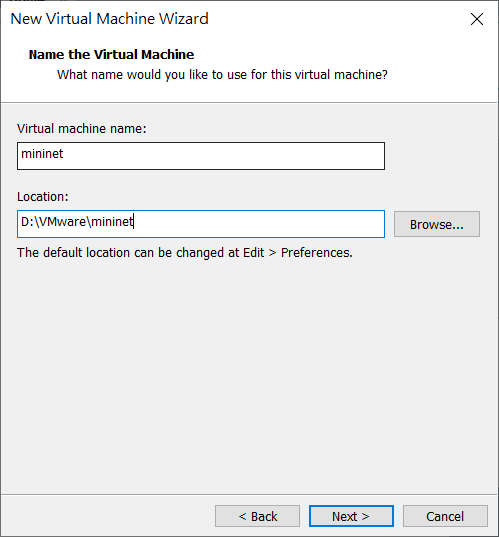
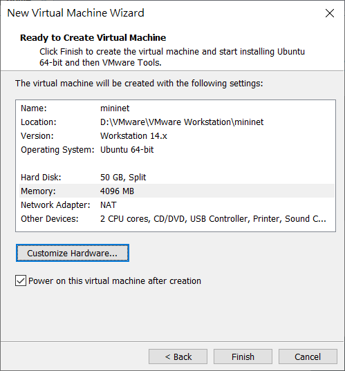
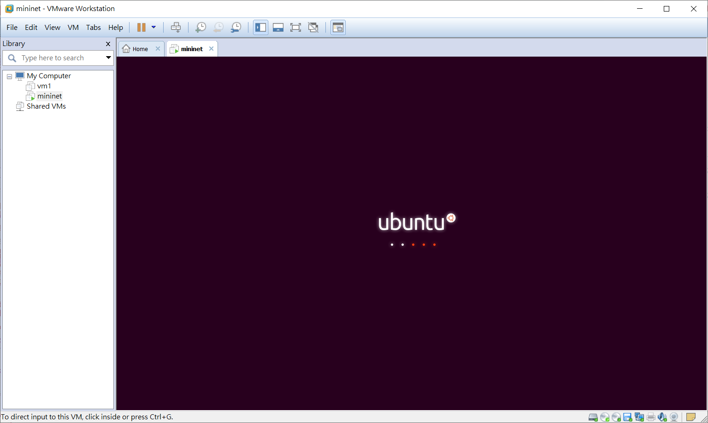
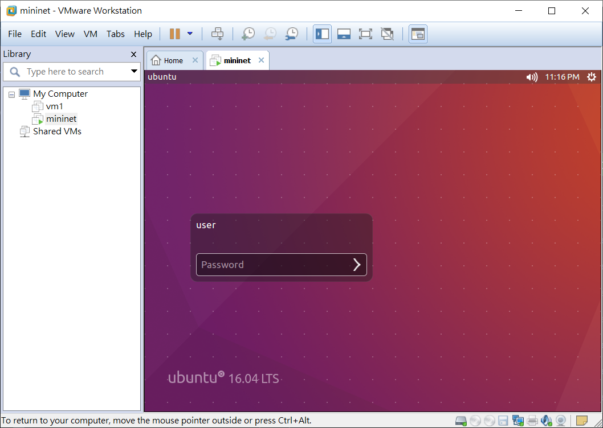

* [網路模擬與分析]()
    - [課程]()
* [Mininet]()
    - [Mininet install]()
    - [Mininet 指令]()
    - [Mininet 實作]()
---

# 網路模擬與分析
## 課程
* telegram 課程群組：nqucsie2021mininet
* 線上學習 mininet 相關課程：[软件定义网络技术,SDN - bilibili](https://www.bilibili.com/video/BV1y4411t71s?from=search&seid=4133657751863872964)、[SDN系列学习课程-OpenFlow-Ryu-Mininet - bilibili](https://www.bilibili.com/video/BV1ft4y1a7ip?from=search&seid=4133657751863872964)
- 期中：操作與課堂上教過的範例
- 期末：課堂筆記 + 報告論文 (與網路或 mininet 有關)

# Mininet
mininet 可以說是一個 open virtualization，一個可以透過一些虛擬終端機、路由器、交換器等連接創建虛擬網路拓樸的平台，因此可以輕易的在自己的個人電腦中創作支援 SDN 的區域網路，在裡面創造出的虛擬的 host 並以真實電腦般發送封包，且可以使用 SSH(Secure Shell) 登錄虛擬 host 中操作。

**虛擬化**

* 計算(computation)
* 儲存(storage)
* 網路(network)

## Mininet install
1. iso 檔 install：[ubuntu 16.04](https://www.ubuntu-tw.org/modules/tinyd0/)
2. 可以安裝在 VMware、VM Virtualbox

* 在 VMware 新增一台 Ubuntu 虛擬機


選擇剛下載的 Ubuntu 16.04 映像檔


設定使用者名稱和密碼


設定虛擬機名稱及儲存位置



設定虛擬硬碟大小


點擊 Customize Hardware... 設定更多



點擊 Memory 設定為 4GB、Processors 設定為 2







新增一台 Ubuntu 虛擬機，完成！

3. mininet install：[mininet/mininet](https://github.com/mininet/mininet)

* 開啟 Terminal
    - 設定 root 密碼：`sudo passwd root`，`su` 使用超級使用者 root
    - 安裝 git：`apt install git`
    - 下載 mininet：`git clone https://github.com/mininet/mininet`
    - 進到 mininet 資料夾，並安裝所有套件：`cd mininet/`、`util/install.sh -a`
        - `-a`：安裝全部的 package
        - `-h`：help
    - 出現 `Enjoy Mininet！` 安裝完成

> * 若是出現 Unable not get lock /var/lib/dpkg/lock ...，執行 `rm -rf /var/lib/dpkg/lock`
> * 若是出現 Unable to fetch some archives, maybe run apt-get update or try with...，執行 `apt update`
> * 若是出現 Some index files failed to download. They have been ignored, or old...，執行 `apt install git --fix-missing`

## Mininet 指令
* `mn`：啟動 mininet
    - `mn -c`：清除未正常結束的 mininet 環境

* `mininet > [option]`：
    - `help`：顯示可執行動作
    - `exit`：離開 mininet
    - `xterm`：開啟 host 終端機，ex：`xterm h1 h2`

## Mininet 實作
1. 在 Terminal 中，以 root 的身分執行 `mn`

    

    * mn 的環境架構

        

2. 開啟兩台終端機：`xterm h1 h2`

    

    

3. 查看 IP，並測試互 ping

```sh
//h1
ifconfig
//h2
ifconfig
ping 10.0.0.1
```


4. 測試一個網頁

* h2 新增一個 `hi.htm`
```sh
root@ubuntu:~# echo "hi" > hi.htm
root@ubuntu:~# python -m SimpleHTTPServer 80
Serving HTTP on 0.0.0.0 port 80 ...
```
- `python -m SimpleHTTPServer 80`：啟動 www Server，利用 python SimpleHTTPServer 模組建立一個網頁伺服器，並開在 80 port
    - `-m`：module，模組

* h1 利用 `curl` 或 `firefox` 的方式查看網頁
```sh
root@ubuntu:/home/user/mininet# su - user
user@ubuntu:~$ curl http://10.0.0.2/hi.htm
hi
user@ubuntu:~$ firefox
```
**curl**


**firefox**


---
參考資料：
- [mininet/mininet - github](https://github.com/mininet/mininet)
- [Lab 1-mininet介紹、安裝與使用方法 - SDN 軟體定義網路](https://sites.google.com/site/sdnruantidingyiwanglu/vmware-xia-zai-yu-an-zhuang/mininet)