* [Ansible-playbook 遠端配置]()
    - [Ansible-playbook 格式]()
    - [使用環境]()
        - [拓樸圖]()
    - [環境設定]()
* [Mininet]()
  - [Mininet 指令]()
* [Iperf]()
  - [簡易測試網路效能]()
    - [實驗環境]()
    - [TCP/IP]()
    - [UDP/IP]()
  - [圖形化檢測 - gnuplot]()
    - [Ubuntu]()
    - [mininet]()

---
# Ansible-playbook 遠端配置
使用 ansible-playbook 腳本自動部署設定 PC2、PC3 的 IP

## Ansible-playbook 格式


## 使用環境
* EVE-Pro
* Ubuntu - Mininet

### 拓樸圖

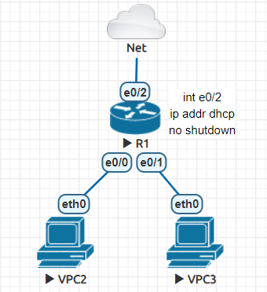

## 環境設定
**R1 setting**
```sh
R1(config)#username cisco password cisco
R1(config)#enable password cisco
R1(config)#ip domain-name test.com
R1(config)#crypto key generate rsa
The name for the keys will be: R1.test.com
Choose the size of the key modulus in the range of 360 to 4096 for your
  General Purpose Keys. Choosing a key modulus greater than 512 may take
  a few minutes.

How many bits in the modulus [512]: 1024
% Generating 1024 bit RSA keys, keys will be non-exportable...
[OK] (elapsed time was 0 seconds)

R1(config)#ip ssh version 2
R1(config)#line vty 0 4
R1(config-line)#login local
R1(config-line)#transport input ssh
R1(config-line)#int e0/2
R1(config-if)#ip addr dhcp
R1(config-if)#do sh ip int brief
Interface                  IP-Address      OK? Method Status                Protocol
Ethernet0/0                unassigned      YES unset  administratively down down
Ethernet0/1                unassigned      YES unset  administratively down down
Ethernet0/2                192.168.196.135 YES DHCP   up                    up  
Ethernet0/3                unassigned      YES unset  administratively down down
```

**Ubuntu test ssh cisco**
* 以 root 身分去執行
```sh
ssh cisco@192.168.196.135
```

**不是第一次登入 SSH，再次登入 SSH 可能會出現以下問題**

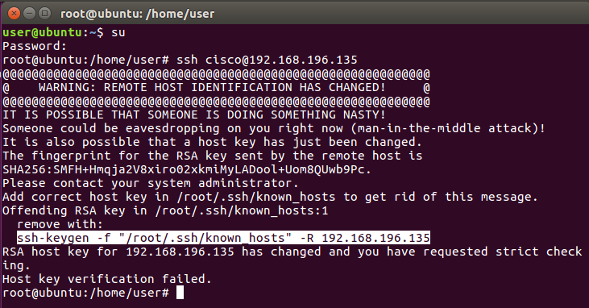

**解決辦法**

執行 `ssh-keygen -f "/root/.ssh/known_hosts" -R 192.168.196.135`，再執行 `ssh cisco@192.168.196.135`

**SSH Success**

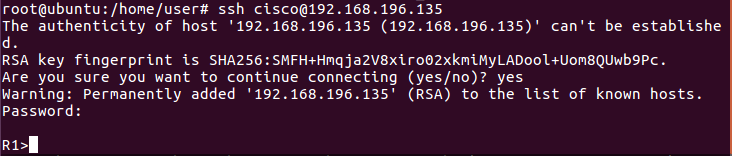

**Ubuntu install Ansible**
* 以 root 身分去執行
```sh
sudo apt update
sudo apt install software-properties-common
sudo apt-add-repository --yes --update ppa:ansible/ansible
sudo apt install ansible
```

**新建 cisco 資料夾與檔案 hosts、config_cisco.yml**
```sh
mkdir cisco
cd cisco/
gedit hosts config_cisco.yml
```

* hosts
```sh
[cisco]
192.168.196.135 ansible_connection=local    # cisco R1 的 IP
```

* config_cisco.yml
```yml
- hosts: 192.168.196.135    # cisco R1 的 IP
  gather_facts: yes
  vars:
    - cisco_host_ip: 192.168.196.135    # cisco R1 的 IP
      ssh_username: cisco
      ssh_password: cisco
      enable_open: yes
      enable_password: cisco
  roles:
     - config_cisco
```

**建立一個 config_cisco、tasks 資料夾和 main.yml 檔案**
```sh
mkdir config_cisco
cd config_cisco/
mkdir tasks
cd tasks/
gedit main.yml
```

* main.yml
```yml
- name: cisco_description_ssh_certification
  set_fact:
    cisco_verification:
      host: "{{cisco_host_ip}}"
      username: "{{ssh_username}}"
      password: "{{ssh_password}}"
      authorize: "{{enable_open}}"
      auth_pass: "{{enable_password}}"

- name: config e0/0
  ios_config:
      provider: "{{cisco_verification}}"
      parents:  interface Ethernet 0/0     
      lines:
        - ip addr 192.168.1.254 255.255.255.0
        - no shut

- name: config e0/1
  ios_config:
      provider: "{{cisco_verification}}"
      parents:  interface Ethernet 0/1     
      lines:
        - ip addr 192.168.2.254 255.255.255.0
        - no shut

- name: show ip interface
  ios_command:
      provider: "{{cisco_verification}}"
      commands: show ip interface brief
  register: show_ip_log

- name: show_ip_log
  debug:
    var: show_ip_log.stdout_lines
  with_items: show_ip_log.results
```

**回到 cisco 資料夾，並使用 `tree` 查看文件，並執行部署指令**

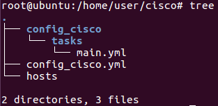

```sh
ansible-playbook config_cisco.yml -i hosts
```

**ansible 部署成功**

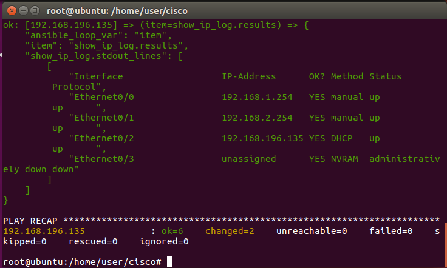

**R1 查看 IP**

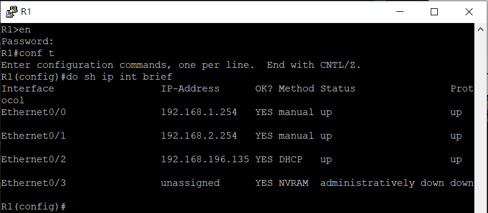

> 以後如果要更改 IP，只需更改 main.yml 檔

# Mininet
Mininet 是一個 closed environment (封閉式環境)

## Mininet 指令
* `xterm`：開啟 host 終端機
* `net`：顯示網路拓樸，示意圖如下

  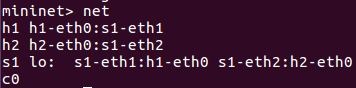

  

**使用 h1 的指令有兩種方式，在 h1 終端機下執行或在 mininet 下執行** 

**1. h1**

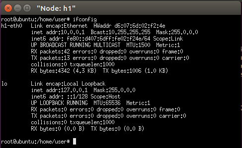

**2. mininet：`h1 ifconfig`**

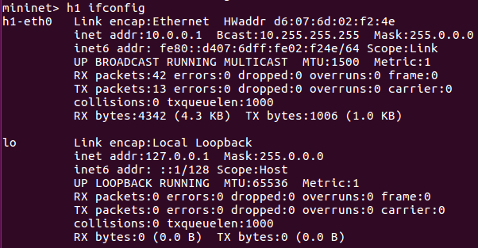

* `link h1 s1 down`：控制 s1 到 h1 的連線狀態 (down：關閉、up：開啟)
* `sh ls`：使用 `sh(share)` 後面加上 linux 指令，可以在 mininet 下執行 linux
* `pingall`：測試目前的網路狀態

  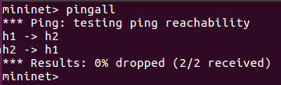

# Iperf
簡易測試網路效能的工具，是一個 TCP/IP 和 UDP/IP 的性能檢測工具，能供提供網路吞吐信息、震動、丟包率等訊息，進而幫助我們測試網路性能。

## 簡易測試網路效能
### 實驗環境
* h1 (Client)
* h2 (Server)

### TCP/IP
**h2**
* `iperf -s -i 1`：TCP 伺服器來監測流量
  - `-s`：以 Server 模式啟動
  - `-i 1`：sec，以秒為單位顯示報告間隔

**h1**
* `iperf -c 10.0.0.2 -t 10`
  - `-c`：以 Client 模式啟動，後面接 Server IP
  - `-t 10`：測試時間，預設是 10 秒

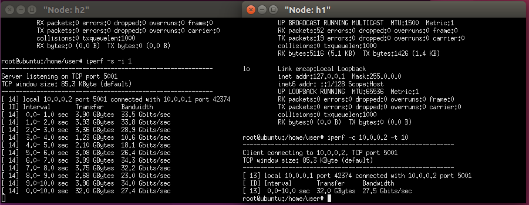

### UDP/IP
**h2**
* `iperf -s -i 1 -u`：UDP 伺服器來監測流量
  - `-u`：使用 UDP 協議

**h1**
* `iperf -c 10.0.0.2 -t 10 -u -b 100M`
  - `-u`：使用 UDP 協議
  - `-b 100M`：Bandwidth，傳輸速率

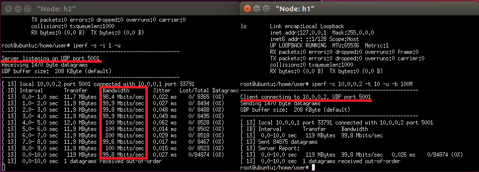


**若是沒有指定 Port 號，UDP 為預設 Port 5001，但有時為了區分方便會設置不同的 Port 號**

**h2**
* `iperf -s -i 1 -u -p 5555`
* `iperf -s -i 1 -u -p 6666`
  - `-p`：設置 Port 號

**h1**
* `iperf -c 10.0.0.2 -u -b 50M -t 10 -p 5555`
* `iperf -c 10.0.0.2 -u -b 100M -t 10 -p 6666`

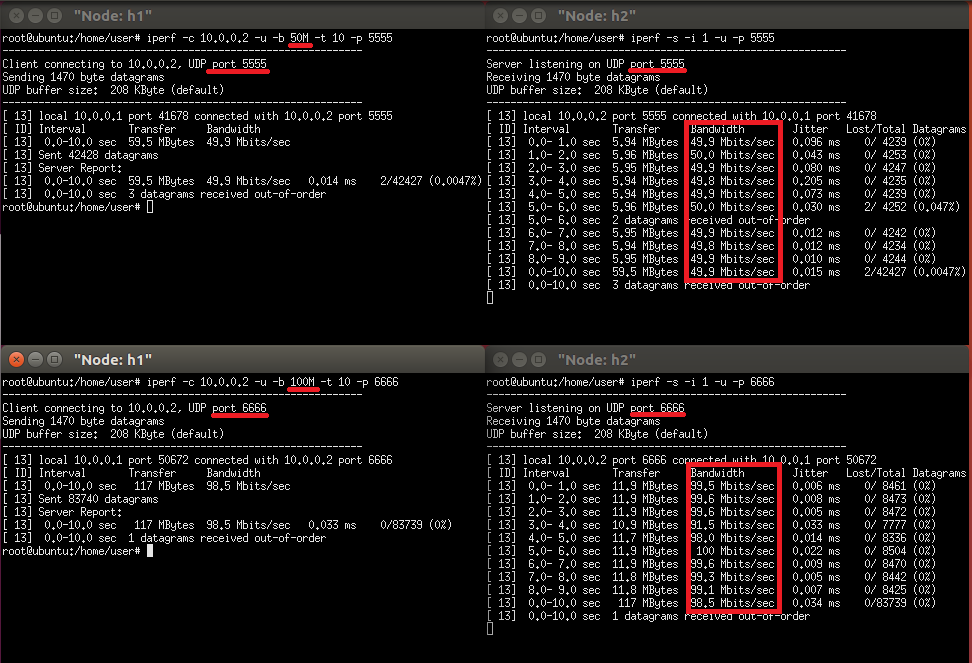

## 圖形化檢測 - gnuplot
### Ubuntu 
* 安裝繪圖軟體：`apt install gnuplot`
### mininet
**h2 將訊息儲存在檔案**
```sh
iperf -s -i 1 -u -p 5555 > udp5555
```

**h1**
```sh
iperf -c 10.0.0.2 -u -b 100M -t 15 -p 5555
```

**h2**

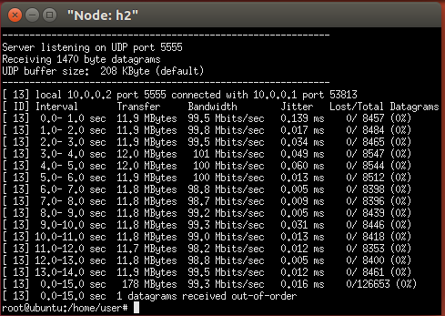

* `cat udp5555 | grep sec | head -n 14 | tr "-" " " | awk '{print $4,$8}' > result.txt`
  - `grep sec`：因為要取 Interval 和 Bandwidth 的的值，而他們的共同特徵為 sec，故使用其區分
  - `head -n 14`：取前 14 筆數據
  - `tr "-" " "`：將 - 取代成空白
  - `awk '{print $4,$8}'`：取第四個和第八個值

**Ubuntu**
```sh
root@ubuntu:/home/user# gnuplot
gnuplot> plot "result.txt"
```
* `set yrange [0:110]`：設置 y 範圍從 0-110
* `set ytics 0,10,110`：設置 0-110 以 10 等分為間隔
* `set ylabel "Throughput (Mbits/sec)"`：設置 y 軸名稱
* `set xrange [0:15]`：設置 x 範圍從 0-15
* `set xtics 0,1,15`：設置 0-15 以 1 等分為間隔
* `set xlabel "Time (sec)"`：設置 x 軸名稱
* `set title "UDP Throughput"`：設置圖的名稱
* `plot "result.txt" with linespoints`：讓數據由點和線連在一起
* `set terminal "gif"`：將結果輸出成 Gif 格式
* `set output "result.gif`：將結果圖儲存並命名為 result.gif
* `replot`：繪出結果

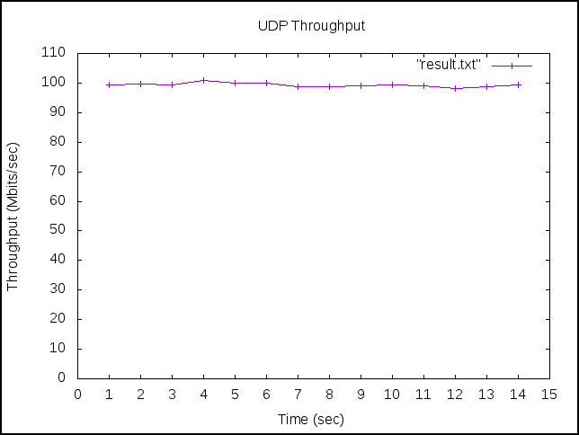

---
參考資料：
- [Installing Ansible on Ubuntu - Documentation](https://docs.ansible.com/ansible/latest/installation_guide/intro_installation.html)
- [Iperf 使用說明 - Martin Chang的部落格](https://neilchen0710.pixnet.net/blog/post/80368013-iperf-%E8%A8%AD%E5%AE%9A-(%E8%BD%89%E8%B2%BC))