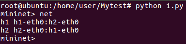

* [Mininet]()
    - [建立一個網路拓樸]()
    - [Gnuplot - 繪出兩筆數據]()
      - [Ubuntu]()
      - [Mininet]()
    - [使用腳本建立 Mininet]()
      - [簡易建立 h1、h2]()
      - [建立 h1、h2、r (router)]()
      - [建立 h1、h2、r 並設定好網路]()
      - [Test - 讓 h1 可以 ping h2]()

---
# Mininet
## 建立一個網路拓樸
* `mn --link=tc,bw=10,delay='1ms',loss=0`：設定連線通道
  - `link=tc`：traffic control，流量控制
  - `bw=10`：bandwidth，設定頻寬為 10 Mbits
  - `delay='1ms'`：每條 link 則 delay 10 ms
  - `loss=0`：遺失封包為 0

**Ubuntu**
* 使用 root 超級使用者
```sh
root@ubuntu:/home/user# mn --link=tc,bw=10,delay='1ms',loss=1
mininet> h1 ping -c 1000 -i 0.01 h2
```


可以發現 packet loss 封包遺失率大約為 3%，是因為設定連線通道的遺失率為 1%，故 h1 ping h2，成功率為 0.99 * 0.99 * 0.99 * 0.99 = 0.96059601，遺失率為 1 - 0.96059601 = 0.03940399，大約為 3%，示意圖如下


## Gnuplot - 繪出兩筆數據
### Ubuntu
```sh
root@ubuntu:/home/user# mn --link=tc,bw=10,delay='10ms',loss=0
mininet> xterm h1 h2 h1 h2
```
### Mininet
**h2**
* `iperf -s -i 1 -p 5555 | tee tcp`
* `iperf -s -i 1 -p 6666 -u | tee udp`
    - `tee udp`：將結果同時輸出到螢幕和檔案

**h1**
* `iperf -c 10.0.0.2 -t 200 -p 5555`
* `iperf -c 10.0.0.2 -t 200 -p 6666 -u -b 3M`

**從檔案中擷取數據**
* `cat tcp | grep sec | head -n 100 | tr "-" " " | awk '{print $4,$8}' > mytcp`
* `cat udp | grep sec | head -n 100 | tr "-" " " | awk '{print $4,$8}' > myudp`

**將數據圖形化呈現**
```sh
gnuplot
plot "mytcp" title "tcp-flow" with linespoints, "myudp" title "udp-flow" with linespoints
set yrange [0:10]
set ytics 0,1,10
set xrange [0:100]
set xtics 0,10,100
set ylabel "Throughput (Mbits/sec)"
set xlabel "Time (sec)"
set title "TCP v.s UDP"
set terminal gif
set output "result.gif"
```


## 使用腳本建立 Mininet
### 簡易建立 h1、h2
* `1.py`
```py
#!/usr/bin/env python
from mininet.cli import CLI
from mininet.net import Mininet
from mininet.link import Link,TCLink

if '__main__' == __name__:
  net = Mininet(link=TCLink)
  h1 = net.addHost('h1')
  h2 = net.addHost('h2')
  Link(h1, h2)
  net.build()
  CLI(net)    # CLI：Command Line Interface
  net.stop()
```



### 建立 h1、h2、r (router)
* `2.py`
```py
#!/usr/bin/env python
from mininet.cli import CLI
from mininet.net import Mininet
from mininet.link import Link,TCLink

if '__main__' == __name__:
  net = Mininet(link=TCLink)
  h1 = net.addHost('h1')
  h2 = net.addHost('h2')
  r = net.addHost('r')
  Link(h1, r)
  Link(h2, r)
  net.build()
  CLI(net)
  net.stop()
```


### 建立 h1、h2、r 並設定好網路
* 拓樸圖


* `3.py`
```py
#!/usr/bin/env python
from mininet.cli import CLI
from mininet.net import Mininet
from mininet.link import Link,TCLink

if '__main__' == __name__:
  net = Mininet(link=TCLink)
  h1 = net.addHost('h1')
  h2 = net.addHost('h2')
  r = net.addHost('r')
  Link(h1, r)
  Link(h2, r)
  net.build()
  h1.cmd("ifconfig h1-eth0 0")
  h1.cmd("ip addr add 192.168.1.1/24 brd + dev h1-eth0")
  h1.cmd("ip route add default via 192.168.1.254")
  h2.cmd("ifdonfig h2-eth0 0")
  h2.cmd("ip addr add 192.168.2.1/24 brd + dev h2-eth0")
  h2.cmd("ip route add default via 192.168.2.254")
  r.cmd("ifconfig r-eth0 0")
  r.cmd("ifconfig r-eth1 0")
  r.cmd("ip addr add 192.168.1.254 brd + dev r-eth0")
  r.cmd("ip addr add 192.168.2.254 brd + dev r-eth1")
  r.cmd("echo 1 > /proc/sys/net/ipv4/ip_forward")   # 預設為 0
  CLI(net)
  net.stop()
```


### Test - 讓 h1 可以 ping h2
* 拓樸圖


* `4.py`
```py
#!/usr/bin/env python
from mininet.cli import CLI
from mininet.net import Mininet
from mininet.link import Link,TCLink

if '__main__' == __name__:
  net = Mininet(link=TCLink)
  h1 = net.addHost('h1')
  h2 = net.addHost('h2')
  r1 = net.addHost('r1')
  r2 = net.addHost('r2')
  Link(h1, r1) 
  Link(r1, r2)
  Link(h2, r2)
  net.build()
  h1.cmd("ifconfig h1-eth0 0")
  h1.cmd("ip addr add 192.168.1.1/24 brd + dev h1-eth0")
  h1.cmd("ip route add default via 192.168.1.254")
  h2.cmd("ifconfig h2-eth0 0")
  h2.cmd("ip addr add 192.168.2.1/24 brd + dev h2-eth0")
  h2.cmd("ip route add default via 192.168.2.254")
  r1.cmd("ifconfig r1-eth0 0")
  r1.cmd("ip addr add 192.168.1.254/24 brd + dev r1-eth0")
  r1.cmd("ifconfig r1-eth1 0")
  r1.cmd("ip addr add 10.0.0.1/24 brd + dev r1-eth1")
  r1.cmd("ip route add 192.168.2.0/24 via 10.0.0.2")
  r1.cmd("echo 1 > /proc/sys/net/ipv4/ip_forward")
  r2.cmd("ifconfig r2-eth0 0")
  r2.cmd("ip addr add 10.0.0.2/24 brd + dev r2-eth0")  
  r2.cmd("ifconfig r2-eth1 0")
  r2.cmd("ip addr add 192.168.2.254/24 brd + dev r2-eth1")
  r2.cmd("ip route add 192.168.1.0/24 via 10.0.0.1")
  r2.cmd("echo 1 > /proc/sys/net/ipv4/ip_forward")
  CLI(net)
  net.stop()
```

