* [Mininet](https://github.com/linjiachi/Linux_note/blob/master/109-2/20210322.md#mininet)
    - [NAT 轉換](https://github.com/linjiachi/Linux_note/blob/master/109-2/20210322.md#nat-%E8%BD%89%E6%8F%9B)
    - [Bridge](https://github.com/linjiachi/Linux_note/blob/master/109-2/20210322.md#bridge)
      - [Test1 - 創建一個 Bridge 橋接器](https://github.com/linjiachi/Linux_note/blob/master/109-2/20210322.md#test1---%E5%89%B5%E5%BB%BA%E4%B8%80%E5%80%8B-bridge-%E6%A9%8B%E6%8E%A5%E5%99%A8)
      - [Test2 - 建立兩個 Bridge](https://github.com/linjiachi/Linux_note/blob/master/109-2/20210322.md#test2---%E5%BB%BA%E7%AB%8B%E5%85%A9%E5%80%8B-bridge)
      - [Test3 - 新增一個 router](https://github.com/linjiachi/Linux_note/blob/master/109-2/20210322.md#test3---%E6%96%B0%E5%A2%9E%E4%B8%80%E5%80%8B-router)
      - [Test4 - vlan](https://github.com/linjiachi/Linux_note/blob/master/109-2/20210322.md#test4---vlan)
    - [補充 - `sed`](https://github.com/linjiachi/Linux_note/blob/master/109-2/20210322.md#%E8%A3%9C%E5%85%85---sed)
---
# Mininet
# NAT 轉換
* 拓樸圖

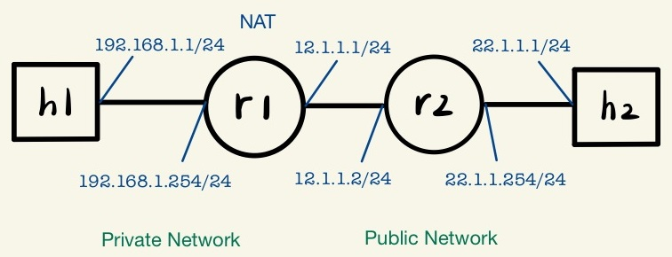

* `5.py` 
  - `iptables -t nat -A POSTROUTING -o r1-eth1 -s 192.168.1.0/24 -j MASQUERADE`：NAT 轉換
    - `POSTROUTING`：套用到所有外送封包
    - `-o`：Output
    - `-s`：Source Address

```py
#!/usr/bin/env python
from mininet.cli import CLI
from mininet.net import Mininet
from mininet.link import Link,TCLink

if '__main__' == __name__:
  net = Mininet(link=TCLink)
  h1 = net.addHost('h1')
  h2 = net.addHost('h2')
  r1 = net.addHost('r1')
  r2 = net.addHost('r2')
  Link(h1, r1) 
  Link(r1, r2)
  Link(h2, r2)
  net.build()
  h1.cmd("ifconfig h1-eth0 0")
  h1.cmd("ip addr add 192.168.1.1/24 brd + dev h1-eth0")
  h1.cmd("ip route add default via 192.168.1.254")
  h2.cmd("ifconfig h2-eth0 0")
  h2.cmd("ip addr add 22.1.1.1/24 brd + dev h2-eth0")
  h2.cmd("ip route add default via 22.1.1.254")
  r1.cmd("ifconfig r1-eth0 0")
  r1.cmd("ip addr add 192.168.1.254/24 brd + dev r1-eth0")
  r1.cmd("ifconfig r1-eth1 0")
  r1.cmd("ip addr add 12.1.1.1/24 brd + dev r1-eth1")
  r1.cmd("ip route add 22.1.1.0/24 via 12.1.1.2")
  r1.cmd("echo 1 > /proc/sys/net/ipv4/ip_forward")
  r1.cmd("iptables -t nat -A POSTROUTING -o r1-eth1 -s 192.168.1.0/24 -j MASQUERADE")
  r2.cmd("ifconfig r2-eth0 0")
  r2.cmd("ip addr add 12.1.1.2/24 brd + dev r2-eth0")  
  r2.cmd("ifconfig r2-eth1 0")
  r2.cmd("ip addr add 22.1.1.254/24 brd + dev r2-eth1")
  r2.cmd("ip route add 192.168.1.0/24 via 12.1.1.1")
  r2.cmd("echo 1 > /proc/sys/net/ipv4/ip_forward")
  CLI(net)
  net.stop()
```
**測試**
```sh
mininet> h1 ping 22.1.1.1
```
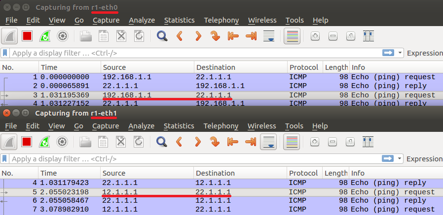


# Bridge
**Ubuntu**
```sh
apt install bridge-utils
```
## Test1 - 創建一個 Bridge 橋接器
* 拓樸圖

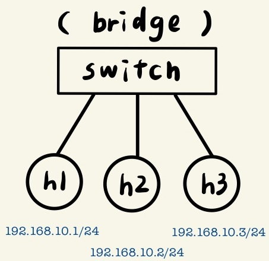

* `1.py`
```py
#!/usr/bin/env python
from mininet.cli import CLI
from mininet.net import Mininet
from mininet.link import Link,TCLink

if '__main__' == __name__:
  net = Mininet(link=TCLink)
  h1 = net.addHost('h1')
  h2 = net.addHost('h2')
  h3 = net.addHost('h3')
  br1 = net.addHost('br1')
  net.addLink(h1, br1)
  net.addLink(h2, br1)
  net.addLink(h3, br1)
  net.build()
  h1.cmd("ifconfig h1-eth0 0")
  h2.cmd("ifconfig h2-eth0 0")
  h3.cmd("ifconfig h3-eth0 0")
  br1.cmd("ifconfig br1-eth0 0")
  br1.cmd("ifconfig br1-eth1 0")
  br1.cmd("ifconfig br1-eth2 0")
  br1.cmd("brctl addbr mybr")
  br1.cmd("brctl addif mybr br1-eth0")
  br1.cmd("brctl addif mybr br1-eth1")
  br1.cmd("brctl addif mybr br1-eth2")
  br1.cmd("ifconfig mybr up")
  h1.cmd("ip address add 192.168.10.1/24 dev h1-eth0")
  h2.cmd("ip address add 192.168.10.2/24 dev h2-eth0")
  h3.cmd("ip address add 192.168.10.3/24 dev h3-eth0")
  CLI(net)
  net.stop()
```
**測試**

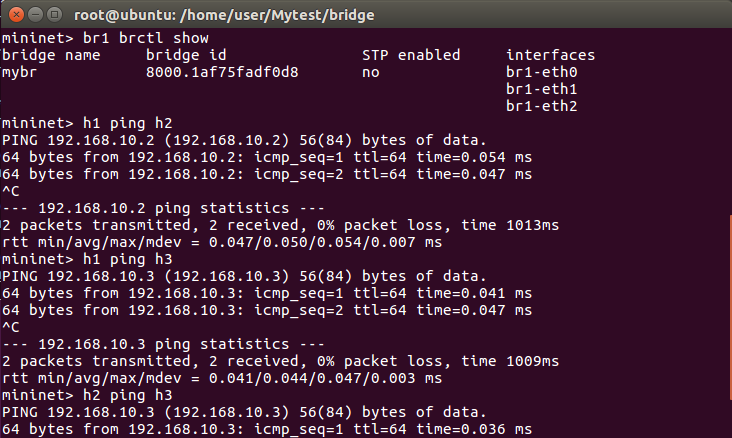

**h2** 
* `tcpdump`：擷取通過某網路介面的封包
```sh
tcpdump -i h2-eth0
```
> 當 h1 ping h3，h2 不會監聽到任何的訊息

## Test2 - 建立兩個 Bridge
* 拓樸圖

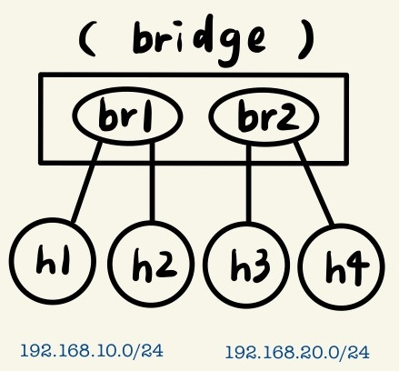

* `2.py`
```py
#!/usr/bin/env python
from mininet.cli import CLI
from mininet.net import Mininet
from mininet.link import Link,TCLink

if '__main__' == __name__:
  net = Mininet(link=TCLink)
  h1 = net.addHost('h1')
  h2 = net.addHost('h2')
  h3 = net.addHost('h3')
  h4 = net.addHost('h4')
  br1 = net.addHost('br1')
  Link(h1, br1) 
  Link(h2, br1)
  Link(h3, br1)
  Link(h4, br1)
  net.build()
  h1.cmd("ifconfig h1-eth0 0")
  h2.cmd("ifconfig h2-eth0 0")
  h3.cmd("ifconfig h3-eth0 0")
  h4.cmd("ifconfig h4-eth0 0")
  br1.cmd("ifconfig br1-eth0 0")
  br1.cmd("ifconfig br1-eth1 0")
  br1.cmd("ifconfig br1-eth2 0")
  br1.cmd("ifconfig br1-eth3 0")
  br1.cmd("brctl addbr mybr1")
  br1.cmd("brctl addbr mybr2")
  br1.cmd("brctl addif mybr1 br1-eth0")
  br1.cmd("brctl addif mybr1 br1-eth1")
  br1.cmd("brctl addif mybr2 br1-eth2")
  br1.cmd("brctl addif mybr2 br1-eth3")
  br1.cmd("ifconfig mybr1 up")
  br1.cmd("ifconfig mybr2 up")
  h1.cmd("ip addr add 192.168.10.1/24 brd + dev h1-eth0")
  h2.cmd("ip addr add 192.168.10.2/24 brd + dev h2-eth0")
  h3.cmd("ip addr add 192.168.20.1/24 brd + dev h3-eth0")
  h4.cmd("ip addr add 192.168.20.2/24 brd + dev h4-eth0")
  CLI(net)
  net.stop()
```
**測試**
* h1 可以 ping h2，但不能 ping h3、h4；h3 可以 ping h4，但不能 ping h1、h2

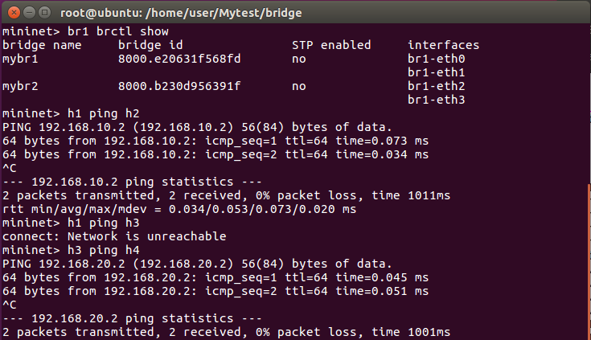
 

## Test3 - 新增一個 router
* 拓樸圖

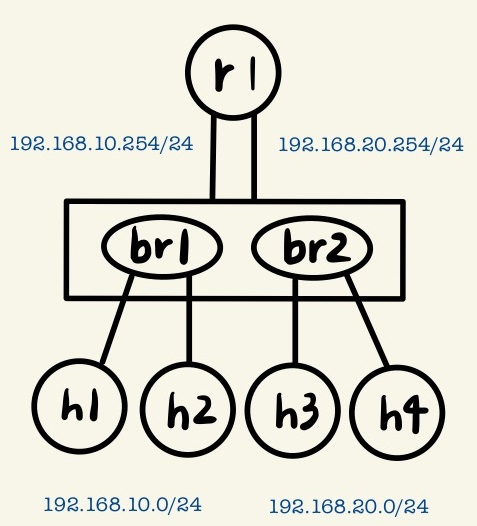

* `3.py`
```py
#!/usr/bin/env python
from mininet.cli import CLI
from mininet.net import Mininet
from mininet.link import Link,TCLink

if '__main__' == __name__:
  net = Mininet(link=TCLink)
  h1 = net.addHost('h1')
  h2 = net.addHost('h2')
  h3 = net.addHost('h3')
  h4 = net.addHost('h4')
  br1 = net.addHost('br1')
  r1 = net.addHost('r1')
  Link(h1, br1) 
  Link(h2, br1)
  Link(h3, br1)
  Link(h4, br1)
  Link(br1, r1)
  Link(br1, r1)
  net.build()
  h1.cmd("ifconfig h1-eth0 0")
  h2.cmd("ifconfig h2-eth0 0")
  h3.cmd("ifconfig h3-eth0 0")
  h4.cmd("ifconfig h4-eth0 0")
  r1.cmd("ifconfig r1-eth0 0")
  r1.cmd("ifconfig r1-eth1 0")
  br1.cmd("ifconfig br1-eth0 0")
  br1.cmd("ifconfig br1-eth1 0")
  br1.cmd("ifconfig br1-eth2 0")
  br1.cmd("ifconfig br1-eth3 0")
  br1.cmd("ifconfig br1-eth4 0")
  br1.cmd("ifconfig br1-eth5 0")
  br1.cmd("brctl addbr mybr1")
  br1.cmd("brctl addbr mybr2")
  br1.cmd("brctl addif mybr1 br1-eth0")
  br1.cmd("brctl addif mybr1 br1-eth1")
  br1.cmd("brctl addif mybr1 br1-eth4")
  br1.cmd("brctl addif mybr2 br1-eth2")
  br1.cmd("brctl addif mybr2 br1-eth3")
  br1.cmd("brctl addif mybr2 br1-eth5")
  br1.cmd("ifconfig mybr1 up")
  br1.cmd("ifconfig mybr2 up")
  h1.cmd("ip addr add 192.168.10.1/24 brd + dev h1-eth0")
  h1.cmd("ip route add default via 192.168.10.254")
  h2.cmd("ip addr add 192.168.10.2/24 brd + dev h2-eth0")
  h2.cmd("ip route add default via 192.168.10.254")
  h3.cmd("ip addr add 192.168.20.1/24 brd + dev h3-eth0")
  h3.cmd("ip route add default via 192.168.20.254")
  h4.cmd("ip addr add 192.168.20.2/24 brd + dev h4-eth0")
  h4.cmd("ip route add default via 192.168.20.254")
  r1.cmd("ip addr add 192.168.10.254/24 brd + dev r1-eth0")
  r1.cmd("ip addr add 192.168.20.254/24 brd + dev r1-eth1")
  r1.cmd("echo 1 > /proc/sys/net/ipv4/ip_forward")
  CLI(net)
  net.stop()
```
**測試**
* h1 可以 ping h2、h3、h4

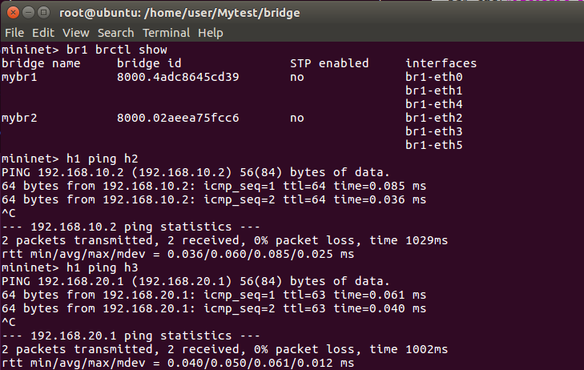

## Test4 - vlan
**Ubuntu**
```sh
apt install vlan
```

* 拓樸圖
  - `Trunk`：帶標籤
  - `access link`：不帶標籤 

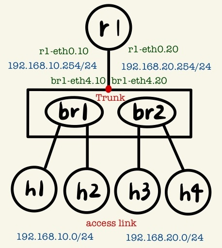

* `4.py`
```py
#!/usr/bin/env python
from mininet.cli import CLI
from mininet.net import Mininet
from mininet.link import Link,TCLink

if '__main__' == __name__:
  net = Mininet(link=TCLink)
  h1 = net.addHost('h1')
  h2 = net.addHost('h2')
  h3 = net.addHost('h3')
  h4 = net.addHost('h4')
  br1 = net.addHost('br1')
  r1 = net.addHost('r1') 
  Link(h1, br1)
  Link(h2, br1)
  Link(h3, br1)
  Link(h4, br1)
  Link(br1, r1)
  net.build()
  h1.cmd("ifconfig h1-eth0 0")
  h2.cmd("ifconfig h2-eth0 0")
  h3.cmd("ifconfig h3-eth0 0")
  h4.cmd("ifconfig h4-eth0 0")
  r1.cmd("ifconfig r1-eth0 0")
  br1.cmd("ifconfig br1-rth0 0")
  br1.cmd("ifconfig br1-rth1 0")
  br1.cmd("ifconfig br1-rth2 0")
  br1.cmd("ifconfig br1-rth3 0")
  br1.cmd("ifconfig br1-rth4 0")
  br1.cmd("vconfig add br1-eth4 10")
  br1.cmd("vconfig add br1-eth4 20")
  r1.cmd("vconfig add r1-eth0 10")
  r1.cmd("vconfig add r1-eth0 20")
  br1.cmd("brctl addbr mybr10")
  br1.cmd("brctl addbr mybr20")
  br1.cmd("brctl addif mybr10 br1-eth0")
  br1.cmd("brctl addif mybr10 br1-eth1")
  br1.cmd("brctl addif mybr10 br1-eth4.10")
  br1.cmd("brctl addif mybr20 br1-eth2")
  br1.cmd("brctl addif mybr20 br1-eth3")
  br1.cmd("brctl addif mybr20 br1-eth4.20")
  br1.cmd("ifconfig mybr10 up")
  br1.cmd("ifconfig mybr20 up")
  br1.cmd("ifconfig br1-eth4.10 up")
  br1.cmd("ifconfig br1-eth4.20 up")
  r1.cmd("ifconfig r1-eth0.10 up")
  r1.cmd("ifconfig r1-eth0.20 up")
  h1.cmd("ip addr add 192.168.10.1/24 brd + dev h1-eth0")
  h1.cmd("ip route add default via 192.168.10.254")
  h2.cmd("ip addr add 192.168.10.2/24 brd + dev h2-eth0")
  h2.cmd("ip route add default via 192.168.10.254")
  h3.cmd("ip addr add 192.168.20.1/24 brd + dev h3-eth0")
  h3.cmd("ip route add default via 192.168.20.254")
  h4.cmd("ip addr add 192.168.20.2/24 brd + dev h4-eth0")
  h4.cmd("ip route add default via 192.168.20.254")
  r1.cmd("ip addr add 192.168.10.254/24 brd + dev r1-eth0.10")
  r1.cmd("ip addr add 192.168.20.254/24 brd + dev r1-eth0.20")
  r1.cmd("echo 1 > /proc/sys/net/ipv4/ip_forward")
  CLI(net)
  net.stop()
```

**測試**
* br1 開啟 wireshark 觀察 br1-eth4，h1 ping h3

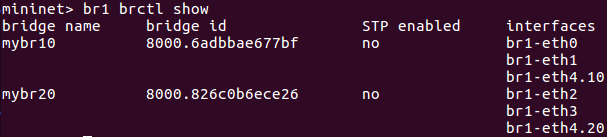

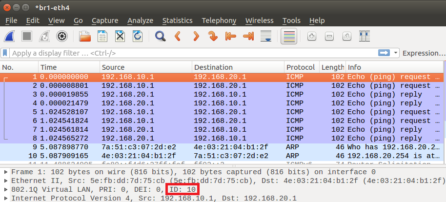

## 補充 - `sed`
* `sed -i '/^$/d' test.py`：將每一行的空白列刪除

---
參考資料：
- [Chih-Heng Ke - Youtube](https://www.youtube.com/channel/UCwQZbPmTyEqyN3pUYwhwpGg/videos)