* [Mininet]()
    - [Test5 - 單臂路由 1]()
    - [Test6 - 單臂路由 2]()
    - [Test7 - Hub]()
* [SDN (Software Defined Network) 軟體定義網路]()
  - [Open vSwitch (OVS)]()
    - [Test1 - ovs 手動控制]()
    - [Test2 - ARP、IP 分開設定]()

---
# Mininet
## Test5 - 單臂路由 1

* 拓撲圖

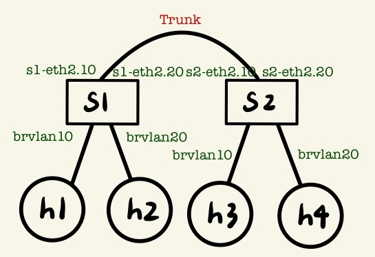

* `5.py`
```py
#!/usr/bin/env python
from mininet.cli import CLI
from mininet.net import Mininet
from mininet.link import Link,TCLink

if '__main__' == __name__:
  net = Mininet(link=TCLink)
  h1 = net.addHost('h1')
  h2 = net.addHost('h2')
  h3 = net.addHost('h3')
  h4 = net.addHost('h4')
  s1 = net.addHost('s1')
  s2 = net.addHost('s2') 
  Link(h1, s1)
  Link(h2, s1)
  Link(h3, s2)
  Link(h4, s2)
  Link(s1, s2)
  net.build()
  h1.cmd("ifconfig h1-eth0 0")
  h2.cmd("ifconfig h2-eth0 0")
  h3.cmd("ifconfig h3-eth0 0")
  h4.cmd("ifconfig h4-eth0 0")
  s1.cmd("ifconfig s1-eth0 0")
  s1.cmd("ifconfig s1-eth1 0")
  s1.cmd("ifconfig s1-eth2 0")
  s2.cmd("ifconfig s2-eth0 0")
  s2.cmd("ifconfig s2-eth1 0")
  s2.cmd("ifconfig s2-eth2 0")
  s1.cmd("vconfig add s1-eth2 10")
  s1.cmd("vconfig add s1-eth2 20")
  s2.cmd("vconfig add s2-eth2 10")
  s2.cmd("vconfig add s2-eth2 20")
  s1.cmd("brctl addbr brvlan10")
  s1.cmd("brctl addbr brvlan20")
  s2.cmd("brctl addbr brvlan10")
  s2.cmd("brctl addbr brvlan20")
  s1.cmd("brctl addif brvlan10 s1-eth0")
  s1.cmd("brctl addif brvlan20 s1-eth1")
  s1.cmd("brctl addif brvlan10 s1-eth2.10")
  s1.cmd("brctl addif brvlan20 s1-eth2.20")
  s2.cmd("brctl addif brvlan10 s2-eth0")
  s2.cmd("brctl addif brvlan20 s2-eth1")
  s2.cmd("brctl addif brvlan10 s2-eth2.10")
  s2.cmd("brctl addif brvlan20 s2-eth2.20")
  s1.cmd("ifconfig brvlan10 up")
  s1.cmd("ifconfig brvlan20 up")
  s2.cmd("ifconfig brvlan10 up")
  s2.cmd("ifconfig brvlan20 up")
  s1.cmd("ifconfig s1-eth2.10 up")
  s1.cmd("ifconfig s1-eth2.20 up")
  s2.cmd("ifconfig s2-eth2.10 up")
  s2.cmd("ifconfig s2-eth2.20 up")
  h1.cmd("ip addr add 192.168.10.1/24 brd + dev h1-eth0")
  h2.cmd("ip addr add 192.168.10.2/24 brd + dev h2-eth0")
  h3.cmd("ip addr add 192.168.10.3/24 brd + dev h3-eth0")
  h4.cmd("ip addr add 192.168.10.4/24 brd + dev h4-eth0")
  CLI(net)
  net.stop()
```

**測試**
* h1 可以 ping h3，h2 可以 ping h4

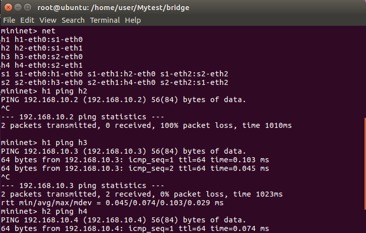

* 當 h1 ping h3，查看 s1-eth2

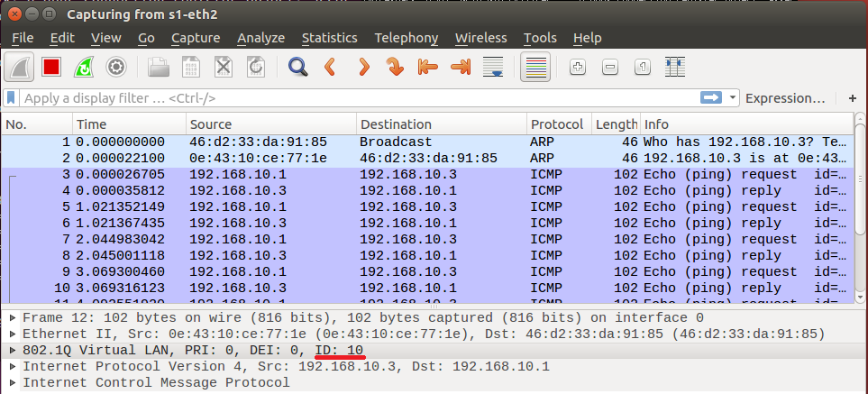

* 當 h2 ping h4，查看 s1-eth2

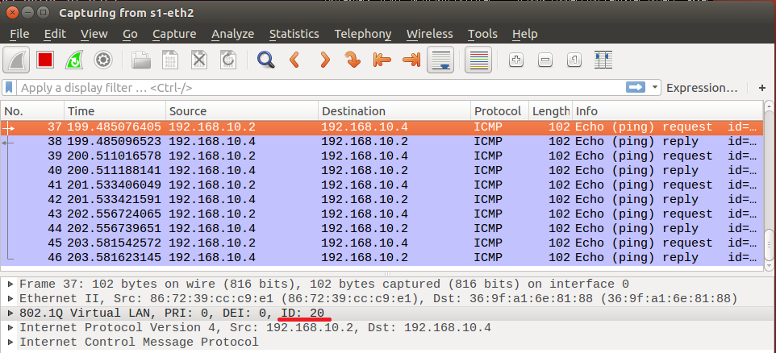

## Test6 - 單臂路由 2

* 拓撲圖

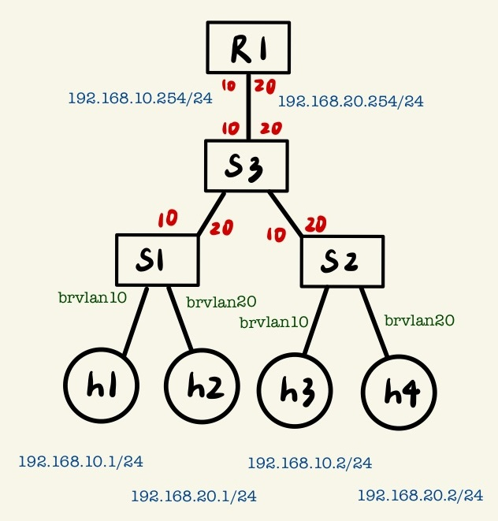

* `6.py`
```py
#!/usr/bin/env python
from mininet.cli import CLI
from mininet.net import Mininet
from mininet.link import Link,TCLink

if '__main__' == __name__:
  net = Mininet(link=TCLink)
  h1 = net.addHost('h1')
  h2 = net.addHost('h2')
  h3 = net.addHost('h3')
  h4 = net.addHost('h4')
  s1 = net.addHost('s1')
  s2 = net.addHost('s2') 
  s3 = net.addHost('s3')
  r1 = net.addHost('r1')
  Link(h1, s1)
  Link(h2, s1)
  Link(h3, s2)
  Link(h4, s2)
  Link(s1, s3)
  Link(s2, s3)
  Link(s3, r1)
  net.build()
  h1.cmd("ifconfig h1-eth0 0")
  h2.cmd("ifconfig h2-eth0 0")
  h3.cmd("ifconfig h3-eth0 0")
  h4.cmd("ifconfig h4-eth0 0")
  s1.cmd("ifconfig s1-eth0 0")
  s1.cmd("ifconfig s1-eth1 0")
  s1.cmd("ifconfig s1-eth2 0")
  s2.cmd("ifconfig s2-eth0 0")
  s2.cmd("ifconfig s2-eth1 0")
  s2.cmd("ifconfig s2-eth2 0")
  s3.cmd("ifconfig s3-eth0 0")
  s3.cmd("ifconfig s3-eth1 0")
  s3.cmd("ifconfig s3-eth2 0")
  r1.cmd("ifconfig r1-eth0 0")
  s1.cmd("vconfig add s1-eth2 10")
  s1.cmd("vconfig add s1-eth2 20")
  s2.cmd("vconfig add s2-eth2 10")
  s2.cmd("vconfig add s2-eth2 20")
  s3.cmd("vconfig add s3-eth0 10")
  s3.cmd("vconfig add s3-eth0 20")
  s3.cmd("vconfig add s3-eth1 10")
  s3.cmd("vconfig add s3-eth1 20")
  s3.cmd("vconfig add s3-eth2 10")
  s3.cmd("vconfig add s3-eth2 20")
  r1.cmd("vconfig add r1-eth0 10")
  r1.cmd("vconfig add r1-eth0 20")
  s1.cmd("ifconfig s1-eth2.10 up")
  s1.cmd("ifconfig s1-eth2.20 up")
  s2.cmd("ifconfig s2-eth2.10 up")
  s2.cmd("ifconfig s2-eth2.20 up")
  s3.cmd("ifconfig s3-eth0.10 up")
  s3.cmd("ifconfig s3-eth0.20 up")
  s3.cmd("ifconfig s3-eth1.10 up")
  s3.cmd("ifconfig s3-eth1.20 up")
  s3.cmd("ifconfig s3-eth2.10 up")
  s3.cmd("ifconfig s3-eth2.20 up")
  r1.cmd("ifconfig r1-eth0.10 up")
  r1.cmd("ifconfig r1-eth0.20 up")
  s1.cmd("brctl addbr brvlan10")
  s1.cmd("brctl addbr brvlan20")
  s2.cmd("brctl addbr brvlan10")
  s2.cmd("brctl addbr brvlan20")
  s3.cmd("brctl addbr brvlan10")
  s3.cmd("brctl addbr brvlan20")
  s1.cmd("ifconfig brvlan10 up")
  s1.cmd("ifconfig brvlan20 up")
  s2.cmd("ifconfig brvlan10 up")
  s2.cmd("ifconfig brvlan20 up")
  s3.cmd("ifconfig brvlan10 up")
  s3.cmd("ifconfig brvlan20 up")
  s1.cmd("brctl addif brvlan10 s1-eth0")
  s1.cmd("brctl addif brvlan20 s1-eth1")
  s1.cmd("brctl addif brvlan10 s1-eth2.10")
  s1.cmd("brctl addif brvlan20 s1-eth2.20")
  s2.cmd("brctl addif brvlan10 s2-eth0")
  s2.cmd("brctl addif brvlan20 s2-eth1")
  s2.cmd("brctl addif brvlan10 s2-eth2.10")
  s2.cmd("brctl addif brvlan20 s2-eth2.20")
  s3.cmd("brctl addif brvlan10 s3-eth0.10")
  s3.cmd("brctl addif brvlan10 s3-eth1.10")
  s3.cmd("brctl addif brvlan10 s3-eth2.10")
  s3.cmd("brctl addif brvlan20 s3-eth0.20")
  s3.cmd("brctl addif brvlan20 s3-eth1.20")
  s3.cmd("brctl addif brvlan20 s3-eth2.20")
  h1.cmd("ip addr add 192.168.10.1/24 brd + dev h1-eth0")
  h1.cmd("ip route add default via 192.168.10.254")
  h2.cmd("ip addr add 192.168.20.1/24 brd + dev h2-eth0")
  h2.cmd("ip route add default via 192.168.20.254")
  h3.cmd("ip addr add 192.168.10.2/24 brd + dev h3-eth0")
  h3.cmd("ip route add default via 192.168.10.254")
  h4.cmd("ip addr add 192.168.20.2/24 brd + dev h4-eth0")
  h4.cmd("ip route add default via 192.168.20.254")
  r1.cmd("ip addr add 192.168.10.254/24 brd + dev r1-eth0.10")
  r1.cmd("ip addr add 192.168.20.254/24 brd + dev r1-eth0.20")
  r1.cmd("echo 1 > /proc/sys/net/ipv4/ip_forward")
  CLI(net)
  net.stop()
```

**測試**
* h1 可以 ping h2、h3、h4

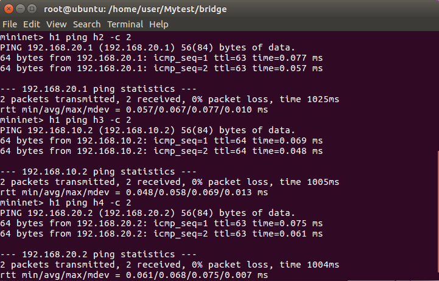


## Test7 - Hub

* 拓撲圖

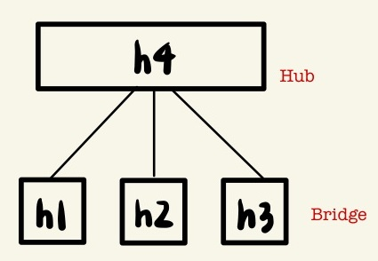

* `hub.py`
```py
#!/usr/bin/env python
from mininet.cli import CLI
from mininet.net import Mininet
from mininet.link import Link,TCLink,Intf
 
if '__main__' == __name__:
  net = Mininet(link=TCLink)
  h1 = net.addHost('h1', mac='00:00:00:00:01:00')
  h2 = net.addHost('h2', mac='00:00:00:00:02:00')
  h3 = net.addHost('h3', mac='00:00:00:00:03:00')
  h4 = net.addHost('h4', mac='00:00:00:00:04:00')
  Link(h1, h4)
  Link(h2, h4)
  Link(h3, h4)
  net.build()
  h4.cmd("ifconfig h4-eth0 0")
  h4.cmd("ifconfig h4-eth1 0")
  h4.cmd("ifconfig h4-eth2 0")
  h4.cmd("brctl addbr br0")
  h4.cmd("brctl addif br0 h4-eth0")
  h4.cmd("brctl addif br0 h4-eth1")
  h4.cmd("brctl addif br0 h4-eth2")
  h4.cmd("brctl setageing br0 0")
  h4.cmd("ifconfig br0 up")
  CLI(net)
  net.stop()
```

**設定 bridge time=0，沒有時間記住 Mac Address、Port 的對應 table 變成類似像 Hub 的關鍵指令**
```py
brctl setageing br0 0   # brctl setageing <bridge> <time>
```

**測試**

* bridge 與 hub 差別，當 h1 ping h3，h2 可以監聽到

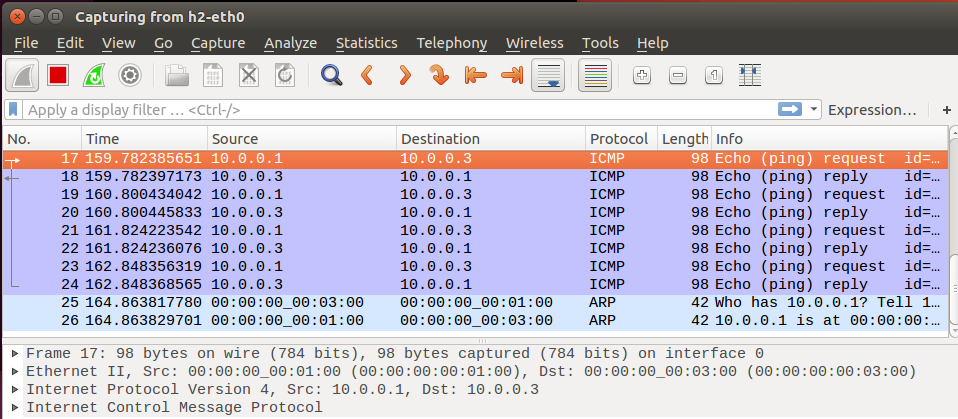

# SDN (Software Defined Network) 軟體定義網路
將控制平面 (Control plane) 和資料平面 (Data plane) 分離，採用集中式管理，讓網路設備成為一個開放式的網路平台。Controller 透過 Openflow 協定去控制網路裝置，而我們用軟體的方式去模擬出網路設備，我們稱為 Open vSwitch (ovs)。

* 傳統的網際網路 (Legacy Network) 是一個分散式的系統，例如：路由器彼此之間會互相的交換訊息，將路由表建立起來 (Control plane)，當資料進來時可以利用路由表來進行轉發的動作。Control plane 指的是資料行走的路徑，Data plane 指的是使用者資料行走的路徑。在 Legacy Network 中 Control plane 和 Data plane 是合在一起的，缺點是效能較差。

## Open vSwitch (OVS)
簡稱 OVS，他是一個開源的虛擬交換機也是實現網路虛擬化的 SDN 的重要基礎設計，設計 OVS 的目的是為了解決實體交換機存在的局限性，比實體交換機更低的成本和更高的工作效率。

### Test1 - ovs 手動控制 

* 拓撲圖

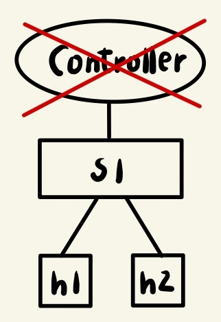

**Ubuntu**

1. 用參數調整拓撲
* single：指的是單個，這類的拓撲只有一個交換機，而主機可以任意指定個數

  ```sh
  mn --topo single,2
  ```

  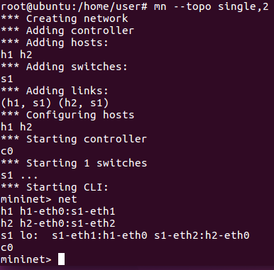

2. 先 `ps -aux | grep controller` 查詢 controller 的 PID，再刪除 `kill -9 [controller PID]` 

3. 測試 h1 ping h2，無法 ping 成功代表成功刪除 controller

**注意：** 若是先 ping 再刪除 controller，還是能 ping，是因為規則已經寫入交換機。故要先刪除 controller，再測試 ping。

4. 查詢交換機指令 
  
  ```sh
  ovs-ofctl -h
  ```

5. 顯示交換機資訊
  
  ```sh
  ovs-ofctl show s1
  ```

  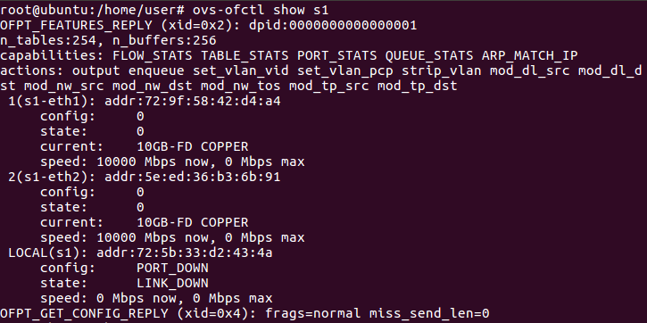

  - `dpid:0000000000000001`：data path ID，在 mininet 當中，第一台交換機的 ID 是 1，第二台是 2，以此類推。為了方便區分 ovs。
  - `n_tables:254`：在這個 ovs 提供 254 個 tables
  - `capabilities`：這台交換機具備哪些能力
  - `actions`：這台交換機可以做什麼
    - `mod_nw_src`：modify network source，支援修改來源 IP Address
    - `mod_nw_dst`：modify network distance，支援修改目的 IP Address
    - `mod_tp_src`：modify transport source，支援修改第四層傳輸層的來源 port IP Address
    - `mod_tp_dst`：modify transport distance，支援修改第四層傳輸層的目的 port IP Address
    - `mod_dl_src`：modify data link source，支援修改第二層資料連結層來源網路卡卡號
    - `mod_dl_dst`：modify data link distnce，支援修改第二層資料連結層目的端的網路卡卡號
    - `output`：轉發到特定的 port 號
     

**在交換機新增規則：** 在 ovs 裡交換機的每一條規則稱為 flow
* 查看交換機的規則：`ovs-ofctl dump-flows s1`，可以發現是空的

  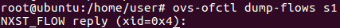

* 新增規則：`ovs-ofctl add-flow SWITCH FLOW` 

  ```sh
  # 1 號 port 進來從 2 號 port 轉發
  ovs-ofctl add-flow s1 in_port=1,actions=output:2

  # 2 號 port 進來從 1 號 port 轉發
  ovs-ofctl add-flow s1 in_port=2,actions=output:1
  ```

  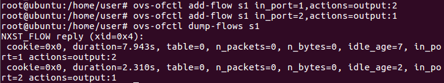

> * n_packets=0：符合此規則的封包數
> * n-bytes=0：符合此規則的封包大小的總和數

* 刪除規則：`ovs-ofctl del-flows SWITCH [FLOW]`
  - 刪除特定的規則：`ovs-ofctl del-flows s1 in_port=1`
  - 刪除所有的規則：`ovs-ofctl del-flows s1`

**Mininet 測試**
* 新增完規則測試 `h1 ping h2 -c 3`，並查看交換機規則

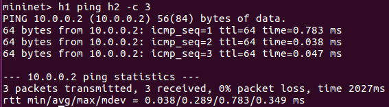

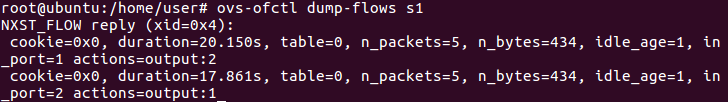

> 會發現 `n_packets=5`，除了傳送三個封包之外，當兩台主機要進行通訊時，會先透過 ARP 廣播去了解對方 IP 對應的 MAC Address 是多少，再透過 ARP response 得知資訊。

### Test2 - ARP、IP 分開設定
一般來說 **ARP 請求-廣播、回覆-單播；IP-單播**，但為了方便我們簡化設定成 ARP-廣播，IP-單播

* 拓撲圖

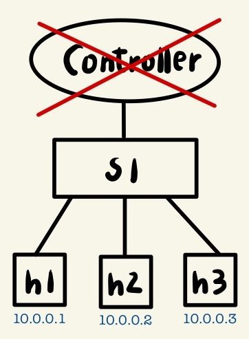

**Ubuntu**
* 設定 ARP 廣播，IP 單播

```sh
mn --topo single,3
ps -aux | grep controller
kill -9 [controller PID]

# 設定 ARP 廣播
ovs-ofctl add-flow s1 in_port=1,arp,actions=output:flood
ovs-ofctl add-flow s1 in_port=2,arp,actions=output:flood
ovs-ofctl add-flow s1 in_port=3,arp,actions=output:flood 

# 設定 IP 單播         # network_destination
ovs-ofctl add-flow s1 ip,nw_dst=10.0.0.1,actions=output:1
ovs-ofctl add-flow s1 ip,nw_dst=10.0.0.2,actions=output:2
ovs-ofctl add-flow s1 ip,nw_dst=10.0.0.3,actions=output:3
```

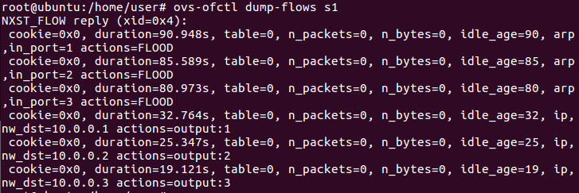

**測試**
* 測試 `h1 ping h3 -c 3`，並查看交換機規則

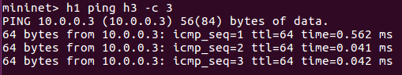

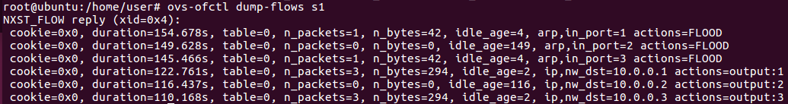

> 可以發現前面三行規則是在處理 ARP 封包，後面三行規則是處理 icmp ping request 跟 ping response

---
參考資料：
- [mininet-ovs 1 - Chih-Heng Ke Youtube](https://www.youtube.com/watch?v=QKXuQtd37jU&ab_channel=Chih-HengKe)