* [Open vSwitch (OVS)](https://github.com/linjiachi/Linux_note/blob/master/109-2/20210412.md#open-vswitch-ovs)
    - [Test3 - 手動設置規則](https://github.com/linjiachi/Linux_note/blob/master/109-2/20210412.md#test3---%E6%89%8B%E5%8B%95%E8%A8%AD%E7%BD%AE%E8%A6%8F%E5%89%87)
    - [Test4 - ping request、reply 分開](https://github.com/linjiachi/Linux_note/blob/master/109-2/20210412.md#test4---ping-requestreply-%E5%88%86%E9%96%8B)
    - [Test5 - Mirror function 手動設定](https://github.com/linjiachi/Linux_note/blob/master/109-2/20210412.md#test5---mirror-function-%E6%89%8B%E5%8B%95%E8%A8%AD%E5%AE%9A)
    - [Test6 - Mirror function](https://github.com/linjiachi/Linux_note/blob/master/109-2/20210412.md#test6---mirror-function)
      - [封包接收判斷](https://github.com/linjiachi/Linux_note/blob/master/109-2/20210412.md#%E5%B0%81%E5%8C%85%E6%8E%A5%E6%94%B6%E5%88%A4%E6%96%B7)

---
# Open vSwitch (OVS)
**觀察規則**
* 建立一個環境，h1 ping h2，觀察規則

```sh
//ubuntu
mn --topo single,2

//mininet
h1 ping h2

//ubuntu
ovs-ofctl dump-flows s1
```

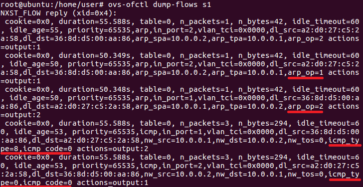

* ARP packet format

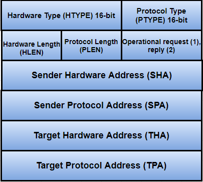

* ICMP type

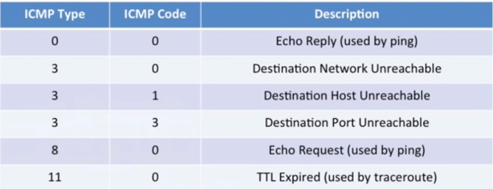

* 可以利用 ARP packet format、ICMP type 觀察 ARP、ICMP 的規則設定
    - `arp_spa`：Sender Protocol Address，來源 IP
    - `arp_tpa`：Target Protocol Address，目標 IP
    - arp request：`arp_op=1`
    - arp reply：`arp_op=2`
    - icmp request：`icmp_type=8`, `icmp_code=0`
    - icmp reply：`icmp_type=0`, `icmp_code=0`

## Test3 - 手動設置規則
**Ubuntu**
1. 將 controller 設定 remote，故要自訂規則

    ```sh
    mn --controller=remote
    ```
2. 設定 ARP 規則

    ```sh
    ovs-ofctl add-flow s1 arp,arp_spa=10.0.0.1,arp_tpa=10.0.0.2,arp_op=1,actions=output:2
    ovs-ofctl add-flow s1 arp,arp_spa=10.0.0.2,arp_tpa=10.0.0.1,arp_op=2,actions=output:1
    ```
**Mininet**

3. 測試 h1 ping h2

    ```sh
    h1 ping h2 -c 1
    ```
4. 查看 ARP table 是否建立成功

    ```sh
    h1 arp -n
    ```
**Ubuntu**

5. 設定 ICMP 規則
    
    ```sh
    ovs-ofctl add-flow s1 icmp,nw_src=10.0.0.1,nw_dst=10.0.0.2,icmp_type=8,icmp_code=0,actions=output:2
    ovs-ofctl add-flow s1 icmp,nw_src=10.0.0.2,nw_dst=10.0.0.1,icmp_type=0,icmp_code=0,actions=output:1
    ```
**Mininet**

6. 再次測試 h1 ping h2，ping 成功

## Test4 - ping request、reply 分開
當 h1 ping h2 或 h2 ping h1，ping request 要走 s3 這條，ping reply 要走 s1、s2 這條

* 拓撲圖

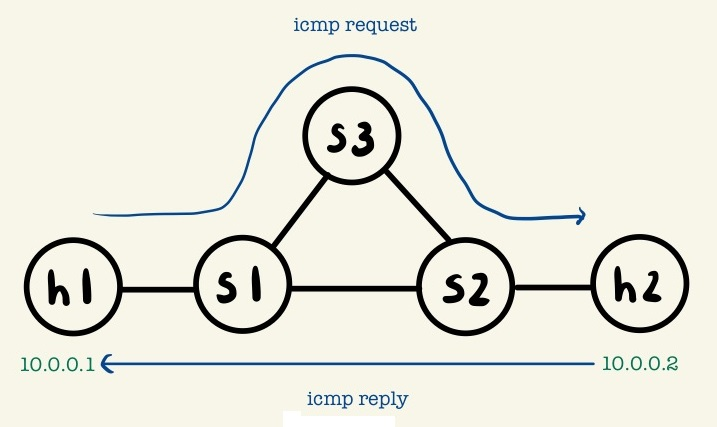

* `lab1.py`
```py
#!/usr/bin/env python
from mininet.cli import CLI
from mininet.net import Mininet
from mininet.link import Link,TCLink,Intf
from mininet.node import Controller,RemoteController

if '__main__' == __name__:
  net = Mininet(link=TCLink)
  h1 = net.addHost('h1')
  h2 = net.addHost('h2')
  s1 = net.addSwitch('s1')
  s2 = net.addSwitch('s2')
  s3 = net.addSwitch('s3')

  # 設定 remotecontroller，故要自訂規則
  c0 = net.addController('c0', controller=RemoteController)

  net.addLink(h1, s1)
  net.addLink(s1, s2)
  net.addLink(s2, h2)
  net.addLink(s1, s3)
  net.addLink(s2, s3)
  net.build()
  c0.start()
  s1.start([c0])
  s2.start([c0])
  s3.start([c0])

# rules for s1
  s1.cmd("ovs-ofctl add-flow s1 arp,arp_spa=10.0.0.1,arp_tpa=10.0.0.2,arp_op=1,actions=output:2")
  s1.cmd("ovs-ofctl add-flow s1 arp,arp_spa=10.0.0.2,arp_tpa=10.0.0.1,arp_op=2,actions=output:1")
  s1.cmd("ovs-ofctl add-flow s1 arp,arp_spa=10.0.0.2,arp_tpa=10.0.0.1,arp_op=1,actions=output:1")
  s1.cmd("ovs-ofctl add-flow s1 arp,arp_spa=10.0.0.1,arp_tpa=10.0.0.2,arp_op=2,actions=output:2")
  s1.cmd("ovs-ofctl add-flow s1 icmp,nw_src=10.0.0.1,nw_dst=10.0.0.2,icmp_type=8,icmp_code=0,actions=output:3")
  s1.cmd("ovs-ofctl add-flow s1 icmp,nw_src=10.0.0.2,nw_dst=10.0.0.1,icmp_type=0,icmp_code=0,actions=output:1")
  s1.cmd("ovs-ofctl add-flow s1 icmp,nw_src=10.0.0.2,nw_dst=10.0.0.1,icmp_type=8,icmp_code=0,actions=output:1")
  s1.cmd("ovs-ofctl add-flow s1 icmp,nw_src=10.0.0.1,nw_dst=10.0.0.2,icmp_type=0,icmp_code=0,actions=output:2")

# rules for s2
  s2.cmd("ovs-ofctl add-flow s2 arp,arp_spa=10.0.0.1,arp_tpa=10.0.0.2,arp_op=1,actions=output:2")
  s2.cmd("ovs-ofctl add-flow s2 arp,arp_spa=10.0.0.2,arp_tpa=10.0.0.1,arp_op=2,actions=output:1")
  s2.cmd("ovs-ofctl add-flow s2 arp,arp_spa=10.0.0.2,arp_tpa=10.0.0.1,arp_op=1,actions=output:1")
  s2.cmd("ovs-ofctl add-flow s2 arp,arp_spa=10.0.0.1,arp_tpa=10.0.0.2,arp_op=2,actions=output:2")
  s2.cmd("ovs-ofctl add-flow s2 icmp,nw_src=10.0.0.1,nw_dst=10.0.0.2,icmp_type=8,icmp_code=0,actions=output:2")
  s2.cmd("ovs-ofctl add-flow s2 icmp,nw_src=10.0.0.2,nw_dst=10.0.0.1,icmp_type=0,icmp_code=0,actions=output:1")
  s2.cmd("ovs-ofctl add-flow s2 icmp,nw_src=10.0.0.2,nw_dst=10.0.0.1,icmp_type=8,icmp_code=0,actions=output:3")
  s2.cmd("ovs-ofctl add-flow s2 icmp,nw_src=10.0.0.1,nw_dst=10.0.0.2,icmp_type=0,icmp_code=0,actions=output:2")

# rules for s3
  s3.cmd("ovs-ofctl add-flow s3 icmp,nw_src=10.0.0.1,nw_dst=10.0.0.2,icmp_type=8,icmp_code=0,actions=output:2")
  s3.cmd("ovs-ofctl add-flow s3 icmp,nw_src=10.0.0.2,nw_dst=10.0.0.1,icmp_type=8,icmp_code=0,actions=output:1")

  CLI(net)
  net.stop()
```

**測試**
* 開啟 s2、s3 並監聽封包

```sh
//mininet
xterm s2 s3

//s2
tcpdump -i s2-eth1

//s3
tcpdump -i s3-eth1

//mininet
h1 ping h2
```

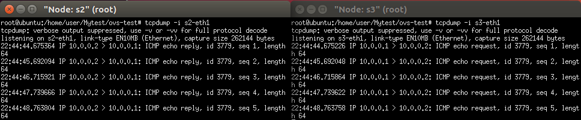

## Test5 - Mirror function 手動設定
當 h1 送 UDP 封包到 h2 時，可以同時再複製一份，送給 h3

* 拓撲圖

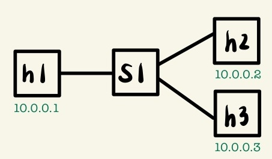

* `mirror.py`
```py
#!/usr/bin/env python
from mininet.cli import CLI
from mininet.net import Mininet
from mininet.link import Link,TCLink,Intf
from mininet.node import Controller,RemoteController

if '__main__' == __name__:
  net = Mininet(link=TCLink)

  # 在新增節點的時候，設定 IP 和 MAC Address
  h1 = net.addHost('h1', ip="10.0.0.1/24", mac="00:00:00:00:00:01")
  h2 = net.addHost('h2', ip="10.0.0.2/24", mac="00:00:00:00:00:02")
  h3 = net.addHost('h3', ip="10.0.0.3/24", mac="00:00:00:00:00:03")
  s1 = net.addSwitch('s1')
  c0 = net.addController('c0', controller=RemoteController)
  net.addLink(h1, s1)
  net.addLink(h2, s1)
  net.addLink(h3, s1)
  net.build()
  c0.start()
  s1.start([c0])
  h1.cmd("arp -s 10.0.0.2 00:00:00:00:00:02")
  h1.cmd("arp -s 10.0.0.3 00:00:00:00:00:03")
  h2.cmd("arp -s 10.0.0.1 00:00:00:00:00:01")
  h2.cmd("arp -s 10.0.0.3 00:00:00:00:00:03")
  h3.cmd("arp -s 10.0.0.1 00:00:00:00:00:01")
  h3.cmd("arp -s 10.0.0.2 00:00:00:00:00:02")

  CLI(net)
  net.stop()
```

**Ubuntu**
* 當規則均符合，priority 大的為優先

```sh
ovs-ofctl add-flow s1 priority=1,ip,nw_dst=10.0.0.1,actions=output:1
ovs-ofctl add-flow s1 priority=1,ip,nw_dst=10.0.0.2,actions=output:2
ovs-ofctl add-flow s1 priority=1,ip,nw_dst=10.0.0.3,actions=output:3
ovs-ofctl add-flow s1 priority=10,ip,nw_src=10.0.0.1,nw_dst=10.0.0.2,actions=output:2,output:3
```

**測試**
* 開啟 h3 wireshark 監看 h1 ping h2，會發現 h3 可以收到封包 (可以發現為單向 request)

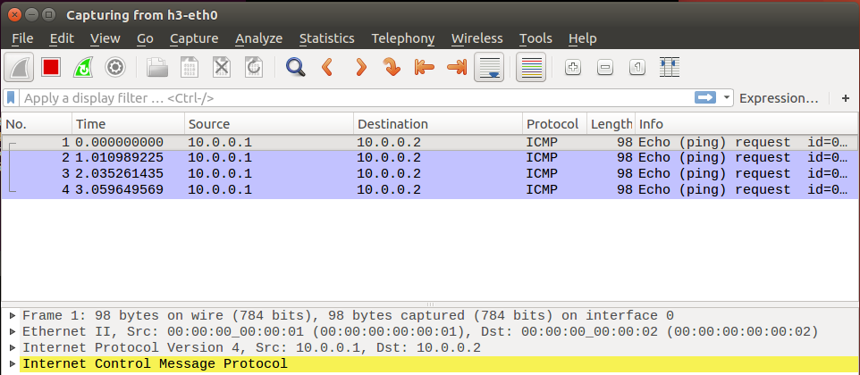

**h2、h3**
```sh
iperf -s -i 1 -u
```
**h1**
```sh
iperf -c 10.0.0.2 -u -b 1M -t 100
```
**會發現只有 h2 收的到封包，h3 沒有**

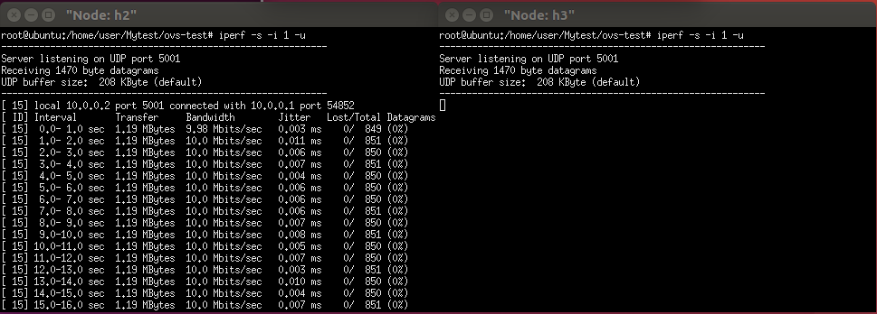

**解決方法：** 新增規則，更改目的端 IP、MAC Address
```sh
ovs-ofctl add-flow s1 priority=100,ip,nw_src=10.0.0.1,nw_dst=10.0.0.2,actions=output:2,mod_nw_dst=10.0.0.3,mod_dl_dst:00:00:00:00:00:03,output:3
```

**再次測試**

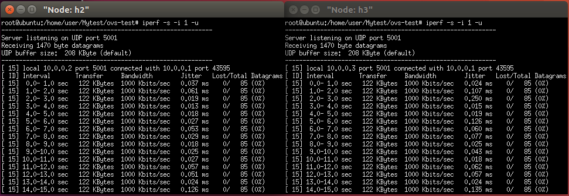

## Test6 - Mirror function

* `mirror.py`
```py
#!/usr/bin/env python
from mininet.cli import CLI
from mininet.net import Mininet
from mininet.link import Link,TCLink,Intf
from mininet.node import Controller,RemoteController

if '__main__' == __name__:
  net = Mininet(link=TCLink)
  h1 = net.addHost('h1', ip="10.0.0.1/24", mac="00:00:00:00:00:01")
  h2 = net.addHost('h2', ip="10.0.0.2/24", mac="00:00:00:00:00:02")
  h3 = net.addHost('h3', ip="10.0.0.3/24", mac="00:00:00:00:00:03")
  s1 = net.addSwitch('s1')
  c0 = net.addController('c0', controller=RemoteController)
  net.addLink(h1, s1)
  net.addLink(h2, s1)
  net.addLink(h3, s1)
  net.build()
  c0.start()
  s1.start([c0])
  h1.cmd("arp -s 10.0.0.2 00:00:00:00:00:02")
  h1.cmd("arp -s 10.0.0.3 00:00:00:00:00:03")
  h2.cmd("arp -s 10.0.0.1 00:00:00:00:00:01")
  h2.cmd("arp -s 10.0.0.3 00:00:00:00:00:03")
  h3.cmd("arp -s 10.0.0.1 00:00:00:00:00:01")
  h3.cmd("arp -s 10.0.0.2 00:00:00:00:00:02")
  #rules for s1
  s1.cmd("ovs-ofctl add-flow s1 priority=1,ip,nw_dst=10.0.0.1,actions=output:1")
  s1.cmd("ovs-ofctl add-flow s1 priority=1,ip,nw_dst=10.0.0.2,actions=output:2")
  s1.cmd("ovs-ofctl add-flow s1 priority=1,ip,nw_dst=10.0.0.3,actions=output:3")
  s1.cmd("ovs-ofctl add-flow s1 priority=10,udp,nw_dst=10.0.0.2,actions=output:2,mod_dl_dst=00:00:00:00:00:03,mod_nw_dst=10.0.0.3,output:3")
  CLI(net)
  net.stop()
```

**Ubuntu**
* 當接收到 10.0.0.3 的封包，要 drop

```sh
ovs-ofctl add-flow s1 priority=100,ip,nw_src=10.0.0.3,actions=drop
```
**測試**
* 開啟 h3 的 wireshark 查看 h3-eth0

```sh
h1 ping h3
```

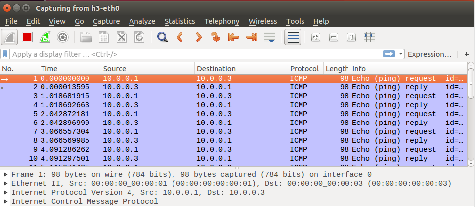

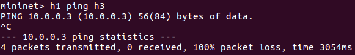

> 可以觀察到 h1 有 ping request、h3 有 ping reply，但 h1 不會接收到 10.0.0.3 的 reply 

### 封包接收判斷
1. At MAC Layer：檢查 dst Address 是否為自己或廣播的位置 (FF:FF:FF:FF:FF:FF)，如果是就接收，不是則丟棄。

2. At IP Layer：檢查 IP Address 是否為自己或廣播位置，同時也會確認 Checksum value，如果是就接收，不是則丟棄。

3. At Transport Layer：檢查 Checksum value 是否正確，如果正確就接收，也會檢查 port 號上面是否有應用程式接取封包，如果沒有則丟棄。


---
參考資料：
- [mininet-ovs 2 - Chih-Heng Ke Youtube](https://www.youtube.com/watch?v=zQDtEoUrnvQ&ab_channel=Chih-HengKe)
- [mininet-ovs 3 - Chih-Heng Ke Youtube](https://www.youtube.com/watch?v=z5h7hRPgFAE&t=1s&ab_channel=Chih-HengKe)
