* [Mininet-wifi]()
    - [MiniEdit]()
        - [Test1]()
        - [Test2]()
        - [Test3 - ovs]()
* [期中題目]()
    - [Test - ovs]()
---
# Mininet-wifiP4
在此虛擬機裡操作，老師的虛擬機 [mininet-wifip4](https://drive.google.com/file/d/11DVZxhi7OMKTOXbUvWu6GxY0RNQZapiY/view?usp=sharing)

## MiniEdit
能利用圖形化介面的方式建立拓撲

* 開啟 MiniEdit
```sh
cd mininet-wifi/
cd examples/
python miniedit.py
```

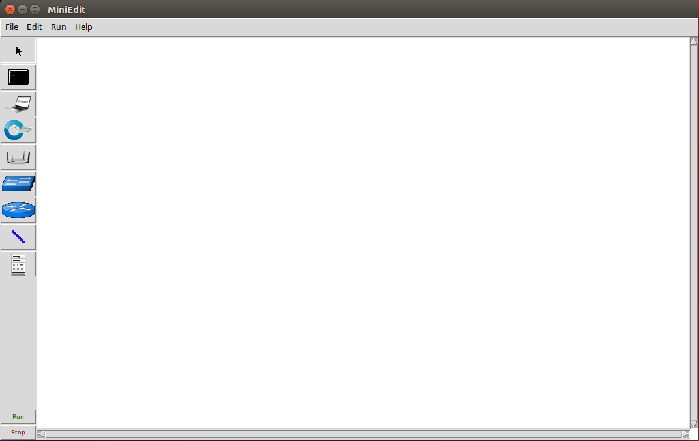

### Test1
* 拓撲圖

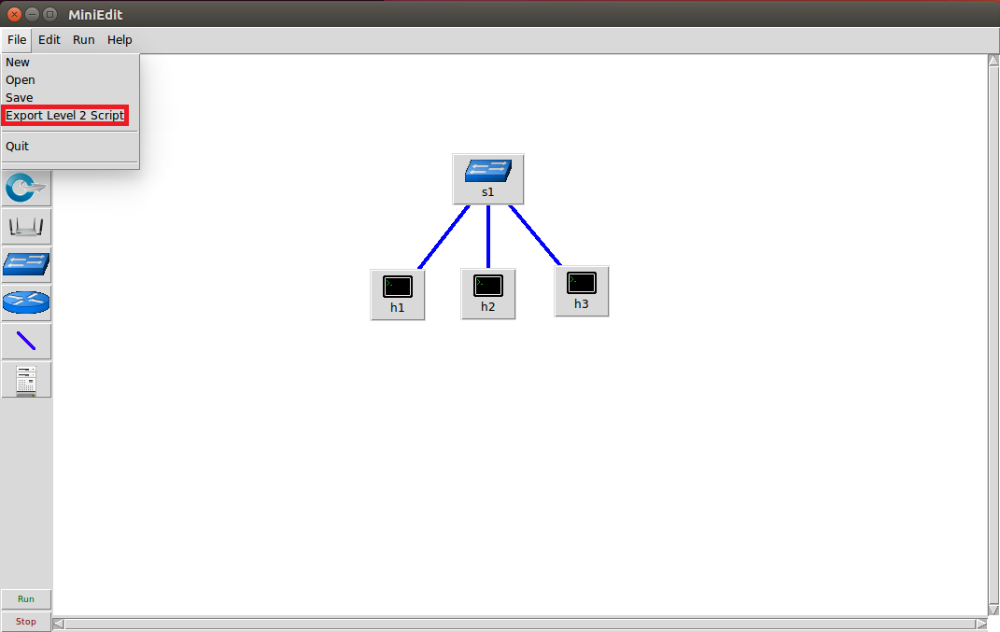

1. 建立完拓撲，點擊 File - Export Level 2 Script 儲存程式
2. 可以開啟剛儲存的程式查看程式碼

    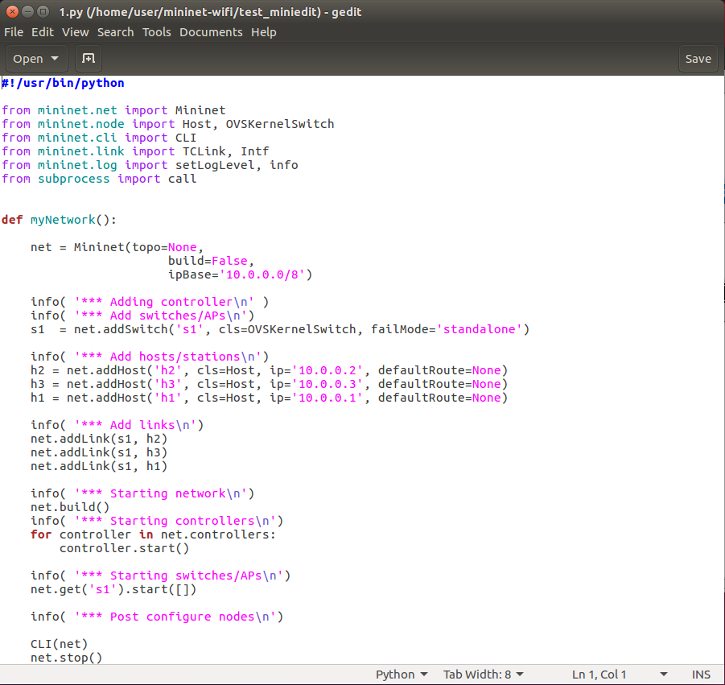

3. 可以執行程式並測試 h1 ping h2，並在 h3 開啟 wireshark 監聽

    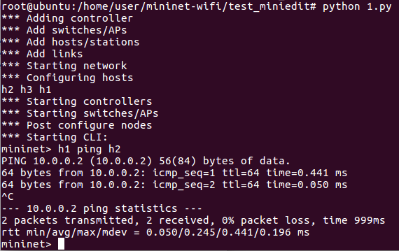

    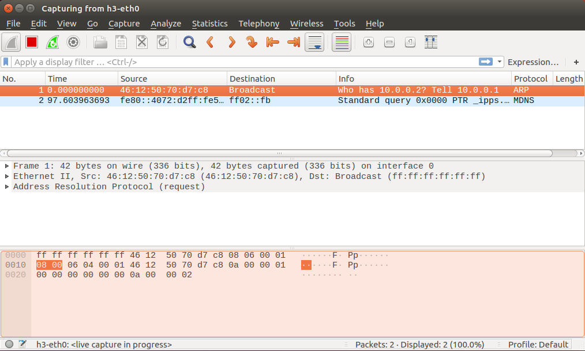

可以發現 h3 只會收到學習 IP Address 的 ARP 請求封包，因為傳統 switch 有 Address Learning

### Test2
* 拓撲圖

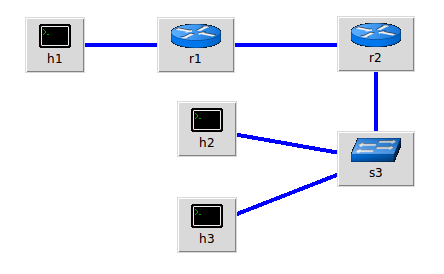

1. 在 h1、h2、h3 按右鍵選擇 properties 設定 IP、Default Route，再儲存程式碼
    
    Host | IP Address | Default Route
    :-:|:-:|:-:
    h1 |192.168.10.1/24|192.168.10.254
    h2 |192.168.20.1/24|192.168.20.254
    h3 |192.168.20.2/24|192.168.20.254

2. 查看程式碼可以發現，enable routing in linux 有兩種設定方式

* `echo 1 > /proc/sys/net/ipv4/ip_forward`
* `sysctl -w net.ipv4.ip_forward=1`

3. 程式碼

    ```py
    #!/usr/bin/python

    from mininet.net import Mininet
    from mininet.node import Host, Node, OVSKernelSwitch
    from mininet.cli import CLI
    from mininet.link import TCLink, Intf
    from mininet.log import setLogLevel, info
    from subprocess import call


    def myNetwork():

    net = Mininet(topo=None, build=False, ipBase='10.0.0.0/8')

    info( '*** Adding controller\n' )
    info( '*** Add switches/APs\n')
    r1 = net.addHost('r1', ip='0.0.0.0')
    r1.cmd('sysctl -w net.ipv4.ip_forward=1')
    s3  = net.addSwitch('s3', cls=OVSKernelSwitch, failMode='standalone')
    r2 = net.addHost('r2', ip='0.0.0.0')
    r2.cmd('sysctl -w net.ipv4.ip_forward=1')

    info( '*** Add hosts/stations\n')
    h3 = net.addHost('h3', cls=Host, ip='192.168.20.2/24', defaultRoute='via 192.168.20.254')
    h1 = net.addHost('h1', cls=Host, ip='192.168.10.1/24', defaultRoute='via 192.168.10.254')
    h2 = net.addHost('h2', cls=Host, ip='192.168.20.1/24', defaultRoute='via 192.168.20.254')

    info( '*** Add links\n')
    net.addLink(s3, h3)
    net.addLink(h1, r1)
    net.addLink(r1, r2)
    net.addLink(r2, s3)
    net.addLink(h2, s3)

    info( '*** Starting network\n')
    net.build()
    info( '*** Starting controllers\n')
    for controller in net.controllers:
        controller.start()

    info( '*** Starting switches/APs\n')
    net.get('s3').start([])

    info( '*** Post configure nodes\n')
    r1.cmd("ifconfig r1-eth0 0")
    r1.cmd("ifconfig r1-eth1 0")
    r1.cmd("ifconfig r1-eth0 192.168.10.254/24")
    r1.cmd("ifconfig r1-eth1 10.0.0.1/24")
    r1.cmd("ip route add 192.168.20.0/24 via 10.0.0.2")
    r2.cmd("ifconfig r2-eth0 0")
    r2.cmd("ifconfig r2-eth1 0")
    r2.cmd("ifconfig r2-eth0 10.0.0.2/24")
    r2.cmd("ifconfig r2-eth1 192.168.20.254/24")
    r2.cmd("ip route add 192.168.10.0/24 via 10.0.0.1")
    CLI(net)
    net.stop()


    if __name__ == '__main__':
    setLogLevel( 'info' )
    myNetwork()
    ```
4. 測試 h1 ping h2、h3

    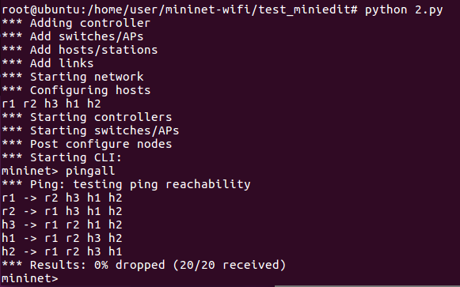

### Test3 - ovs
* 拓撲圖

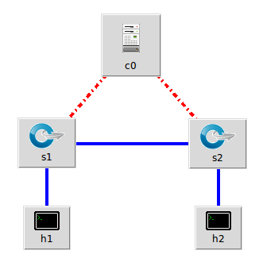

**c0 的 properties 的 Controller Type 為 OpenFlow Reference**

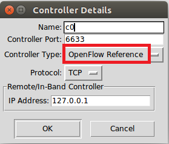

1. 查看程式碼

    ```py
    #!/usr/bin/python

    from mininet.net import Mininet
    from mininet.node import Controller, OVSKernelSwitch, Host
    from mininet.cli import CLI
    from mininet.link import TCLink, Intf
    from mininet.log import setLogLevel, info
    from subprocess import call


    def myNetwork():

        net = Mininet(topo=None,
                        build=False,
                        ipBase='10.0.0.0/8')

        info( '*** Adding controller\n' )
        c0 = net.addController(name='c0',
                            controller=Controller,
                            protocol='tcp',
                            port=6633)

        info( '*** Add switches/APs\n')
        s1 = net.addSwitch('s1', cls=OVSKernelSwitch)
        s2 = net.addSwitch('s2', cls=OVSKernelSwitch)

        info( '*** Add hosts/stations\n')
        h2 = net.addHost('h2', cls=Host, ip='10.0.0.2', defaultRoute=None)
        h1 = net.addHost('h1', cls=Host, ip='10.0.0.1', defaultRoute=None)

        info( '*** Add links\n')
        net.addLink(s1, s2)
        net.addLink(h1, s1)
        net.addLink(h2, s2)

        info( '*** Starting network\n')
        net.build()
        info( '*** Starting controllers\n')
        for controller in net.controllers:
            controller.start()

        info( '*** Starting switches/APs\n')
        net.get('s1').start([c0])
        net.get('s2').start([c0])

        info( '*** Post configure nodes\n')

        CLI(net)
        net.stop()


    if __name__ == '__main__':
        setLogLevel( 'info' )
        myNetwork()
    ```
2. 查看 s1、s2 的 ovs 規則，會發現是空的

    ```sh
    ovs-ofctl dump-flows s1
    ```
    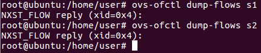

3. `h1 ping h2 -c 3`，再查看 ovs 規則

    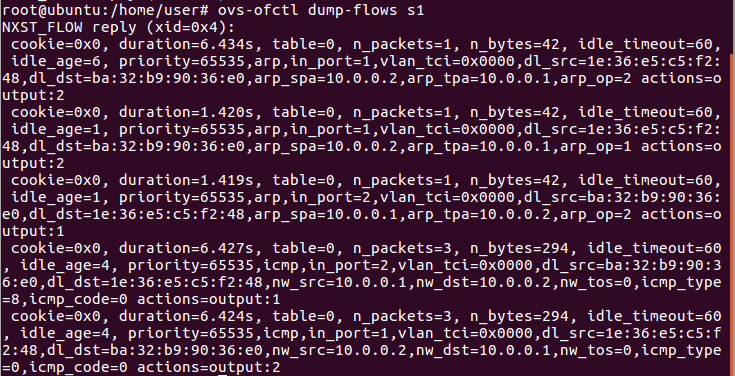

    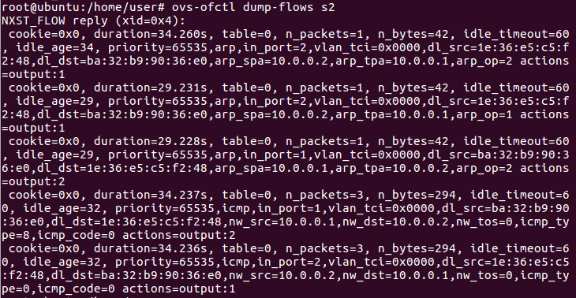

**c0 的 properties 的 Controller Type 為 Remote Controller**

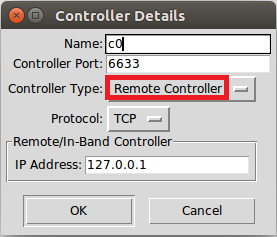

1. 查看程式碼

    ```py
    #!/usr/bin/python

    from mininet.net import Mininet
    from mininet.node import RemoteController, OVSKernelSwitch, Host
    from mininet.cli import CLI
    from mininet.link import TCLink, Intf
    from mininet.log import setLogLevel, info
    from subprocess import call


    def myNetwork():

        net = Mininet(topo=None,
                        build=False,
                        ipBase='10.0.0.0/8')

        info( '*** Adding controller\n' )
        c0 = net.addController(name='c0',
                            controller=RemoteController,
                            ip='127.0.0.1',
                            protocol='tcp',
                            port=6633)

        info( '*** Add switches/APs\n')
        s1 = net.addSwitch('s1', cls=OVSKernelSwitch)
        s2 = net.addSwitch('s2', cls=OVSKernelSwitch)

        info( '*** Add hosts/stations\n')
        h1 = net.addHost('h1', cls=Host, ip='10.0.0.1', defaultRoute=None)
        h2 = net.addHost('h2', cls=Host, ip='10.0.0.2', defaultRoute=None)

        info( '*** Add links\n')
        net.addLink(s1, s2)
        net.addLink(s1, h1)
        net.addLink(s2, h2)

        info( '*** Starting network\n')
        net.build()
        info( '*** Starting controllers\n')
        for controller in net.controllers:
            controller.start()

        info( '*** Starting switches/APs\n')
        net.get('s1').start([c0])
        net.get('s2').start([c0])

        info( '*** Post configure nodes\n')

        CLI(net)
        net.stop()


    if __name__ == '__main__':
        setLogLevel( 'info' )
        myNetwork()
    ```
2. 執行程式，測試 `h1 ping h2 -c 3`，會失敗，因為是 remote controller

    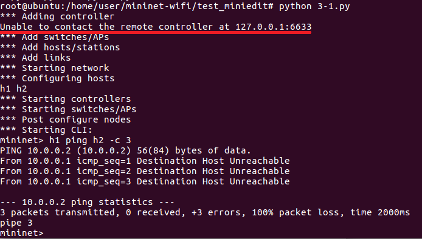

3. 可以切換到 `/home/user/ryu/ryu/app` 下，將提供的模組載入

    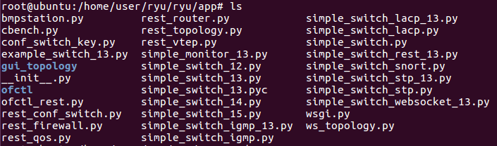

    * 使用預設 `simple_switch 1.0 version`，Ex. `simple_switch12` 為 1.2 version

    ```sh
    ryu-manager simple_switch.py
    ```
4. 再次測試 `h1 ping h2 -c 3`，查看 ovs 規則

    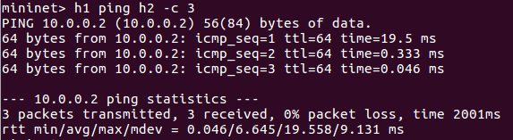

    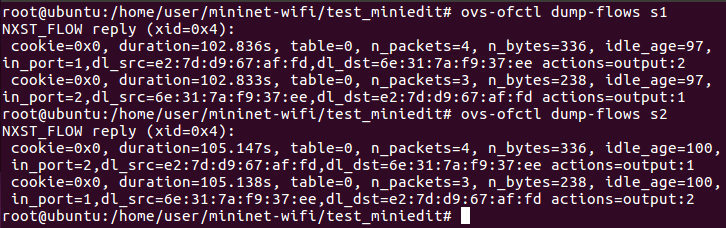

**補充：SDN 是一個較開放的平台，支援較多的 controller。例如，如果對 python 較熟悉，可以使用 ryu 裡的 controller；如果對 java 較熟悉，可以使用 oflops 裡的 controller**

# 期中題目
## Test - ovs
* 拓撲圖

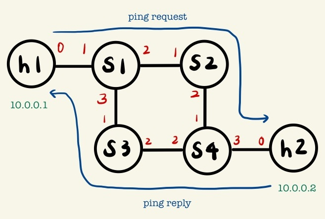

* 程式碼

```py
#!/usr/bin/env python
from mininet.cli import CLI
from mininet.net import Mininet
from mininet.link import Link,TCLink,Intf
from mininet.node import Controller,RemoteController

if '__main__' == __name__:
  net = Mininet(link=TCLink)
  h1 = net.addHost('h1')
  h2 = net.addHost('h2')
  s1 = net.addSwitch('s1')
  s2 = net.addSwitch('s2')
  s3 = net.addSwitch('s3')
  s4 = net.addSwitch('s4')
  c0 = net.addController('c0', controller=RemoteController)

  net.addLink(h1, s1)
  net.addLink(s1, s2)
  net.addLink(s2, s4)
  net.addLink(s1, s3)
  net.addLink(s3, s4)
  net.addLink(s4, h2)
  net.build()
  c0.start()
  s1.start([c0])
  s2.start([c0])
  s3.start([c0])
  s4.start([c0])

# rules for s1
  s1.cmd("ovs-ofctl add-flow s1 arp,arp_spa=10.0.0.1,arp_tpa=10.0.0.2,arp_op=1,actions=output:2")
  s1.cmd("ovs-ofctl add-flow s1 arp,arp_spa=10.0.0.2,arp_tpa=10.0.0.1,arp_op=2,actions=output:1")
  s1.cmd("ovs-ofctl add-flow s1 arp,arp_spa=10.0.0.2,arp_tpa=10.0.0.1,arp_op=1,actions=output:1")
  s1.cmd("ovs-ofctl add-flow s1 arp,arp_spa=10.0.0.1,arp_tpa=10.0.0.2,arp_op=2,actions=output:3")
  s1.cmd("ovs-ofctl add-flow s1 icmp,nw_src=10.0.0.1,nw_dst=10.0.0.2,icmp_type=8,icmp_code=0,actions=output:2")
  s1.cmd("ovs-ofctl add-flow s1 icmp,nw_src=10.0.0.2,nw_dst=10.0.0.1,icmp_type=0,icmp_code=0,actions=output:1")
  s1.cmd("ovs-ofctl add-flow s1 icmp,nw_src=10.0.0.2,nw_dst=10.0.0.1,icmp_type=8,icmp_code=0,actions=output:1")
  s1.cmd("ovs-ofctl add-flow s1 icmp,nw_src=10.0.0.1,nw_dst=10.0.0.2,icmp_type=0,icmp_code=0,actions=output:3")

# rules for s2
  s2.cmd("ovs-ofctl add-flow s2 arp,arp_spa=10.0.0.1,arp_tpa=10.0.0.2,arp_op=1,actions=output:2")
  s2.cmd("ovs-ofctl add-flow s2 arp,arp_spa=10.0.0.2,arp_tpa=10.0.0.1,arp_op=1,actions=output:1")
  s2.cmd("ovs-ofctl add-flow s2 icmp,nw_src=10.0.0.1,nw_dst=10.0.0.2,icmp_type=8,icmp_code=0,actions=output:2")
  s2.cmd("ovs-ofctl add-flow s2 icmp,nw_src=10.0.0.2,nw_dst=10.0.0.1,icmp_type=8,icmp_code=0,actions=output:1")

# rules for s3
  s3.cmd("ovs-ofctl add-flow s3 arp,arp_spa=10.0.0.1,arp_tpa=10.0.0.2,arp_op=2,actions=output:2")
  s3.cmd("ovs-ofctl add-flow s3 arp,arp_spa=10.0.0.2,arp_tpa=10.0.0.1,arp_op=2,actions=output:1")
  s3.cmd("ovs-ofctl add-flow s3 icmp,nw_src=10.0.0.2,nw_dst=10.0.0.1,icmp_type=0,icmp_code=0,actions=output:1")
  s3.cmd("ovs-ofctl add-flow s3 icmp,nw_src=10.0.0.1,nw_dst=10.0.0.2,icmp_type=0,icmp_code=0,actions=output:2")

# rules for s4
  s4.cmd("ovs-ofctl add-flow s4 arp,arp_spa=10.0.0.1,arp_tpa=10.0.0.2,arp_op=1,actions=output:3")
  s4.cmd("ovs-ofctl add-flow s4 arp,arp_spa=10.0.0.2,arp_tpa=10.0.0.1,arp_op=2,actions=output:2")
  s4.cmd("ovs-ofctl add-flow s4 arp,arp_spa=10.0.0.2,arp_tpa=10.0.0.1,arp_op=1,actions=output:1")
  s4.cmd("ovs-ofctl add-flow s4 arp,arp_spa=10.0.0.1,arp_tpa=10.0.0.2,arp_op=2,actions=output:3")
  s4.cmd("ovs-ofctl add-flow s4 icmp,nw_src=10.0.0.1,nw_dst=10.0.0.2,icmp_type=8,icmp_code=0,actions=output:3")
  s4.cmd("ovs-ofctl add-flow s4 icmp,nw_src=10.0.0.2,nw_dst=10.0.0.1,icmp_type=0,icmp_code=0,actions=output:2")
  s4.cmd("ovs-ofctl add-flow s4 icmp,nw_src=10.0.0.2,nw_dst=10.0.0.1,icmp_type=8,icmp_code=0,actions=output:1")
  s4.cmd("ovs-ofctl add-flow s4 icmp,nw_src=10.0.0.1,nw_dst=10.0.0.2,icmp_type=0,icmp_code=0,actions=output:3")

  CLI(net)
  net.stop()
```

**測試**

執行 `h1 ping h2 -c 3` 分別開啟 s2、s3 wireshark 查看 `s2-eth1`、`s3-eth1` 封包

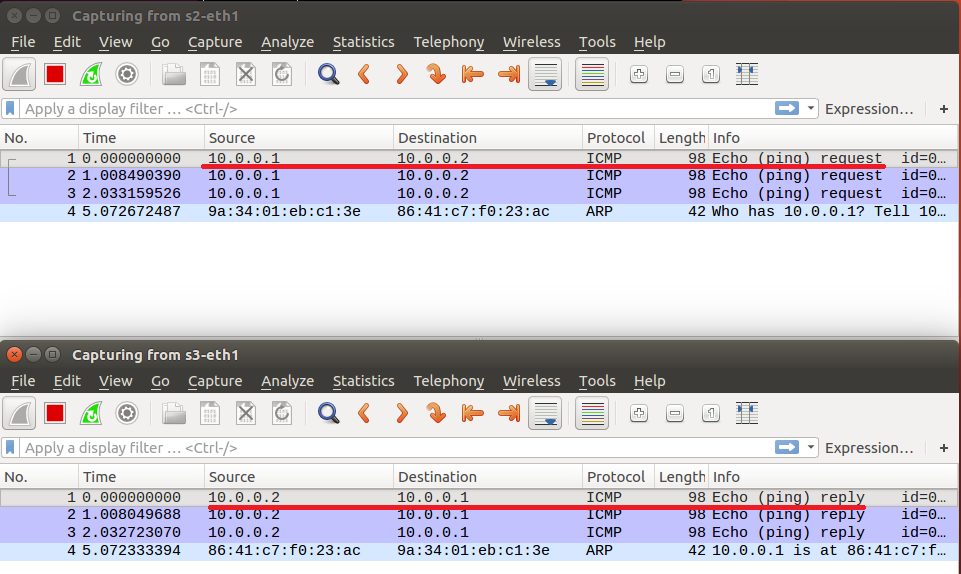

---
參考資料：
- [mininet-miniedit 1 - Chih-Heng Ke Youtube](https://www.youtube.com/watch?v=4uZz_9oM2T0)
- [mininet-miniedit 2 - Chih-Heng Ke Youtube](https://www.youtube.com/watch?v=FnPRYnE6dzw&ab_channel=Chih-HengKe%E6%9F%AF%E5%BF%97%E4%BA%A8)