* [Mininet]()
  - [Group Table]()
    - [Group Type]()
    - [Group Table]()
  - [Test1 - Load Balance (Select)]()
  - [Test2 - Fault Tolerance (Fast Failover)]()
  - [Test3 - Group Chining]()
  - [Test4 - SDN / NFV]()
---
# Mininet
## Group Table
* 參考 [深入OpenFlow協定 看Group Table設定流程 - 網管人](https://www.netadmin.com.tw/netadmin/zh-tw/technology/9FF6A417220F400884C788AB00FA3750)

### Group Type
* All：執行**所有** Action Buckets 中的動作，主要在處理 Multicast 和 Broadcast 封包
* Select：執行**一個** Action Bucket 中的動作
* Indirect：執行**既有定義**的某個 Action Bucket 中的動作
* Fast Failover：執行**第一個** Live Action Bucket 中的動作

### Group Table
1. Load Balance (Select)
2. Fault Tolerance (Fast Failover, ff)
3. Mix `1` and `2`

## Test1 - Load Balance (Select)
* 拓撲圖

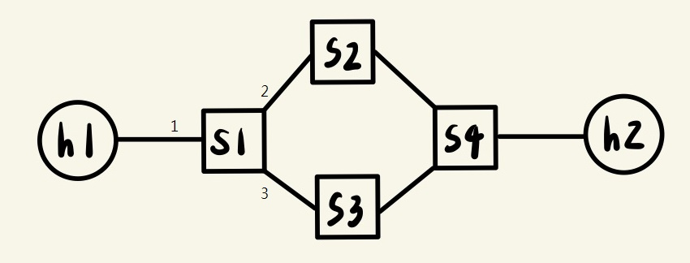

**當 h1 至 h2 有兩種不同的傳輸路徑，利用 Group Table 中的 Select 來有效利用兩條路徑**

  1. h1-s1-s2-s4-h2
  2. h1-s1-s3-s4-h2

**實作**
1. 新建一個資料夾，裡面新增兩個檔案

* `select.py`

```py
from mininet.net import Mininet
from mininet.node import Controller, RemoteController, OVSKernelSwitch, UserSwitch, OVSSwitch
from mininet.cli import CLI
from mininet.log import setLogLevel
from mininet.link import Link, TCLink
 
def topology():
  net = Mininet( controller=RemoteController, link=TCLink, switch=OVSKernelSwitch)
 
  # Add hosts and switches
  h1 = net.addHost('h1', mac="00:00:00:00:00:01" )
  h2 = net.addHost('h2', mac="00:00:00:00:00:02" )
 
  s1 = net.addSwitch('s1', protocols=["OpenFlow10,OpenFlow13"], listenPort=6634 )
  s2 = net.addSwitch('s2', protocols=["OpenFlow10,OpenFlow13"], listenPort=6635 )
  s3 = net.addSwitch('s3', protocols=["OpenFlow10,OpenFlow13"], listenPort=6636 )
  s4 = net.addSwitch('s4', protocols=["OpenFlow10,OpenFlow13"], listenPort=6637 )
 
  c0 = net.addController('c0', controller=RemoteController, ip='127.0.0.1', port=6633 )
 
  net.addLink(h1, s1)
  net.addLink(h2, s4)
  net.addLink(s1, s2)
  net.addLink(s1, s3)
  net.addLink(s2, s4)
  net.addLink(s3, s4)
  net.build()
  c0.start()
  s1.start([c0])
  s2.start([c0])
  s3.start([c0])
  s4.start([c0])
 
  print "*** Running CLI"
  CLI(net)

  print "*** Stopping network"
  net.stop()

if __name__ == '__main__':
    setLogLevel('info')
    topology()
```

* `rule.sh`

```sh
ovs-ofctl -O OpenFlow13 add-flow s2 in_port=1,actions=output:2
ovs-ofctl -O OpenFlow13 add-flow s2 in_port=2,actions=output:1
ovs-ofctl -O OpenFlow13 add-flow s3 in_port=1,actions=output:2
ovs-ofctl -O OpenFlow13 add-flow s3 in_port=2,actions=output:1
ovs-ofctl -O OpenFlow13 add-flow s4 in_port=2,actions=output:1
ovs-ofctl -O OpenFlow13 add-flow s4 in_port=3,actions=output:1
ovs-ofctl -O OpenFlow13 add-flow s4 in_port=1,actions=output:3
ovs-ofctl -O OpenFlow13 add-flow s1 in_port=2,actions=output:1
ovs-ofctl -O OpenFlow13 add-flow s1 in_port=3,actions=output:1
ovs-ofctl -O OpenFlow13 add-group s1 group_id=5,type=select,bucket=output:2,bucket=output:3
ovs-ofctl -O OpenFlow13 add-flow s1 in_port=1,actions=group:5
```

2. 開啟兩台終端機，一台執行 `select.py`，一台執行 `rule.sh`

```sh
python select.py

// 另一個 terminal
chmod +x rule.sh
./rule.sh
```
3. 查看 s1 port 的狀況

```sh
ovs-ofctl -O OpenFlow13 dump-ports s1
```
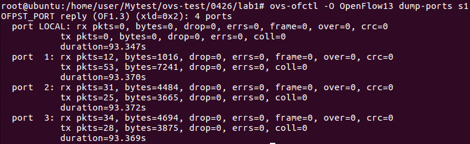

4. 在 mininet `xterm h1 h2` 

測試 **TCP**
```sh
//h2
iperf -s -i 1

//h1
iperf -c 10.0.0.2 -t 10
```

**查看 s1 port 的狀況**

先是 port 3 改變，h1 再重複執行 `iperf -c 10.0.0.1 -t 10`

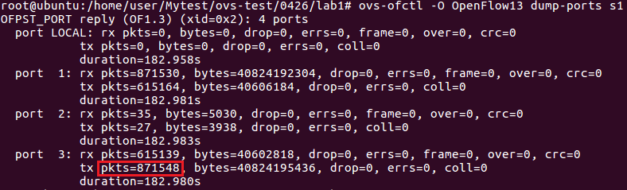

會發現變成 port 2 改變

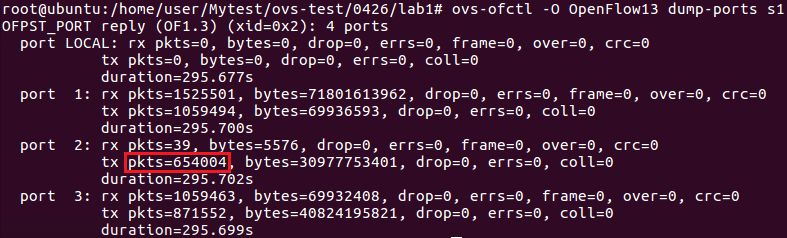


再來測試 **UDP**
```sh
//h2
iperf -s -i 1 -u

//h1
iperf -c 10.0.0.2 -u -b 1M -t 100
```
* 查看 s1 port 的狀況會發現，只有 port 2 會增加，原因是因為目前的 Group Table Select 只適用於 TCP，不適用於 UDP

## Test2 - Fault Tolerance (Fast Failover)
* 拓撲圖


**當第一條路徑 (port2) 出現問題，會自動切換成第二條路徑 (port3)，無須人工介入**

**實作**
1. 新建一個資料夾，裡面新增兩個檔案

* `fast-failover.py`

```py
from mininet.net import Mininet
from mininet.node import Controller, RemoteController, OVSKernelSwitch, UserSwitch, OVSSwitch
from mininet.cli import CLI
from mininet.log import setLogLevel
from mininet.link import Link, TCLink
 
def topology():
  net = Mininet( controller=RemoteController, link=TCLink, switch=OVSKernelSwitch)
 
  # Add hosts and switches
  h1 = net.addHost('h1', mac="00:00:00:00:00:01" )
  h2 = net.addHost('h2', mac="00:00:00:00:00:02" )
 
  s1 = net.addSwitch('s1', protocols=["OpenFlow10,OpenFlow13"], listenPort=6634 )
  s2 = net.addSwitch('s2', protocols=["OpenFlow10,OpenFlow13"], listenPort=6635 )
  s3 = net.addSwitch('s3', protocols=["OpenFlow10,OpenFlow13"], listenPort=6636 )
  s4 = net.addSwitch('s4', protocols=["OpenFlow10,OpenFlow13"], listenPort=6637 )
 
  c0 = net.addController('c0', controller=RemoteController, ip='127.0.0.1', port=6633 )
 
  net.addLink(h1, s1)
  net.addLink(h2, s4)
  net.addLink(s1, s2)
  net.addLink(s1, s3)
  net.addLink(s2, s4)
  net.addLink(s3, s4)
  net.build()
  c0.start()
  s1.start([c0])
  s2.start([c0])
  s3.start([c0])
  s4.start([c0])
 
  print "*** Running CLI"
  CLI(net)

  print "*** Stopping network"
  net.stop()

if __name__ == '__main__':
    setLogLevel('info')
    topology()
```

* `rule.sh`

```sh
ovs-ofctl -O OpenFlow13 add-flow s2 in_port=1,actions=output:2
ovs-ofctl -O OpenFlow13 add-flow s2 in_port=2,actions=output:1
ovs-ofctl -O OpenFlow13 add-flow s3 in_port=1,actions=output:2
ovs-ofctl -O OpenFlow13 add-flow s3 in_port=2,actions=output:1
ovs-ofctl -O OpenFlow13 add-flow s4 in_port=2,actions=output:1
ovs-ofctl -O OpenFlow13 add-flow s4 in_port=3,actions=output:1
ovs-ofctl -O OpenFlow13 add-flow s4 in_port=1,actions=output:3
ovs-ofctl -O OpenFlow13 add-flow s1 in_port=2,actions=output:1
ovs-ofctl -O OpenFlow13 add-flow s1 in_port=3,actions=output:1
ovs-ofctl -O OpenFlow13 add-group s1 group_id=4,type=ff,bucket=watch_port:2,output:2,bucket=watch_port:3,output:3
ovs-ofctl -O OpenFlow13 add-flow s1 in_port=1,actions=group:4
```

2. 開啟兩台終端機，一台執行 `fast-failover.py`，一台執行 `rule.sh`
```sh
python fast-failover.py

// 另一個 terminal
chmod +x rule.sh
./rule.sh
```

3. 觀察 s1 port 的狀況

```sh
ovs-ofctl -O OpenFlow13 dump-ports s1
```

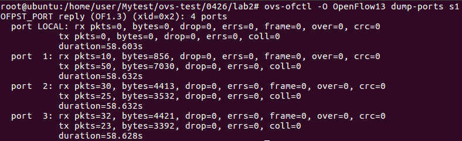

4. 在 mininet `xterm h1 h2`
* **TCP** 和 **UDP** 皆通用

測試 **UDP**

```sh
//h2
iperf -s -i 1 -u

//h1
iperf -c 10.0.0.2 -u -b 1M -t 100
```
**觀察 s1 port 的狀況**

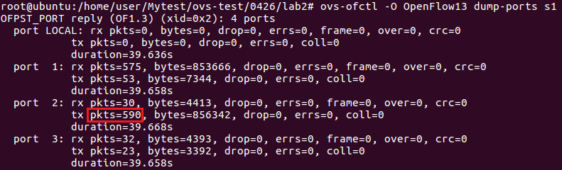

> 會發現只有 port 2 會增加

5. 讓 port 2 中斷，觀察 s1 port 的狀況

**Mininet**
```sh
mininet> link s1 s2 down
```

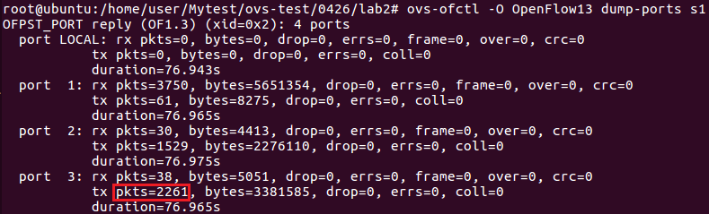

> port 3 增加了

6. 恢復 port 2，觀察 s1 port 的狀況

**Mininet**
```sh
mininet> link s1 s2 up
```


> 回到預設 port 2

## Test3 - Group Chining
* 拓撲圖

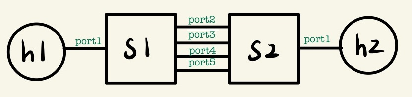

port 2、port 4 一組，port 3、port 5 一組

**實作**
1. 新建一個資料夾，裡面新增兩個檔案

* `GroupChining.py`

```py
from mininet.net import Mininet
from mininet.node import Controller, RemoteController, OVSKernelSwitch, UserSwitch, OVSSwitch
from mininet.cli import CLI
from mininet.log import setLogLevel
from mininet.link import Link, TCLink
 
def topology():
  net = Mininet( controller=RemoteController, link=TCLink, switch=OVSKernelSwitch)

  # Add hosts and switches
  h1= net.addHost('h1', mac="00:00:00:00:00:01" )
  h2 = net.addHost('h2', mac="00:00:00:00:00:02" )
  s1 = net.addSwitch('s1', protocols=["OpenFlow10,OpenFlow13"], listenPort=6634 )
  s2 = net.addSwitch('s2', protocols=["OpenFlow10,OpenFlow13"], listenPort=6635 )
  c0 = net.addController('c0', controller=RemoteController, ip='127.0.0.1', port=6633 )
  linkopt={'bw':10}
  linkopt2={'bw':100}
  net.addLink(h1, s1, cls=TCLink, **linkopt2)
  net.addLink(h2, s2, cls=TCLink, **linkopt2)
  net.addLink(s1, s2, cls=TCLink, **linkopt)
  net.addLink(s1, s2, cls=TCLink, **linkopt)
  net.addLink(s1, s2, cls=TCLink, **linkopt)
  net.addLink(s1, s2, cls=TCLink, **linkopt)

  net.build()
  c0.start()
  s1.start([c0])
  s2.start([c0])

  print "*** Running CLI"
  h1.cmd("arp -s 10.0.0.2 00:00:00:00:00:02")
  h2.cmd("arp -s 10.0.0.1 00:00:00:00:00:01")
  CLI(net)
  print "*** Stopping network"
  net.stop()
 
if __name__ == '__main__':
  setLogLevel('info')
  topology()  
```

* `rule.sh`

```sh
ovs-ofctl -O OpenFlow13 add-flow s2 in_port=2,actions=output:1
ovs-ofctl -O OpenFlow13 add-flow s2 in_port=3,actions=output:1
ovs-ofctl -O OpenFlow13 add-flow s2 in_port=4,actions=output:1
ovs-ofctl -O OpenFlow13 add-flow s2 in_port=5,actions=output:1
ovs-ofctl -O OpenFlow13 add-flow s2 in_port=1,actions=output:5
ovs-ofctl -O OpenFlow13 add-flow s1 in_port=5,actions=output:1
ovs-ofctl -O OpenFlow13 add-group s1 group_id=2,type=select,bucket=output:2,bucket=output:4
ovs-ofctl -O OpenFlow13 add-group s1 group_id=3,type=select,bucket=output:3,bucket=output:5
ovs-ofctl -O OpenFlow13 add-group s1 group_id=1,type=ff,bucket=watch_port:2,group:2,bucket=watch_port:3,group:3
ovs-ofctl -O OpenFlow13 add-flow s1 in_port=1,actions=group:1
```

2. 開啟兩台終端機，一台執行 `GroupChining.py`，一台執行 `rule.sh`
```sh
python GroupChining.py

// 另一個 terminal
chmod +x rule.sh
./rule.sh
```

3. 查看 s1、s2 規則、s1 port
```sh
ovs-ofctl -O OpenFlow13 dump-flows s1
ovs-ofctl -O OpenFlow13 dump-flows s2
ovs-ofctl -O OpenFlow13 dump-groups s1
```

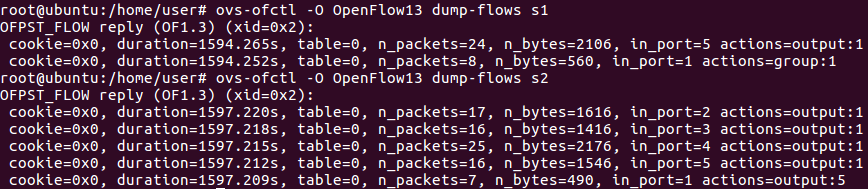

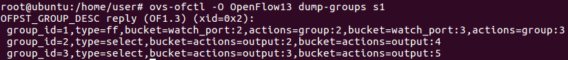

```sh
ovs-ofctl -O OpenFlow13 dump-ports s1
```

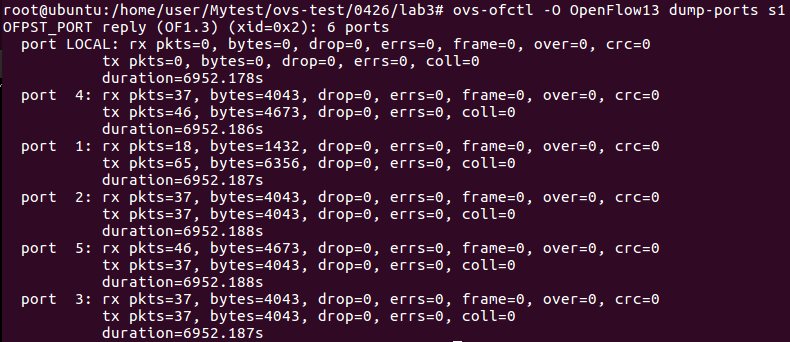

4. 在 mininet `xterm h1 h2 h1 h2`

```sh
//h2
iperf -s -i 1 -p 5555

//h1
iperf -c 10.0.0.2 -p 5555 -t 1000

//h2 
iperf -s -i 1 -p 5556

//h1
iperf -c 10.0.0.2 -p 5556 -t 1000
```

**觀察 s1 port 的狀況，可以發現 port 2、port 4 有資料流**

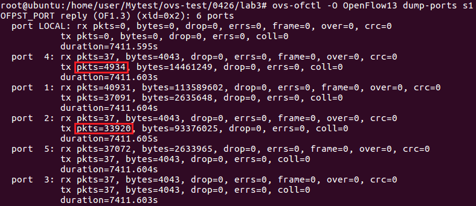

**將 s1 port2 down**

```sh
ovs-ofctl mod-port s1 s1-eth2 down
```

**觀察 s1 port 的狀況，可以發現 port 3、port 5 有資料流**

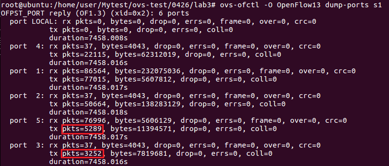

**將 s1 port2 up，port 2、port 4 恢復資料流**

```sh
ovs-ofctl mod-port s1 s1-eth2 up
```
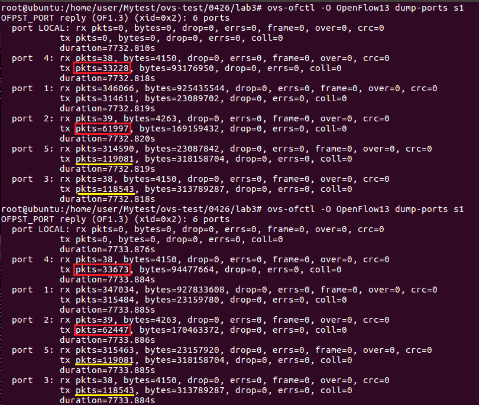

## Test4 - SDN / NFV
SDN (Software Defined Networking)：Change the Routing Path，控制資料的傳送

NFV (Network Function Virtualization)：網路功能虛擬化

* 拓撲圖

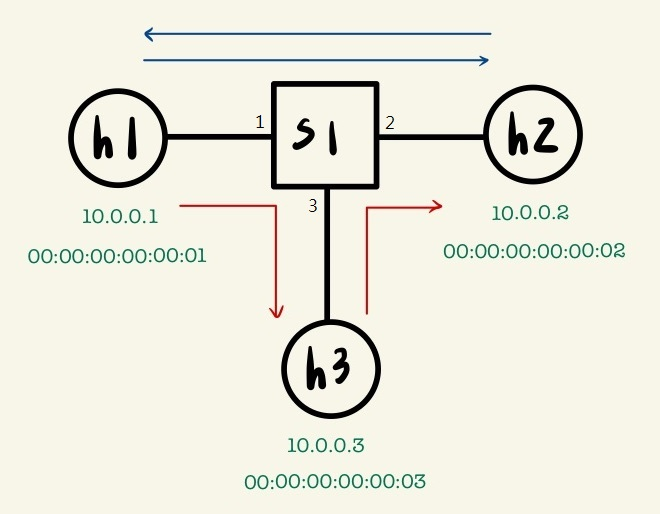

可以在 h3 部署減速器或類似防火牆、防毒的軟體，在資料要從 h1 送到 h2 時，可以先傳送到 h3 檢查之後再轉發至 h2。

**實驗**

在 h2 開啟 80 port 和 8080 port 的網頁伺服器，在 h3 允許訪問 8080 port，而訪問 80 port 的要 drop 

* `NFV.py`
```py
#!/usr/bin/env python
from mininet.cli import CLI
from mininet.net import Mininet
from mininet.link import Link,TCLink,Intf
from mininet.node import Controller,RemoteController
 
if '__main__' == __name__:
  net = Mininet(link=TCLink)
  h1 = net.addHost('h1', ip="10.0.0.1/24", mac="00:00:00:00:00:01")
  h2 = net.addHost('h2', ip="10.0.0.2/24", mac="00:00:00:00:00:02")
  h3 = net.addHost('h3', ip="10.0.0.3/24", mac="00:00:00:00:00:03")
  s1 = net.addSwitch('s1')
  c0 = net.addController('c0', controller=RemoteController)
  net.addLink(h1, s1)
  net.addLink(h2, s1)
  net.addLink(h3, s1)
  net.build()
  c0.start()
  s1.start([c0])

  # rules for s1
  h1.cmd("arp -s 10.0.0.2 00:00:00:00:00:02")
  h1.cmd("arp -s 10.0.0.3 00:00:00:00:00:03")
  h2.cmd("arp -s 10.0.0.1 00:00:00:00:00:01")
  h2.cmd("arp -s 10.0.0.3 00:00:00:00:00:03")
  h3.cmd("arp -s 10.0.0.1 00:00:00:00:00:01")
  h3.cmd("arp -s 10.0.0.2 00:00:00:00:00:02") 
  h3.cmd("echo 1 > /proc/sys/net/ipv4/ip_forward")
  h3.cmd("iptables -A FORWARD -p tcp --destination-port 8080 -j ACCEPT")
  h3.cmd("iptables -A FORWARD -p tcp --destination-port 80 -j DROP")
  s1.cmd("ovs-ofctl add-flow s1 priority=1,in_port=1,actions=output:2")
  s1.cmd("ovs-ofctl add-flow s1 priority=1,in_port=2,actions=output:1")
  s1.cmd("ovs-ofctl add-flow s1 priority=10,ip,in_port=1,actions=mod_dl_dst=00:00:00:00:00:03,output:3")
  s1.cmd("ovs-ofctl add-flow s1 priority=10,ip,in_port=2,actions=mod_dl_dst=00:00:00:00:00:03,output:3")
  s1.cmd("ovs-ofctl add-flow s1 priority=10,ip,in_port=3,nw_dst=10.0.0.2,actions=mod_dl_dst=00:00:00:00:00:02,output:2")
  s1.cmd("ovs-ofctl add-flow s1 priority=10,ip,in_port=3,nw_dst=10.0.0.1,actions=mod_dl_dst=00:00:00:00:00:01,output:1")


  CLI(net)
  net.stop()
```

**Ubuntu**
```sh
python NFV.py
mininet> xterm h2 h2
```

**h2 建立兩個網頁伺服器**
```sh
python -m SimpleHTTPServer 80
python -m SimpleHTTPServer 8080
```

**測試**
```sh
mininet> h1 ping h2 -c 2  # ok
mininet> h1 curl 10.0.0.2:8080  # ok
mininet> h1 curl 10.0.0.2:80  # fail
```
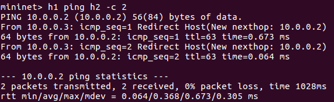

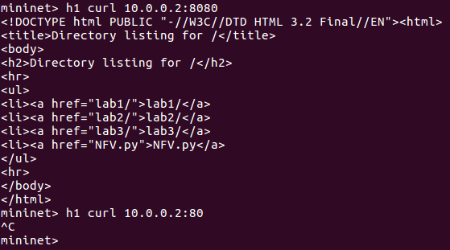

---
參考資料：
- [深入OpenFlow協定 看Group Table設定流程 - 網管人](https://www.netadmin.com.tw/netadmin/zh-tw/technology/9FF6A417220F400884C788AB00FA3750)
- [mininet-ovs 4 - Chih-Heng Ke Youtube](https://www.youtube.com/watch?v=dNovnDE68Wc&ab_channel=Chih-HengKe)
- [mininet-ovs 5 - Chih-Heng Ke Youtube](https://www.youtube.com/watch?v=4HlIRAwumlw&ab_channel=Chih-HengKe)
- [mininet-ovs 6 - Chih-Heng Ke Youtube](https://www.youtube.com/watch?v=c5fpkUEhKlg&ab_channel=Chih-HengKe%E6%9F%AF%E5%BF%97%E4%BA%A8)
- [Test Fast-Failover Group in OpenFlow 1.3 - smallko](http://csie.nqu.edu.tw/smallko/sdn/group-fastfailover.htm)
- [Test Select Group in OpenFlow 1.3 - smallko](http://csie.nqu.edu.tw/smallko/sdn/group-select.htm)
- [Test Group Chaining in OpenFlow 1.3 - smallko](http://csie.nqu.edu.tw/smallko/sdn/group_chaining.htm)
