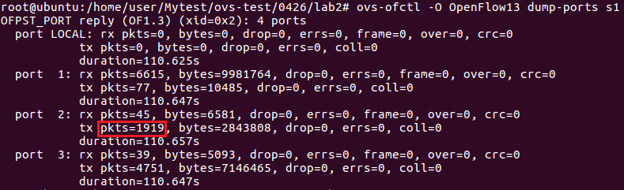

* []()
    - []()
    - []()

---
# Mininet
## Group Table
* 參考 [深入OpenFlow協定 看Group Table設定流程 - 網管人](https://www.netadmin.com.tw/netadmin/zh-tw/technology/9FF6A417220F400884C788AB00FA3750)

### Group Type
* All：執行**所有** Action Buckets 中的動作，主要在處理 Multicast 和 Broadcast 封包
* Select：執行**一個** Action Bucket 中的動作
* Indirect：執行**既有定義**的某個 Action Bucket 中的動作
* Fast Failover：執行**第一個** Live Action Bucket 中的動作

### Group Table
1. Load Balance (Select)
2. Fault Tolerance (Fast Failover, ff)
3. Mix `1` and `2`

## Test1 - Load Balance (Select)
* 拓撲圖


**當 h1 至 h2 有兩種不同的傳輸路徑，利用 Group Table 中的 Select 來有效利用兩條路徑**

  1. h1-s1-s2-s4-h2
  2. h1-s1-s3-s4-h2

**實作**
1. 新建一個資料夾，裡面新增兩個檔案

* `select.py`

```py
from mininet.net import Mininet
from mininet.node import Controller, RemoteController, OVSKernelSwitch, UserSwitch, OVSSwitch
from mininet.cli import CLI
from mininet.log import setLogLevel
from mininet.link import Link, TCLink
 
def topology():
  net = Mininet( controller=RemoteController, link=TCLink, switch=OVSKernelSwitch)
 
  # Add hosts and switches
  h1 = net.addHost('h1', mac="00:00:00:00:00:01" )
  h2 = net.addHost('h2', mac="00:00:00:00:00:02" )
 
  s1 = net.addSwitch('s1', protocols=["OpenFlow10,OpenFlow13"], listenPort=6634 )
  s2 = net.addSwitch('s2', protocols=["OpenFlow10,OpenFlow13"], listenPort=6635 )
  s3 = net.addSwitch('s3', protocols=["OpenFlow10,OpenFlow13"], listenPort=6636 )
  s4 = net.addSwitch('s4', protocols=["OpenFlow10,OpenFlow13"], listenPort=6637 )
 
  c0 = net.addController('c0', controller=RemoteController, ip='127.0.0.1', port=6633 )
 
  net.addLink(h1, s1)
  net.addLink(h2, s4)
  net.addLink(s1, s2)
  net.addLink(s1, s3)
  net.addLink(s2, s4)
  net.addLink(s3, s4)
  net.build()
  c0.start()
  s1.start([c0])
  s2.start([c0])
  s3.start([c0])
  s4.start([c0])
 
  print "*** Running CLI"
  CLI(net)

  print "*** Stopping network"
  net.stop()

if __name__ == '__main__':
    setLogLevel('info')
    topology()
```

* `rule.sh`

```sh
ovs-ofctl -O OpenFlow13 add-flow s2 in_port=1,actions=output:2
ovs-ofctl -O OpenFlow13 add-flow s2 in_port=2,actions=output:1
ovs-ofctl -O OpenFlow13 add-flow s3 in_port=1,actions=output:2
ovs-ofctl -O OpenFlow13 add-flow s3 in_port=2,actions=output:1
ovs-ofctl -O OpenFlow13 add-flow s4 in_port=2,actions=output:1
ovs-ofctl -O OpenFlow13 add-flow s4 in_port=3,actions=output:1
ovs-ofctl -O OpenFlow13 add-flow s4 in_port=1,actions=output:3
ovs-ofctl -O OpenFlow13 add-flow s1 in_port=2,actions=output:1
ovs-ofctl -O OpenFlow13 add-flow s1 in_port=3,actions=output:1
ovs-ofctl -O OpenFlow13 add-group s1 group_id=5,type=select,bucket=output:2,bucket=output:3
ovs-ofctl -O OpenFlow13 add-flow s1 in_port=1,actions=group:5
```

2. 開啟兩台終端機，一台執行 `select.py`，一台執行 `rule.sh`

```sh
python select.py

// 另一個 terminal
chmod +x rule.sh
./rule.sh
```
3. 查看 s1 port 的狀況

```sh
ovs-ofctl -O OpenFlow13 dump-ports s1
```


4. 在 mininet `xterm h1 h2` 

測試 **TCP**
```sh
//h2
iperf -s -i 1

//h1
iperf -c 10.0.0.2 -t 10
```

**查看 s1 port 的狀況**

先是 port 3 改變，h1 再重複執行 `iperf -c 10.0.0.1 -t 10`


會發現變成 port 2 改變


再來測試 **UDP**
```sh
//h2
iperf -s -i 1 -u

//h1
iperf -c 10.0.0.2 -u -b 1M -t 100
```
* 查看 s1 port 的狀況會發現，只有 port 2 會增加，原因是因為目前的 Group Table Select 只適用於 TCP，不適用於 UDP

## Test2 - Fault Tolerance (Fast Failover)
* 拓撲圖


**當第一條路徑 (port2) 出現問題，會自動切換成第二條路徑 (port3)**

**實作**
1. 新建一個資料夾，裡面新增兩個檔案

* `fast-failover.py`

```py
from mininet.net import Mininet
from mininet.node import Controller, RemoteController, OVSKernelSwitch, UserSwitch, OVSSwitch
from mininet.cli import CLI
from mininet.log import setLogLevel
from mininet.link import Link, TCLink
 
def topology():
  net = Mininet( controller=RemoteController, link=TCLink, switch=OVSKernelSwitch)
 
  # Add hosts and switches
  h1 = net.addHost('h1', mac="00:00:00:00:00:01" )
  h2 = net.addHost('h2', mac="00:00:00:00:00:02" )
 
  s1 = net.addSwitch('s1', protocols=["OpenFlow10,OpenFlow13"], listenPort=6634 )
  s2 = net.addSwitch('s2', protocols=["OpenFlow10,OpenFlow13"], listenPort=6635 )
  s3 = net.addSwitch('s3', protocols=["OpenFlow10,OpenFlow13"], listenPort=6636 )
  s4 = net.addSwitch('s4', protocols=["OpenFlow10,OpenFlow13"], listenPort=6637 )
 
  c0 = net.addController('c0', controller=RemoteController, ip='127.0.0.1', port=6633 )
 
  net.addLink(h1, s1)
  net.addLink(h2, s4)
  net.addLink(s1, s2)
  net.addLink(s1, s3)
  net.addLink(s2, s4)
  net.addLink(s3, s4)
  net.build()
  c0.start()
  s1.start([c0])
  s2.start([c0])
  s3.start([c0])
  s4.start([c0])
 
  print "*** Running CLI"
  CLI(net)

  print "*** Stopping network"
  net.stop()

if __name__ == '__main__':
    setLogLevel('info')
    topology()
```

* `rule.sh`
```sh
ovs-ofctl -O OpenFlow13 add-flow s2 in_port=1,actions=output:2
ovs-ofctl -O OpenFlow13 add-flow s2 in_port=2,actions=output:1
ovs-ofctl -O OpenFlow13 add-flow s3 in_port=1,actions=output:2
ovs-ofctl -O OpenFlow13 add-flow s3 in_port=2,actions=output:1
ovs-ofctl -O OpenFlow13 add-flow s4 in_port=2,actions=output:1
ovs-ofctl -O OpenFlow13 add-flow s4 in_port=3,actions=output:1
ovs-ofctl -O OpenFlow13 add-flow s4 in_port=1,actions=output:3
ovs-ofctl -O OpenFlow13 add-flow s1 in_port=2,actions=output:1
ovs-ofctl -O OpenFlow13 add-flow s1 in_port=3,actions=output:1
ovs-ofctl -O OpenFlow13 add-group s1 group_id=4,type=ff,bucket=watch_port:2,output:2,bucket=watch_port:3,output:3
ovs-ofctl -O OpenFlow13 add-flow s1 in_port=1,actions=group:4
```

2. 開啟兩台終端機，一台執行 `fast-failover.py`，一台執行 `rule.sh`
```sh
python fast-failover.py

// 另一個 terminal
chmod +x rule.sh
./rule.sh
```
3. 觀察 s1 port 的狀況

```sh
ovs-ofctl -O OpenFlow13 dump-ports s1
```


4. 在 mininet `xterm h1 h2`

測試 **UDP**

```sh
//h2
iperf -s -i 1 -u

//h1
iperf -c 10.0.0.2 -u -b 1M -t 100
```
**觀察 s1 port 的狀況**


> 會發現只有 port 2 會增加

5. 讓 port 2 中斷，觀察 s1 port 的狀況

**Mininet**
```sh
mininet> link s1 s2 down
```


> port 3 增加了

6. 恢復 port 2，觀察 s1 port 的狀況

**Mininet**
```sh
mininet> link s1 s2 up
```



> 回到預設 port 2

## Test3 - 
* 拓撲圖


---
參考資料：
- [深入OpenFlow協定 看Group Table設定流程 - 網管人](https://www.netadmin.com.tw/netadmin/zh-tw/technology/9FF6A417220F400884C788AB00FA3750)
- [mininet-ovs 4 - Chih-Heng Ke Youtube](https://www.youtube.com/watch?v=dNovnDE68Wc&ab_channel=Chih-HengKe)
- [mininet-ovs 5 - Chih-Heng Ke Youtube](https://www.youtube.com/watch?v=4HlIRAwumlw&ab_channel=Chih-HengKe)
- [Test Fast-Failover Group in OpenFlow 1.3 - smallko](http://csie.nqu.edu.tw/smallko/sdn/group-fastfailover.htm)
- [Test Select Group in OpenFlow 1.3 - smallko](http://csie.nqu.edu.tw/smallko/sdn/group-select.htm)
- [Test Group Chaining in OpenFlow 1.3 - smallko](http://csie.nqu.edu.tw/smallko/sdn/group_chaining.htm)
