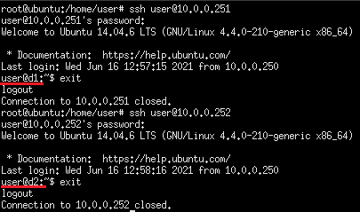
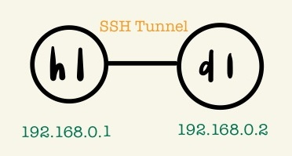

* [Mininet-wifiP4](https://github.com/linjiachi/Linux_note/blob/master/109-2/20210503.md#mininet-wifip4)
  - [Containernet (Dockernet)](https://github.com/linjiachi/Linux_note/blob/master/109-2/20210503.md#containernet-dockernet)
    - [Test1 - containernet](https://github.com/linjiachi/Linux_note/blob/master/109-2/20210503.md#test1---containernet)
        - [用 hydra 來破解 ssh 的用戶名/密碼](https://github.com/linjiachi/Linux_note/blob/master/109-2/20210503.md#%E7%94%A8-hydra-%E4%BE%86%E7%A0%B4%E8%A7%A3-ssh-%E7%9A%84%E7%94%A8%E6%88%B6%E5%90%8D%E5%AF%86%E7%A2%BC)
    - [Test2 - Quagga](https://github.com/linjiachi/Linux_note/blob/master/109-2/20210503.md#test2---quagga)
        - [靜態路由 Static Routing](https://github.com/linjiachi/Linux_note/blob/master/109-2/20210503.md#-%E9%9D%9C%E6%85%8B%E8%B7%AF%E7%94%B1-static-routing)
        - [動態路由 Dynamic Routing](https://github.com/linjiachi/Linux_note/blob/master/109-2/20210503.md#-%E5%8B%95%E6%85%8B%E8%B7%AF%E7%94%B1-dynamic-routing)
    - [Test3 - SSH Tunnel](https://github.com/linjiachi/Linux_note/blob/master/109-2/20210503.md#test3---ssh-tunnel)
        - [Local Port Forwarding](https://github.com/linjiachi/Linux_note/blob/master/109-2/20210503.md#local-port-forwarding)
        - [Local Port Forwarding 2](https://github.com/linjiachi/Linux_note/blob/master/109-2/20210503.md#local-port-forwarding-2)
        - [Remote Port Forwarding](https://github.com/linjiachi/Linux_note/blob/master/109-2/20210503.md#remote-port-forwarding)
  - [Mininet-wifip4](https://github.com/linjiachi/Linux_note/blob/master/109-2/20210503.md#mininet-wifip4-1)
---
# Mininet-wifiP4
在此虛擬機裡操作，老師的虛擬機 [mininet-wifip4](https://drive.google.com/file/d/11DVZxhi7OMKTOXbUvWu6GxY0RNQZapiY/view?usp=sharing)

## Containernet (Dockernet)
Mininet 的延伸，由於 Mininet host 沒有檔案的隔離，他們共用底層相同的檔案，他們的 / 目錄相同。

* 開啟終端機切換至 Containernet 的操作環境
```sh
// 記得切換到超級使用者

cd /home/user/containernet
python3 ./setup.py install
```

可以測試是否切換成功
```sh
cd /home/user/containernet/example
python3 dockerhost.py
```
### Test1 - containernet
* 拓撲圖


在不同的 host，採用不同的 image，去執行不同的 ssh server

1. 執行 docker
```sh
docker image
docker run -it ubuntu:trusty
```

2. docker：安裝並開啟 ssh server
* 在 docker 安裝套件可以先執行 `apt update`
* 在 docker 中啟動套件 `/etc/init.d/[套件] [start/stop/status]`

```sh
apt update
apt install openssh-server
/etc/init.d/ssh start
apt install net-tools   # ifconfig
apt install iputils-ping    # ping
```

3. docker：新增一個使用者/密碼 user/user1
```sh
adduser user
```


開啟另一個終端機
```sh
ssh user@172.17.0.2
exit
```


4. Ubuntu：從容器創建一個新的 image
```sh
docker ps
docker commit 2bd ubuntu:sshd1
```
5. docker：新增一個使用者/密碼 user/user2
```sh
passwd user
docker commit 2bd ubuntu:sshd2
```

6. 新增一個檔案，並執行
* `1.py`

    ```py
    #!/usr/bin/python
    """
    This is the most simple example to showcase Containernet.
    """
    from mininet.net import Containernet
    from mininet.node import Controller
    from mininet.cli import CLI
    from mininet.link import TCLink
    from mininet.log import info, setLogLevel
    setLogLevel('info')

    net = Containernet(controller=Controller)
    info('*** Adding controller\n')
    net.addController('c0')
    info('*** Adding docker containers\n')
    h1 = net.addHost('h1', ip='10.0.0.250/24')
    d1 = net.addDocker('d1', ip='10.0.0.251/24', dimage="ubuntu:sshd1")
    d2 = net.addDocker('d2', ip='10.0.0.252/24', dimage="ubuntu:sshd2")
    info('*** Adding switches\n')
    s1 = net.addSwitch('s1')
    info('*** Creating links\n')
    net.addLink(h1, s1)
    net.addLink(d1, s1)
    net.addLink(d2, s1)
    info('*** Starting network\n')
    net.start()
    info('*** Running CLI\n')
    d1.cmd("/etc/init.d/ssh start")
    d2.cmd("/etc/init.d/ssh start")
    CLI(net)
    info('*** Stopping network')
    net.stop()
    ```

```sh
python3 1.py
```
7. 測試 h1 ping d1、d2

**containernet**
```sh
containernet> h1 ping 10.0.0.251
containernet> h1 ping 10.0.0.252
```

8. h1 測試 ssh

**containernet**
```sh
containernet> xterm h1
```

**Ubuntu**
```sh
// 開啟 d1、d2 terminal
docker ps
docker exec -it mn.d1 bash
/etc/init.d/ssh start
docker exec -it mn.d2 bash
/etc/init.d/ssh start
```


**h1**
```sh
ssh user@10.0.0.251
ssh user@10.0.0.252
```



**如果 ssh 遇到以下問題，可能是因為之前登入過或密碼有更改過**


**解決方法**

* 到 `/root/.ssh/` 下，刪除 `known_hosts` 檔

```sh
cd 
cd .ssh/
rm known_hosts
```

#### 用 hydra 來破解 ssh 的用戶名/密碼
hydra 是一種暴力破解 ssh 用戶名和密碼的工具

**Ubuntu**

1. 安裝套件
```sh
apt install hydra
```

2. 建立兩個簡易字典，帳號檔/密碼檔
```sh
//h1
vim user.txt
vim password.txt
```


3. 執行指令
```sh
hydra -L user.txt -P password.txt 10.0.0.251 ssh -t 4
```
* hydra 相關指令 (大小寫有區分)：
    - `-L`：(FILE) Login 的縮寫，指的是用戶名字典
    - `-l`：指定破解的用戶，對特定用戶破解
    - `-P`：(FILE) Password 的縮寫，指的是密碼字典
    - `-p`：指定密碼破解，少用，一般是使用密碼字典
    - `-t`：thread 的縮寫，指的是線程數，預設為 16
    - `10.0.0.251`：路由器的 IP

**結果**


### Test2 - Quagga
* 拓撲圖


* 下載 `kathara/quagga:latest`
```sh
docker pull kathara/quagga:latest
cd /home/user/Downloads
unzip test-quagga-ospf.zip
```

**當無法 `docker pull` 檔案，先測試 `ping 8.8.8.8` 如果成功，再測試 `ping tw.yahoo.com` 如果無法成功 -> DNS 的問題**

**解決方法：**
修改 `/etc/resolv.conf` 下的 nameserver，改成 `nameserver 8.8.8.8` 

#### * 靜態路由 Static Routing
優點是不太需要維護成本

1. 新增一個檔案並執行

* `static_routing.py`

    ```py
    #!/usr/bin/env python
    
    from mininet.net import Containernet
    from mininet.cli import CLI
    from mininet.link import TCLink, Link
    
    if '__main__' == __name__:
    net = Containernet(link=TCLink)
    h1 = net.addHost('h1')
    h2 = net.addHost('h2')
    r1 = net.addHost('r1')
    r2 = net.addHost('r2')
    r3 = net.addHost('r3')
    Link(h1, r1)
    Link(h2, r2)
    Link(r1, r2)
    Link(r1, r3)
    Link(r2, r3)
    net.build()
    
    r1.cmd("echo 1 > /proc/sys/net/ipv4/ip_forward")
    r2.cmd("echo 1 > /proc/sys/net/ipv4/ip_forward")
    r3.cmd("echo 1 > /proc/sys/net/ipv4/ip_forward")
    r1.cmd("ifconfig r1-eth0 0")
    r1.cmd("ifconfig r1-eth1 0")
    r1.cmd("ifconfig r1-eth2 0")
    r2.cmd("ifconfig r2-eth0 0")
    r2.cmd("ifconfig r2-eth1 0")
    r2.cmd("ifconfig r2-eth2 0")
    r3.cmd("ifconfig r3-eth0 0")
    r3.cmd("ifconfig r3-eth1 0")
    r1.cmd("ip addr add 192.168.1.254/24 brd + dev r1-eth0")
    r1.cmd("ip addr add 12.1.1.1/24 brd + dev r1-eth1")
    r1.cmd("ip addr add 13.1.1.1/24 brd + dev r1-eth2")
    r2.cmd("ip addr add 192.168.2.254/24 brd + dev r2-eth0")
    r2.cmd("ip addr add 12.1.1.2/24 brd + dev r2-eth1")
    r2.cmd("ip addr add 23.1.1.2/24 brd + dev r2-eth2")
    r3.cmd("ip addr add 13.1.1.3/24 brd + dev r3-eth0")
    r3.cmd("ip addr add 23.1.1.3/24 brd + dev r3-eth1")
    r1.cmd("ip route add 192.168.2.0/24 via 12.1.1.2")
    r2.cmd("ip route add 192.168.1.0/24 via 12.1.1.1")
    
    h1.cmd("ifconfig h1-eth0 0")
    h1.cmd("ip address add 192.168.1.1/24 dev h1-eth0")
    h1.cmd("ip route add default via 192.168.1.254 dev h1-eth0")
    h2.cmd("ifconfig h2-eth0 0")
    h2.cmd("ip address add 192.168.2.1/24 dev h2-eth0")
    h2.cmd("ip route add default via 192.168.2.254 dev h2-eth0")
    CLI(net)
    net.stop()
    ```
```sh
python3 static_routing.py
```
2. 安裝套件

**Ubuntu**
```sh
apt-get install traceroute
```
**containernet**
```sh
xterm h1

// h1
traceroute 192.168.2.1
```


#### * 動態路由 Dynamic Routing

1. 修改檔案權限、檢查 `dynamic_routing.py` 的 `volumes` 位置，並執行檔案

**修改檔案權限**
```sh
chmod 777 -R dynamic_routing
```
* `dynamic_routing.py`

    ```py
    #!/usr/bin/env python

    from mininet.net import Containernet 
    from mininet.cli import CLI
    from mininet.link import TCLink, Link
    from mininet.log import info, setLogLevel
    
    if '__main__' == __name__:
    setLogLevel('info')
    net = Containernet()
    h1 = net.addHost('h1')
    h2 = net.addHost('h2')
    r1 = net.addDocker('r1', dimage="kathara/quagga:latest", volumes=["/home/user/0503/qugga-ospf/dynamic_routing/r1/quagga:/etc/quagga"])
    r2 = net.addDocker('r2', dimage="kathara/quagga:latest", volumes=["/home/user/0503/qugga-ospf/dynamic_routing/r2/quagga:/etc/quagga"])
    r3 = net.addDocker('r3', dimage="kathara/quagga:latest", volumes=["/home/user/0503/qugga-ospf/dynamic_routing/r3/quagga:/etc/quagga"])
    net.addLink(h1, r1)
    net.addLink(h2, r2)
    net.addLink(r1, r2)
    net.addLink(r1, r3)
    net.addLink(r2, r3)
    net.build()
    
    r1.cmd("ifconfig r1-eth0 0")
    r1.cmd("ifconfig r1-eth1 0")
    r1.cmd("ifconfig r1-eth2 0")
    r2.cmd("ifconfig r2-eth0 0")
    r2.cmd("ifconfig r2-eth1 0")
    r2.cmd("ifconfig r2-eth2 0")
    r3.cmd("ifconfig r3-eth0 0")
    r3.cmd("ifconfig r3-eth1 0")
    r1.cmd("ip addr add 192.168.1.254/24 brd + dev r1-eth0")
    r1.cmd("ip addr add 12.1.1.1/24 brd + dev r1-eth1")
    r1.cmd("ip addr add 13.1.1.1/24 brd + dev r1-eth2")
    r2.cmd("ip addr add 192.168.2.254/24 brd + dev r2-eth0")
    r2.cmd("ip addr add 12.1.1.2/24 brd + dev r2-eth1")
    r2.cmd("ip addr add 23.1.1.2/24 brd + dev r2-eth2")
    r3.cmd("ip addr add 13.1.1.3/24 brd + dev r3-eth0")
    r3.cmd("ip addr add 23.1.1.3/24 brd + dev r3-eth1")
    r1.cmd("/etc/init.d/quagga restart")	
    r2.cmd("/etc/init.d/quagga restart")
    r3.cmd("/etc/init.d/quagga restart")
    h1.cmd("ifconfig h1-eth0 0")
    h1.cmd("ip address add 192.168.1.1/24 dev h1-eth0")
    h1.cmd("ip route add default via 192.168.1.254 dev h1-eth0")
    h2.cmd("ifconfig h2-eth0 0")
    h2.cmd("ip address add 192.168.2.1/24 dev h2-eth0")
    h2.cmd("ip route add default via 192.168.2.254 dev h2-eth0")
    CLI(net)
    net.stop()
    ```

**執行檔案，測試 h1 ping h2**
```sh
python3 dynamic_routing.py
xterm h1

// h1 
ping 192.168.2.1
traceroute 192.168.2.1
```


2. 開啟另一個終端機
```sh
docker exec -it mn.r1 bash
cd /etc/quagga/
telnet localhost 2604   # passwd：zebra
```


3. 查看 ospf route
```sh
R1# show ip ospf route
```


```sh
R1# exit
root@r1:/etc/quagga# ifconfig r1-eth1 down
root@r1:/etc/quagga# telnet localhost 2604
R1# show ip ospf route
```


### Test3 - SSH Tunnel
* 拓撲圖



SSH Tunnel 可以看作是一個會幫訊息自動加密的通道

* 下載 `smallko/php-apache-dev:v10`
```sh
docker pull smallko/php-apache-dev:v10
```
可以使用 `ifconfig` 檢查是否有 `docker0`，如果沒有可以到 [Install docker on Ubuntu](https://docs.docker.com/engine/install/ubuntu/) Install Docker Engine，執行安裝程式，或執行以下重安裝 docker 指令

```sh
apt-get install --reinstall docker-ce docker-ce-cli containerd.io
```
#### Local Port Forwarding
1. 新增一個檔案並執行

* `1.py`

    ```py
    #!/usr/bin/python
    from mininet.net import Containernet
    from mininet.node import Docker
    from mininet.cli import CLI
    from mininet.log import setLogLevel, info
    from mininet.link import TCLink, Link
    
    def topology():
    
        "Create a network with some docker containers acting as hosts."
        net = Containernet()
    
        info('*** Adding hosts\n')
        h1 = net.addHost('h1', ip='192.168.0.1/24')
        d1 = net.addDocker('d1', ip='192.168.0.2/24', dimage="smallko/php-apache-dev:v10")
    
        info('*** Creating links\n')
        net.addLink(h1, d1)
    
        info('*** Starting network\n')
        net.start()
        d1.cmd("/etc/init.d/ssh start")
        #d1.cmd("/etc/init.d/apache2 start")
        #h1.cmd("ssh -Nf -L 192.168.0.1:5555:192.168.0.2:80 user@192.168.0.2")   
    
        info('*** Running CLI\n')
        CLI(net)
    
        info('*** Stopping network')
        net.stop()
    
    if __name__ == '__main__':
        setLogLevel('info')
        topology()
    ```

```sh
python3 1.py
```

2. 開啟另一個終端機切換至 d1 terminal，並開啟網頁伺服器
```sh
docker exec -it mn.d1 bash
python -m SimpleHTTPServer 80
```
3. 建立加密登入
```sh
xterm h1

// h1 建立加密登入
ssh -Nf -L 5555:192.168.0.2:80 user@192.168.0.2 # passwd：user
curl 127.0.0.1:5555
```
#### Local Port Forwarding 2
* 拓撲圖


1. 新增一個檔案並執行

* `2.py`

    ```sh
    #!/usr/bin/python
    from mininet.net import Containernet
    from mininet.node import Docker
    from mininet.cli import CLI
    from mininet.log import setLogLevel, info
    from mininet.link import TCLink, Link
    
    def topology():
    
        "Create a network with some docker containers acting as hosts."
        net = Containernet()
    
        info('*** Adding hosts\n')
        h1 = net.addHost('h1', ip='192.168.0.1/24')
        d1 = net.addDocker('d1', ip='192.168.0.2/24', dimage="smallko/php-apache-dev:v10")
        h2 = net.addHost('h2', ip='192.168.0.3/24')
        br1 = net.addHost('br1')
    
        info('*** Creating links\n')
        net.addLink(h1, br1)
        net.addLink(d1, br1)
        net.addLink(h2, br1)
    
        info('*** Starting network\n')
        net.start()
        d1.cmd("/etc/init.d/ssh start")
        br1.cmd("ifconfig br1-eth0 0")
        br1.cmd("ifconfig br1-eth1 0")
        br1.cmd("ifconfig br1-eth2 0")
        br1.cmd("brctl addbr br1")
        br1.cmd("brctl addif br1 br1-eth0")
        br1.cmd("brctl addif br1 br1-eth1")
        br1.cmd("brctl addif br1 br1-eth2")
        br1.cmd("ifconfig br1 up") 
    
        info('*** Running CLI\n')
        CLI(net)
    
        info('*** Stopping network')
        net.stop()
    
    if __name__ == '__main__':
        setLogLevel('info')
        topology()
    ```
#### Remote Port Forwarding
* 拓撲圖


## Mininet-wifip4

* 開啟終端機切換至 Mininet-wifip4 的操作環境
```sh
// 記得切換到超級使用者

cd /home/user/mininet-wifi
util/install.sh -n
```
---
參考資料：
- [mininet-container(dockernet) - Chih-Heng Ke Youtube](https://www.youtube.com/watch?v=RpgX07v7DiY&ab_channel=Chih-HengKe%E6%9F%AF%E5%BF%97%E4%BA%A8)
- [mininet(containernet)-server 3 - Chih-Heng Ke Youtube](https://www.youtube.com/watch?v=lVRxycBe1RE&ab_channel=Chih-HengKe%E6%9F%AF%E5%BF%97%E4%BA%A8)
- [mininet(containernet)-server 4 - Chih-Heng Ke Youtube](https://www.youtube.com/watch?v=wpw2KRdeaUo&ab_channel=Chih-HengKe%E6%9F%AF%E5%BF%97%E4%BA%A8)
- [用hydra 破解ssh 用戶名和密碼 - 每日頭條](https://kknews.cc/zh-tw/code/mexabk2.html)
- [Static routing vs Dynamic Routing (Quagga: RIPv2) - smallko](http://csie.nqu.edu.tw/smallko/sdn/routing.htm)
- [SSH Tunnel - smallko](http://csie.nqu.edu.tw/smallko/sdn/sshtunnel.htm)

/*需要再整理*/