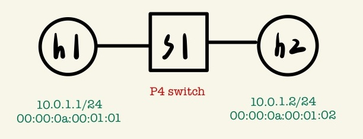
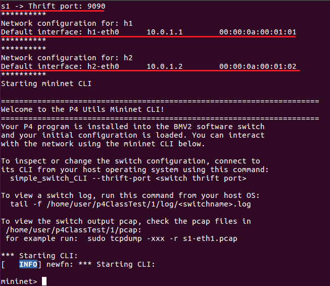
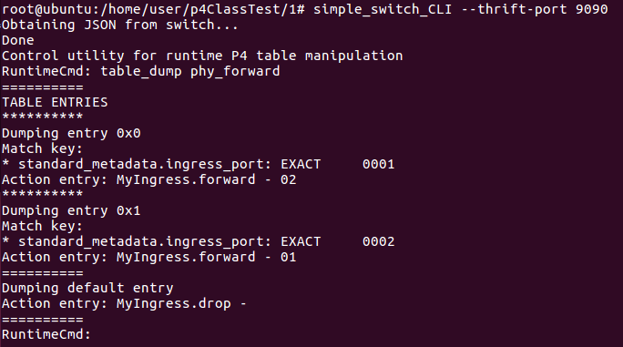
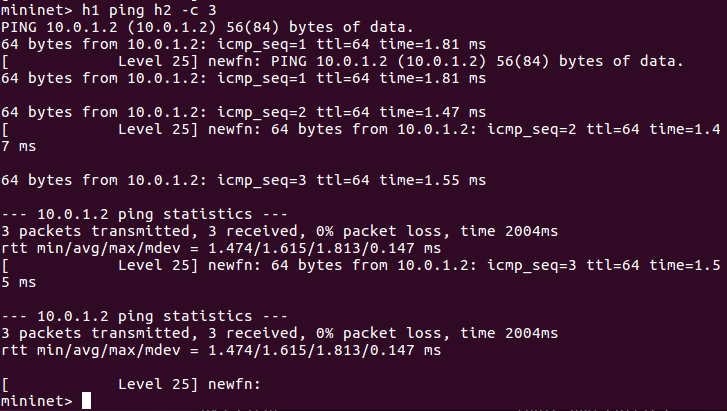
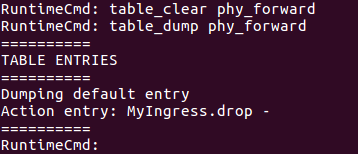
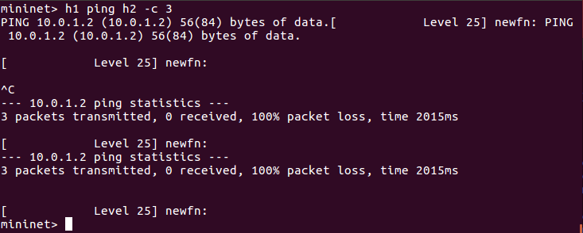
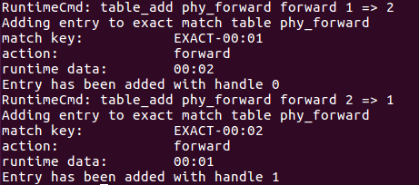
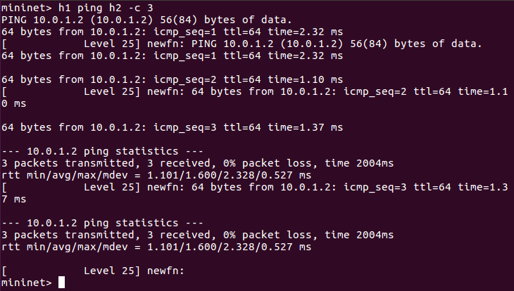
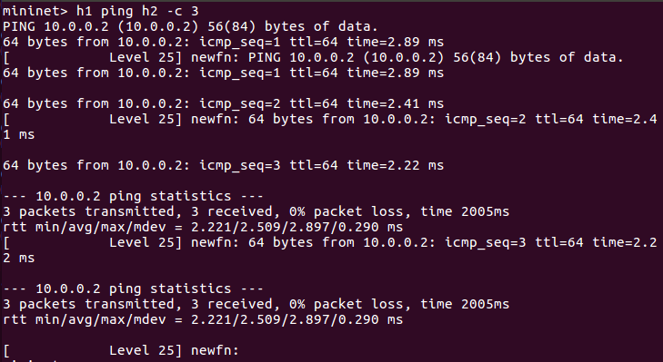

* [5G]()
* [P4 (Programming Protocol - independent Packet Processors)]()
    - [Test1 - Physical Layer Forwarding]()
        - [延伸]()
---
# 5G
5G 指的是第五代行動通訊技術 (5th Generation Wireless System)。
* 3GPP (3rd Generation Partnership Project) 是 5G 規格主要的制定者。
* 5G 的三大特色：

    - 增強型移動寬頻 (Enhanced Mobile Broadband, eMBB)
    - 大規模機器型通訊 (Massive Machine Type Communications, mMTC)
    - 高可靠度和低延遲通訊 (Ultra-reliable and Low Latency Communications, uRLLC)
Network Slicing 網路切片

# P4 (Programming Protocol - independent Packet Processors)
早期 SDN 是 bottom-up design，需要從底層的限制往上發展；P4 是 top-down design，是底層去配合上層的動作。P4 可以自己定義想操作的欄位，P4 有額外提供如 register、meter、counter 元件紀錄儲存狀態 (state)。

* P4 Langeage Elements

    - Parsers：分析標頭的資訊
    - Controls：Tables、Actions，主要控制資料流
    - Expressions：P4 支援基本的運算，但不支援除法
    - Data Type：支援 Bistring、headers、structures、arrays

* 在 Mininet 使用的 P4 為 V1 model
    
    - 運作方式：Input -> parser -> verify checksum -> Ingress (In) -> Egress (Out) -> compute checksum -> deparser -> Output

**課程**
* 課堂中我們要使用 [nsg-ethz/p4-utils](https://github.com/nsg-ethz/p4-utils#documentation) 此框架，會自動編譯，為整合型開發環境。
> * 從此下載可以執行 `sed -i '/^$/d' [file]` 來刪除空白行

* 課堂中，我們學習 P4 16 版本，可以自定義 header

    

* 課程中程式可以從此下載 [p4-utils-example](https://www.dropbox.com/sh/9qzkarvkwehgn9q/AACNww8zdDrR0N6z9bMMpNGEa/p4-utils-example?dl=0&subfolder_nav_tracking=1)


## Test1 - Physical Layer Forwarding
* 拓撲圖



實體層的轉發 (Forwarding)

* 程式下載 [p4-utils-example](https://www.dropbox.com/sh/9qzkarvkwehgn9q/AACNww8zdDrR0N6z9bMMpNGEa/p4-utils-example?dl=0&subfolder_nav_tracking=1) 中的 `1.zip`

1. 準備三個檔案 `p4app.json`、`basic.p4`、`cmd.txt`
* `p4app.json`

    ```json
    {
    "program": "basic.p4",
    "switch": "simple_switch",
    "compiler": "p4c",
    "options": "--target bmv2 --arch v1model --std p4-16",
    "switch_cli": "simple_switch_CLI",
    "cli": true,
    "pcap_dump": true,
    "enable_log": true,
    "topo_module": {
        "file_path": "",
        "module_name": "p4utils.mininetlib.apptopo",
        "object_name": "AppTopoStrategies"
    },
    "controller_module": null,
    "topodb_module": {
        "file_path": "",
        "module_name": "p4utils.utils.topology",
        "object_name": "Topology"
    },
    "mininet_module": {
        "file_path": "",
        "module_name": "p4utils.mininetlib.p4net",
        "object_name": "P4Mininet"
    },
    "topology": {
        "links": [["h1", "s1"], ["h2", "s1"]],
        "hosts": {
        "h1": {
        },
        "h2": {
        }
        },
        "switches": {
        "s1": {
            "cli_input": "cmd.txt",
            "program": "basic.p4"
        }
        }
    }
    }
    ```

* `basic.p4`

    ```sh
    /* -*- P4_16 -*- */
    #include <core.p4>
    #include <v1model.p4>
    /*************************************************************************
    *********************** H E A D E R S  ***********************************
    *************************************************************************/
    
    struct metadata {
        /* empty */
    }
    
    struct headers {
    }
    
    /*************************************************************************
    *********************** P A R S E R  ***********************************
    *************************************************************************/
    parser MyParser(packet_in packet,
                    out headers hdr,
                    inout metadata meta,
                    inout standard_metadata_t standard_metadata) {
        state start {
            transition accept;
        }
    }
    
    /*************************************************************************
    ************   C H E C K S U M    V E R I F I C A T I O N   *************
    *************************************************************************/
    
    control MyVerifyChecksum(inout headers hdr, inout metadata meta) {  
        apply {  }
    }
    /*************************************************************************
    **************  I N G R E S S   P R O C E S S I N G   *******************
    *************************************************************************/
    control MyIngress(inout headers hdr,
                    inout metadata meta,
                    inout standard_metadata_t standard_metadata) {
        action drop() {
            mark_to_drop(standard_metadata);
        }
        action forward(bit<9> port) {
            standard_metadata.egress_spec = port;
        }
        /* 重點!! */
        table phy_forward {
            key = {
                standard_metadata.ingress_port: exact;  # 根據進來的 port，採用完全匹配的方式 (exact)
                # 匹配有許多種方式：match、exact、lmp、ternary、range
            }
            actions = {
                forward;
                drop;
            }
            size = 1024;
            default_action = drop();
        }
        apply {
            phy_forward.apply();
        }
    }
    /*************************************************************************
    ****************  E G R E S S   P R O C E S S I N G   *******************
    *************************************************************************/
    control MyEgress(inout headers hdr,
                    inout metadata meta,
                    inout standard_metadata_t standard_metadata) {
        apply {  }
    }
    /*************************************************************************
    *************   C H E C K S U M    C O M P U T A T I O N   **************
    *************************************************************************/
    control MyComputeChecksum(inout headers  hdr, inout metadata meta) {
        apply {
        }
    }
    /*************************************************************************
    ***********************  D E P A R S E R  *******************************
    *************************************************************************/
    control MyDeparser(packet_out packet, in headers hdr) {
        apply {
        }
    }
    /*************************************************************************
    ***********************  S W I T C H  *******************************
    *************************************************************************/
    V1Switch(
    MyParser(),
    MyVerifyChecksum(),
    MyIngress(),
    MyEgress(),
    MyComputeChecksum(),
    MyDeparser()
    ) main;
    ```

* `cmd.txt`

    ```txt
    table_add phy_forward forward 1 => 2
    table_add phy_forward forward 2 => 1
    ```

2. 執行 P4
```sh
p4run
```


3. 連接到 s1 去查看規則

* 預設 port 為 9090
```sh
simple_switch_CLI --thrift-port 9090
table_dump phy_forward
```


* 在 `simple_switch_CLI` 環境中

    - `help`：可使用的指令查詢
    - `table_clear phy_forward`：刪除 `phy_forward` 規則
    - `help table_add`：查詢 `table_add` 的用法

4. 測試

剛剛在執行 `table_dump phy_forward` 有規則，故可以執行 h1 ping h2



刪除 `phy_forward` 規則，h1 不能 ping h2

```sh
table_clear phy_forward
```





把規則加上去

```sh
table_add phy_forward forward 1 => 2
tablr_add phy_forward forward 2 => 1
```





### 延伸
* 拓撲圖


* Test1 的延伸，新增一個 s2

1. 準備四個檔案 `p4app.json`、`basic.p4`、`cmds1.txt`、`cmds2.txt`
* `p4app.json`

    ```json
    {
    "program": "basic.p4",
    "switch": "simple_switch",
    "compiler": "p4c",
    "options": "--target bmv2 --arch v1model --std p4-16",
    "switch_cli": "simple_switch_CLI",
    "cli": true,
    "pcap_dump": true,
    "enable_log": true,
    "topo_module": {
        "file_path": "",
        "module_name": "p4utils.mininetlib.apptopo",
        "object_name": "AppTopoStrategies"
    },
    "controller_module": null,
    "topodb_module": {
        "file_path": "",
        "module_name": "p4utils.utils.topology",
        "object_name": "Topology"
    },
    "mininet_module": {
        "file_path": "",
        "module_name": "p4utils.mininetlib.p4net",
        "object_name": "P4Mininet"
    },
    /* 重點!! */
    "topology": {
        "assignment_strategy": "l2", 
        //  l2：第二層設備、l3：路由器，第三層設備、manual：手動設定
        "links": [["h1", "s1"], ["h2", "s2"], ["s1", "s2"]],
        "hosts": {
        "h1": {
        },
        "h2": {
        }
        },
        "switches": {
        "s1": {
        "cli_input": "cmds1.txt",
            "program": "basic.p4"
        },
        "s2": {
        "cli_input": "cmds2.txt",
            "program": "basic.p4"
        }	
        }
    }
    }
    ```

* `basic.p4`

    ```sh
    /* -*- P4_16 -*- */
    #include <core.p4>
    #include <v1model.p4>

    /*************************************************************************
    *********************** H E A D E R S  ***********************************
    *************************************************************************/
    
    struct metadata {
        /* empty */
    }

    

    struct headers {
    }

    

    /*************************************************************************
    *********************** P A R S E R  ***********************************
    *************************************************************************/

    parser MyParser(packet_in packet,
                    out headers hdr,
                    inout metadata meta,
                    inout standard_metadata_t standard_metadata) {

        state start {
            transition accept;
        }

    }

    

    /*************************************************************************

    ************   C H E C K S U M    V E R I F I C A T I O N   *************

    *************************************************************************/

    

    control MyVerifyChecksum(inout headers hdr, inout metadata meta) {  
        apply {  }
    }

    /*************************************************************************
    **************  I N G R E S S   P R O C E S S I N G   *******************
    *************************************************************************/
    control MyIngress(inout headers hdr,
                    inout metadata meta,
                    inout standard_metadata_t standard_metadata) {
        action drop() {
            mark_to_drop(standard_metadata);
        }

        action forward(bit<9> port) {
            standard_metadata.egress_spec = port;
        }

        table phy_forward {
            key = {
                standard_metadata.ingress_port: exact;
            }

            actions = {
                forward;
                drop;
            }
            size = 1024;
            default_action = drop();
        }

        apply {
            phy_forward.apply();
        }
    }

    /*************************************************************************
    ****************  E G R E S S   P R O C E S S I N G   *******************
    *************************************************************************/

    control MyEgress(inout headers hdr,
                    inout metadata meta,
                    inout standard_metadata_t standard_metadata) {
        apply {  }
    }

    /*************************************************************************
    *************   C H E C K S U M    C O M P U T A T I O N   **************
    *************************************************************************/

    control MyComputeChecksum(inout headers  hdr, inout metadata meta) {
        apply {
        }
    }

    /*************************************************************************
    ***********************  D E P A R S E R  *******************************
    *************************************************************************/

    control MyDeparser(packet_out packet, in headers hdr) {
        apply {
        }
    }

    /*************************************************************************
    ***********************  S W I T C H  *******************************
    *************************************************************************/

    V1Switch(
    MyParser(),
    MyVerifyChecksum(),
    MyIngress(),
    MyEgress(),
    MyComputeChecksum(),
    MyDeparser()

    ) main;
    ```

* `cmds1.txt`

    ```txt
    table_add phy_forward forward 1 => 2
    table_add phy_forward forward 2 => 1
    ```

* `cmds2.txt`

    ```txt
    table_add phy_forward forward 1 => 2
    table_add phy_forward forward 2 => 1
    ```

2. 執行 P4 並測試
```sh
p4run
h1 ping h2 -c 3
```


---
參考資料：
- [如何理解IT、OT、CT？ - 每日頭條](https://kknews.cc/zh-tw/tech/jkxkk4q.html)
- [nsg-ethz/p4-utils - GitHub](https://github.com/nsg-ethz/p4-utils#documentation)
- [mininet-p4 1 - Chih-Heng Ke Youtube](https://www.youtube.com/watch?v=euDS8MHaW3I&ab_channel=Chih-HengKe%E6%9F%AF%E5%BF%97%E4%BA%A8)
- [mininet-p4 2 - Chih-Heng Ke Youtube](https://www.youtube.com/watch?v=QbTboYkIBjE&ab_channel=Chih-HengKe%E6%9F%AF%E5%BF%97%E4%BA%A8)