* [P4 (Programming Protocol - independent Packet Processors)](https://github.com/linjiachi/Linux_note/blob/master/109-2/20210524.md#p4-programming-protocol---independent-packet-processors)
    - [Test4](https://github.com/linjiachi/Linux_note/blob/master/109-2/20210524.md#test4)
        - [延伸](https://github.com/linjiachi/Linux_note/blob/master/109-2/20210524.md#%E5%BB%B6%E4%BC%B8)
    - [Register & Counter](https://github.com/linjiachi/Linux_note/blob/master/109-2/20210524.md#register--counter)
        - [Test1 - Register](https://github.com/linjiachi/Linux_note/blob/master/109-2/20210524.md#test1---register)
        - [Test2 - Counter](https://github.com/linjiachi/Linux_note/blob/master/109-2/20210524.md#test2---counter)
        - [延伸 - 吞吐量實作](https://github.com/linjiachi/Linux_note/blob/master/109-2/20210524.md#%E5%BB%B6%E4%BC%B8---%E5%90%9E%E5%90%90%E9%87%8F%E5%AF%A6%E4%BD%9C)
---
# P4 (Programming Protocol - independent Packet Processors)
## Test4
* 拓撲圖

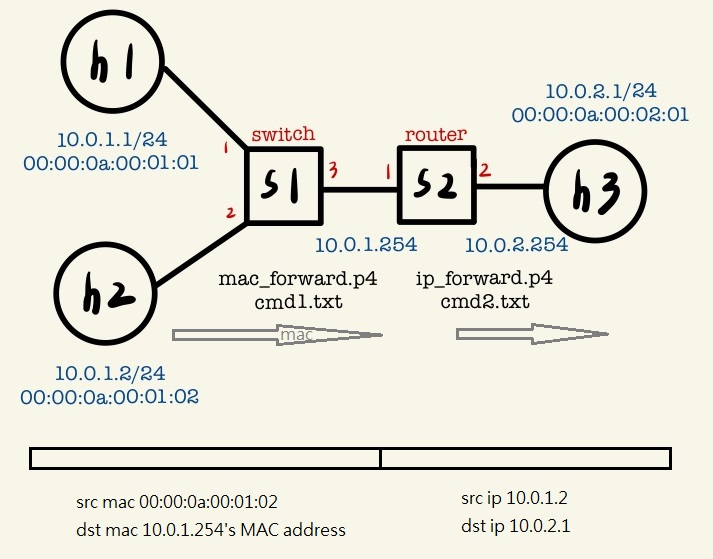

**檔案**
* 程式下載 [2p4](https://drive.google.com/file/d/1_1EUghckyvMnfisZv44fMJN3DiQW7O4g/view?usp=sharing)

* `p4app.json` 

    ```json
    {
    "program": "ip_forward.p4",
    "switch": "simple_switch",
    "compiler": "p4c",
    "options": "--target bmv2 --arch v1model --std p4-16",
    "switch_cli": "simple_switch_CLI",
    "cli": true,
    "pcap_dump": false,
    "enable_log": true,
    "topo_module": {
        "file_path": "",
        "module_name": "p4utils.mininetlib.apptopo",
        "object_name": "AppTopoStrategies"
    },
    "controller_module": null,
    "topodb_module": {
        "file_path": "",
        "module_name": "p4utils.utils.topology",
        "object_name": "Topology"
    },
    "mininet_module": {
        "file_path": "",
        "module_name": "p4utils.mininetlib.p4net",
        "object_name": "P4Mininet"
    },
    "topology": {
        "assignment_strategy": "manual",
        "auto_arp_tables": "true",
        "auto_gw_arp": "true",
        "links": [["h1", "s1"], ["h2", "s1"], ["s1", "s2"], ["s2", "h3"]],
        "hosts": {
        "h1": {
            "ip": "10.0.1.1/24",
            "gw": "10.0.1.254"
        },
        "h2": {
            "ip": "10.0.1.2/24",
            "gw": "10.0.1.254"
        },
        "h3": {
            "ip": "10.0.2.1/24",
            "gw": "10.0.2.254"
        } 
        },
        "switches": {
        "s1": {
            "cli_input": "cmd1.txt",
            "program": "mac_forward.p4"
        },
        "s2": {
            "cli_input": "cmd2.txt",
            "program": "ip_forward.p4"
        }
        }
    }
    }
    ```

* `ip_forward.p4` 

    ```sh
    #include <core.p4>
    #include <v1model.p4>
    typedef bit<48> macAddr_t;
    typedef bit<9> egressSpec_t;
    
    header ethernet_t {
        bit<48> dstAddr;
        bit<48> srcAddr;
        bit<16> etherType;
    }
    
    header ipv4_t {
        bit<4>  version;
        bit<4>  ihl;
        bit<8>  diffserv;
        bit<16> totalLen;
        bit<16> identification;
        bit<3>  flags;
        bit<13> fragOffset;
        bit<8>  ttl;
        bit<8>  protocol;
        bit<16> hdrChecksum;
        bit<32> srcAddr;
        bit<32> dstAddr;
    }
    
    struct metadata {
    }
    
    struct headers {
        @name(".ethernet")
        ethernet_t ethernet;
        @name(".ipv4")
        ipv4_t     ipv4;
    }
    
    parser ParserImpl(packet_in packet, out headers hdr, inout metadata meta, inout standard_metadata_t standard_metadata) {

        @name(".parse_ethernet") state parse_ethernet {
            packet.extract(hdr.ethernet);
            transition select(hdr.ethernet.etherType) {
                16w0x800: parse_ipv4;
                default: accept;
            }
        }
        @name(".parse_ipv4") state parse_ipv4 {
            packet.extract(hdr.ipv4);
            transition accept;
        }
        @name(".start") state start {
            transition parse_ethernet;
        }
    }
    
    control egress(inout headers hdr, inout metadata meta, inout standard_metadata_t standard_metadata) {
        apply {
        }
    }
    
    control ingress(inout headers hdr, inout metadata meta, inout standard_metadata_t standard_metadata) {
        @name(".set_nhop") action set_nhop(macAddr_t dstAddr, egressSpec_t port) {
            //set the src mac address as the previous dst, this is not correct right?
            hdr.ethernet.srcAddr = hdr.ethernet.dstAddr;
    
            //set the destination mac address that we got from the match in the table
            hdr.ethernet.dstAddr = dstAddr;
    
            //set the output port that we also get from the table
            standard_metadata.egress_spec = port;
    
            //decrease ttl by 1
            hdr.ipv4.ttl = hdr.ipv4.ttl - 1;
        }
        @name("._drop") action _drop() {
            mark_to_drop(standard_metadata);
        }
        @name(".ipv4_lpm") table ipv4_lpm {
            actions = {
                set_nhop;
                _drop;
            }
            key = {
                hdr.ipv4.dstAddr: lpm;
            }
            size = 512;
            const default_action = _drop();
        }
        apply {
            ipv4_lpm.apply();
        }
    }
    
    control DeparserImpl(packet_out packet, in headers hdr) {
        apply {
            packet.emit(hdr.ethernet);
            packet.emit(hdr.ipv4);
        }
    }
    
    control verifyChecksum(inout headers hdr, inout metadata meta) {
        apply {
            verify_checksum(true, { hdr.ipv4.version, hdr.ipv4.ihl, hdr.ipv4.diffserv, hdr.ipv4.totalLen, hdr.ipv4.identification, hdr.ipv4.flags, hdr.ipv4.fragOffset, hdr.ipv4.ttl, hdr.ipv4.protocol, hdr.ipv4.srcAddr, hdr.ipv4.dstAddr }, hdr.ipv4.hdrChecksum, HashAlgorithm.csum16);
        }
    }
    
    control computeChecksum(inout headers hdr, inout metadata meta) {
        apply {
            update_checksum(true, { hdr.ipv4.version, hdr.ipv4.ihl, hdr.ipv4.diffserv, hdr.ipv4.totalLen, hdr.ipv4.identification, hdr.ipv4.flags, hdr.ipv4.fragOffset, hdr.ipv4.ttl, hdr.ipv4.protocol, hdr.ipv4.srcAddr, hdr.ipv4.dstAddr }, hdr.ipv4.hdrChecksum, HashAlgorithm.csum16);
        }
    }
    
    V1Switch(ParserImpl(), verifyChecksum(), ingress(), egress(), computeChecksum(), DeparserImpl()) main;
    ```

* `mac_forward.p4` 

    ```sh
    /* -*- P4_16 -*- */
    #include <core.p4>
    #include <v1model.p4>

    /*************************************************************************
    *********************** H E A D E R S  ***********************************
    *************************************************************************/

    header ethernet_t {
        bit<48> dstAddr;
        bit<48> srcAddr;
        bit<16>   etherType;
    }

    
    struct metadata {
        /* empty */
    }

    

    struct headers {
    ethernet_t   ethernet;
    }

    

    /*************************************************************************
    *********************** P A R S E R  ***********************************
    *************************************************************************/

    parser MyParser(packet_in packet,
                    out headers hdr,
                    inout metadata meta,
                    inout standard_metadata_t standard_metadata) {

        state start {
            transition parse_ethernet;
        }

        state parse_ethernet {
            packet.extract(hdr.ethernet);
            transition accept;
        }	
    }

    

    /*************************************************************************

    ************   C H E C K S U M    V E R I F I C A T I O N   *************

    *************************************************************************/

    

    control MyVerifyChecksum(inout headers hdr, inout metadata meta) {  
        apply {  }
    }

    /*************************************************************************
    **************  I N G R E S S   P R O C E S S I N G   *******************
    *************************************************************************/
    control MyIngress(inout headers hdr,
                    inout metadata meta,
                    inout standard_metadata_t standard_metadata) {
        action drop() {
            mark_to_drop(standard_metadata);
        }

        action forward(bit<9> port) {
            standard_metadata.egress_spec = port;
        }

        table mac_forward {
            key = {
                hdr.ethernet.dstAddr: exact;
            }

            actions = {
                forward;
                drop;
            }
            size = 1024;
            default_action = drop();
        }

        apply {
            mac_forward.apply();
        }
    }

    /*************************************************************************
    ****************  E G R E S S   P R O C E S S I N G   *******************
    *************************************************************************/

    control MyEgress(inout headers hdr,
                    inout metadata meta,
                    inout standard_metadata_t standard_metadata) {
        apply {  }
    }

    /*************************************************************************
    *************   C H E C K S U M    C O M P U T A T I O N   **************
    *************************************************************************/

    control MyComputeChecksum(inout headers  hdr, inout metadata meta) {
        apply {
        }
    }

    /*************************************************************************
    ***********************  D E P A R S E R  *******************************
    *************************************************************************/

    control MyDeparser(packet_out packet, in headers hdr) {
        apply {
        packet.emit(hdr.ethernet);
        }
    }

    /*************************************************************************
    ***********************  S W I T C H  *******************************
    *************************************************************************/

    V1Switch(
    MyParser(),
    MyVerifyChecksum(),
    MyIngress(),
    MyEgress(),
    MyComputeChecksum(),
    MyDeparser()

    ) main;
    ```

* `cmd1.txt` 

    ```txt
    table_add mac_forward forward 00:00:0a:00:01:01 => 1
    table_add mac_forward forward 00:00:0a:00:01:02 => 2
    table_add mac_forward forward 00:01:0a:00:01:01 => 3
    table_add mac_forward forward 00:01:0a:00:01:02 => 3
    ```
    - 由於 P4 框架的關係，故 h1、h2 的 10.0.1.254's MAC Address 不同
    - 可以使用 `h1 arp -n` 指令查看

        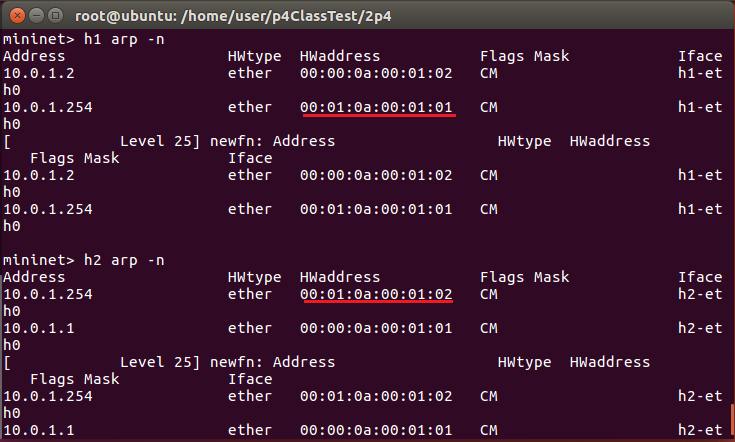

* `cmd2.txt`

    ```txt
    table_add ipv4_lpm set_nhop 10.0.1.1/32 => 00:00:0a:00:01:01 1
    table_add ipv4_lpm set_nhop 10.0.1.2/32 => 00:00:0a:00:01:02 1
    table_add ipv4_lpm set_nhop 10.0.2.1/32 => 00:00:0a:00:02:01 2
    ```

**測試**
```sh
p4run
pingall
```
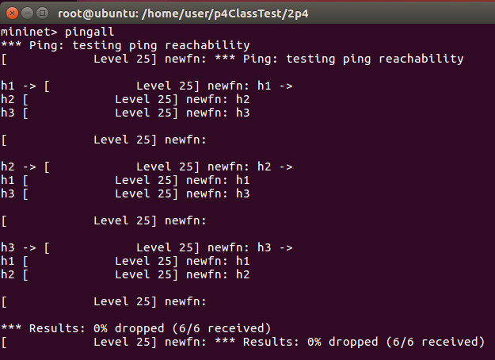

**將 h1、h2 的 10.0.1.254's MAC Address 統一**
```sh
// Mininet
h1 arp -d 10.0.1.254    # 刪除
h1 arp -s 10.0.1.254 00:00:0a:00:01:FE  # 新增
h2 arp -d 10.0.1.254
h2 arp -s 10.0.1.254 00:00:0a:00:01:FE
```
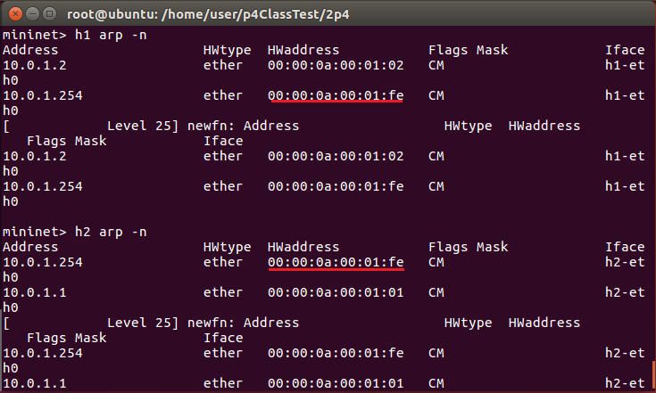

**動態修改 s1 規則**
```sh
// Ubuntu
simple_switch_CLI --thrift-port 9090
table_dump mac_forward
```
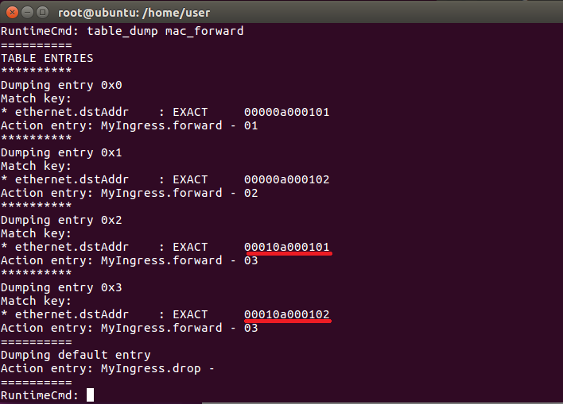

```sh
table_delete mac_forward 2
table_delete mac_forward 3
table_add mac_forward forward 00:00:0a:00:01:FE => 3
```
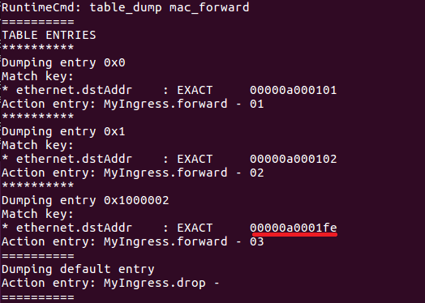

```sh
pingall
```
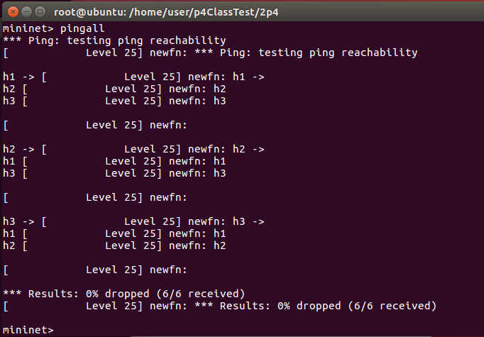

### 延伸
* 拓撲圖

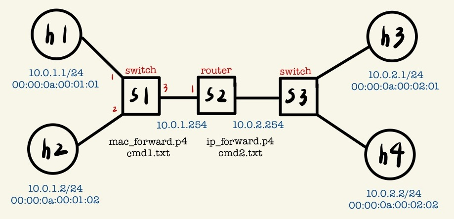

**檔案**
* `p4app.json`

    ```json
    {
    "program": "ip_forward.p4",
    "switch": "simple_switch",
    "compiler": "p4c",
    "options": "--target bmv2 --arch v1model --std p4-16",
    "switch_cli": "simple_switch_CLI",
    "cli": true,
    "pcap_dump": false,
    "enable_log": true,
    "topo_module": {
        "file_path": "",
        "module_name": "p4utils.mininetlib.apptopo",
        "object_name": "AppTopoStrategies"
    },
    "controller_module": null,
    "topodb_module": {
        "file_path": "",
        "module_name": "p4utils.utils.topology",
        "object_name": "Topology"
    },
    "mininet_module": {
        "file_path": "",
        "module_name": "p4utils.mininetlib.p4net",
        "object_name": "P4Mininet"
    },
    "topology": {
        "assignment_strategy": "manual",
        "auto_arp_tables": "true",
        "auto_gw_arp": "true",
        "links": [["h1", "s1"], ["h2", "s1"], ["s1", "s2"], ["s2", "s3"], ["s3", "h3"], ["s3", "h4"]],
        "hosts": {
        "h1": {
            "ip": "10.0.1.1/24",
            "gw": "10.0.1.254",
        "commands":[["arp -d 10.0.1.254"], ["arp -s 10.0.1.254 00:00:0a:00:01:FE"]]
        },
        "h2": {
            "ip": "10.0.1.2/24",
            "gw": "10.0.1.254",
        "commands":[["arp -d 10.0.1.254"], ["arp -s 10.0.1.254 00:00:0a:00:01:FE"]]
        },
        "h3": {
            "ip": "10.0.2.1/24",
            "gw": "10.0.2.254",
        "commands":[["arp -d 10.0.2.254"], ["arp -s 10.0.2.254 00:00:0a:00:02:FE"]]
        },
        "h4": {
            "ip": "10.0.2.2/24",
            "gw": "10.0.2.254",
        "commands":[["arp -d 10.0.2.254"], ["arp -s 10.0.2.254 00:00:0a:00:02:FE"]]
        } 
        },
        "switches": {
        "s1": {
            "cli_input": "cmd1.txt",
            "program": "mac_forward.p4"
        },
        "s2": {
            "cli_input": "cmd2.txt",
            "program": "ip_forward.p4"
        },
        "s3": {
            "cli_input": "cmd3.txt",
            "program": "mac_forward.p4"
        }
        }
    }
    }
    ```

* `ip_forward.p4`

    ```sh
    #include <core.p4>
    #include <v1model.p4>
    typedef bit<48> macAddr_t;
    typedef bit<9> egressSpec_t;
    
    header ethernet_t {
        bit<48> dstAddr;
        bit<48> srcAddr;
        bit<16> etherType;
    }
    
    header ipv4_t {
        bit<4>  version;
        bit<4>  ihl;
        bit<8>  diffserv;
        bit<16> totalLen;
        bit<16> identification;
        bit<3>  flags;
        bit<13> fragOffset;
        bit<8>  ttl;
        bit<8>  protocol;
        bit<16> hdrChecksum;
        bit<32> srcAddr;
        bit<32> dstAddr;
    }
    
    struct metadata {
    }
    
    struct headers {
        @name(".ethernet")
        ethernet_t ethernet;
        @name(".ipv4")
        ipv4_t     ipv4;
    }
    
    parser ParserImpl(packet_in packet, out headers hdr, inout metadata meta, inout standard_metadata_t standard_metadata) {

        @name(".parse_ethernet") state parse_ethernet {
            packet.extract(hdr.ethernet);
            transition select(hdr.ethernet.etherType) {
                16w0x800: parse_ipv4;
                default: accept;
            }
        }
        @name(".parse_ipv4") state parse_ipv4 {
            packet.extract(hdr.ipv4);
            transition accept;
        }
        @name(".start") state start {
            transition parse_ethernet;
        }
    }
    
    control egress(inout headers hdr, inout metadata meta, inout standard_metadata_t standard_metadata) {
        apply {
        }
    }
    
    control ingress(inout headers hdr, inout metadata meta, inout standard_metadata_t standard_metadata) {
        @name(".set_nhop") action set_nhop(macAddr_t dstAddr, egressSpec_t port) {
            //set the src mac address as the previous dst, this is not correct right?
            hdr.ethernet.srcAddr = hdr.ethernet.dstAddr;
    
            //set the destination mac address that we got from the match in the table
            hdr.ethernet.dstAddr = dstAddr;
    
            //set the output port that we also get from the table
            standard_metadata.egress_spec = port;
    
            //decrease ttl by 1
            hdr.ipv4.ttl = hdr.ipv4.ttl - 1;
        }
        @name("._drop") action _drop() {
            mark_to_drop(standard_metadata);
        }
        @name(".ipv4_lpm") table ipv4_lpm {
            actions = {
                set_nhop;
                _drop;
            }
            key = {
                hdr.ipv4.dstAddr: lpm;
            }
            size = 512;
            const default_action = _drop();
        }
        apply {
            ipv4_lpm.apply();
        }
    }
    
    control DeparserImpl(packet_out packet, in headers hdr) {
        apply {
            packet.emit(hdr.ethernet);
            packet.emit(hdr.ipv4);
        }
    }
    
    control verifyChecksum(inout headers hdr, inout metadata meta) {
        apply {
            verify_checksum(true, { hdr.ipv4.version, hdr.ipv4.ihl, hdr.ipv4.diffserv, hdr.ipv4.totalLen, hdr.ipv4.identification, hdr.ipv4.flags, hdr.ipv4.fragOffset, hdr.ipv4.ttl, hdr.ipv4.protocol, hdr.ipv4.srcAddr, hdr.ipv4.dstAddr }, hdr.ipv4.hdrChecksum, HashAlgorithm.csum16);
        }
    }
    
    control computeChecksum(inout headers hdr, inout metadata meta) {
        apply {
            update_checksum(true, { hdr.ipv4.version, hdr.ipv4.ihl, hdr.ipv4.diffserv, hdr.ipv4.totalLen, hdr.ipv4.identification, hdr.ipv4.flags, hdr.ipv4.fragOffset, hdr.ipv4.ttl, hdr.ipv4.protocol, hdr.ipv4.srcAddr, hdr.ipv4.dstAddr }, hdr.ipv4.hdrChecksum, HashAlgorithm.csum16);
        }
    }
    
    V1Switch(ParserImpl(), verifyChecksum(), ingress(), egress(), computeChecksum(), DeparserImpl()) main;
    ```

* `mac_forward.p4`

    ```sh
    /* -*- P4_16 -*- */
    #include <core.p4>
    #include <v1model.p4>

    /*************************************************************************
    *********************** H E A D E R S  ***********************************
    *************************************************************************/

    header ethernet_t {
        bit<48> dstAddr;
        bit<48> srcAddr;
        bit<16>   etherType;
    }

    
    struct metadata {
        /* empty */
    }

    

    struct headers {
    ethernet_t   ethernet;
    }

    

    /*************************************************************************
    *********************** P A R S E R  ***********************************
    *************************************************************************/

    parser MyParser(packet_in packet,
                    out headers hdr,
                    inout metadata meta,
                    inout standard_metadata_t standard_metadata) {

        state start {
            transition parse_ethernet;
        }

        state parse_ethernet {
            packet.extract(hdr.ethernet);
            transition accept;
        }	
    }

    

    /*************************************************************************

    ************   C H E C K S U M    V E R I F I C A T I O N   *************

    *************************************************************************/

    

    control MyVerifyChecksum(inout headers hdr, inout metadata meta) {  
        apply {  }
    }

    /*************************************************************************
    **************  I N G R E S S   P R O C E S S I N G   *******************
    *************************************************************************/
    control MyIngress(inout headers hdr,
                    inout metadata meta,
                    inout standard_metadata_t standard_metadata) {
        action drop() {
            mark_to_drop(standard_metadata);
        }

        action forward(bit<9> port) {
            standard_metadata.egress_spec = port;
        }

        table mac_forward {
            key = {
                hdr.ethernet.dstAddr: exact;
            }

            actions = {
                forward;
                drop;
            }
            size = 1024;
            default_action = drop();
        }

        apply {
            mac_forward.apply();
        }
    }

    /*************************************************************************
    ****************  E G R E S S   P R O C E S S I N G   *******************
    *************************************************************************/

    control MyEgress(inout headers hdr,
                    inout metadata meta,
                    inout standard_metadata_t standard_metadata) {
        apply {  }
    }

    /*************************************************************************
    *************   C H E C K S U M    C O M P U T A T I O N   **************
    *************************************************************************/

    control MyComputeChecksum(inout headers  hdr, inout metadata meta) {
        apply {
        }
    }

    /*************************************************************************
    ***********************  D E P A R S E R  *******************************
    *************************************************************************/

    control MyDeparser(packet_out packet, in headers hdr) {
        apply {
        packet.emit(hdr.ethernet);
        }
    }

    /*************************************************************************
    ***********************  S W I T C H  *******************************
    *************************************************************************/

    V1Switch(
    MyParser(),
    MyVerifyChecksum(),
    MyIngress(),
    MyEgress(),
    MyComputeChecksum(),
    MyDeparser()

    ) main;
    ```

* `cmd1.txt`

    ```txt
    table_add mac_forward forward 00:00:0a:00:01:01 => 1
    table_add mac_forward forward 00:00:0a:00:01:02 => 2
    table_add mac_forward forward 00:00:0a:00:01:FE => 3
    ```

* `cmd2.txt`

    ```txt
    table_add ipv4_lpm set_nhop 10.0.1.1/32 => 00:00:0a:00:01:01 1
    table_add ipv4_lpm set_nhop 10.0.1.2/32 => 00:00:0a:00:01:02 1
    table_add ipv4_lpm set_nhop 10.0.2.1/32 => 00:00:0a:00:02:01 2
    table_add ipv4_lpm set_nhop 10.0.2.2/32 => 00:00:0a:00:02:02 2
    ```

* `cmd3.txt`

    ```txt
    table_add mac_forward forward 00:00:0a:00:02:01 => 2
    table_add mac_forward forward 00:00:0a:00:02:02 => 3
    table_add mac_forward forward 00:00:0a:00:02:FE => 1
    ```
**測試**
```sh
p4run
pingall
```

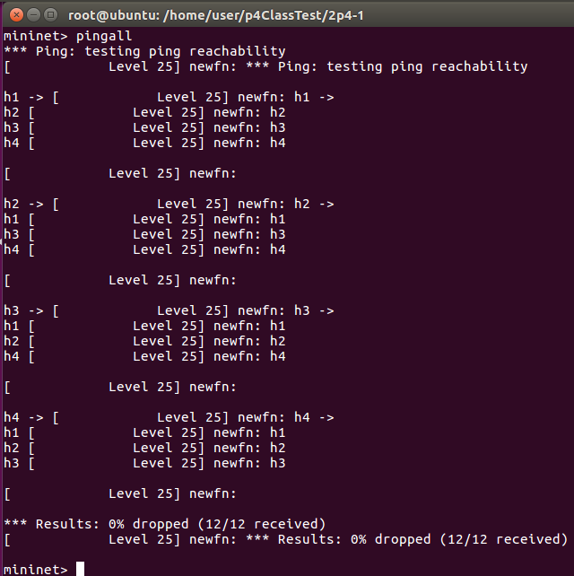

## Register & Counter
* Register：(write、read) 放在 P4 交換機裡，用來儲存資料，可以用 `simple_switch_CLI` 命令將儲存在 Resgister 裡的資料取出來
* Counter：(count、read) 用來計算封包數，或計算累積的封包大小

### Test1 - Register
* 拓撲圖

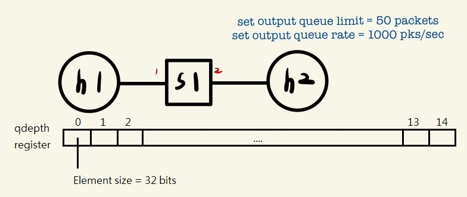

**檔案**
* 程式下載 [p4-utils-example](https://www.dropbox.com/sh/9qzkarvkwehgn9q/AACNww8zdDrR0N6z9bMMpNGEa/p4-utils-example?dl=0&subfolder_nav_tracking=1) 中的 [monitor_qlen](https://www.dropbox.com/sh/9qzkarvkwehgn9q/AAC7bRd4iRZGzjY2CNrzRALVa/p4-utils-example/monitor_qlen?dl=0&subfolder_nav_tracking=1)

* `p4app.json`

    ```json
    {
    "program": "ip_forward.p4",
    "switch": "simple_switch",
    "compiler": "p4c",
    "options": "--target bmv2 --arch v1model --std p4-16",
    "switch_cli": "simple_switch_CLI",
    "cli": true,
    "pcap_dump": false,
    "enable_log": false,
    "topo_module": {
        "file_path": "",
        "module_name": "p4utils.mininetlib.apptopo",
        "object_name": "AppTopoStrategies"
    },
    "controller_module": null,
    "topodb_module": {
        "file_path": "",
        "module_name": "p4utils.utils.topology",
        "object_name": "Topology"
    },
    "mininet_module": {
        "file_path": "",
        "module_name": "p4utils.mininetlib.p4net",
        "object_name": "P4Mininet"
    },
    "topology": {
        "assignment_strategy": "manual",
        "auto_arp_tables": "true",
        "auto_gw_arp": "true",
        "links": [["h1", "s1"], ["h2", "s1"]],
        "hosts": {
        "h1": {
            "ip": "10.0.1.1/24",
            "gw": "10.0.1.254"
        },
        "h2": {
            "ip": "10.0.2.1/24",
        "gw": "10.0.2.254"
        }
        },
        "switches": {
        "s1": {
            "cli_input": "cmd.txt",
            "program": "ip_forward.p4"
        }
        }
    }
    }
    ```

* `ip_forward.p4`

    ```sh
    #include <core.p4>
    #include <v1model.p4>
    typedef bit<48> macAddr_t;
    typedef bit<9> egressSpec_t;
    
    header ethernet_t {
        bit<48> dstAddr;
        bit<48> srcAddr;
        bit<16> etherType;
    }
    
    header ipv4_t {
        bit<4>  version;
        bit<4>  ihl;
        bit<8>  diffserv;
        bit<16> totalLen;
        bit<16> identification;
        bit<3>  flags;
        bit<13> fragOffset;
        bit<8>  ttl;
        bit<8>  protocol;
        bit<16> hdrChecksum;
        bit<32> srcAddr;
        bit<32> dstAddr;
    }
    
    struct metadata {
    }
    
    struct headers {
        @name(".ethernet")
        ethernet_t ethernet;
        @name(".ipv4")
        ipv4_t     ipv4;
    }
    
    parser ParserImpl(packet_in packet, out headers hdr, inout metadata meta, inout standard_metadata_t standard_metadata) {
        @name(".parse_ethernet") state parse_ethernet {
            packet.extract(hdr.ethernet);
            transition select(hdr.ethernet.etherType) {
                16w0x800: parse_ipv4;
                default: accept;
            }
        }
        @name(".parse_ipv4") state parse_ipv4 {
            packet.extract(hdr.ipv4);
            transition accept;
        }
        @name(".start") state start {
            transition parse_ethernet;
        }
    }
    
    control egress(inout headers hdr, inout metadata meta, inout standard_metadata_t standard_metadata) {
        register<bit<32>>(15) qdepth;   
        apply {
        qdepth.write((bit<32>)standard_metadata.egress_port, (bit<32>)standard_metadata.deq_qdepth);
        }
    }
    
    control ingress(inout headers hdr, inout metadata meta, inout standard_metadata_t standard_metadata) {
        @name(".set_nhop") action set_nhop(macAddr_t dstAddr, egressSpec_t port) {
            //set the src mac address as the previous dst, this is not correct right?
            hdr.ethernet.srcAddr = hdr.ethernet.dstAddr;
    
            //set the destination mac address that we got from the match in the table
            hdr.ethernet.dstAddr = dstAddr;
    
            //set the output port that we also get from the table
            standard_metadata.egress_spec = port;
    
            //decrease ttl by 1
            hdr.ipv4.ttl = hdr.ipv4.ttl - 1;
        }
        @name("._drop") action _drop() {
            mark_to_drop(standard_metadata);
        }
        @name(".ipv4_lpm") table ipv4_lpm {
            actions = {
                set_nhop;
                _drop;
            }
            key = {
                hdr.ipv4.dstAddr: lpm;
            }
            size = 512;
            const default_action = _drop();
        }
        apply {
            ipv4_lpm.apply();
        }
    }
    
    control DeparserImpl(packet_out packet, in headers hdr) {
        apply {
            packet.emit(hdr.ethernet);
            packet.emit(hdr.ipv4);
        }
    }
    
    control verifyChecksum(inout headers hdr, inout metadata meta) {
        apply {
            verify_checksum(true, { hdr.ipv4.version, hdr.ipv4.ihl, hdr.ipv4.diffserv, hdr.ipv4.totalLen, hdr.ipv4.identification, hdr.ipv4.flags, hdr.ipv4.fragOffset, hdr.ipv4.ttl, hdr.ipv4.protocol, hdr.ipv4.srcAddr, hdr.ipv4.dstAddr }, hdr.ipv4.hdrChecksum, HashAlgorithm.csum16);
        }
    }
    
    control computeChecksum(inout headers hdr, inout metadata meta) {
        apply {
            update_checksum(true, { hdr.ipv4.version, hdr.ipv4.ihl, hdr.ipv4.diffserv, hdr.ipv4.totalLen, hdr.ipv4.identification, hdr.ipv4.flags, hdr.ipv4.fragOffset, hdr.ipv4.ttl, hdr.ipv4.protocol, hdr.ipv4.srcAddr, hdr.ipv4.dstAddr }, hdr.ipv4.hdrChecksum, HashAlgorithm.csum16);
        }
    }
    
    V1Switch(ParserImpl(), verifyChecksum(), ingress(), egress(), computeChecksum(), DeparserImpl()) main;
    ```

* `cmd.txt`

    ```txt
    set_queue_depth 50
    set_queue_rate 1000
    table_add ipv4_lpm set_nhop 10.0.1.1/32 => 00:00:0a:00:01:01 1
    table_add ipv4_lpm set_nhop 10.0.2.1/32 => 00:00:0a:00:02:01 2
    ```

**測試**
```sh
p4run
xterm h1 h2
```
```sh
// Ubuntu
simple_swith_CLI --thrift-port 9090
register_read qdepth
```
在沒有傳送任何封包時，qdepth 全為 0

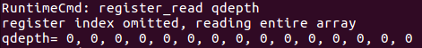

使用 iperf 傳資料

```sh
// h2
iperf -s -i 1 -u

// h1
iperf -c 10.0.2.1 -b 20M -t 100 -u
```
qdepth 數值為 48、45...，因為有限制 `set_queue_depth 50，故佇列不會超過 50

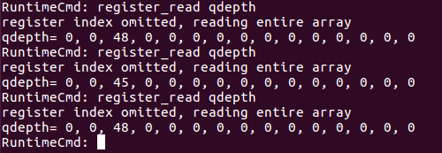

由於一次一次按無法連續觀察到完整的封包資訊，故會寫一個腳本程式來記錄

* `monitor_qlens1h2.sh`

    ```sh
    #!/bin/bash
    CLI_PATH=/usr/local/bin/simple_switch_CLI
    #get current unix time in milliseconds
    prev_time=`date +%s%N | cut -b1-13`
    while true; do
    qlen=`echo register_read qdepth 2 | $CLI_PATH --thrift-port 9090 | grep qdepth | awk '{print $NF}'`   # NF：Number of fields，最後一個值     
    now=`date +%s%N | cut -b1-13` 
    time=$(echo "scale=2; ($now -  $prev_time) / 1000.0"| bc -l)
    echo $time $qlen
    sleep 0.1
    done
    ```

使用腳本觀察 qlen

```sh
sh monitor_qlens1h2.sh
```

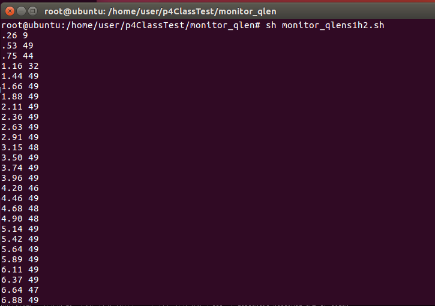

### Test2 - Counter
* 拓撲圖

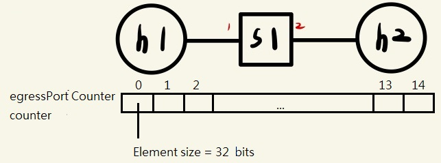

主要計算網路頻寬

**檔案**
* 程式下載 [p4-utils-example](https://www.dropbox.com/sh/9qzkarvkwehgn9q/AACNww8zdDrR0N6z9bMMpNGEa/p4-utils-example?dl=0&subfolder_nav_tracking=1) 中的 [monitor_linkbw](https://www.dropbox.com/sh/9qzkarvkwehgn9q/AAAbkvWk1ncN-VTVC2nESmnva/p4-utils-example/monitor_linkbw?dl=0&subfolder_nav_tracking=1)

* `p4app.json`

    ```json
    {
    "program": "ip_forward.p4",
    "switch": "simple_switch",
    "compiler": "p4c",
    "options": "--target bmv2 --arch v1model --std p4-16",
    "switch_cli": "simple_switch_CLI",
    "cli": true,
    "pcap_dump": false,
    "enable_log": false,
    "topo_module": {
        "file_path": "",
        "module_name": "p4utils.mininetlib.apptopo",
        "object_name": "AppTopoStrategies"
    },
    "controller_module": null,
    "topodb_module": {
        "file_path": "",
        "module_name": "p4utils.utils.topology",
        "object_name": "Topology"
    },
    "mininet_module": {
        "file_path": "",
        "module_name": "p4utils.mininetlib.p4net",
        "object_name": "P4Mininet"
    },
    "topology": {
        "assignment_strategy": "manual",
        "auto_arp_tables": "true",
        "auto_gw_arp": "true",
        "links": [["h1", "s1"], ["h2", "s1"]],
        "hosts": {
        "h1": {
            "ip": "10.0.1.1/24",
            "gw": "10.0.1.254"
        },
        "h2": {
            "ip": "10.0.2.1/24",
            "gw": "10.0.2.254"
        }
        },
        "switches": {
        "s1": {
            "cli_input": "cmd.txt",
            "program": "ip_forward.p4"
        }
        }
    }
    }
    ```

* `ip_forward.p4`

    ```sh
    #include <core.p4>
    #include <v1model.p4>
    typedef bit<48> macAddr_t;
    typedef bit<9> egressSpec_t;
    const bit<4> MAX_PORT = 15;
    
    header ethernet_t {
        bit<48> dstAddr;
        bit<48> srcAddr;
        bit<16> etherType;
    }
    
    header ipv4_t {
        bit<4>  version;
        bit<4>  ihl;
        bit<8>  diffserv;
        bit<16> totalLen;
        bit<16> identification;
        bit<3>  flags;
        bit<13> fragOffset;
        bit<8>  ttl;
        bit<8>  protocol;
        bit<16> hdrChecksum;
        bit<32> srcAddr;
        bit<32> dstAddr;
    }
    
    struct metadata {
    }
    
    struct headers {
        @name(".ethernet")
        ethernet_t ethernet;
        @name(".ipv4")
        ipv4_t     ipv4;
    }
    
    parser ParserImpl(packet_in packet, out headers hdr, inout metadata meta, inout standard_metadata_t standard_metadata) {
        @name(".parse_ethernet") state parse_ethernet {
            packet.extract(hdr.ethernet);
            transition select(hdr.ethernet.etherType) {
                16w0x800: parse_ipv4;
                default: accept;
            }
        }
        @name(".parse_ipv4") state parse_ipv4 {
            packet.extract(hdr.ipv4);
            transition accept;
        }
        @name(".start") state start {
            transition parse_ethernet;
        }
    }
    // !!重點!! //
    control egress(inout headers hdr, inout metadata meta, inout standard_metadata_t standard_metadata) {
        counter((bit<32>)MAX_PORT, CounterType.bytes) egressPortCounter;
        apply {
        egressPortCounter.count((bit<32>)standard_metadata.egress_port);
        }
    }
    
    control ingress(inout headers hdr, inout metadata meta, inout standard_metadata_t standard_metadata) {
        @name(".set_nhop") action set_nhop(macAddr_t dstAddr, egressSpec_t port) {
            //set the src mac address as the previous dst, this is not correct right?
            hdr.ethernet.srcAddr = hdr.ethernet.dstAddr;
    
            //set the destination mac address that we got from the match in the table
            hdr.ethernet.dstAddr = dstAddr;
    
            //set the output port that we also get from the table
            standard_metadata.egress_spec = port;
    
            //decrease ttl by 1
            hdr.ipv4.ttl = hdr.ipv4.ttl - 1;
        }
        @name("._drop") action _drop() {
            mark_to_drop(standard_metadata);
        }
        @name(".ipv4_lpm") table ipv4_lpm {
            actions = {
                set_nhop;
                _drop;
            }
            key = {
                hdr.ipv4.dstAddr: lpm;
            }
            size = 512;
            const default_action = _drop();
        }
        apply {
            ipv4_lpm.apply();
        }
    }
    
    control DeparserImpl(packet_out packet, in headers hdr) {
        apply {
            packet.emit(hdr.ethernet);
            packet.emit(hdr.ipv4);
        }
    }
    
    control verifyChecksum(inout headers hdr, inout metadata meta) {
        apply {
            verify_checksum(true, { hdr.ipv4.version, hdr.ipv4.ihl, hdr.ipv4.diffserv, hdr.ipv4.totalLen, hdr.ipv4.identification, hdr.ipv4.flags, hdr.ipv4.fragOffset, hdr.ipv4.ttl, hdr.ipv4.protocol, hdr.ipv4.srcAddr, hdr.ipv4.dstAddr }, hdr.ipv4.hdrChecksum, HashAlgorithm.csum16);
        }
    }
    
    control computeChecksum(inout headers hdr, inout metadata meta) {
        apply {
            update_checksum(true, { hdr.ipv4.version, hdr.ipv4.ihl, hdr.ipv4.diffserv, hdr.ipv4.totalLen, hdr.ipv4.identification, hdr.ipv4.flags, hdr.ipv4.fragOffset, hdr.ipv4.ttl, hdr.ipv4.protocol, hdr.ipv4.srcAddr, hdr.ipv4.dstAddr }, hdr.ipv4.hdrChecksum, HashAlgorithm.csum16);
        }
    }
    
    V1Switch(ParserImpl(), verifyChecksum(), ingress(), egress(), computeChecksum(), DeparserImpl()) main;
    ```

* `cmd.txt`

    ```txt
    table_add ipv4_lpm set_nhop 10.0.1.1/32 => 00:00:0a:00:01:01 1
    table_add ipv4_lpm set_nhop 10.0.2.1/32 => 00:00:0a:00:02:01 2
    ```

**測試**
```sh
p4run
xterm h1 h2
```

使用 iperf 傳資料

```sh
// h2
iperf -s -i 1 -u

// h1
iperf -c 10.0.2.1 -b 1M -t 10 -u
```

使用腳本了解 link 的使用情形

* `monitor_s1h2bw.sh`

    ```sh
    #!/bin/bash
    CLI_PATH=/usr/local/bin/simple_switch_CLI
    bytes_s1h2=0
    pre_bytes_s1h2=0
    #get current unix time in milliseconds
    prev_time=`date +%s%N | cut -b1-13`
    while true; do
    bytes_s1h2=`echo counter_read egressPortCounter 2 | $CLI_PATH --thrift-port 9090 | grep egressPortCounter | tr '=' ' ' | tr ')' ' ' | awk '{print $6}'`       
    now=`date +%s%N | cut -b1-13` 
    
    if [ ! $pre_bytes_s1h2 -eq 0 ];then
        thr=`echo "scale=2;($bytes_s1h2-$pre_bytes_s1h2) * 8.0  / ($now-$pre_time)" | bc -l`
        echo "BW consumption (s1-h2):" $thr "kbps"      
    fi
    pre_bytes_s1h2=$bytes_s1h2
    pre_time=$now
    sleep 1
    done
    ```

執行腳本
```sh
sh monitor_s1h2bw.sh
```

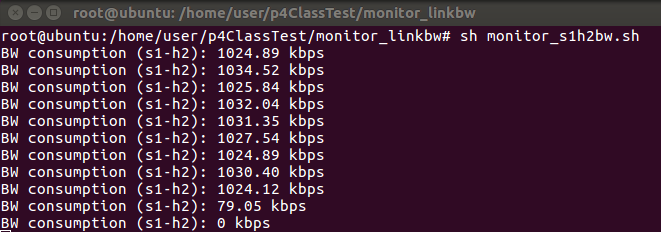

### 延伸 - 吞吐量實作
* 拓撲圖

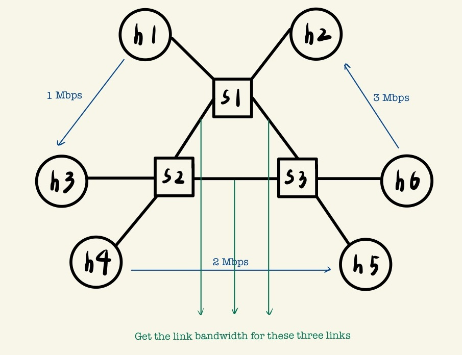

**檔案**
* ``
```json

```

* ``
```sh

```

* ``
```txt

```

**測試**
```sh

```
---
參考資料：
- [monitor_qlen - smallko](https://www.dropbox.com/sh/9qzkarvkwehgn9q/AAC7bRd4iRZGzjY2CNrzRALVa/p4-utils-example/monitor_qlen?dl=0&subfolder_nav_tracking=1)
- [monitor_linkbw - smallko](https://www.dropbox.com/sh/9qzkarvkwehgn9q/AAAbkvWk1ncN-VTVC2nESmnva/p4-utils-example/monitor_linkbw?dl=0&subfolder_nav_tracking=1)