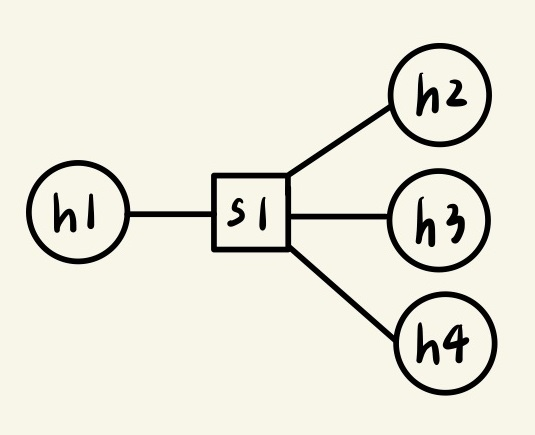
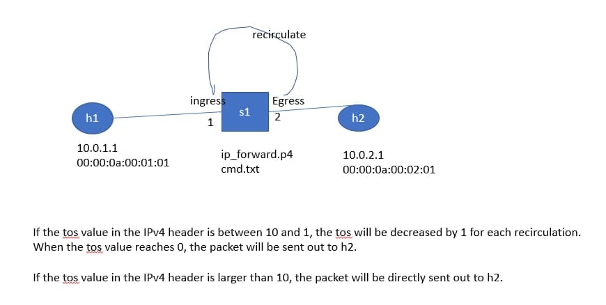
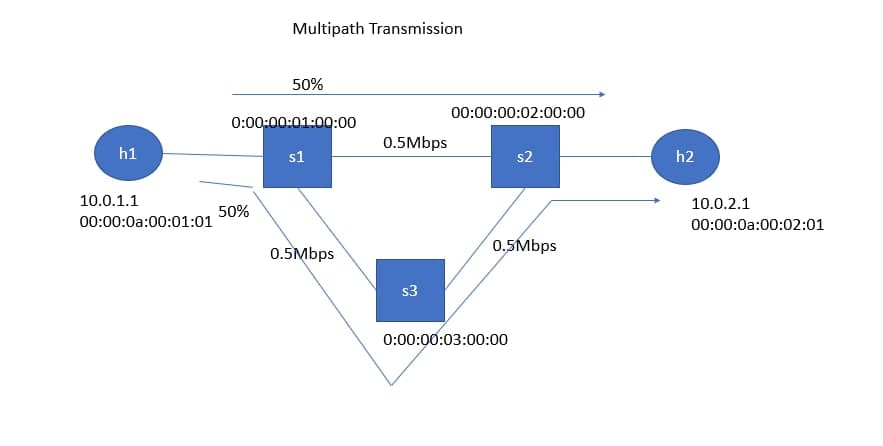

* [P4 (Programming Protocol - independent Packet Processors)]()
    - [Broadcast & Multicast]()
        - [Test2]()
    - [Meter]()
    - [Recirculate]()
    - [Multipath]()
---
# P4 (Programming Protocol - independent Packet Processors)
## Broadcast & Multicast
### Test2
* 拓撲圖



1. h1 sends out a multicast packet (with destination ip addr 224.0.0.10), and h2 and h4 can receive the packet
2. h2 sends out a multicast packet (with destination ip addr 224.0.0.20), and h1、h3 and h4 can receive the packet
3. h3 sends out a multicast packet (with destination ip addr 224.0.0.30), and h1 and h4 can receive the packet
4. h4 sends out a multicast packet (with destination ip addr 224.0.0.40), and only h2 can receive the packet

**檔案**


**測試**
```sh
p4run
```

## Meter
用來限制傳輸速度，在網路端可以用來調節傳輸速率

Two rates three colors algorithm (Green、Yallow、Red)
* CIR：Committed Information Rate
* PIR：Peak Information Rate

* 拓撲圖


**檔案**

* 程式下載 [p4-utils-example](https://www.dropbox.com/sh/9qzkarvkwehgn9q/AACNww8zdDrR0N6z9bMMpNGEa/p4-utils-example?dl=0&subfolder_nav_tracking=1) 中的 [test-meter](https://www.dropbox.com/sh/9qzkarvkwehgn9q/AAC69iOm_Jghjp51EJGcw1J4a/p4-utils-example/test-meter?dl=0&subfolder_nav_tracking=1)


**測試**

## Recirculate
* 拓撲圖



**檔案**

* 程式下載 [p4-utils-example](https://www.dropbox.com/sh/9qzkarvkwehgn9q/AACNww8zdDrR0N6z9bMMpNGEa/p4-utils-example?dl=0&subfolder_nav_tracking=1) 中的 [test-recirculate](https://www.dropbox.com/sh/9qzkarvkwehgn9q/AABiTv3bxnMcoBdPwmCP1OQ6a/p4-utils-example/test-recirculate?dl=0&subfolder_nav_tracking=1)

## Multipath T
* 拓撲圖



* 程式下載 [p4-utils-example](https://www.dropbox.com/sh/9qzkarvkwehgn9q/AACNww8zdDrR0N6z9bMMpNGEa/p4-utils-example?dl=0&subfolder_nav_tracking=1) 中的 [multipath](https://www.dropbox.com/sh/9qzkarvkwehgn9q/AADTXZ-EnYFPp1LLqeNNw6zFa/p4-utils-example/multipath?dl=0&subfolder_nav_tracking=1)


---
參考資料：
- [P4 (P4-16) Switch: Meter Example - smallko](http://csie.nqu.edu.tw/smallko/sdn/p4_meter.htm)
- [test-meter - smallko](https://www.dropbox.com/sh/9qzkarvkwehgn9q/AAC69iOm_Jghjp51EJGcw1J4a/p4-utils-example/test-meter?dl=0&subfolder_nav_tracking=1)
- [test-recirculate - smallko](https://www.dropbox.com/sh/9qzkarvkwehgn9q/AABiTv3bxnMcoBdPwmCP1OQ6a/p4-utils-example/test-recirculate?dl=0&subfolder_nav_tracking=1)
- [multipath - smallko](https://www.dropbox.com/sh/9qzkarvkwehgn9q/AADTXZ-EnYFPp1LLqeNNw6zFa/p4-utils-example/multipath?dl=0&subfolder_nav_tracking=1)
