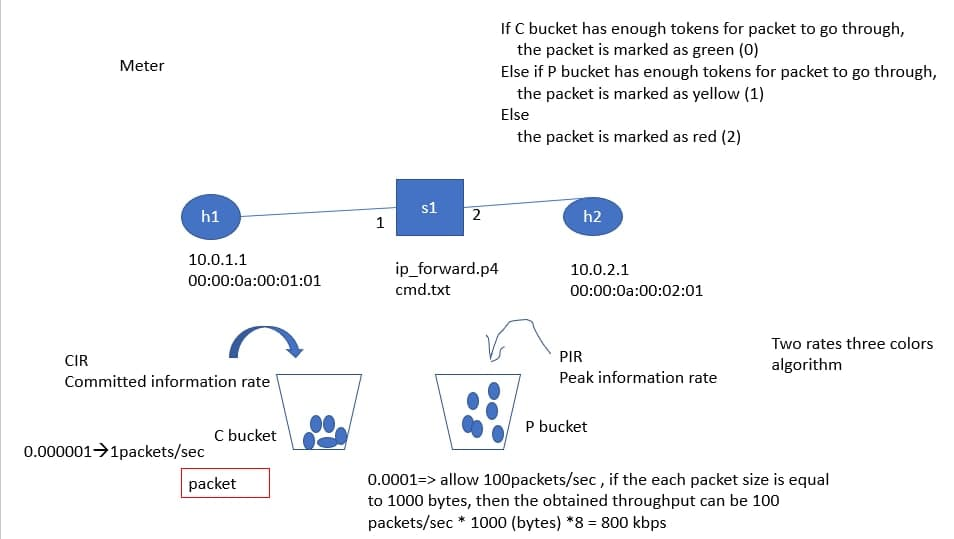

* [P4 (Programming Protocol - independent Packet Processors)](https://github.com/linjiachi/Linux_note/blob/master/109-2/20210607.md#p4-programming-protocol---independent-packet-processors)
    - [Broadcast & Multicast](https://github.com/linjiachi/Linux_note/blob/master/109-2/20210607.md#broadcast--multicast)
        - [Test2](https://github.com/linjiachi/Linux_note/blob/master/109-2/20210607.md#test2)
    - [Meter](https://github.com/linjiachi/Linux_note/blob/master/109-2/20210607.md#meter)
    - [Recirculate](https://github.com/linjiachi/Linux_note/blob/master/109-2/20210607.md#recirculate)
    - [Multipath]()
---
# P4 (Programming Protocol - independent Packet Processors)
## Broadcast & Multicast
### Test2
* 拓撲圖


1. h1 sends out a multicast packet (with destination ip addr 224.0.0.10), and h2 and h4 can receive the packet
2. h2 sends out a multicast packet (with destination ip addr 224.0.0.20), and h1、h3 and h4 can receive the packet
3. h3 sends out a multicast packet (with destination ip addr 224.0.0.30), and h1 and h4 can receive the packet
4. h4 sends out a multicast packet (with destination ip addr 224.0.0.40), and only h2 can receive the packet

**檔案**


**測試**
```sh
p4run
```

## Meter
用來限制傳輸速度，在網路端可以用來調節傳輸速率

Two rates three colors algorithm (Green、Yallow、Red)
* CIR：Committed Information Rate
* PIR：Peak Information Rate

* 拓撲圖



**檔案**

* 程式下載 [p4-utils-example](https://www.dropbox.com/sh/9qzkarvkwehgn9q/AACNww8zdDrR0N6z9bMMpNGEa/p4-utils-example?dl=0&subfolder_nav_tracking=1) 中的 [test-meter](https://www.dropbox.com/sh/9qzkarvkwehgn9q/AAC69iOm_Jghjp51EJGcw1J4a/p4-utils-example/test-meter?dl=0&subfolder_nav_tracking=1)


**測試**
```sh
p4run
xterm h1 h2
```

使用 iperf 傳輸觀察

```sh
// h2
iperf -s -i 1 -u

// h1
iperf -c 10.0.2.1 -b 10M -l 1000 -t 100 -u
iperf -c 10.0.2.1 -b 10M -l 500 -t 100 -u
```


* 第一次 length=1000，會發現頻寬在 800 Kbits/sec 左右
* 第二次 length=500，會發現頻寬在 400 Kbits/sec 左右

## Recirculate 
1. 當在處理封包時，若一次沒辦法處理完成，可以在將封包丟回到 engress
2. 不知道封包需要處理幾次才會結束

* 拓撲圖


當 h1 傳送封包至 h2，tos 欄位會判斷條件，來決定要不要 recirculate

**檔案**

* 程式下載 [p4-utils-example](https://www.dropbox.com/sh/9qzkarvkwehgn9q/AACNww8zdDrR0N6z9bMMpNGEa/p4-utils-example?dl=0&subfolder_nav_tracking=1) 中的 [test-recirculate](https://www.dropbox.com/sh/9qzkarvkwehgn9q/AABiTv3bxnMcoBdPwmCP1OQ6a/p4-utils-example/test-recirculate?dl=0&subfolder_nav_tracking=1)

* `ip_forward.p4`
    ```sh
    .
    .
    .
    control egress(inout headers hdr, inout metadata meta, inout standard_metadata_t standard_metadata) {
        action set_mytos() {
            hdr.ipv4.diffserv=hdr.ipv4.diffserv-1;
            recirculate<headers>(hdr);
        }              
        table set_tos {
            key = {
                hdr.ipv4.diffserv: range;
            }
            actions = {
                set_mytos;
                NoAction;
            }
            size = 1024;
            default_action = NoAction();
            const entries = {
            1..10 : set_mytos();
            _ : NoAction();
            }
        }
        apply {
        set_tos.apply();
        }
    }
    .
    .
    .
    ```

**測試**
```sh
p4run
xterm h1 h2
```

## Multipath
* 拓撲圖


**檔案**

* 程式下載 [p4-utils-example](https://www.dropbox.com/sh/9qzkarvkwehgn9q/AACNww8zdDrR0N6z9bMMpNGEa/p4-utils-example?dl=0&subfolder_nav_tracking=1) 中的 [multipath](https://www.dropbox.com/sh/9qzkarvkwehgn9q/AADTXZ-EnYFPp1LLqeNNw6zFa/p4-utils-example/multipath?dl=0&subfolder_nav_tracking=1)


**測試**
```sh
p4run
xterm h1 h2
```

## 


---
參考資料：
- [P4 (P4-16) Switch: Meter Example - smallko](http://csie.nqu.edu.tw/smallko/sdn/p4_meter.htm)
- [test-meter - smallko](https://www.dropbox.com/sh/9qzkarvkwehgn9q/AAC69iOm_Jghjp51EJGcw1J4a/p4-utils-example/test-meter?dl=0&subfolder_nav_tracking=1)
- [test-recirculate - smallko](https://www.dropbox.com/sh/9qzkarvkwehgn9q/AABiTv3bxnMcoBdPwmCP1OQ6a/p4-utils-example/test-recirculate?dl=0&subfolder_nav_tracking=1)
- [multipath - smallko](https://www.dropbox.com/sh/9qzkarvkwehgn9q/AADTXZ-EnYFPp1LLqeNNw6zFa/p4-utils-example/multipath?dl=0&subfolder_nav_tracking=1)
