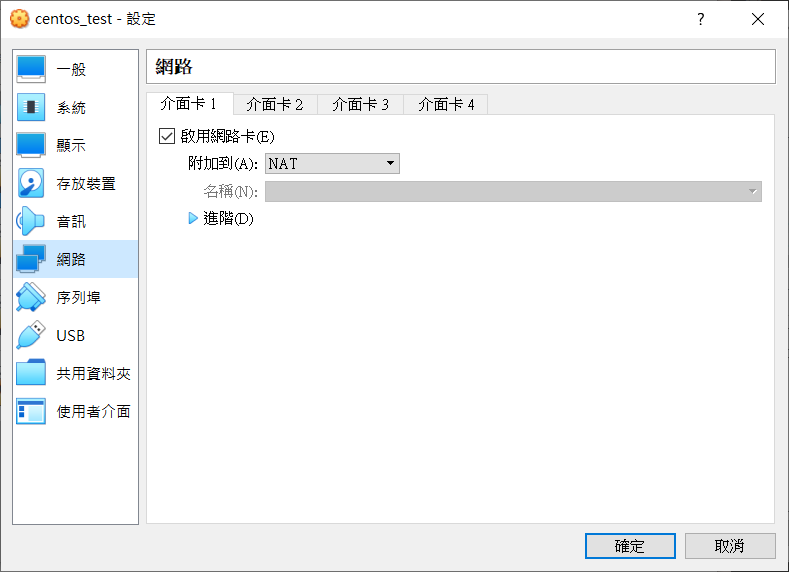
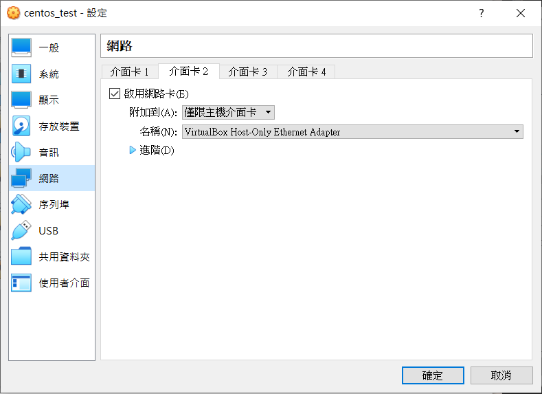
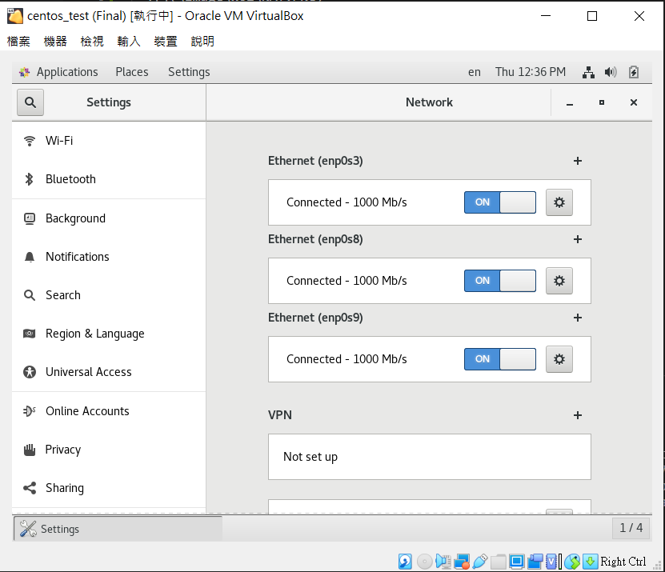
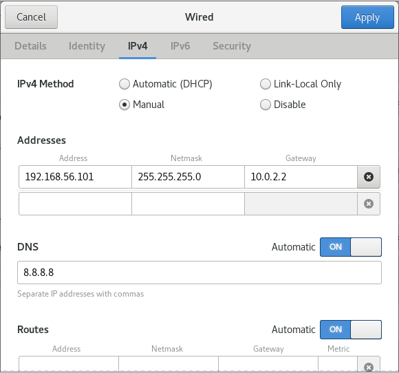

## 新增三台虛擬機
- 可以先設定好一台，其他兩台用再製

#### #開兩張網路卡
  - enp0s3-NAT
  
  - enp0s8-僅限主機介面卡(Host-Only)
  
  
#### #在三台虛擬機裡設定
##### 1. setting裡的Network，Ethernet(enp0s8)按設定

##### 2. 點IPv4下，選擇Manual

##### 3. Addresses
  * Address
    - 192.168.56.101 (VM1)
    - 192.168.56.102 (VM2)
    - 192.168.56.103 (VM3)
  * Netmask 
    - 255.255.255.0
  * Gateway 
    - 10.0.2.2 -> `route -n 可查詢`
  * VM1、VM2、VM3

---
參考：
- [ssh](https://github.com/linjiachi/Linux_note/blob/109-1/ssh.md)
 
