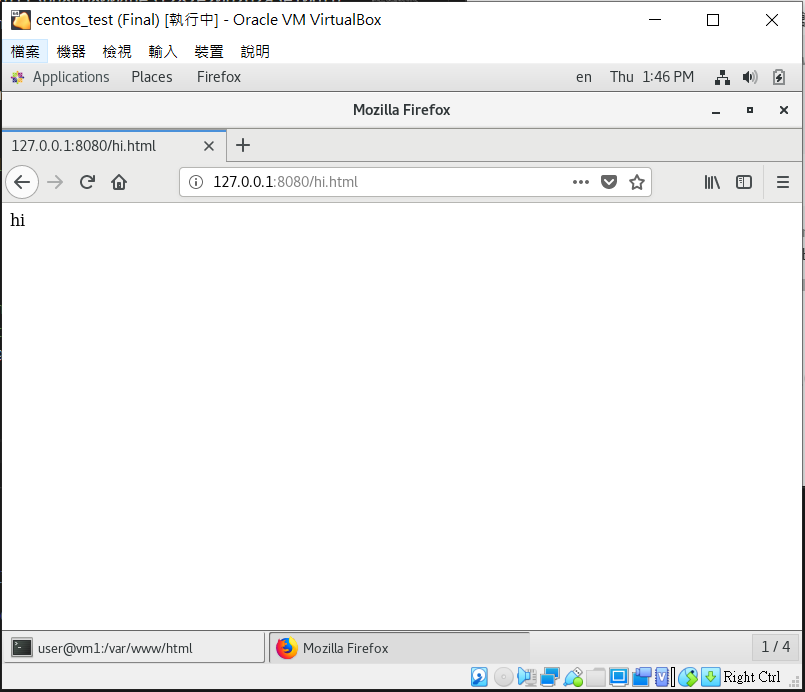
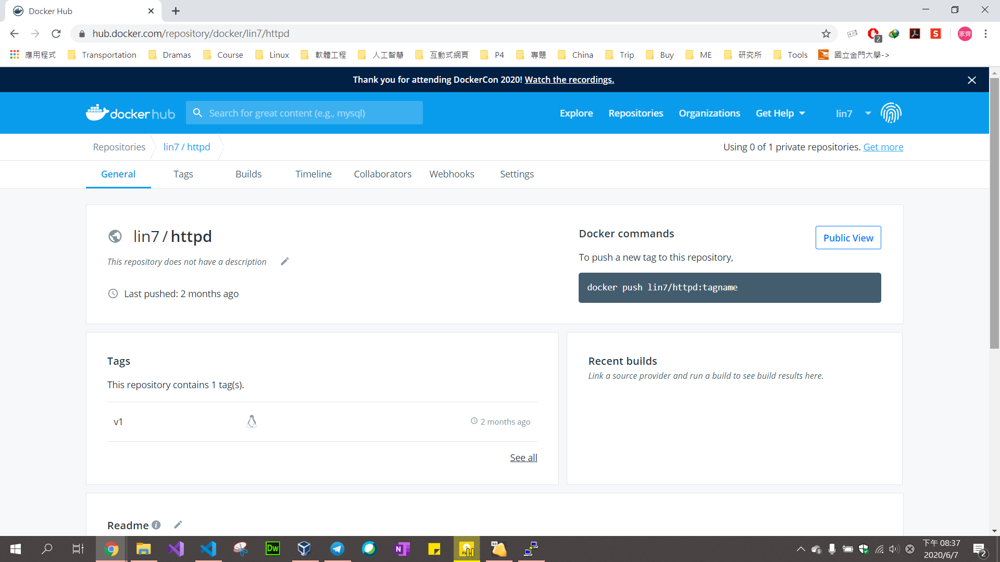

### 遠端上課，會用到的工具
- Telegram (nqucsie-2020linux3)
- zoom 雲端視訊會議
- teamviewer 遠端遙控

### 自建SSL憑證

1. 安裝產生SSL憑證的軟體
`[root@vm1 ~]# yum install mod_ssl openssl`
2. 建立私鑰
`[root@vm1 ~]# openssl genrsa -out ca.key 2048`
3. 建立簽證檔
    ```sh
    [root@vm1 ~]# openssl req -new -key ca.key -out ca.csr

    You are about to be asked to enter information that will be incorporated
    into your certificate request.
    What you are about to enter is what is called a Distinguished Name or a DN.
    There are quite a few fields but you can leave some blank
    For some fields there will be a default value,
    If you enter '.', the field will be left blank.
    -----
    Country Name (2 letter code) [XX]: TW
    State or Province Name (full name) []: Kinmen
    Locality Name (eg, city) [Default City]: Jinning
    Organization Name (eg, company) [Default Company Ltd]: NQU
    Organizational Unit Name (eg, section) []: CSIE
    Common Name (eg, your name or your server's hostname) []: www.nqutest.com
    Email Address []: xxx@gmail.com
    
    Please enter the following 'extra' attributes
    to be sent with your certificate request
    A challenge password []:
    An optional company name []:
    ```
4. 產生CA簽證
`[root@vm1 ~]# openssl x509 -req -days 3650 -in ca.csr -signkeyca.key -out ca.crt`
5. 檔案整理到一個資料夾(mySSL)
`[root@vm1 ~]# mkdir -p /etc/mySSL`
`[root@vm1 ~]# cp ca.key ca.csr ca.crt /etc/mySSL`
6. 修改設定檔
    ```sh
    [root@vm1 ~]# vim /etc/httpd/conf.d/ssl.conf

    a.把 SSLCertificateFile /etc/pki/tls/certs/localhost.crt 加上#註解掉
    下一行加上 SSLCertificateFile /etc/mySSL/ca.crt

    #SSLCertificateFile /etc/pki/tls/certs/localhost.crt
    SSLCertificateFile /etc/mySSL/ca.crt

    b.把 SSLCertificateKeyFile /etc/pki/tls/private/localhost.key 加上#註解掉
    下一行加上 SSLCertificateKeyFile /etc/mySSL/ca.key

    #SSLCertificateKeyFile /etc/pki/tls/private/localhost.key
    SSLCertificateKeyFile /etc/mySSL/ca.key

    :wq
    ```
7. 存檔後重啟伺服器
`[root@vm1 ~]# systemctl restart httpd`
8. 新建一個hi.html的網頁
    ```
    [root@vm1 ~]# echo "hi" > hi.html

    到C:\Windows\System32\drivers\etc 裡 修改hosts檔，
    手動指定ip的方式加上
    192.168.56.101  www.nqutest.com
    (hosts檔要有權限才能更改)

    到Chrome 搜尋 https://www.nqutest.com/hi.html
    會出現"你的連線不是私人連線"-> 進階-> 繼續前往
    可以看憑證是否設定成功
    不安全->
    ```
參考：https://www.brilliantcode.net/343/centos-7-create-own-ssl-certificates/

### Docker
是一個開放原始碼平台
#### Docker 容器三大特色
1. 命名空間隔離
2. aufs (advanced multi-layered unification filesystem)
    - 更動採用分層疊架的方式
    - 更動檔案的這個變動就成為一層
    - 每一層只記錄與上一層的差異
    - 儲存起來的只能讀不能寫，只有最上面那層才能進行寫入
3. cgroups：用來配送資源的 -> resources

#### Image 映象檔/鏡像檔 與 Container 容器
1. Image是儲存在磁碟中的檔案，尚未運行
2. 當Image開始運行，他會變成Container，換句話說Container是用Image建立出來執行的實例
3. 一個Image可以跑多個Container，但Image的名字和本機port要改變

#### Docker 使用
* 到 [Dockerhub](https://hub.docker.com/) 申請一組帳號和密碼，如果將來在電腦裡有做好的Image(映像檔/鏡像檔)，可以把映像檔/鏡像檔上傳自自己的 Dockerhub 上，公開給大家使用或者隱藏。 


#### Docker 指令
##### - Container 執行時的操作
##### - Container 的狀態
* `docker pull [映像檔]:[版本]`：從Dockerhub下載映像檔
  - 映像檔有分和官方有作者的
    - 官方鏡像 -> httpd
    - 有作者的鏡像-> lin7/httpd (owner/image) 
  - 若沒有打版本則下載最新的版本
* `docker ps [option]`：列出容器的使用狀態
  - `-a` : all 顯示所有容器Container，包含未運行的
  - `-a -q` : 顯示所有執行的容器ID (CONTAINER ID)
* `docker start [容器ID或名稱]`：開始、復活 容器Container
* `docker stop [容器ID或名稱]`：暫停 容器Container
* `docker rm [容器ID或名稱]`：移除 容器Container (如果容器狀態已離開)
* `docker rm -f [容器ID或名稱]`：強制移除 容器Container (如果容器狀態還在運行)
* `docker rm -f $(docker ps -a -q)`：移除所有 容器Container
* `docker run [容器ID或名稱]`：執行 Image 變成 容器Container
* `docker inspect [容器ID或名稱]`：可以知道詳細的 容器Container 資訊
* `docker images`：顯示目前鏡像檔
* `docker rmi [鏡像TAG]`：移除 鏡像image
* `docker commit [鏡像TAG]`：從容器創建一個新的鏡像


#### Docker Test 1 - 使用官方docker images
1. 下載鏡像檔
    ```sh
    [root@vm1 user]# docker pull httpd:2.4.41
    2.4.41: Pulling from library/httpd
    Digest: sha256:946c54069130dbf136903fe658fe7d113bd8db8004de31282e20b262a3e106fb
    Status: Downloaded newer image for httpd:2.4.41
    docker.io/library/httpd:2.4.41
    ```
2. 到../var/www/html/ 資料夾下創建 hi.html
    ```sh
    [root@vm1 user]# cd /var/www/html/
    [root@vm1 html]# echo "hi" > hi.html
    [root@vm1 html]# ls
    a.htm  hi.html
    ```
3. 執行鏡像
    ```sh                                
    [root@vm1 html]# docker run -dit --name my-apache-app -p 8080:80 -v "$PWD":/usr/local/apache2/htdocs/ httpd:2.4.41
    0599e86d739e178d012c0687d4b7787067493064de4432900219f9b1f5587c1d
    ```
  * `docker ps`：查看容器使用狀態
  * `docker run`：啟動鏡像
    - `-dit`：在背景執行
      - `-d`：讓Container進入背景執行
      - `-i`：Keep STDIN open even if not attached，讓標準輸入維持在打開的狀態
      - `-t`：Allocate a pseudo-tty，替Container配置一個虛擬的終端機
    - `--name my-apache-app`：從鏡像跑起來的名字
    - `-p 8080:80`：從本機的 8080 port對應到容器的 80 port
    - `-v`：value，設定從外部掛載資源到 Container
    - `"$PWD"`：本機，Linux這台機器
    - `/usr/local/apache2/htdocs/`：docker，網頁伺服器的家目錄
4. 開啟網頁
* 在虛擬機裡的瀏覽器打上 `127.0.0.1:8080/hi.html`
  
* 在本機Google瀏覽器打上虛擬機 ip:8080/hi.html `192.168.56.101:8080/hi.html`
  
> 網頁上出現 hi 則執行成功

#### Docker Test 2 - 將鏡像上傳自自己的空間
1. 查看鏡像檔 `docker images`
    ```sh
    [root@vm1 user]# docker images
    REPOSITORY          TAG                 IMAGE ID            CREATED             SIZE
    php                 latest              76a5dae0c884        2 months ago        405MB
    httpd               latest              8326be82abe6        2 months ago        166MB
    <none>              <none>              66782b5fc374        2 months ago        1.84kB
    httpd               2.4.41              c5a012f9cf45        3 months ago        165MB
    ```
2. 將鏡像上傳至我們的空間 `docker tag c5a lin7/httpd:v1`
    ```sh
    [root@vm1 user]# docker tag c5a lin7/httpd:v1
    REPOSITORY          TAG                 IMAGE ID            CREATED             SIZE
    php                 latest              76a5dae0c884        2 months ago        405MB
    httpd               latest              8326be82abe6        2 months ago        166MB
    <none>              <none>              66782b5fc374        2 months ago        1.84kB
    httpd               2.4.41              c5a012f9cf45        3 months ago        165MB
    lin7/httpd          v1                  c5a012f9cf45        3 months ago        165MB
    ```
* `docker tag [鏡像ID] [owner(docker帳號)/鏡像名字:版本]` : 將鏡像標籤成屬於自己的鏡像 
3. 登入docker `docker login`
    ```sh
    [root@vm1 user]# docker login
    Login with your Docker ID to push and pull images from Docker Hub. If you don't have a Docker ID, head over to https://hub.docker.com to create one.
    Username: lin7
    Password: 
    WARNING! Your password will be stored unencrypted in /root/.docker/config.json.
    Configure a credential helper to remove this warning. See
    https://docs.docker.com/engine/reference/commandline/login/#credentials-store

    Login Succeeded
    ```
4. 將鏡像推入雲端自己的空間 `docker push lin7/httpd:v1`
* 到自己的dockerhub上看是否推上去

> * 若有出現屬於自己的則成功
> * 若沒有立即看到可以晚點再更新一次，或是執行 `docker pull lin7/httpd:v1` 看是否能載下，若能載下則成功

#### Docker Test 3 - 與容器進行互動
1. 執行自己的Image 
    ```sh
    [root@vm1 user]# docker run -dit --name my-apache-app -p 8080:80 -v "$PWD":/usr/local/apache2/htdocs/ lin7/httpd:v1
    0599e86d739e178d012c0687d4b7787067493064de4432900219f9b1f5587c1d
    ```
2. 進到容器中與容器互動
    ```sh
    [root@vm1 user]# docker exec -it 059 /bin/bash
    root@0599e86d739e:/usr/local/apache2#
    ```
* `docker exec -it 059 /bin/bash`：
    - `exec`：execute，執行
    - `-it`：與容器互動
      - `-i`：Keep STDIN open even if not attached，讓標準輸入維持在打開的狀態
      - `-t`：Allocate a pseudo-tty，替Container配置一個虛擬的終端機
    - `059`：現成的容器ID，正在執行的容器
    - `/bin/bash`：shell
* 在容器裡的文件`(/usr/local/apache2/htdocs/)`與在Linux`(/tmp)`裡的文件會相同
3. 進到容器後發現有許多指令不能執行，於是下載套件
    ```sh
    root@0599e86d739e:/usr/local/apache2/htdocs# cat /etc/issue
    Debian GNU/Linux 10 \n \l
    root@0599e86d739e:/usr/local/apache2/htdocs# apt-get update
    root@0599e86d739e:/usr/local/apache2/htdocs# apt-get install net-tools
    root@0599e86d739e:/usr/local/apache2/htdocs# apt-get install iptyils-ping
    root@0599e86d739e:/usr/local/apache2/htdocs# exit
    exit
    ```
> * 離開後裡面所下載的都會消失，所以可以考慮將鏡像新增成一個新的

參考：https://www.jinnsblog.com/2018/10/docker-container-command.html

