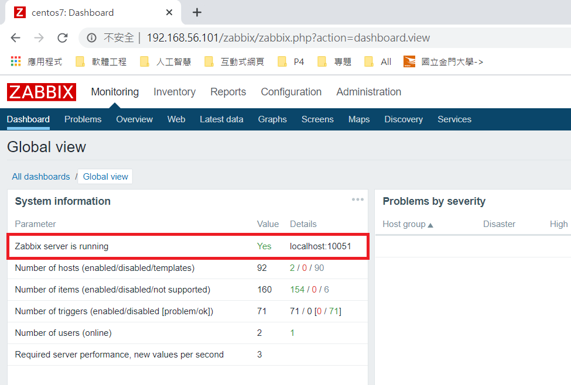
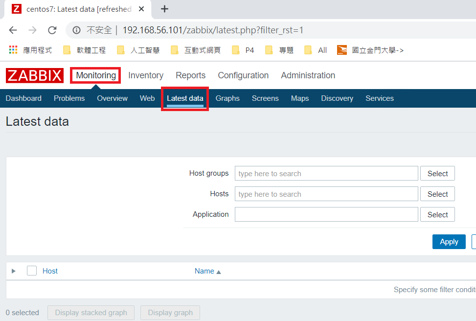
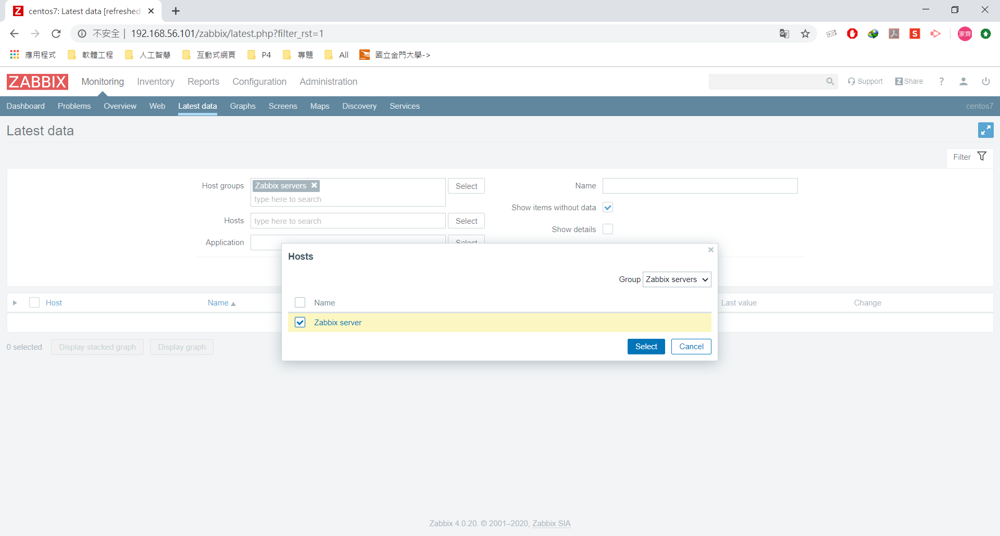
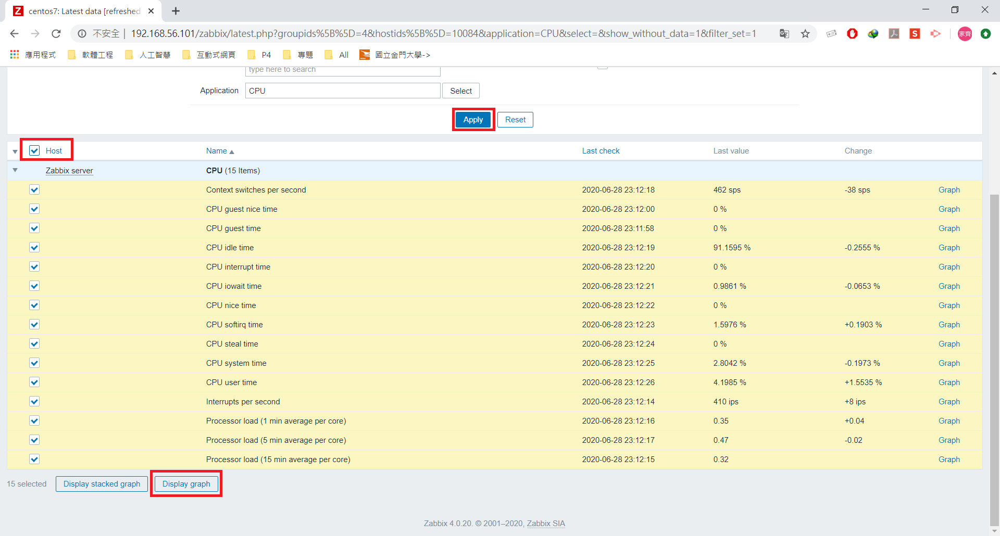
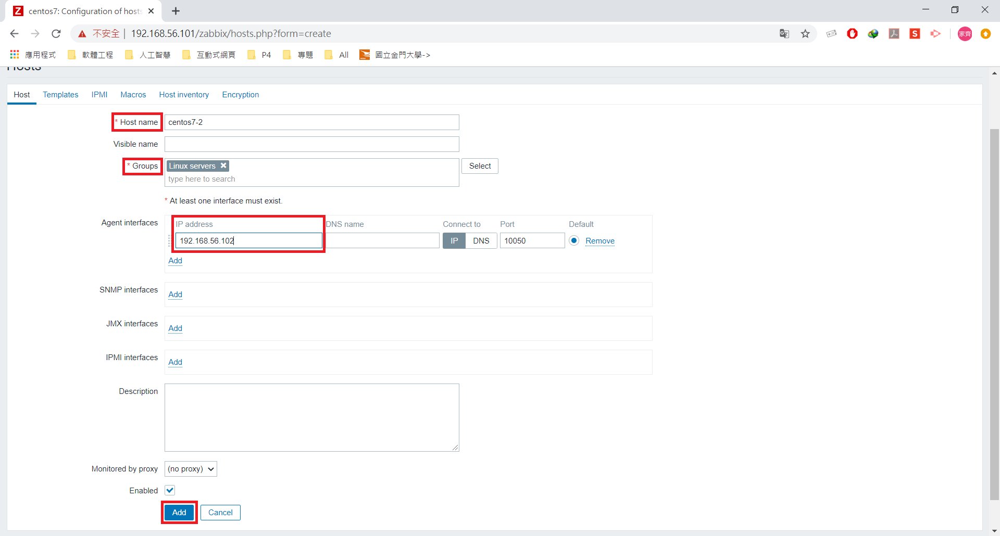
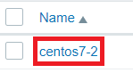
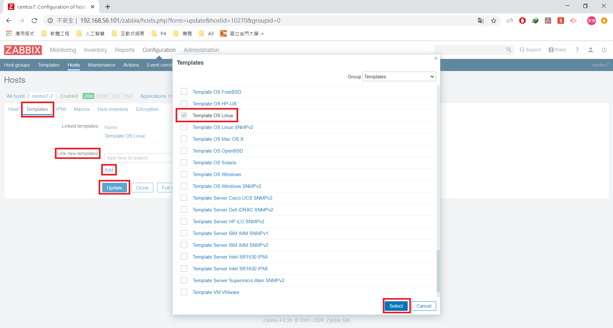
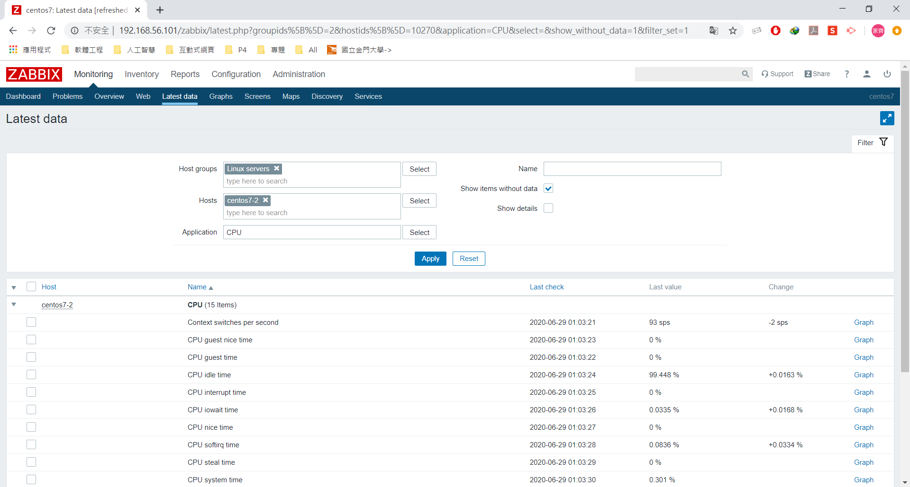

## ansible-galaxy
1. ansible 資料夾中，有 httpd_role.yml 檔和 roles 資料夾
```sh
[root@vm1 user]# tree ansible
ansible
├── httpd_role.yml
└── roles
    └── httpd
        ├── tasks
        │   ├── conf.yml
        │   ├── install.yml
        │   ├── main.yml
        │   └── service.yml
        └── templates
            └── httpd.conf.j2

4 directories, 6 files
```
2. 當執行 httpd_role.yml 會執行 httpd 資料夾裡的資料
```sh
[root@vm1 ansible]# cat httpd_role.yml
- hosts: app1
  remote_user: root
  roles:
  - role: httpd
[root@vm1 httpd]# tree
.
└── tasks
    ├── conf.yml
    ├── install.yml
    ├── main.yml
    └── service.yml

1 directories, 4 files
```
3. 分別為 conf.yml, install.yml, main.yml, service.yml
    1. conf.yml
    ```sh
    - name: copy conf
      template: src=httpd.conf.j2 dest=/etc/httpd/conf/httpd.conf
    ```
    2. install.yml
    ```sh
    - name: install package
      yum: name=httpd
    ```
    3. main.yml
    ```sh
    - include: install.yml
    - include: conf.yml
    - include: service.yml
    ```
    4. service.yml
    ```sh
    - name: start service
      service: name=httpd state=started
    ```
#### 範例一：可以從 [Galaxy](https://galaxy.ansible.com/) 中找尋套件
* [Galaxy apache](https://galaxy.ansible.com/geerlingguy/apache) 
1. 下載 apache：`ansible-galaxy install geerlingguy.apache`
2. 檢視
```sh
[root@vm1 roles]# tree
.
├── geerlingguy.apache
│   ├── defaults
│   │   └── main.yml
│   ├── handlers
│   │   └── main.yml
│   ├── LICENSE
│   ├── meta
│   │   └── main.yml
│   ├── molecule
│   │   └── default
│   │       ├── molecule.yml
│   │       ├── playbook.yml
│   │       └── yaml-lint.yml
│   ├── README.md
│   ├── tasks
│   │   ├── configure-Debian.yml
│   │   ├── configure-RedHat.yml
│   │   ├── configure-Solaris.yml
│   │   ├── configure-Suse.yml
│   │   ├── main.yml
│   │   ├── setup-Debian.yml
│   │   ├── setup-RedHat.yml
│   │   ├── setup-Solaris.yml
│   │   └── setup-Suse.yml
│   ├── templates
│   │   └── vhosts.conf.j2
│   └── vars
│       ├── AmazonLinux.yml
│       ├── apache-22.yml
│       ├── apache-24.yml
│       ├── Debian.yml
│       ├── RedHat.yml
│       ├── Solaris.yml
│       └── Suse.yml
└── httpd
    ├── tasks
    │   ├── conf.yml
    │   ├── install.yml
    │   ├── main.yml
    │   └── service.yml
    └── templates
        └── httpd.conf.j2
```

# Zabbix
1. [Download and install Zabbix](https://www.zabbix.com/download?zabbix=4.0&os_distribution=centos&os_version=7&db=mysql&ws=apache) 選擇版本 4.0 LTS、CentOS、7、MySQL、Apache 
2. 安裝 zabbix
```sh
[root@vm1 user]# rpm -Uvh https://repo.zabbix.com/zabbix/4.0/rhel/7/x86_64/zabbix-release-4.0-2.el7.noarch.rpm
[root@vm1 user]# yum clean all

# 安裝 SQL Server、圖形化介面，要監控自己和他人
[root@vm1 user]# yum install zabbix-server-mysql zabbix-web-mysql zabbix-agent
```
3. 安裝 mariadb 資料庫，並開啟且設定自動開啟
> 安裝 mariadb 資料庫是因為收集到的資料會回傳到資料庫
```sh
[root@vm1 user]# yum -y install mariadb mariadb-server
[root@vm1 user]# systemctl start mariadb.service
[root@vm1 user]# systemctl enable mariadb.service
```
* 設定資料庫密碼
```sh
[root@vm1 user]# mysqladmin -uroot password
New password:
Confirm new password:
```
* 創建 zabbix 資料庫
```sh
[root@vm1 user]# mysqladmin -uroot password
[root@vm1 user]# mysql -uroot -pcentos
Welcome to the MariaDB monitor.  Commands end with ; or \g.
Your MariaDB connection id is 54
Server version: 5.5.65-MariaDB MariaDB Server

Copyright (c) 2000, 2018, Oracle, MariaDB Corporation Ab and others.

Type 'help;' or '\h' for help. Type '\c' to clear the current input statement.

MariaDB [(none)]> create database zabbix character set utf8 collate utf8_bin;       # 創建一個資料庫 zabbix，將編碼改成 utf8
MariaDB [(none)]> grant all privileges on zabbix.* to zabbix@localhost identified by 'zabbix';      # 創建一個帳號 zabbix，密碼 zabbix
```
* 將資料庫(數據結構、表格)打包匯入 zabbix
```sh
# 將資料解壓縮，匯入 zabbix
[root@vm1 user]# zcat /usr/share/doc/zabbix-server-mysql*/create.sql.gz | mysql -uzabbix -pzabbix zabbix
```
```sh
MariaDB [(none)]> use zabbix;
Reading table information for completion of table and column names
You can turn off this feature to get a quicker startup with -A

Database changed
MariaDB [zabbix]> show tables;
+----------------------------+
| Tables_in_zabbix           |
+----------------------------+
| acknowledges               |
| actions                    |
| alerts                     |
| application_discovery      |
| application_prototype      |
| application_template       |
| applications               |
| auditlog                   |
| auditlog_details           |
| hosts_templates            |
| housekeeper                |
| hstgrp                     |
| httpstep                   |
| .                          |
| .                          |
| widget_field               |
+----------------------------+
144 rows in set (0.01 sec)
# 代表成功匯入
```
* 修改 zabbix 設定檔
> 到 `/etc/zabbix/` 下，複製 zabbix_server.conf 改名成 zabbix_server.conf.bak，並修改 zabbix_server.conf
```sh
[root@vm1 ~]# cd /etc/zabbix/
[root@vm1 ~]# cp zabbix_server.conf zabbix_server.conf.bak
[root@vm1 ~]# vim zabbix_server.conf

# 更改位置、名稱如下
91  DBHost=zabbix
100 DBName=zabbix
116 DBUser=zabbix 
124 DBPassword=zabbix
```
* 配置 zabbix-agent 設定檔
```sh
[root@vm1 ~]# cd /etc/zabbix/
[root@vm1 ~]# cp zabbix_agentd.conf zabbix_agentd.conf.bak
[root@vm1 ~]# vim zabbix_agentd.conf

# 更改位置、名稱如下
98  Server=127.0.0.1            # 客戶端被動等待指定服務器來查詢數據
139 ServerActive=127.0.0.1      # 客戶端主動提交數據到指定的服務器
150 Hostname=centos7            # 建議修改此行，配置規範的主機名
```
* 修改配置
```sh
[root@vm1 ~]# vim /etc/httpd/conf.d/zabbix.conf

# 更改位置、名稱如下
# 取消註解並改成 Asia/Taipei
21 php_value date.timezone Asia/Taipei
```
* 開啟網頁伺服器 `systemctl start httpd`，並且在瀏覽器中打上 vm1 IP/zabbix
1. 設定頁面->下一步 
2. 檢查是否都 ok->下一步
3. Configure DB connection->下一步
```md
Database type: MySQL
Database host: localhost
Database port: 3306
Database name: zabbix
User: zabbix
Password: zabbix
```
4. Zabbix server details->下一步
```md
Host: localhost
Port: 10051
Name: centos7
```
5. 確認資訊->下一步
6. Install Congratulations! ->Finish
7. 登入畫面 - 帳號：Admin，密碼：zabbix


8. 進去之後查看 Zabbix server 是否 running
> 如果沒有，到 vm1 檢查是否開啟以下 \
 `systemctl start zabbix-server.service` \
 `systemctl enable zabbix-server` \
 `systemctl start httpd` \
 `systemctl start zabbix-agent` \
 `systemctl enable zabbix-agent`



## 查看監控 CPU
1. 到 Monitoring 下的 Latest data 新增監控


2. 選擇 Host groups:Zabbix servers


3. 選擇 Hosts:Zabbix server


4. 選擇 Application:CPU


5. 按下 Apply 之後，勾選全選在點擊 Display graph


6. 顯示圖形化介面，監控成功


# 配置 zabbix 監控 Linux客戶端
> 我選擇 vm2(192.168.56.102) 當客戶端

1. 安裝 zabbix
```sh
[root@vm1 user]# rpm -Uvh https://repo.zabbix.com/zabbix/4.0/rhel/7/x86_64/zabbix-release-4.0-2.el7.noarch.rpm
[root@vm1 user]# yum clean all
```
2. 安裝 agent
```sh
[root@vm1 user]# yum -y install zabbix-agent
```
3. 配置 zabbix-agent 設定檔
```sh
[root@vm1 ~]# cd /etc/zabbix/
[root@vm1 ~]# cp zabbix_agentd.conf zabbix_agentd.conf.bak
[root@vm1 ~]# vim zabbix_agentd.conf

# 更改位置、名稱如下
98  Server=192.168.56.101           # 客戶端被動等待指定服務器來查詢數據
139 ServerActive=192.168.56.101     # 客戶端主動提交數據到指定的服務器
150 Hostname=centos7                # 建議修改此行，配置規範的主機名
```
4. 啟動 zabbix-agent.service 並設定自動開啟
```sh
[root@vm1 ~]# systemctl start zabbix-agent.service
[root@vm1 ~]# systemctl enable zabbix-agent.service
```
5. 可以執行 `netstat -tunlp | grep zabbix` 檢查是否連上
```sh
[root@vm2 ~]# netstat -tunlp | grep zabbix
tcp        0      0 0.0.0.0:10050           0.0.0.0:*               LISTEN      1102/zabbix_agentd
tcp6       0      0 :::10050                :::*                    LISTEN      1102/zabbix_agentd
```

## 把客戶端加入到監控圖形化
1. 到 Configuration 下的 Hosts 新增監控 Create host


2. 只需設定 Host name、Groups、Agent interfaces-IP address(Client IP)



3. 設定監控，選取剛剛新增的 centos7-2



4. 設定 centos7-2，點選 Templates 設定 Link new templates，選擇 Template OS Linux，按下 Select 後 Add，最後 Update



5. 設定完後每個類別旁邊都有數字了


## 額外補充
> 如果最後一步的狀態 Availability ZBX 出現紅色或沒顏色
* 確認防火牆是否為關閉的 ` systemctl disable firewalld.service`
* `getenforce` = Disable

## 
1. 到 Monitoring 下的 Latest data 新增監控，選擇 Host groups:Linux servers、Hosts:centos7-2、Application:CPU



2. 勾選全選在點擊 Display graph


3. 監視圖形化


## 監控端向被控端做詢問
1. 安裝 zabbix-get
```sh
[root@vm2 ~]# yum install zabbix-get
```
2. `zabbix_get -s 192.168.56.102 -p 10050 -k "system.cpu.load[all,avg1]"`： 
* `-p 10050`：zabbix 所使用的 port
* `-k`：key，想要取得的資訊
```sh
[root@vm1 ~]# zabbix_get -s 192.168.56.102 -p 10050 -k "system.cpu.load[all,avg1]"
0.010000
```
3. `zabbix_get -s 192.168.56.102 -p 10050 -k "system.hostname"`
```sh
[root@vm1 ~]# zabbix_get -s 192.168.56.102 -p 10050 -k "system.hostname"
vm2
```
--- 
參考：
- [Playbook 角色(Roles) 和 Include 语句](https://ansible-tran.readthedocs.io/en/latest/docs/playbooks_roles.html)
- [Galaxy](https://galaxy.ansible.com/)
- [Galaxy apache](https://galaxy.ansible.com/geerlingguy/apache)
- [Download and install Zabbix](https://www.zabbix.com/download?zabbix=4.0&os_distribution=centos&os_version=7&db=mysql&ws=apache)