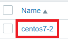
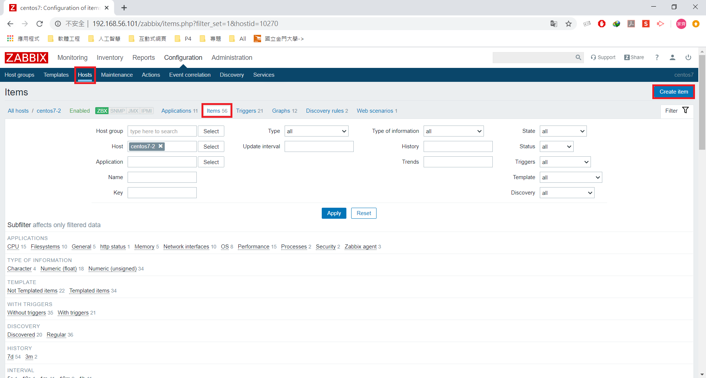
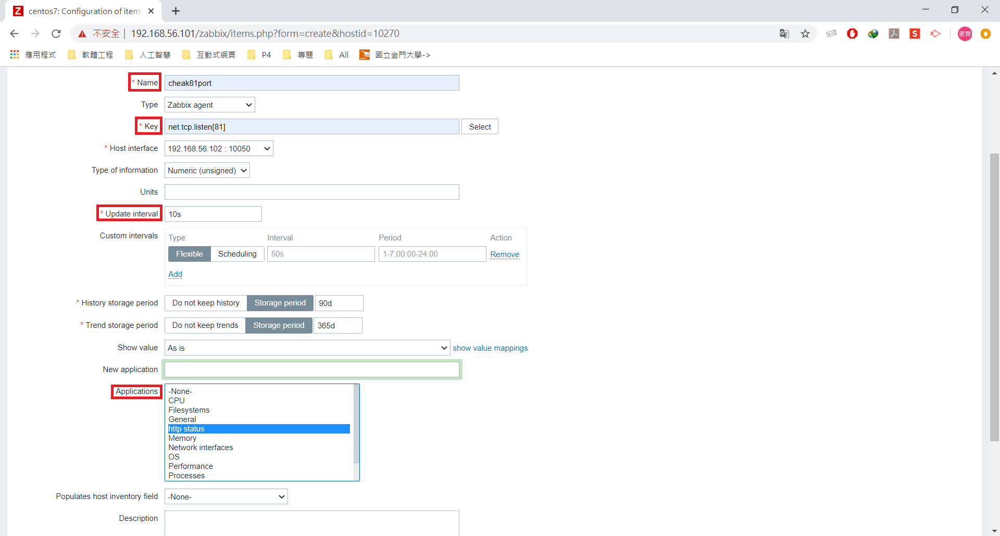
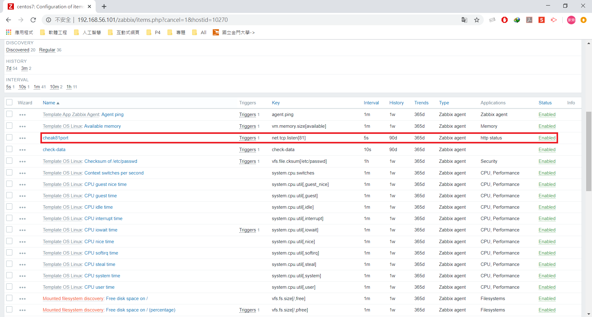
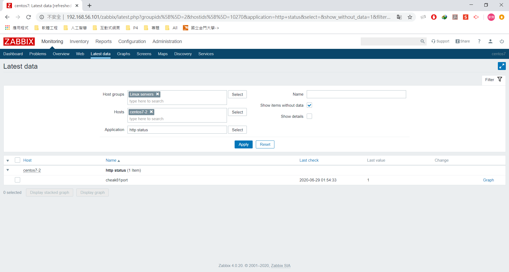
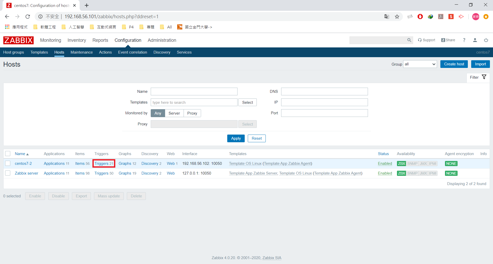
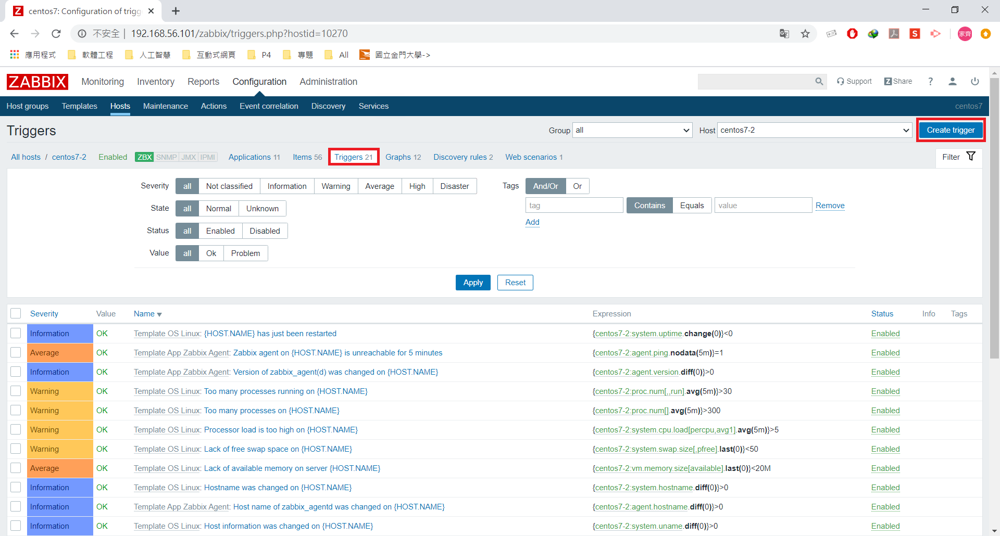
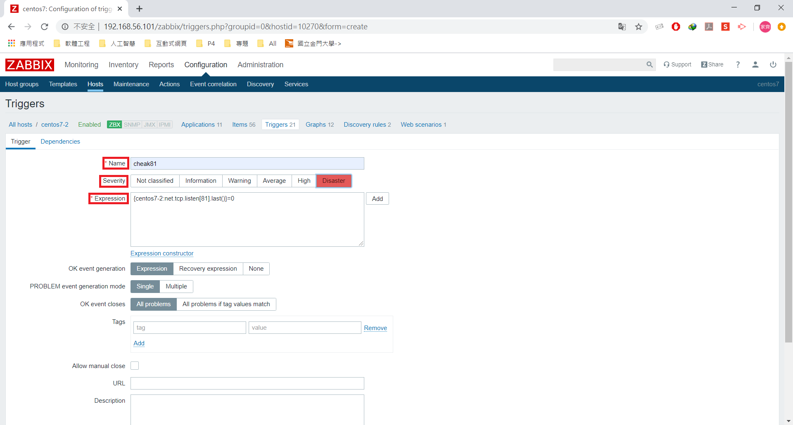
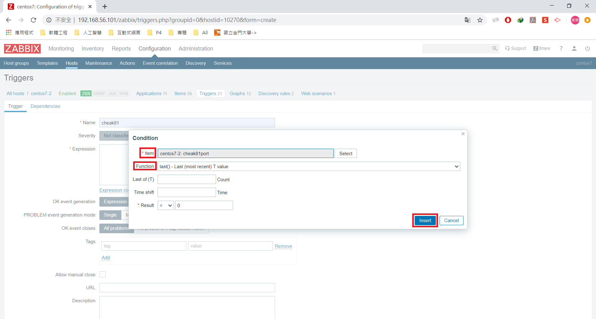
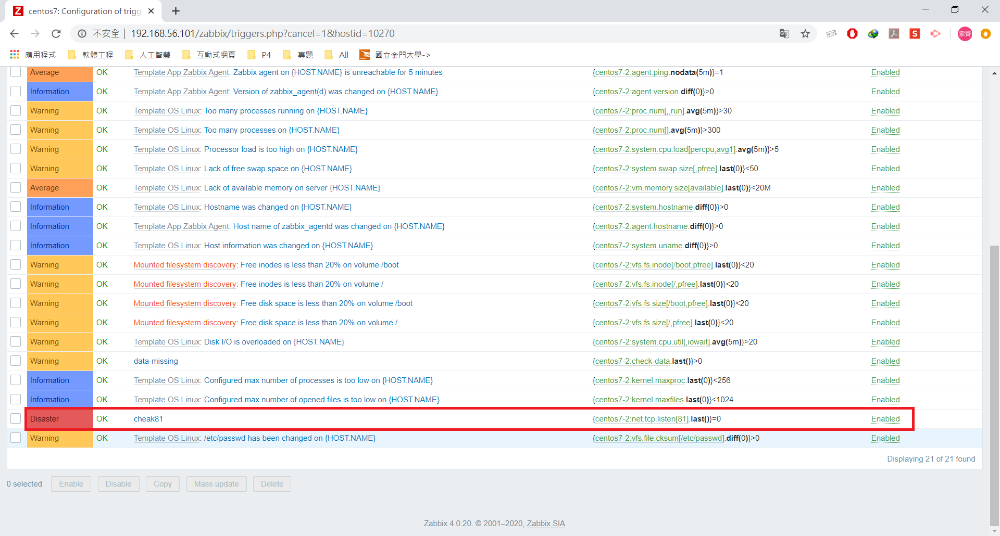

# zabbix
> 可搭配 [W11-20200513](https://github.com/linjiachi/Linux_note/blob/109-2/Weekly_Note/W11-20200513.md)

* open zabbix -> 192.168.56.101/zabbix (監控端ip)
* 若是 ZBX 出現紅色，先 cheak firewalld 是否 Disabled
 ```sh
 [root@vm2 user]# systemctl status firewalld.service 
● firewalld.service - firewalld - dynamic firewall daemon
   Loaded: loaded (/usr/lib/systemd/system/firewalld.service; disabled; vendor preset: enabled)
   Active: inactive (dead)
     Docs: man:firewalld(1)
[root@vm2 user]# getenforce
Disabled
```

## 範例一
1. 選取 centos7-2



2. 到 Configuration 下的 Hosts ，點選 Items 新增 Create Items 



3. 在 Create Items 下設定 Name、Key、Update、Applications -> Add
* Name: cheak81port
* Key: net.tcp.listen[81]
* Update: 10s(建議更改)
* Applications: http status



4. 確定新增成功




## 範例二
1. 到 Configuration 下的 Hosts ，點選 centos7-2 的 Triggers 



2. 選取新增 Create Triggers



3. 在 Create Triggers 下設定 Name、Severity、Expression
* Name: cheak81
* Severity: Disaster



* Expression: {centos7-2:net.tcp.listen[81].last()}=0
  - Item:cheak81port
  - Function:last() - Last(most recent) T value



4. 確定新增成功



## 範例三 - 將訊息同步到 LINE Notify
1. 到 Configuration 下的 Media types ，點選新增 Create media type


2. 在 vm1 的 `/usr/lib/zabbix/alertscripts` 下編輯腳本檔 line.sh
> LINE Notify 的設定可看 [W11-20200513](https://github.com/linjiachi/Linux_note/blob/109-2/Weekly_Note/W11-20200513.md)
```sh
#!/usr/bin/bash
# LINE Notify Token - Media > "Send to".
TOKEN="金鑰"

# {ALERT.SUBJECT}
subject="$1"

# {ALERT.MESSAGE}
message="$2"

curl https://notify-api.line.me/api/notify -H "Authorization: Bearer ${TOKEN}" -d "message=${message}"
```

3. 在 Create media type 下設定 Name、Type、Script name
* Name: line
* Type: Script
* Script name: line.sh


open enp0s8 connet

reload page

---
參考：
- [﹝Linux﹞Zabbix LINE Notify 警報通知](https://dotblogs.com.tw/xerion30476/2019/08/28/153643)
- [第4章 自定义监控与监控报警](https://www.cnblogs.com/clsn/p/7885990.html#auto-id-34)
